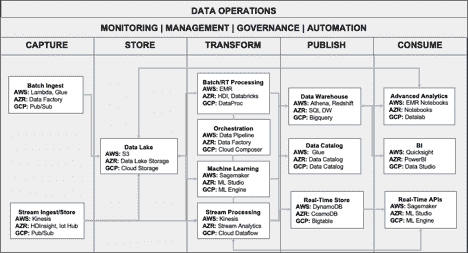
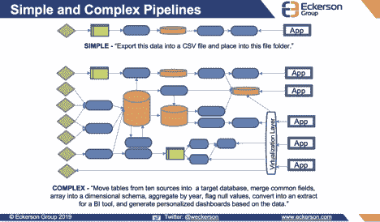
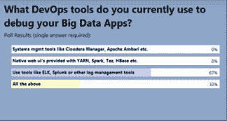

# AIOps 如何克服大数据管道上的性能差距

> 原文：<https://thenewstack.io/how-aiops-conquers-performance-gaps-on-big-data-pipelines/>

如果您的数据管道变得越来越复杂，超出了您的管理能力，您并不孤单。如今，它们已经变得如此庞大，并且被如此多的依赖项所交叉，以至于很难看出所有组件是如何组合在一起的，也很难确定影响应用性能和可用性的问题和机会。数据堆栈结合了许多不同的数据收集和分析元素以及其他功能，而大多数组织中的指数级数据增长只会增加挑战。

AWS、Azure 和 Google 云平台的数据服务示例:

在这种环境下，简单地监控性能并在性能滞后时采取反应措施不再是可行的方法。

## AIOps 成熟

 [巴拉·文卡特劳

Bala Venkatrao 目前是 unlable Data 的创始团队成员和产品副总裁。Bala 之前在 Elastic 和 Cloudera 担任过产品管理和战略职位。Bala 是 Cloudera 的早期员工，在那里他参与了一系列广泛的活动，包括产品管理、市场营销、合作伙伴发展和客户宣传。](https://unraveldata.com/) 

如今，借助 ai ops(IT 运营人工智能),关联数据模型可帮助您发现应用和系统资源的完整背景，以便您能够充分规划、管理和提高性能。与此同时，AIOps 正在走向成熟，在 DevOps 团队努力应对整个堆栈的多样性、复杂性和变化率时，为他们创造真正的效率。

但是为什么是 AIOps，为什么是现在？十年前，系统复杂性和人的能力之间的差距要求成熟的 AIOps 功能和实践。但是组织正在弥补自动化所损失的时间(由于缺乏可用的技术造成的)，并且他们正在通过利用 AIOps 的技能和经验来优化数据性能。

事实上，在所有 IT 运营中，最好的团队合作可能是拥有共同目标的开发运维团队和数据运维团队之间的流畅协同。DevOps 主要关注提高敏捷性和灵活性；DataOps 和 [AIOps 专注于从开发到生产的自动化路径](/aiops-is-devops-ready-for-an-infusion-of-artificial-intelligence/)。当这两个功能协作时，他们共同关注整个系统和如何自动化，并密切关注补救问题和优化性能。

开发运维团队和数据运维团队面临着多方面的挑战:他们需要发现并修复问题。他们需要提高系统性能。他们需要提高运营效率。他们了解到 AIOps 和自动化可以通过以下方式提供帮助:

*   检测异常
*   预测性能问题
*   检测与基线的偏差
*   建议优化
*   跨多个平台关联信号以进行故障排除
*   执行根本原因分析
*   自动化补救。

众所周知，数据正以前所未有的速度膨胀。IDC 表示:“数据的规模每两年翻一番，到 2020 年，数字世界——人们每年创建和复制的数据——将达到 44 千兆字节或 44 万亿千兆字节。”IDC 还指出，当前大数据“山”中有四分之一包含对分析有用的信息。到 2020 年，这一比例将增至三分之一。

此外，在 2018 年 10 月的一次网络研讨会上，Gartner 表示，到 2022 年，40%的大型企业将使用 AIOps 来支持和部分取代 IT 运营管理活动，比今天的 5%有所增加。

当然，这种数据冲击对不同的人意味着不同的东西。但是，对于数据驱动的组织来说，这意味着存储、处理、分析、解释和使用数据的能力正在成为一个危险信号。

## 应对多种复杂的数据管道

流水线的元素通常以并行或时间分片的方式执行。当今企业面临的巨大基础设施挑战说明了对 AIOps 的需求。

考虑一下:

1.  数据不再仅仅驻留在单个数据库或数据仓库中。如今，企业正在处理复杂且高度分布式的数据生态系统。
2.  如今，各种数据源正在以实时或批处理的方式被处理和接收。
3.  一系列的技术正在使用中:比如 Hive(用于文本)甚至更老的 MapReduce 用于数据摄取的 Kafka 和 Spark 流；Hive 和 Spark 用于分析；HBase 和 Cassandra 用于键值存储。然后，在云中，你有诞生在云中的系统，比如红移。这些技术在一个相互关联的生态系统中各有其独特的作用；都是至关重要的，没有一个是主导的。

当你把所有这些应用放在一起时，复杂性就会爆炸。

从一开始，数据运营团队就面临着运营管道以确保满足业务需求的挑战。但当应用程序运行缓慢、容易出错或不可靠时，他们就做不到这一点。结果是达不到服务级别协议，成本更高，解决这些问题的平均解决时间(MTTR)也越来越长。

更糟糕的是，团队面临的问题是，在基础架构的一个节点中诊断出的问题可能会蔓延到基础架构的其他部分，并可能影响应用程序和操作。换句话说，问题的症状可能无法揭示问题的根本原因或位置。

数据管道迅速变得复杂:

在 2018 年 12 月的[网络研讨会](https://www.eckerson.com/articles/diving-into-dataops-the-underbelly-of-modern-data-pipelines)中，与会者被问及他们使用哪些 DevOps 工具来调试大数据应用。调查显示，日志管理是调试应用程序的第一代技术，远远超过其他技术。但是可以说，更令人信服的发现是由研究和咨询公司埃克森集团[的总裁韦恩·埃克森加的标题:“堆栈是工具的扩散，没有一个是真理的单一来源。”](https://www.eckerson.com/)

## AIOps 塔梅什管道复杂性

如今，借助 AIOps，您可以自动监控和关联数据管道中的活动，并发现 1)数据量增长和 2)使用一系列不同的应用程序来处理数据时可能出现的各种问题。数据应用程序很复杂，它们运行在各种各样的架构上，并且这些应用程序之间有很多依赖关系。

因此，就像在其他市场一样，人工智能正在成为一个真正的推动者。采用 AIOps 的规划者意识到，管理他们的管道有三个关键:获得对整个堆栈的可见性，部署高级分析，以及开发人工智能驱动的自动化。

随着人工智能的进步，大数据团队现在使用 AIOps 作为自助服务应用性能管理系统的主干。大数据和 IT 团队可以针对任何期望的 SLA 优化他们的 AIOps 平台。此外，虽然自动化显然是一大优势，但 AIOps 让运营团队相信，他们“拥有”的大数据基础架构部分针对性能进行了优化。这是可能的，因为 AIOps 支持基于角色的访问控制，允许用户只查看他们自己的应用程序或只与他们的部门或业务单位相关的应用程序。

也许最后的部分是 AIOps，当在更深层次应用时，它可以自动修复，自行解决问题。这并不十分神奇；只是看起来像而已。这也是人工智能的初衷。

由 Pixabay 的 Jean-Paul Jandrain 制作的专题图片。

<svg xmlns:xlink="http://www.w3.org/1999/xlink" viewBox="0 0 68 31" version="1.1"><title>Group</title> <desc>Created with Sketch.</desc></svg>