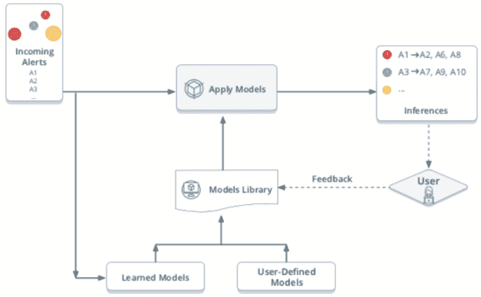

# AIOps 如何支持 DevOps 世界

> 原文：<https://thenewstack.io/how-aiops-supports-a-devops-world/>

 [贾伊·霍夫曼，OpsRamp

贾伊·霍夫曼是 OpsRamp 的数据科学架构师。她的专长包括机器学习、企业服务器架构、移动客户端服务器架构、亚马逊云技术、iOS 和 Android 移动应用。可以在 LinkedIn 上找到她。](https://www.linkedin.com/in/jiayigu/) 

面向 IT 运营的人工智能(AIOps)正在转变 IT 运营团队管理警报和补救事件的方式，但它也在通过持续的警报和事件管理来重新构建 DevOps 管道。AIOps 不仅使用数据科学和计算技术来自动化常见和常规的操作任务，它还吸收指标并使用推理模型从数据中提取可操作的见解。IT 运营团队不仅可以获得服务运行状况的上下文视图，而且自动化的引入使端到端服务正常运行时间(从监控到警报再到补救)变得更加轻松和容易。这种自动化几乎是为支持 DevOps 的组织定制的，在这种组织中，持续部署和运营管理是标准的操作流程。

## 它从更简单的警报开始

典型的警报管理工作流包括以下内容:

1.  将摄取的警报与常见原因相关联，
2.  对警报进行分类和优先级排序，
3.  与 ITSM 工具集成以改进问题管理，包括为需要进一步根本原因分析的问题创建事件单。

这看起来很简单，但是这里的问题是这个工作流程中的每一步都消耗了人类的执行时间。每个接收到的警报在任务流上花费的平均时间随着传入警报的数量不成比例地增加。AIOps 提供这些任务的智能警报和自动化，这意味着警报不必由人工处理。节省的人力时间转化为节省的成本、速度、效率以及所有其他通常与开发运维相关的价值。

## AIOps 工作流:从警报到推理，推理到模型

如下面的图 1 所示，AIOps 不断学习模式，并将学习到的模型应用于传入的警报流，以了解级联和并行影响。它根据学习模型将相关警报分组到*推理*中。

图一。AIOps 通过推理模型极大地减少了需要注意的单个警报的数量。

*推理模型*是这些推理如何在系统中被驱动。它们允许用户设置过滤标准，并将分析模型应用于跨应用程序和基础架构堆栈的特定类型的 IT 资源。然后，IT 和 DevOps 团队可以管理这些推论，而不是处理单个警报，从而减少用户在日常操作中需要筛选的“噪音”。他们可以构建这些推理来连续地、有上下文地操作，支持连续的 CI/CD 管道。

一些常见的推理模型包括:

*   **拓扑**。拓扑推理模型使用 IT 服务和底层基础设施之间的关系来构建推理。他们通过正确的情景背景和影响分析来确定事件的根本原因警报。
*   **集群**。基于聚类的推理模型通过分析相似性和将不同的警报关联成一个推理警报，使用属性来推动洞察。
*   **同现**。这些模型使用现有警报的警报序列模式来关联警报并确定事件的根本原因。****

## 策略驱动的升级和补救

每个警报都代表一个必须修复的问题条件。AIOps 根据明确定义的操作顺序处理事件。例如，如果某个服务器在某个关键应用程序进程停止运行(例如 Apache)时变得不可用，重启该进程可以是一个定义明确、可自动执行的操作，以使服务器重新工作。AIOps 调用警报触发器上的脚本并执行补救措施，完全不受监督。

AIOps 还可以自动处理需要上报、人工关注和/或调查的警报工作流。例如，支持关键业务 IT 服务的设备上的警报要求在收到警报后五分钟内通知 1 级支持人员。如果警报来自服务器并针对特定应用程序，IT 或 DevOps 用户将需要创建一个事件并将其发送给相关应用程序团队。AIOps 通过警报升级工作流立即解决了这一问题，该工作流有助于针对通知和事件创建制定第一响应措施。同样，一旦建立了这些策略，这可以在完全无人监督的情况下发生，不需要人工干预。

此外，策略驱动的 AIOps 根据下游资源关联依赖关系，或建立基于算法的关联，以持续处理警报组。这极大地节省了时间，这些时间通常用于筛选警报洪水，找出如何处理它们，然后再去做。高级 AIOps 工具使用本机工具来确定特定警报序列出现的频率。此外，警报升级策略可以使用先前的警报、事件和通知数据自动分配事件。

## 总体影响是巨大的

AIOps 主动监控系统运行状况，减少警报风暴，快速修复问题，并自动上报。对于 It 运营团队来说，这是最新、最棒的技术。但是 DevOps 团队也可以使用 AIOps 实时分析事件流，从事件中提取有意义的见解以进行持续改进，推动更快的部署和更好的协作，并通过主动检测减少停机时间。

来自 Pixabay 的 Prawny 的特征图像。

<svg xmlns:xlink="http://www.w3.org/1999/xlink" viewBox="0 0 68 31" version="1.1"><title>Group</title> <desc>Created with Sketch.</desc></svg>