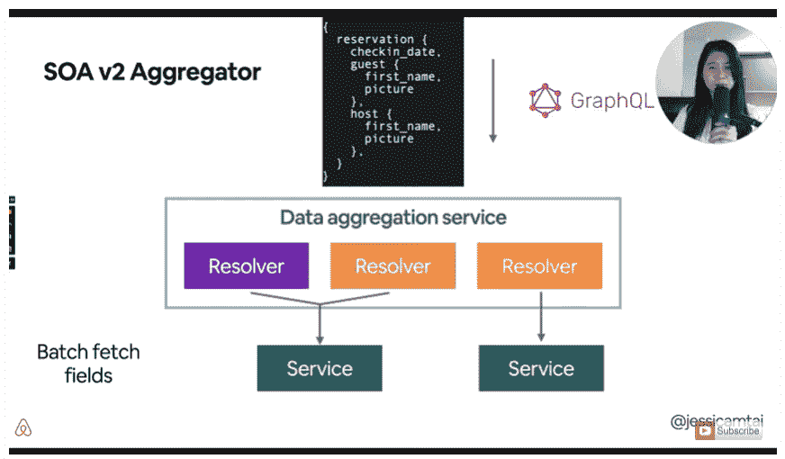
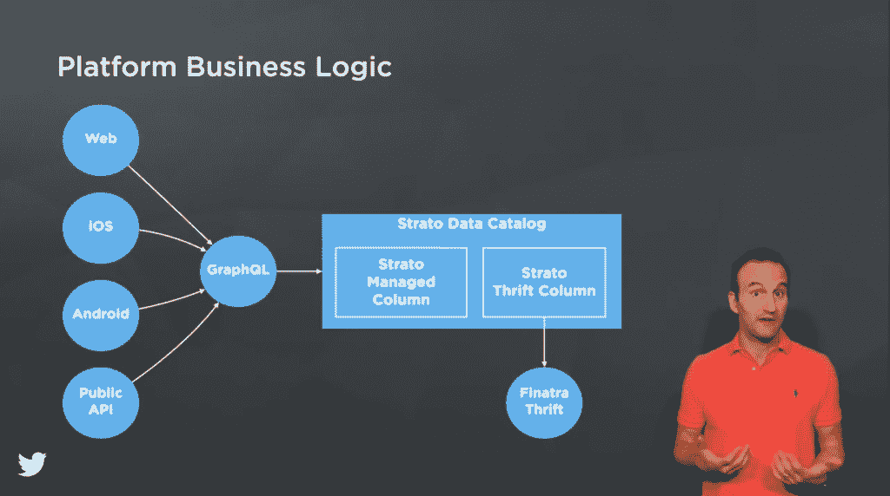

# Airbnb 和 Twitter 如何降低微服务的复杂性

> 原文：<https://thenewstack.io/how-airbnb-and-twitter-cut-back-on-microservice-complexities/>

Airbnb 和 Twitter 最近发布的两次谈话显示了这些网络规模的公司如何在各自基于微服务的架构中与侵入的复杂性进行斗争。两者都在 GraphQL 上建立了健壮的数据层，并将核心功能简化为一组简化的服务，使开发人员更容易在边缘构建新功能。

上个十年，Airbnb 转向面向服务的架构(SOA)以消除整体复杂性，却发现这种基于微服务的方法导致了自身的复杂性。该公司目前有 2000 项服务，由 500 名工程师管理。依赖图，也就是整个系统的设计，“很难推理”，[Airbnb 技术主管兼 c ore services 基础设施工程师杰西卡·泰](https://twitter.com/jessicamtai)在上个月早些时候发布的 [InfoQ Qcon](https://qconferences.com/) 演讲[中说。](https://www.youtube.com/watch?v=yI91FSghAL4&list=WL&index=3&t=1410s)

这样的复杂性使得调试服务变得困难。由于必须在集成点进行越来越多的更改，开发特性花费了更长的时间。服务开始重复功能，数据变得支离破碎。

作为回应，住宿业巨头创建了其工程师所称的 SOA v2。在 v2 中，服务分为内部服务或表示服务。在它们之间是一个数据聚合器，这是一组新的 API，使用 GraphQL 可以减轻表示服务复制数据服务的需要。

例如，移动应用程序必须从不同来源获取 Airbnb 房源和用户自身的数据。这导致应用程序或网站的不同部分重复大量的查询逻辑。

使用 GraphQL，Airbnb 的“数据聚合器”依赖于一组通用解析器，这些解析器知道从哪里获取数据。这也是嵌入一些轻量级业务逻辑的好地方。数据聚合器还可以将多个查询批处理到对底层服务的单个调用中，从而提高可伸缩性。

为了进一步降低复杂性，底层数据服务被聚集成“服务块”，处理不同的核心实体，如“用户”和“家庭”，而开发人员对此一无所知。

Tai 说，在数据聚合器中，每个模块都提供“围绕该实体的内聚性业务逻辑”。“服务之下的一切对客户端来说都是一个黑盒，这有助于简化开发人员的体验。”

虽然这种方法引入了一个额外的网络跃点，但它给了工程师们优化查询模式的机会。

[https://www.youtube.com/embed/yI91FSghAL4?start=1410&feature=oembed](https://www.youtube.com/embed/yI91FSghAL4?start=1410&feature=oembed)

视频

顺便说一下，另一个社交网络巨头 Twitter 也经历了类似的重构过程。

社交媒体巨头刚刚推出了一套公共 API，以及一个多租户微服务，以减少其他微服务的蔓延，[Twitter 高级员工工程师 Steve Cosenza](https://twitter.com/scosenza) 在[的另一次 QCon 演讲](https://youtu.be/axFSaH_-IMw)中说道。

最初，Twitter 通过一个 Ruby-on-Rails 应用程序(“Monorail”)运行他们的公共 API，这个应用程序已经发展成为世界上最大的 Rails 代码库之一。因此更新变得越来越困难。到 2014 年，Twitter 走上了微服务的道路，将 API 服务迁移到一组 14 个微服务上，运行在基于 Java 虚拟机(JVM)的内部框架(“Maccaws”)上。

第一个微服务方法在一段时间内运行良好。

“虽然微服务方法最初提高了开发速度，但它也导致了分散和脱节的 Twitter API，”Cosenza 说。独立团队在很少协调的情况下为他们的特定用例设计和构建端点。这导致了碎片化，并且不可避免地降低了开发人员的工作效率。

随着时间的推移，Twitter 开始构建一套内部 API，也是基于 GraphQL 的[，以帮助自己的开发者更快地行动。2020 年，这个内部架构被用于 Twitter 公共 API 的第二版。](https://thenewstack.io/how-graphql-flexibility-gives-highly-scalable-businesses-a-competitive-edge/)

公共 API 平台旨在扩展到大量终端，这些终端都可以随着新服务的引入而部署。这个想法是让开发人员只关心查询和修改他们需要的数据，而不用为每个新功能设置和运行 HTTP API 服务。

这个想法是为了最小化核心 HTTP 服务中的任何特定端点业务逻辑，“否则系统将很快成为另一个不可维护的庞然大物，”Cosenza 说。

核心和公共 API 逻辑将由专门的基础设施团队处理。对开发人员来说，这个核心服务提供了一个“强大的数据访问层，它强调声明性查询胜过命令性代码。”

“Twitter 客户端查询数据并呈现 ui，而公共 Twitter APIs 查询数据并呈现 JSON，”他说。

两个核心数据组件是“资源字段”，即 tweet 或用户等原子数据，以及“选择”，即查找和聚合资源字段的方法(“按 ID 查找 tweet”)。

那么开发人员可以在哪里添加他们自己的特定于端点的业务逻辑呢？默认情况下，他们可以选择为 Twitter 的内部数据编目系统斯特拉托使用特定领域语言。对于那些需要命令式代码的情况，开发人员可以构建一个 Scala 微服务，然后在斯特拉托专栏中公开。

“在这两种情况下，因为平台为 API 端点提供了通用的 HTTP 需求，所以新的 API 可以在不增加新的 HTTP 服务的情况下发布，”Cosenza 说。

[https://www.youtube.com/embed/axFSaH_-IMw?start=13&feature=oembed](https://www.youtube.com/embed/axFSaH_-IMw?start=13&feature=oembed)

视频

<svg xmlns:xlink="http://www.w3.org/1999/xlink" viewBox="0 0 68 31" version="1.1"><title>Group</title> <desc>Created with Sketch.</desc></svg>