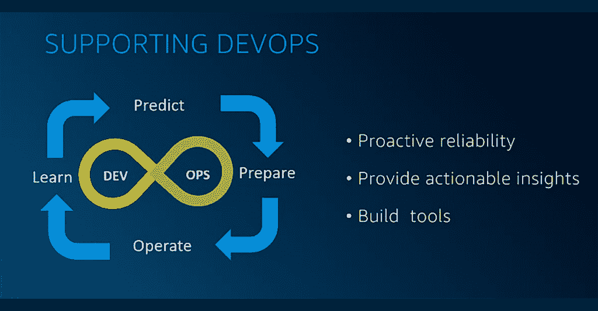

# 亚马逊 Prime 视频工程如何建立团队弹性

> 原文：<https://thenewstack.io/how-amazon-prime-videos-engineering-teams-build-resilience/>

高度分布式软件系统允许组织更快地扩展，并给予他们的工程师更多的速度、控制和自主权。但是随着公司规模的扩大，复杂性也在增加。

没有一家公司比亚马逊(Amazon)更清楚这一点，亚马逊雇佣的 Prime Video 意味着跨地域的跨职能团队通过数千种 API 为数百万用户提供服务。随着直播活动和热门流媒体首映的复杂性增加，其团队不得不学会应对流量和工作负载的急剧增加。

因此，[持续的弹性](https://thenewstack.io/adrian-cockcroft-on-failover-theater-and-achieving-true-continuous-resilience/)是亚马逊跨组织成功的核心。对于 Prime Video 来说，这归结于解决规模、复杂性和对客户的影响。

一月份的[混沌嘉年华](http://chaoscarnival.io/)的两场令人难忘的会议，由 [ChaosNative](http://cloud.chaosnative.com/?utm_content=inline-mention) 主办的年度用户大会，来自 Prime Video 的弹性和混沌工程团队，该团队专注于支持该公司的 [DevOps](https://thenewstack.io/category/devops/) 团队不断改进他们如何预测、准备、操作和学习。

为了跟上全球范围内经常不可预测的流量负载，Prime Video 正在试验人类创造力、[机器学习](https://thenewstack.io/category/machine-learning/)和团队弹性分数的混合。

## 持续弹性的机器学习

[Prime Video 的技术项目总监 Olga Hall](https://www.linkedin.com/in/olgahall/) 通过反思几维鸟板球，启动了关于通过机器学习在 DevOps 中实现持续弹性的小组讨论。

她的团队正准备在新西兰发布 Amazon Prime，因此必须准备好直播热门比赛，这些比赛可能会持续三到五天，每天至少持续六个小时。客流量的高峰通常是当每个人都收看比赛的最后一个小时时——但是收视率高峰的时间通常无法提前预测。

借鉴 DevOps 畅销书“ [Accelerate](https://itrevolution.com/book/accelerate/) ”和“[architecture for Scale](https://www.oreilly.com/library/view/architecting-for-scale/9781492057161/)”的经验，霍尔的团队在迄今为止最南部的发射之前进行了一些科学实验。它创建了机器学习模型来计算工作负载的形状和需求，应用[混沌工程](https://thenewstack.io/chaos-engineering-can-give-distributed-systems-stability/)来模拟故障场景，并练习事件恢复。

亚马逊创始人杰夫·贝索斯的一句名言是:“好的意图永远不会起作用，你需要好的机制来让事情发生。”

霍尔的团队围绕五个原则寻找建立持续弹性机制的方法:

1.  **工作负载建模。**什么样的活动，什么样的观众规模，在什么时间？哪些设备？哪些地区？当客户观看体育直播时，点播内容会发生什么变化？
2.  **围着那些模特玩[游戏天](https://thenewstack.io/gameday-system-testing-can-catch-issues-pre-production-checks-miss/)。**
3.  **并行运行故障进样。**除了在非工作时间对客户的所有服务进行生产中的自动负载测试之外，该团队还在非生产环境中执行压力测试和性能测试。它还运行延迟注入，总是检查一致的超时设置。
4.  **偶发事件和替代途径。**确保回退和故障转移在不同的架构级别自动生效。
5.  [**可观察性**](https://thenewstack.io/observability-the-5-year-retrospective/) **跨越一切。**

霍尔的团队发现了一种模式，并决定将实验分成两部分——可控的和不可控的。

*   **可控输入**，或工作负载建模和游戏天数，是团队应用机器学习来运行连续或定时实验的地方。
*   **不可控输入**，或者失败注入和应急计划，是人类可以做决定的时候，所以工程师可以享受实验的乐趣。

两者都需要可观察性，才能真正从自动异常检测和人类主导的科学实验的混搭中获益。

下一步将是将机器学习和人工智能应用于该团队迄今为止认为无法控制的事情。

## 用于工作负载预测的机器学习

工作量预测很像天气预测。您正在预测未来在日益复杂和不可预测的环境下工作负载将如何变化。

但是，尽管气候危机使得历史模式作为预测的基础变得不那么可靠，但在 Prime Video，团队在进行突然增加客户群这样的实验之前，依赖亚马逊应用科学家阿里·贾拉里(Ali Jalali)所谓的“正常情况”。

在霍尔发言的同一个混沌嘉年华小组中，贾拉里表示，亚马逊 Prime 的团队也需要考虑很多变量，包括:

*   客户指标
*   功能卷展栏
*   长期规划
*   基于云的工具
*   新的营销策略
*   季节性，如一周中的每一天、每月、每季度

贾拉里的团队需要考虑所有这些变量，并确定一个最佳的未来风险水平——他说，对于 Prime Video 来说，这个水平在 90%到 95%之间。考虑到这一点，他的团队使用“[经典时间序列模型](https://thenewstack.io/how-to-select-the-right-database-for-time-series-data/)从本质上缩小预测区域，然后使用更先进的技术，如深度学习，来真正放大该区域并找到准确的数字。”

他说，这种组合对他的团队很有效，但在基线工作负载预测和扩展方面还有一段路要走。当体育赛事直播与大型点播首映式同时进行时，这变得更加困难。

> "弹性是复杂性、规模和影响的交集."

— Olga Hall，亚马逊 Prime Video 技术项目总监

当亚马逊 Prime 发布广受欢迎的印度动作连续剧“Mirzapur”第二季时，该公司能够很容易地预测到收视率的一个巨大峰值的时间。然后，其团队利用机器学习模型，结合任何其他直播活动和合作伙伴内容发布，预测流量峰值。

“我们需要一个预测模型，它可以提前告诉我们在那个确切的时刻会发生什么，以便我们能够为此做好准备，”贾拉里说。

考虑到这一点，Prime Video 建立了一个过去亚马逊活动的图书馆，以创建一个相似性引擎，工程师们将它与通过社交媒体和 IMDB 评级涌入的数据相结合，以预测炒作。然后，他们针对这种宣传测试容量和弹性。

团队甚至可以自动考虑地区因素。例如，贾拉里说，很多印度人正在通过手机直播活动。但由于数据非常昂贵，他们将聚集在免费的公共 Wi-Fi 点。因此，他的团队训练模型在这些条件下进行测试。

有了所有这些，Prime Video 团队就能够根据可用性和延迟自动将负载委派给不同的数据中心，实时做出反应性决策，包括 CPU 和内存优化，允许自动调整和自动扩展。

这包括一个新的碳足迹模型，贾拉里说它考虑了发电的方式和机器的类型。

## 机器学习减少事故管理

[Prime Video 的首席技术项目经理 Geoffrey Robinson](https://www.linkedin.com/in/geoffreynrobinson/) 也在混沌嘉年华小组中，他将[事件管理](https://thenewstack.io/how-to-automate-incident-management-with-code-and-get-better-results/)自动化与自适应巡航控制进行了比较，自适应巡航控制已经从速度控制一直发展到了自主。

Robinson 的团队致力于回答这样的问题:“有哪些事情是工程师必须多次做的，我们可以在哪里实现自动化？我们如何改进我们的流程，以便他们能够利用脑力解决更多的战略需求？”

他的团队专注于在压力最大的时候——寻呼机来电时——减少认知负荷的方法。

他的团队的目标之一是减少缓解时间。它使用数据来发现错误警报之类的模式，从而更容易标记错误和进行故障排除。该工具还突出显示了可能的罪魁祸首:在过去 15 分钟内进行的任何部署。

通过机器学习，他的团队从机票申报服务开始，将事故登机流程缩短到了五分钟。通过所有的标记，在解决问题后，团队将更多的实时事件数据反馈到模型中，然后反馈到游戏日模拟中。

“任何我们可以自动化的东西，比如自适应巡航控制，我们都可以反馈到事故中，”Robinson 说。“因此，在下一次事故发生之前，我们知道数据要么可供正在排除故障的团队使用，要么他们已经经历了比赛日，他们已经进行了测试，以确保一切准备就绪。”

霍尔说，随着时间的推移，这种基于数据的自动化可能会减少事故。“我们看到了我们所有人的未来——我们作为一个团队的未来，以及你们许多观众的未来——工程师只会看到一个问题或事件一次，”她说。“这是一个可重复、可控、可理解的问题。”

但目前，对于那些机器可识别模式之外的罕见事件或异常现象，仍有人参与其中。就像我们还没有消除人类驾驶汽车的需求一样，Amazon Prime 的流程也没有将人类从事故管理中自动化出来——目前还没有。这只是为了不让他们在凌晨两点醒来。

## 团队弹性得分

Prime Video 的同事 Sudeepa Prakash 通过询问现场观众在一名高管建立新的评分系统时的反应，开始了她的混沌嘉年华演讲。大约四分之三的观众承认他们的公司正在进行新的自上而下的测量——尽管这并不意味着他们对此感到高兴。

Prime Video 的高级产品经理 Prakash 告诉观众，她的公司的团队弹性得分不仅解决了如何开发这种机制来鼓励团队做好准备，以推动运营准备。她给出了一些关于如何引入新的基于度量的概念的技巧——而不会吓跑每个人。

重点必须放在围绕实现主动可靠性调整的[团队上，Prakash 说这是“通过做好准备以避免故障来影响卓越运营”为了解决难以克服的复杂性影响，他们选择以可用性为目标，因为正如她所说，“当你有更高的弹性时，你可能会有更高的可用性。”](https://thenewstack.io/a-guide-to-okrs-and-overcoming-the-pain-of-them/)

Prime Video 的弹性一词可以解释为:

*   准备避免失败。
*   在出现故障的情况下成功运行。
*   接受失败是不可避免的，所以你需要有应急措施。

该公司希望将这一概念转化为一种机制。但是 Prakash 强调，构建一个工具只是达到特定目的的一种手段——与可用性保持一致。

这当然可以追溯到 Prime Video 的预测、准备、操作和学习的持续改进周期。经理们要求弹性和混乱工程团队查看现有的工程实践。

Prakash 说，亚马逊非常擅长记录[根本原因分析](https://thenewstack.io/the-power-of-the-debriefing-to-get-at-root-causes/)，所以该公司已经有了她所说的“得分中更有实质内容的部分”的数据，这些数据反映了以前的问题。

乐谱组件也全部来自现有工具，包括:

*   部署安全措施。您可以部署哪些不会导致问题的不同工具？
*   作战准备审查。
*   单元测试和集成测试。
*   根本原因分析。具体来说，该组织希望对来自[根本原因分析](https://thenewstack.io/top-12-best-practices-for-better-incident-management-postmortems/)的任何未决行动项进行检查。

团队弹性得分将所有这些数据汇集到每个团队的一个得分中，每个人都可以在一个地方看到，围绕四个得分目标，权重如下:

*   部署安全性:40%
*   运营就绪性审查:30%
*   卓越中心行动项目:15%
*   代码覆盖率:15%

这个菱形评分网格的目标是提供可操作的见解，基于定期报告，由团队民主化——不增加[认知负荷](https://thenewstack.io/how-to-recognize-recover-from-and-prevent-burnout/)。一目了然，团队可以看到他们所处的位置，用浅灰色突出显示任何缺失的组件。这是他们首先希望减少重复操作并尽可能实现自动化的地方。

“可视化很重要，”普拉卡什说。“只要看到这一点，团队就能迅速决定他们要优先考虑什么。”

每个团队弹性分数的内容是不同的，由团队层面决定。分数根据团队的复杂程度有很大的不同。

如果一个特定的领域已经为卓越运营进行了优化，团队就转移到另一个不同的改进领域。Prakash 说，随着时间的推移，组织已经认识到它需要灵活，不断迭代分数，从团队获得持续的反馈。然而，虽然得分可能会改变，但它不应该经常改变，没有明确的理由，球门柱不应该移动。

## 弹性分数有助于设定优先级

透明度是成功实施团队弹性得分的关键，团队成员能够深入探究失分的任何原因。虽然分数是自动的，但每个团队都有一个覆盖按钮，可以添加注释或进一步的数据，以防他们认为自己满足标准。

普拉卡什强调，团队弹性得分是一种帮助团队的机制，与提供可操作见解的工具相结合，但它“不是一张成绩单，不是一种强制流程的手段，不仅仅是对领导者来说——它是团队的一种工具。”

她警告说,“把这些分数当作代理，而不是另一种评估或表现机制。这意味着团队要区分他们应该做什么和不应该做什么。”

虽然它让主要视频团队围绕弹性保持一致，但在真正的先有鸡还是先有蛋的情况下，该公司甚至不确定高团队弹性得分是否与高可用性相关，或者相反。然而，很明显，团队的弹性是建立在持续改进的基础上的，所以分数应该会继续上升。

<svg xmlns:xlink="http://www.w3.org/1999/xlink" viewBox="0 0 68 31" version="1.1"><title>Group</title> <desc>Created with Sketch.</desc></svg>