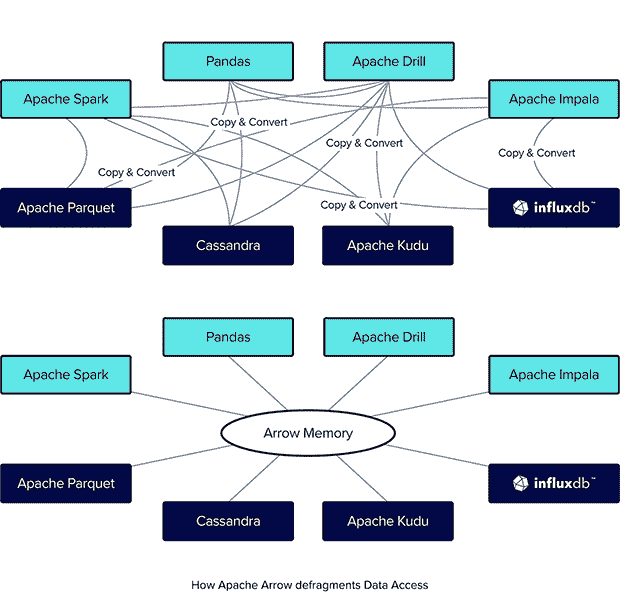
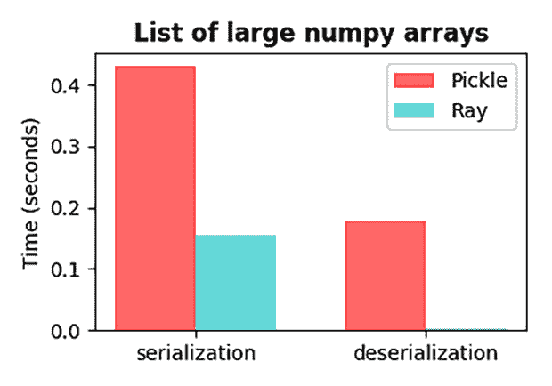

# Apache Arrow 如何改变大数据生态系统

> 原文：<https://thenewstack.io/how-apache-arrow-is-changing-the-big-data-ecosystem/>

使用[大数据](https://thenewstack.io/how-aiops-conquers-performance-gaps-on-big-data-pipelines/)的最大挑战之一是作为数据处理管道的一部分，在不同工具和系统之间移动数据所涉及的性能开销。

不同的编程语言、文件格式和网络协议都有不同的方式来表示内存中的相同数据。在数据管道中的潜在每一步将相同的数据序列化和反序列化为不同的表示的过程使得处理大量数据在硬件方面更慢且成本更高。

这个问题的解决方案是创建一种可以被视为数据通用语的东西，工具和[编程语言](https://thenewstack.io/25-most-popular-programming-languages-used-by-devops-pros/)可以将其用作高效传输和操作大量数据的通用标准。这个概念的一个提议实现是 [Apache Arrow](https://arrow.apache.org/) ，它已经开始被广泛采用。

## 什么是阿帕奇箭？

Apache Arrow 是一个开源项目，旨在为平面和层次数据提供标准化的[列内存格式](https://thenewstack.io/apache-arrow-designed-accelerate-hadoop-spark-columnar-layouts-data/)。Arrow 使现代 CPU 和 GPU 硬件的分析工作负载更高效，从而使处理大型数据集更容易，成本更低。

Apache Arrow 于 2016 年上线，随着时间的推移，其范围和功能都有所增长，许多以前独立的项目被集成到核心 Arrow 项目中，如 DataFusion 和 Plasma。

Apache Arrow 的总体目标可以概括为，通过为处理分析数据的不同系统创建一个通用接口，尝试为 OLAP 工作负载做 ODBC/JDBC 为 OLTP 工作负载做的事情。

## 阿帕奇箭的好处

### 表演

采用 Arrow 的主要好处是性能。使用 Arrow，在不同的工具和语言之间移动数据时，不再需要序列化和反序列化数据，因为它们都可以使用 Arrow 格式。当您需要多台服务器来处理数据时，这在大规模应用中尤其有用。

下面是一个从 Ray 获得性能提升的例子，Ray 是一个用于管理分布式计算的 Python 框架:

来源:Apache Arrow 博客。

不仅将数据转换为 Arrow 格式比使用 Pickle 等 Python 替代方法更快，而且在反序列化方面性能提升更大，速度快了几个数量级。

由于 Arrow 的基于列的格式，处理和操作数据也更快，因为它是为现代 CPU 和 GPU 设计的，因此数据可以并行处理，并利用 SIMD(单指令，多数据)进行矢量化处理。

Arrow 还提供了零拷贝读取，因此当您希望以不同的方式转换和操作相同的底层数据时，可以减少内存需求。

### 通过拼花地板进出大量数据

Arrow 与另一种基于列的数据格式 Apache Parquet[集成得很好，这种格式侧重于磁盘持久性。Arrow 和 Parquet 的结合使得管理生命周期和数据从 RAM 到磁盘的移动变得更加容易和高效。](https://www.influxdata.com/glossary/apache-parquet/?utm_source=vendor&utm_medium=referral&utm_campaign=2022-12_spnsr-ctn_apache-arrow-big-data_tns)

### 生态系统

Apache Arrow 的另一个好处是生态系统。随着时间的推移，越来越多的功能和特性被添加进来，性能也在不断提高。正如您将在接下来的章节中看到的，在许多情况下，公司会将整个项目捐赠给 Apache Arrow，并对项目本身做出重大贡献。

Apache Arrow 使几乎所有的公司受益，因为它使在系统之间移动数据变得更加容易。这意味着通过向项目中添加 Arrow 支持，开发人员也可以更容易地移植或采用该技术。

## 阿帕奇箭头功能

现在，让我们看看 Apache Arrow 项目的一些关键特性和不同组件。

### 箭头列格式

箭头列格式是项目的核心，它定义了数据在内存中应该如何组织的实际规范。从性能角度来看，这种格式提供的主要功能有:

*   数据能够被顺序读取。
*   恒定时间随机存取。
*   SIMD 和矢量处理支持。
*   零拷贝读取。

有多种语言的多个客户端库，使 Arrow 易于入门。

### 箭头飞行

[Arrow Flight](https://arrow.apache.org/blog/2019/10/13/introducing-arrow-flight/) 是一个添加到项目中的 RPC(远程过程调用)框架，允许通过网络轻松传输大量数据，而没有序列化和反序列化的开销。Arrow 提供的压缩也意味着与优化程度较低的协议相比，消耗的带宽更少。许多项目使用 Arrow Flight 来实现分析和数据科学工作负载的分布式计算。

### 箭头飞行 SQL

Arrow Flight SQL 是 Arrow Flight 的扩展，用于直接与 SQL 数据库交互。虽然它仍被认为是[的实验版](https://arrow.apache.org/docs/format/FlightSql.html)，但功能正在迅速增加。最近，一个 [JDBC 驱动](https://arrow.apache.org/blog/2022/11/01/arrow-flight-sql-jdbc/)被添加到该项目中，这意味着任何支持 JDBC (Java 数据库连接)或 ODBC(微软开放数据库连接)的数据库现在都可以通过 Flight SQL 与 Arrow 数据通信。

### 箭头数据融合

[DataFusion](https://www.influxdata.com/glossary/apache-datafusion/?utm_source=vendor&utm_medium=referral&utm_campaign=2022-12_spnsr-ctn_apache-arrow-big-data_tns) 是 2019 年捐赠给 Apache Arrow 的查询执行框架。DataFusion 包括一个查询优化器和执行引擎，支持 SQL 和 DataFrame APIs。它通常用于创建数据管道、ETL 过程和数据库。

## 使用 Apache Arrow 的项目

许多项目正在添加与 Arrow 的集成，以使采用他们的工具更容易，或者将 Arrow 的组件直接嵌入到他们的项目中，以避免重复工作。

*   **influx db IOx—**[influx db](https://www.influxdata.com/products/influxdb-cloud/?utm_source=vendor&utm_medium=referral&utm_campaign=2022-12_spnsr-ctn_apache-arrow-big-data_tns)的新列存储引擎 [IOx](https://www.influxdata.com/blog/influxdb-engine/?utm_source=vendor&utm_medium=referral&utm_campaign=2022-12_spnsr-ctn_apache-arrow-big-data_tns) 使用 Arrow 格式来表示数据，并将数据移入和移出 Parquet。它还使用 DataFusion 向 InfluxDB 添加 SQL 支持。
*   **Apache Parquet**—[Parquet](https://github.com/apache/parquet-mr)是一种用于存储[柱状数据](https://www.influxdata.com/glossary/column-database/?utm_source=vendor&utm_medium=referral&utm_campaign=2022-12_spnsr-ctn_apache-arrow-big-data_tns)的文件格式，被很多项目用于持久化。Parquet 支持对 Arrow 的向量化读写。
*   **Dask** — [Dask](https://github.com/dask/dask) 是一个并行计算框架，可以轻松地横向扩展 Python 代码。Dask 使用 Arrow 来访问拼花文件。
*   **Ray** — [Ray](https://github.com/ray-project/ray) 是一个框架，允许数据科学家处理数据，训练机器学习模型，然后使用统一的工具在生产中服务这些模型。Ray 依靠 Apache Arrow 以最小的开销在组件之间移动数据。
*   **Pandas**—[Pandas](https://github.com/pandas-dev/pandas)是 Python 生态系统中最流行的数据分析工具之一。Pandas 能够在后台使用 Apache Arrow 读取存储在 Parquet 文件中的数据。
*   **turbo DC**—[turbo DC](https://github.com/blue-yonder/turbodbc)是一个基于 ODBC 接口的工具，允许数据科学家通过 Python 高效地访问存储在关系数据库中的数据。Arrow 允许数据成批传输，而不是作为单个记录传输，从而提高了效率。

## 结论

软件开发的许多不同领域的一个大趋势是通过提高互操作性来消除锁定效应。在可观测性和监控领域，我们可以从 [OpenTelemetry](https://www.influxdata.com/blog/introduction-opentelemetry-observability/?utm_source=vendor&utm_medium=referral&utm_campaign=2022-12_spnsr-ctn_apache-arrow-big-data_tns) 等项目中看到这一点，在大数据生态系统中，我们可以从 Apache Arrow 等项目中看到类似的努力。

利用 Apache Arrow 的开发人员不仅可以节省时间，不需要重新发明轮子，还可以使用 Arrow 访问整个工具生态系统，这可以使新用户更容易采用。

<svg xmlns:xlink="http://www.w3.org/1999/xlink" viewBox="0 0 68 31" version="1.1"><title>Group</title> <desc>Created with Sketch.</desc></svg>