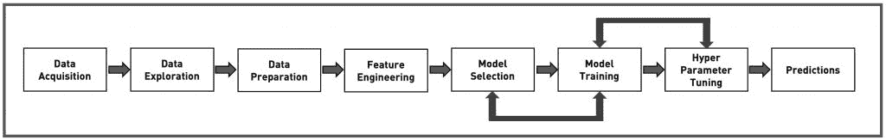

# AutoML 如何将人工智能的力量掌握在商业分析师手中

> 原文：<https://thenewstack.io/how-automl-puts-the-power-of-ai-in-the-hands-of-business-analysts/>

将人工智能和机器学习融入商业应用不是一项简单的任务。特别是，对于处理关键任务应用程序的企业来说，将 ML 与现有的应用程序集成起来是一项具有挑战性的工作。

从组织决定纳入机器学习到完全训练的模型的实际部署，有多个阶段涉及不同的团队和具有不同技能的个人。它必须经过下图所示的工作流程。

点击放大

## 看看机器学习管道

数据获取包括从各种数据源中识别和提取数据，如 RDBMS、NoSQL 数据库、数据仓库、第三方数据源等。企业依靠先进的 ETL(提取、转换、加载)工具来聚合来自不同来源的数据。

数据探索将提供对获得的数据集的洞察，并帮助数据工程团队评估数据的质量。这个阶段将帮助团队在聚合数据集中发现隐藏的模式、相关性和缺失的数据点。

数据准备阶段处理清理数据集。丢失的数据点可能会被删除，现有的列可能会被拆分，多个列可能会被合并，最后，数据集将成为工作流剩余阶段的完整且有价值的输入源。

特征工程是数据科学家从数据集中识别因变量(标签)和自变量(特征)的关键步骤。它们执行编码、缩放和标准化等技术，以使数据一致且同质。特征工程是 ML 项目成功的关键。

下一个阶段，模型选择，就是从大量可用的统计模型中选择正确的算法。解决同一个问题的算法可能不止一个(有时甚至十几个)。一个有经验的数据科学家将运用直觉和对业务问题的深刻理解来精选一套算法。

在训练阶段，充分准备的特征工程数据集用于训练和测试模型的准确性。输入数据被拆分为一个训练和测试数据集，这有助于评估模型的准确性和精确度。

超参数调整包括调整训练作业的各种参数，以发展出精确的模型。对用于训练的所有入围算法进行这种优化。这个阶段是工作流程中最复杂的步骤。

前面的三个阶段——模型选择、模型训练和超参数调整——被重复多次，直到结果令人满意。对于选择用于训练的每个模型，迭代地应用超参数调整。

最后，选择并部署最佳模型进行实时预测。开发人员可以像调用任何其他 API 一样调用 REST 端点来生成预测。

## 输入 AutoML

AutoML 试图通过自动化大部分步骤来加速一个训练好的模型的进化过程。用户需要上传数据集，并等待预测可用。从特征工程到超参数调整，AutML 自动化了管道中最复杂的步骤。

AutoML 创造了一个新的“公民数据科学家”阶层，将高级 ML 的力量直接掌握在商业用户手中。这并不意味着使用 AutoML 平台的组织不需要数据科学家。他们仍然需要发挥作用，带来他们的经验和领域知识。但是，AutoML 使数据科学家更加高效，因为模型构建过程中的重复步骤是自动化的，允许他们使用自己独特的专业知识来优化模型。

当处理一个 AutoML 平台时，业务分析师将注意力集中在业务问题上，而不是迷失在流程和工作流中。大多数平台会提示用户上传数据集，然后标注类别。之后，准备数据、选择正确的算法、优化和超参数调整等大部分步骤都在幕后处理。过了一会儿，平台公开了一个可用于预测的 REST 端点。这种方法极大地改变了训练机器学习模型所涉及的传统工作流程。

## AutoML 入门

AutoML 是人工智能和 ML 领域的一个发展趋势。IBM、Google 和微软等公共云提供商正在通过提供定制的认知平台来引领 AutoML 革命。像 [DataRobot](https://www.datarobot.com/) 这样的企业玩家正在为企业带来 AutoML 的力量。包括 Scikit-learn 和 Keras 在内的主流框架都在采用 AutoML 来简化工作流。

要感受一下 AutoML，参考我的[教程](https://thenewstack.io/get-started-with-google-cloud-automl-vision-for-image-classification/)关于在 Google 云平台上使用 AutoML vision。

AutoML 完美地介于认知 API 和定制 ML 平台之间。它提供了正确的定制级别，而无需强迫开发人员经历复杂的工作流程。与通常被认为是黑盒的认知 API 不同，AutoML 展示了同样程度的灵活性，但是将定制数据与可移植性相结合。

一些 AutoML 平台，如微软 Azure，也支持导出与运行 Android 和 iOS 的移动设备兼容的完整训练模型。开发人员可以快速将模型与他们的移动应用程序集成，而不必学习机器学习的具体细节。

微软最近[宣布](https://azure.microsoft.com/en-us/blog/getting-started-with-azure-cognitive-services-in-containers/)可以在容器中运行认知服务。当 AutoML 模型被导出到 Docker 容器中时，DevOps 团队将能够在生产环境中大规模部署它们以进行推理。他们可以在由 Kubernetes 和 DC/OS 管理的可扩展集群中托管容器。

随着每个平台供应商试图使机器学习民主化，AutoML 正在演变为人工智能的未来。它将人工智能的力量放在了商业分析师和技术决策者的手中。

安德森·W·兰格尔在 [Unsplash](https://unsplash.com/?utm_source=unsplash&utm_medium=referral&utm_content=creditCopyText) 上的照片。

<svg xmlns:xlink="http://www.w3.org/1999/xlink" viewBox="0 0 68 31" version="1.1"><title>Group</title> <desc>Created with Sketch.</desc></svg>