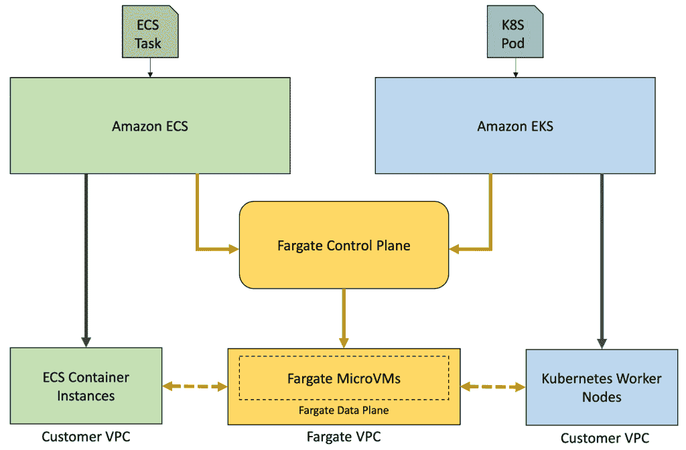
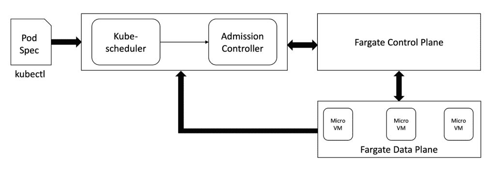
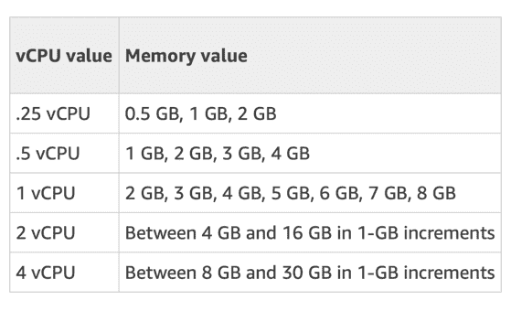
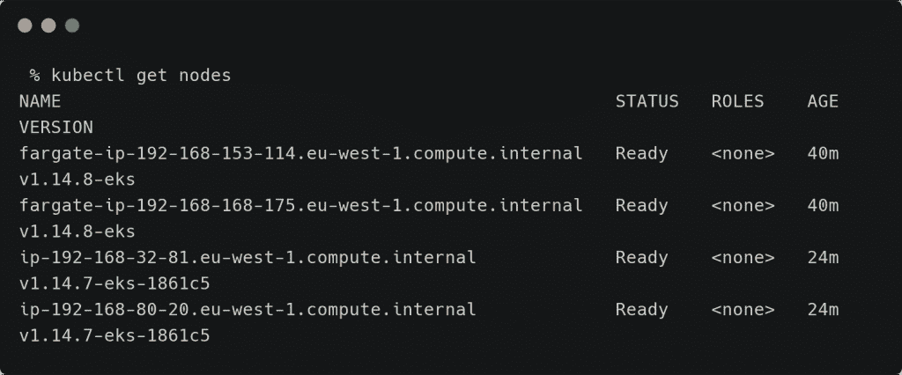
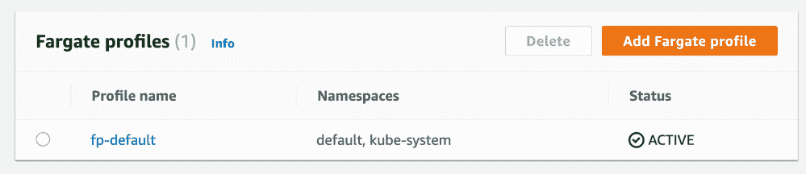
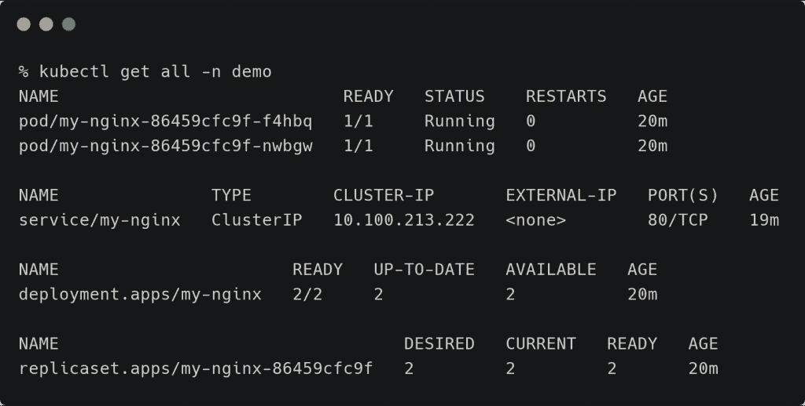
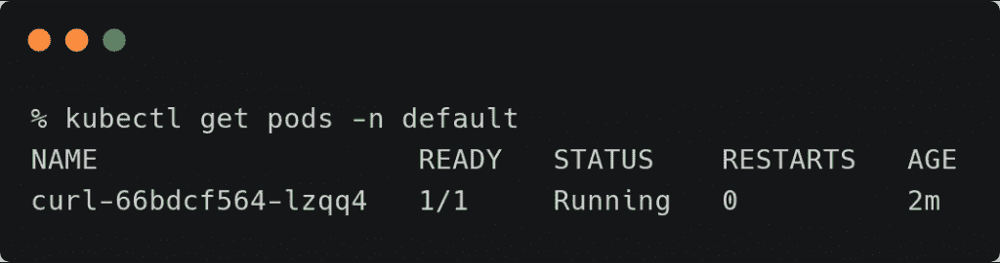
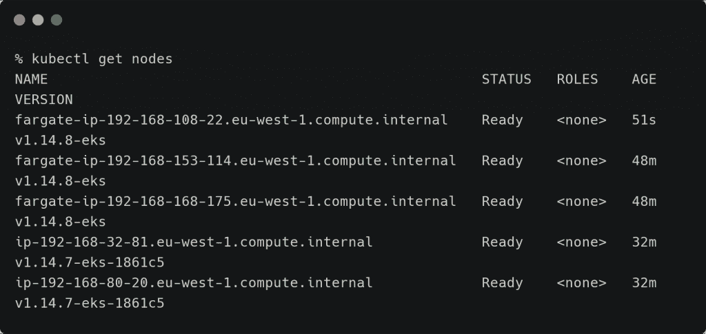
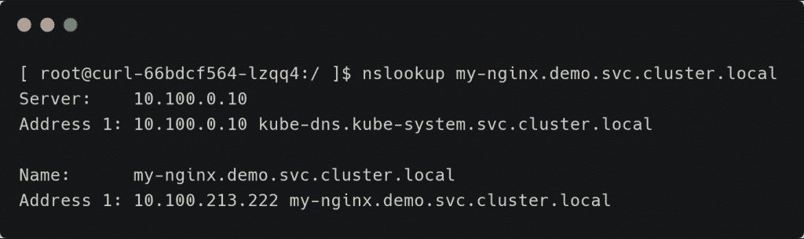
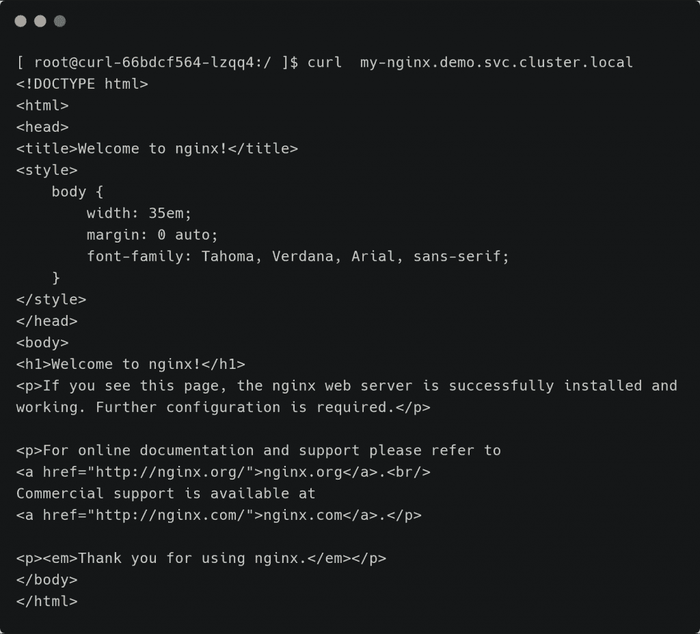

# AWS Fargate 如何将亚马逊 EKS 变成无服务器容器平台

> 原文：<https://thenewstack.io/how-aws-fargate-turned-amazon-eks-into-serverless-container-platform/>

这是第三部分

[Janakiram MSV](https://janakiram.com/webinars/)

这是一个由四部分组成的系列，研究 Amazon Web Services 上自动化容器服务的发展。阅读

[part one](/the-evolution-of-serverless-container-platform-on-aws-fargate/)

，以及

[two](/aws-fargate-through-the-lens-of-kubernetes/)

；本周晚些时候检查最后一期。

在本系列的最后一部分中，我将 Amazon Web Services 的 Fargate/Elastic Container Services(ECS)与 Kubernetes 进行了比较。在这一部分中，我们将仔细看看 Amazon Elastic Kubernetes 服务(EKS)是如何扩展以支持 Fargate 的。我还将解释服务发现在法盖特和 EKS 之间是如何工作的。

在我们进入 Fargate 与 EKS 集成的细节之前，让我回顾一下 Fargate 的设计，它为 ECS 和 EKS 提供了无服务器容器功能。

Amazon 将 Fargate 设计为一个独立的控制平面，可以通过多个接口公开。产品团队没有将 Fargate 定位为一个独立的服务，而是将其作为 ECS 的一个发布类型。这也使他们能够将 ECS 的任务和服务术语扩展到 Fargate。

到目前为止，ECS 是处理 Fargate 的唯一接口。但是随着亚马逊 EKS 获得动力，产品团队现在正在扩展 Kubernetes 控制平面作为 Fargate 的接口。Fargate 和 EKS 之间的集成将使 Kubernetes 用户能够将标准 pod 定义转换为 Fargate 部署。

【T2

如上图所示，Fargate 成为 AWS 无服务器容器平台的核心构建块。ECS 任务或 Kubernetes pod 可以很容易地找到到达 Fargate 数据层的路径。

AWS 的 Fargate 团队在扩展 Kubernetes 以支持 Fargate 控制平面方面做了令人印象深刻的工作。让我们来了解一下它是如何工作的。

首先，亚马逊 EKS 获得了一组控制器来与 Fargate 控制平面对话。当一个以特定命名空间为目标或者标注了自定义标签的 pod 到达 EKS 时，Kubernetes 使用自定义控制器将生命周期移交给 Fargate。

在幕后，EKS 使用标准的 Kubernetes [准入控制器 webhooks](https://kubernetes.io/blog/2019/03/21/a-guide-to-kubernetes-admission-controllers/) 来处理吊舱的定制调度。一旦 pod 被委托给 Fargate，Kubernetes 就不再负责管理生命周期。Kubernetes 控制平面仅报告 pod 的当前状态，同时将对象的 CRUD 操作传递给 Fargate 控制平面。

由于资源调度是由 Fargate 处理的，因此可以启动一个没有工作节点的 EKS 集群，该集群只充当 Fargate 的接口。有趣的是，在专用微型虚拟机中调度的每个 pod 都显示为集群的一个新节点。每个被伪装成 Kubernetes 工作节点的 Fargate 微虚拟机都运行 Kubelet，它像任何其他工作节点一样与 Kubernetes 主节点通信。这种设计非常类似于微软通过虚拟 Kubelet 项目集成 Azure 容器实例和 Azure Kubernetes 服务的方法。

【T2

总之，与 EKS 集成的 Fargate 控制器翻译通过 kubectl 提交给 Fargate 任务的 pod 的 YAML 定义。

## 看看法盖特的简介

Kubernetes 和 Fargate 之间的关键链接是 Fargate 配置文件，它可以在集群配置期间创建(通过 *eksctl* CLI ),也可以在以后添加。

Fargate 配置文件包含将 Kubernetes 与 Fargate 控制平面相关联的基本元素。该配置文件包含以下元素:

*   **Pod 执行角色:**由于 Pod 最终变成了 EC2 微 VM，我们需要传递实例可以承担的角色，以调用 ECR 之类的服务。没有这个角色，Fargate 代理/kubelet 就不能与 AWS 宇宙对话。
*   **子网:**即使 Fargate 数据平面运行在隐藏的私有 VPC 中，也需要来自客户 VPC 的子网来路由入站和出站流量。此时，在 Fargate 上运行的 pod 没有被分配公共 IP 地址，因此只允许私有子网。
*   **选择器:【Kubernetes 中的整个名称空间或一组标签可以与 Fargate 控制平面相关联。任何以指定命名空间为目标的吊舱或带有标签的吊舱都是对 EKS 的暗示，要将其转变为 Fargate 部署。**

## **从 Kubernetes Pod 到 Fargate 实例**

对 Fargate 使用 pod 规范的优点之一是能够将所需的资源映射到 EC2 实例类型。



例如，当下面显示的 pod 规范通过 EKS 部署在 Fargate 中时，它被分配到一个具有 1 个 vCPU 和 2GB 配置的 EC2 微虚拟机。

```
apiVersion:  v1
kind:  Pod
metadata:
  name:  fg-eks-demo
spec:
  containers:
  -  name:  fg-eks-demo-container
    image:  gcr.io/google-samples/node-hello:1.0
    resources:
      requests:
        memory:  "64Mi"
        cpu:  "250m"
      limits:
        memory:  "128Mi"
        cpu:  "1"

```

如果一个 pod 有多个明确定义了资源需求的容器，那么 Fargate 调度程序会对一个 pod 中所有容器的 limits 部分下定义的 CPU 和内存需求进行舍入，然后选择正确的 EC2 实例来放置任务。

## EKS /法盖特的服务发现

假设安全组配置正确，允许节点组和为 Fargate 配置文件选择的子网之间的流量， [CoreDNS](https://coredns.io/) 可以促进 Kubernetes 和 Fargate 部署之间的 DNS 和服务发现。

我启动了一个 EKS 集群，默认的 Fargate 配置文件是由 *eksctl* CLI 添加的。后来，我添加了一个包含两个工作节点的托管节点组。



*eksctl* 实用程序将自动为 Fargate 配置默认名称空间和 **kube-system** 名称空间。看看由 *eksctl* 创建的 **fp-default** 概要文件。



在 **kube-system** 名称空间中，CoreDNS pods 被安排启用名称解析和服务发现。以 **fargate-ip-xxx** name 开头的前两个节点代表运行 CoreDNS 的 fargate 实例。

然后我创建了一个名为 **demo** 的新名称空间，它不是 Fargate 概要文件的一部分，然后在这个名称空间中部署了一个 Nginx pod 和服务。



因此，在这一点上，我们有一个标准的 Nginx 部署，作为运行在 **demo** 名称空间中的 ClusterIP 服务。

现在让我们在**默认的**名称空间中启动一个 pod，它将被转换成一个 Fargate 实例。这个 pod 将运行一个 Busybox 容器，其中包含网络实用程序，如 *nslookup* 和 *curl* 。

```
kubectl run curl  --image=radial/busyboxplus:curl  -i  --tty

```

几秒钟后，pod 进入运行状态，节点计数增加，表明 Fargate 已经将 pod 分配给一个新实例。



第一个已经运行了 51 秒的节点正在运行 Busybox pod。



现在，让我们看看 Fargate 中运行的 Busybox pod ( **默认**名称空间)是否可以访问 Kubernetes 中运行的 Ngnix pod ( **演示**名称空间)。





它清楚地显示了 Fargate 实例能够与 Kubernetes 中本地运行的 pods 和服务进行对话。

我非常喜欢这种方法，因为我可以使用标准的 Kubernetes 原语，比如部署和服务，而无需更改规范。基于目标名称空间和标签，EKS 将计算出在哪里运行我的工作负载。我们必须感谢 AWS 容器服务团队的这个优雅的设计。

这种模式带来了许多有趣的机会。例如，在 Fargate 中运行 web 和 API 前端时，我可以在 EKS 运行一个 HA 数据库集群作为一个 statefulset。在我之前的一个教程中，我[演示了](https://thenewstack.io/deploy-an-elastic-web-app-with-portworx-and-google-cloud-run/)如何在标准 GKE 集群上运行 Portworx 支持的有状态数据库，同时在 Google Cloud Run 上运行前端。我们可以很容易地将这个用例扩展到 EKS 和法盖特。

还应该可以从 Kubernetes 获得在同一 VPC 推出的 ECS 服务。该功能与 App Mesh 相结合，使得在 AWS 上部署容器成为可能，而无需担心通过 ECS 和 EKS 暴露的控制平面原语。

这种可互操作的、与控制平面无关的部署模式使得在 AWS 中运行容器化的生产工作负载更加便宜和高效。

在本系列的最后一部分，我将讨论 EKS/Fargate 的局限性，并与 Google Cloud Run 和微软 Azure Container 实例进行简单比较。敬请期待！

贾纳奇拉姆·MSV 的网络研讨会系列“机器智能和现代基础设施(MI2)”提供了涵盖前沿技术的信息丰富、见解深刻的会议。在 [http://mi2.live](http://mi2.live/) 注册即将到来的 MI2 网络研讨会。

<svg xmlns:xlink="http://www.w3.org/1999/xlink" viewBox="0 0 68 31" version="1.1"><title>Group</title> <desc>Created with Sketch.</desc></svg>