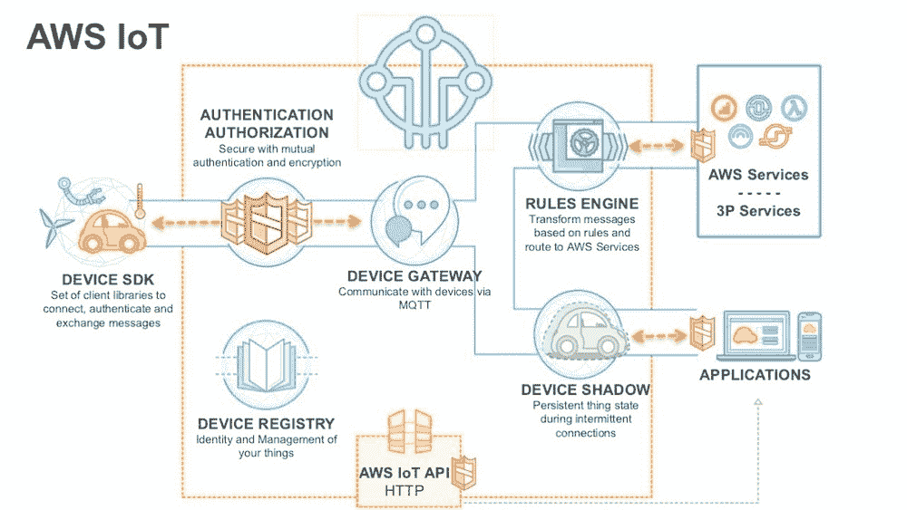
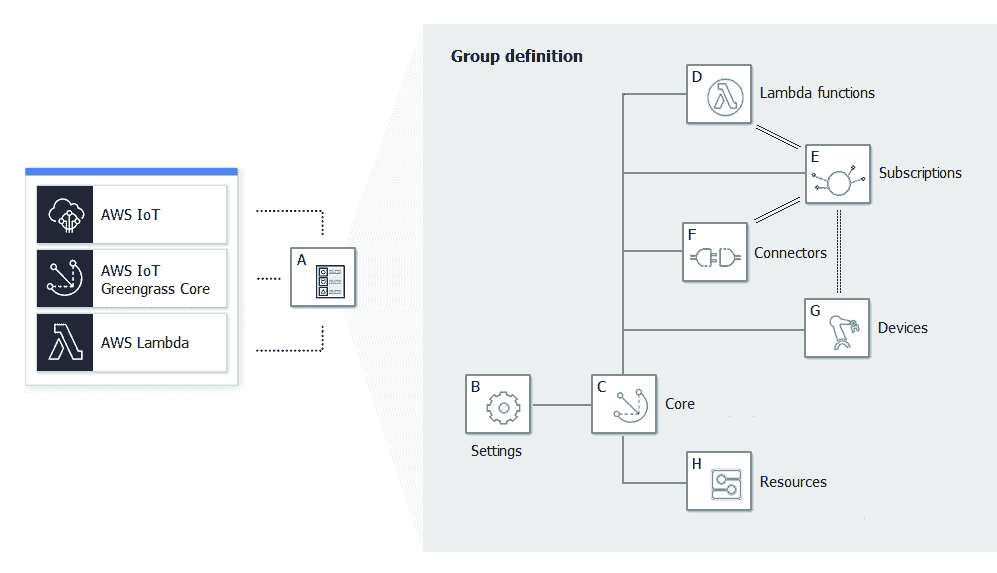

# AWS 物联网 Greengrass 如何将云功能带到边缘

> 原文：<https://thenewstack.io/how-aws-iot-greengrass-brings-cloud-capabilities-to-the-edge/>

亚马逊网络服务在 2016 年末推出了 [AWS 物联网 Greengrass](https://aws.amazon.com/greengrass/) ，作为需要离线本地计算能力的设备的[物联网(IoT)](https://thenewstack.io/category/edge-iot/) 网关。随着行业的发展，物联网网关成熟成为[边缘计算](https://thenewstack.io/azure-iot-edge-a-technology-primer/)设备。一些新兴趋势，如事件驱动计算、机器学习推理，是这一演变的关键驱动力。

AWS 物联网 Greengrass 已经成为亚马逊的战略投资。一些在内部运行的 AWS 产品和服务(如 Snowball Edge)广泛使用 Greengrass 进行连接和管理。

在本文中，我将提供 AWS 物联网 Greengrass 的整体情况以及该平台的核心构建模块。

## AWS 物联网核心:云中的设备管理服务

正是 AWS[收购 2lemetry](https://techcrunch.com/2015/03/12/amazon-has-quietly-acquired-2lemetry-to-build-out-its-internet-of-things-strategy/) 导致了 [AWS 物联网核心](https://aws.amazon.com/iot-core/)的推出，即云中的设备管理和机器对机器(M2M)服务。

凭借物联网核心，AWS 做了许多正确的事情。该平台有一个设备注册表，作为设备的安全存储库。根据 X.509 证书，每台设备在加入连接的解决方案之前都要经过身份验证和授权。设备通过适用于主要平台和语言的 AWS 物联网设备 SDK 连接到云。

物联网核心附带一个安全且可扩展的 [MQTT 代理](https://thenewstack.io/mqtt-protocol-iot/)，支持设备到云以及云到设备的通信。该平台具有与 SQL 兼容的健壮的规则引擎，用于以声明方式定义路由和过滤器。规则引擎可以与包括 Lambda 在内的各种 AWS 服务集成，Lambda 是 AWS 物联网核心的关键组件。

AWS Lambda 充当连接到云的物联网设备和其余平台服务之间的桥梁。开发人员使用 Lambda 将传感器遥测数据与 Redshift、DynamoDB 和其他数据库集成在一起。

## AWS 物联网 Greengrass:离线物联网核心和 Lambda

AWS 物联网 Greengrass 主要是为解决离线场景而设计的。最初被编程为与云对话的设备即使在断开连接时也应该继续工作。

为了实现离线功能，亚马逊公开了一个紧凑的物联网核心层，它在本地运行，占用空间较小。AWS 物联网设备 SDK 在失去与云的通信时继续与 Greengrass 合作。像它的对手一样，物联网 Greengrass 向本地设备公开了设备注册表和消息代理。

Greengrass 附带了一个 Lambda 运行时来支持事件驱动的计算。开发人员可以将代码编写为普通的 Lambda 函数，并将它们部署到 AWS Lambda，后者被 Greengrass 控制平面推到了边缘。

在 Greengrass 中运行的 Lambda 为边缘计算层提供了所需的管道。由于 Lambda 函数在边缘本地运行，它们可以访问本地资源，如 ModBus、CanBus、GPIO，甚至文件系统。开发人员利用 Lambda 为他们运行在边缘的应用程序添加强大的功能。

### AWS 物联网 Greengrass:关键构建模块

以下是与 AWS 物联网 Greengrass 相关的一些关键概念:

*   *   **AWS 物联网 Greengrass Group**:AWS 物联网 Greengrass Group 是一组设置和组件的集合，例如 AWS 物联网 green grass 核心、设备和订阅。组用于定义交互的范围。例如，一个组可能代表建筑物的一层、一辆卡车或整个矿区。因为组充当所有设备的逻辑边界，所以它对所有实体实施一致的配置和策略。
    *   **AWS 物联网 Greengrass 核心**:这只是 AWS 物联网核心注册表中的一个设备，兼作边缘设备。它是运行 Greengrass 运行时的 x86 和 ARM 计算设备。本地设备与核心的对话方式类似于它们与 AWS 物联网核心的交互方式。
    *   **AWS 物联网设备**:这些设备是绿草集团的一部分。一旦设备成为群组的一部分，它们会自动发现核心以继续通信。每个设备都有唯一的身份，运行 AWS 物联网设备 SDK。现有设备可以添加到 Greengrass 组。

*   **Lambda 功能**:如前所述，Lambda 为 AWS 物联网 Greengrass 提供本地计算能力。内核中运行的每个功能都使用 Greengrass SDK 与资源和设备进行交互。这个 SDK 抽象了处理核心运行时、设备和本地资源的原语。Lambda 函数可以定制为在 Greengrass 沙盒容器中运行，或者直接作为设备操作系统中的一个进程运行。
*   **订阅** : AWS 物联网 Greengrass 订阅以声明方式连接资源。它维护一个交换消息的发布者和订阅者的列表。本地设备可以充当发布者，而λ函数可以是订阅者。对于另一个场景，Lambda 函数可以向设备订阅的主题发布消息。订阅通过有效地分离发布者和消费者，消除了他们之间的强烈依赖。
*   **连接器** : AWS 物联网 Greengrass 连接器允许开发人员在 AWS 物联网 Greengrass 上轻松构建复杂的工作流，而不必担心理解设备协议、管理凭证或与外部 API 交互。基于声明性机制，Connects 将边缘计算场景扩展到第三方环境和服务。连接器依赖秘密来维护外部服务所需的 API 密钥、密码和凭证。
*   **ML 推断**:这是 AWS 物联网 Greengrass 最近新增的功能之一。训练好的模型首先被上传到亚马逊 S3 桶，然后在本地下载。加载本地模型后，负责推断入站数据流的 Lambda 函数将预测发布到 MQTT 主题。由于 Python 是 Lambda 中的一等公民，许多现有的模块和库可以用于在边缘执行 ML 推理。

在下一篇文章中，我将向您介绍在 AWS IoT Greengrass 管理的边缘运行智能相机设备的步骤。敬请期待！

<svg xmlns:xlink="http://www.w3.org/1999/xlink" viewBox="0 0 68 31" version="1.1"><title>Group</title> <desc>Created with Sketch.</desc></svg>