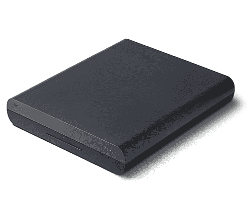
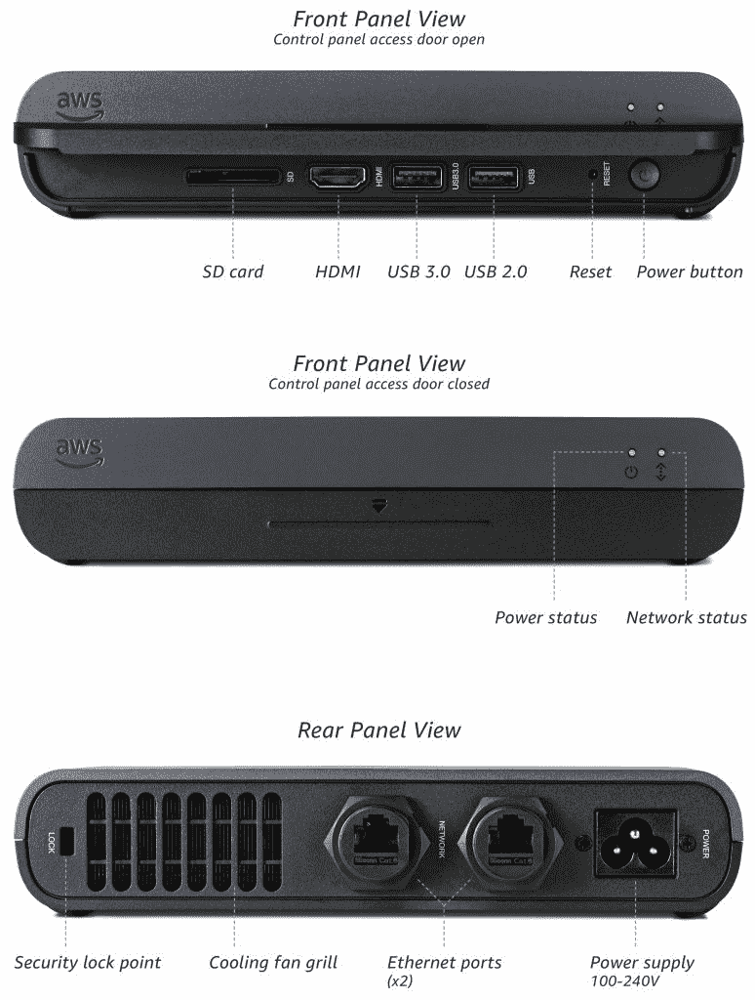

# AWS Panorama 如何在边缘加速计算机视觉

> 原文：<https://thenewstack.io/how-aws-panorama-accelerates-computer-vision-at-the-edge/>

在 AWS re:Invent 2017 上，亚马逊推出了 [AWS Deep Lens](https://aws.amazon.com/deeplens/) ，这是一款由英特尔图形引擎和 GreenGrass、SageMaker、IoT Core 和 Lambda 等 AWS 服务提供支持的智能相机。作为一名 AI 爱好者，我对 DeepLens 的设计和架构非常着迷。我一从维加斯回家，就剖析了架构，并在新堆栈上发表了一篇[深度分析](https://thenewstack.io/deep-dive-amazon-deeplens/)。

三年后，在 re:Invent 2020 上，亚马逊宣布了 [AWS Panorama](https://aws.amazon.com/panorama/) ，这是 AWS DeepLens 的行业级企业级版本。它旨在帮助客户加快基于计算机视觉的应用程序的部署。AWS Panorama 可以将任何现有的开放网络视频接口论坛( [ONVIF](https://www.onvif.org) )兼容的 IP 摄像机转变为智能的、灵巧的摄像机。

AWS Panorama 的根源在于 DeepLens，它是作为一个原型设计的，旨在展示如何在云中训练的人工智能模型可以部署在边缘。亚马逊与客户、原始设备制造商(ODM)、设计人工智能加速器的硅制造商和系统集成商密切合作，提供端到端的解决方案。

AWS Panorama 有两个组件，一个即插即用设备和一个用于构建和部署应用程序的 SDK。让我们仔细看看这个平台。

## AWS Panorama 设备

AWS Panorama 设备是一种加固型硬件设备，充当多个 IP 摄像机的中枢。它可以将任何支持 ONVIF 标准的相机变成智能相机。由于 AWS Panorama 设备的防护等级为 IP62，具有防尘和防水功能，因此可以部署在恶劣的环境中。

AWS Panorama 设备带有一个 HDMI 端口，用于连接视频监视器以查看推理输出和两个千兆以太网端口。该设备大约有半个机架单元宽，这意味着一个服务器机架中可以容纳两个单元。

虽然该设备计划于明年发布，但 AWS Panorama 设备开发工具包将帮助客户开始使用该平台。开发工具包的硬件规格与设备的最终版本非常相似。

由于边缘的计算机视觉需要硬件加速，AWS Panorama 设备建立在 [NVIDIA Jetson Xavier](https://developer.nvidia.com/embedded/jetson-agx-xavier-developer-kit) 系统级模块(SOM)上。Jetson Xavier 拥有带张量内核的 512 核 Volta GPU、8 核 ARM CPU、32GB RAM，是市场上最强大的 edge 硬件平台。在 Tensorflow、PyTorch 和 MXNet 中训练的模型被转换为 NVIDIA 的 TensorRT 格式，并针对推理进行了优化。亚马逊做出了基于 NVIDIA Jetson Xavier 构建其计算机视觉设备的最佳决定。它提供了并发处理多个视频流所需的能力和性能，同时提供了快速推理。

该设备的最终版本也可能支持用于人工智能加速的 [Ambarella](https://www.ambarella.com) CV 2x 产品线。这些 som 设计用于精确的 3D 环境建模和实时神经网络性能。CV2x 系列芯片用于高级机器人和工业应用，包括自主机器人。CVFlow 是优化部署在 CV 2x 芯片上的推理神经网络的软件层。

首先，您需要将 AWS Panorama 设备连接到互联网，并通过 AWS 控制台进行配置。一个向导完成这些步骤，最后生成一个包含证书和注册元数据的 tarball。一旦插入装有 tarball 的 USB 驱动器，设备将自动完成注册过程。在幕后，本地 GreenGrass 实例与物联网核心进行对话，以将该设备注册为物联网设备。IAM 角色被分配给设备，该设备提供足够的权限来访问 Lambda 函数和其他 AWS 服务，如 CloudWatch 和 CloudTrail。

亚马逊正在包括多个预训练的 ML 模型，用于 PPE 检测、估计零售队列长度和人群计数。通过 SageMaker 训练或注册的其他模型可以轻松地推送到设备。

为了构建应用程序并将其与 ML 模型集成，开发人员需要 AWS Panorama SDK。

## AWS 全景 SDK

AWS Panorama SDK 是平台的软件组件，用于在设备上开发、测试和部署应用程序。它同时支持 NVIDIA Jetson Xavier 和 Ambarella CV 2 SOM。

亚马逊正在让 SDK 只对设备制造商和硬件合作伙伴的封闭社区开放。它不对更广泛的 AWS 开发者社区开放。

通过 SDK，开发人员可以将应用程序推送到部署在边缘的 Panorama 设备群。经过训练的模型存储在 S3 桶中，该桶与 Lambda 函数集成在一起。通过 AWS 控制台，开发者可以将模型和 Lambda 函数的组合打包部署并在边缘运行。

亚马逊在 [GitHub](https://github.com/aws-samples/aws-panorama-samples) 上发布了 AWS Panorama 的样本和机器学习模型，附带 Jupyter 笔记本和 Lambda 功能。

## 总结和关键要点

自 2017 年宣布 DeepLens 以来，AWS ML、IoT 和 edge 平台已经成熟。AWS Panorama 平台基于这些服务和计算机视觉的新兴用例(如社交距离和强制使用面罩)的紧密集成。

AWS Panorama 也是首批来自公共云提供商的工业级计算机视觉平台之一。对于寻求即插即用计算机视觉平台的制造、零售、医疗保健和物流垂直行业的客户来说，这是一个绝佳的选择。

就我个人而言，我对 AWS 不向开发者开放 SDK 有点失望。DeepLens 和 AWS Panorama 不兼容。AWS 应该已经发布了一个新的 SDK 来升级 DeepLens，使其与 Panorama Appliance 持平。它可能仅限于一个不支持 ONVIF 的 USB 摄像头。

亚马逊网络服务是新堆栈的赞助商。

<svg xmlns:xlink="http://www.w3.org/1999/xlink" viewBox="0 0 68 31" version="1.1"><title>Group</title> <desc>Created with Sketch.</desc></svg>