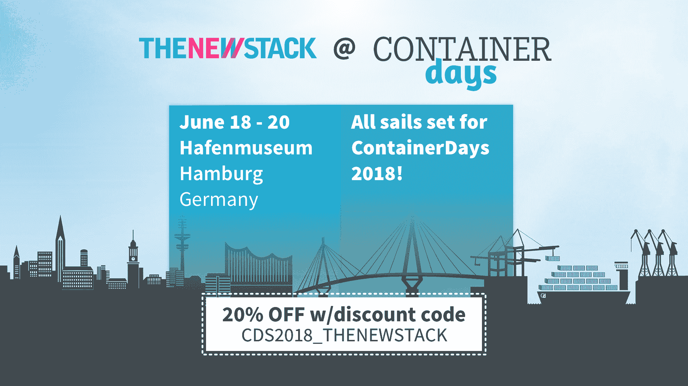

# AWS 如何在后容器时代使用 Chef

> 原文：<https://thenewstack.io/how-aws-uses-chef-in-a-post-container-world/>

[AWS 如何在后容器世界使用厨师](https://thenewstack.simplecast.com/episodes/how-aws-uses-chef-in-a-post-container-world)

现在，你可能正在世界的某个地方，在亚马逊网络服务上运行某种形式的服务器。如果是这样，您也将您的系统的可靠性和稳定性托付给了 AWS 的人员:他们已经考虑了他们的 DevOps 实践，并在扩展、停机和备份方面支持您。你应该相信这一点:亚马逊的 AWS 记录每年都会变得更好，因为数十亿应用程序在其范围内成功完成了他们的业务目标。

但是亚马逊是如何维持这样一个惊人的科幻大小的硬件和软件托管系统的呢？答案不仅是 DevOps，也是[大厨](https://www.chef.io/)。过去一周，在 Chefconf ，我们与高级软件开发经理 [Jonathan Weiss](https://www.slideshare.net/jweiss) 和软件开发经理 [Mark Rambow](https://www.linkedin.com/in/markrambow/) 坐在一起，他们都来自亚马逊的 AWS 团队。我们追踪了他们公司内部的控制和实践线，以发现是什么让他们不仅可以规模化经营，还可以让世界上的其他人也可以规模化经营。

他们的回答很吸引人。“我们相信我们所说的‘从客户开始逆向工作’这意味着，我们总是试图从客户问题开始，我们如何解决它，我们如何为客户消除摩擦，并向后工作到技术问题，韦斯说。我们总是喜欢把这个交给专门的团队来解决。我们称之为“两个披萨”团队。一个可以用两个披萨喂饱的团队。然后，这一小组人负责解决这个问题，并把 DevOps 方面带入其中，这意味着定义问题、设计解决方案、实现解决方案，然后部署、操作它，并在一定程度上维护它。"

“我们的目标是让基础设施对客户来说毫不费力，对吗？因此，当你转向云时，在 Docker 容器部署中运行新的服务器实例是很方便的，这是一个为我们的客户解决的问题，”Rambow 说。“我们喜欢向我们的客户宣传我们在内部所做的事情，因为他们可以从我们目前生活的敏捷性中受益，这样他们就可以采用相同的最佳实践。”

两人还表示，即使在基于容器的世界中，Chef 仍然对他们的团队有用。配置管理仍然涵盖了许多企业所需的用例，从法规遵从性到部署。Weiss 指出，企业继续需要帮助的一个主要领域是“著名的遗留应用程序，它比绿地应用程序要多得多。这些通常很难进入 Docker 或 Kubernetes 之类的东西，但更容易的是将它们放在映像中，并用 Chef 之类的东西复制它们，以便您至少能够将它们提升并转移到云中，在那里您可以运行灵活的工作负载，您可以受益于自动扩展之类的东西，即使您无法像您希望的那样自动执行它们。”

[https://www.youtube.com/embed/w4iMgvkxT9g?feature=oembed](https://www.youtube.com/embed/w4iMgvkxT9g?feature=oembed)

视频

## 在这个版本中:

*   [1:43:](https://thenewstack.simplecast.com/episodes/how-aws-uses-chef-in-a-post-container-world?t=1:43)devo PS 在亚马逊内部是如何工作的？
*   [5:36:](https://thenewstack.simplecast.com/episodes/how-aws-uses-chef-in-a-post-container-world?t=5:36) 在客户要求您添加功能的技术决策中，您从他们那里看到了什么？
*   [7:11:](https://thenewstack.simplecast.com/episodes/how-aws-uses-chef-in-a-post-container-world?t=7:11) 你建立的那些内部流程最终是如何外化的？
*   [14:06:](https://thenewstack.simplecast.com/episodes/how-aws-uses-chef-in-a-post-container-world?t=14:06) 对于 AWS 来说，配置管理作为一种实践是如何发展的？
*   [21:42:](https://thenewstack.simplecast.com/episodes/how-aws-uses-chef-in-a-post-container-world?t=21:42) 什么是 [OpsWorks](https://aws.amazon.com/opsworks/) ？
*   [26:32:](https://thenewstack.simplecast.com/episodes/how-aws-uses-chef-in-a-post-container-world?t=26:32) 随着客户对他们想要做的事情越来越了解，您如何看待您开发的架构和基础设施的发展？

<svg xmlns:xlink="http://www.w3.org/1999/xlink" viewBox="0 0 68 31" version="1.1"><title>Group</title> <desc>Created with Sketch.</desc></svg>