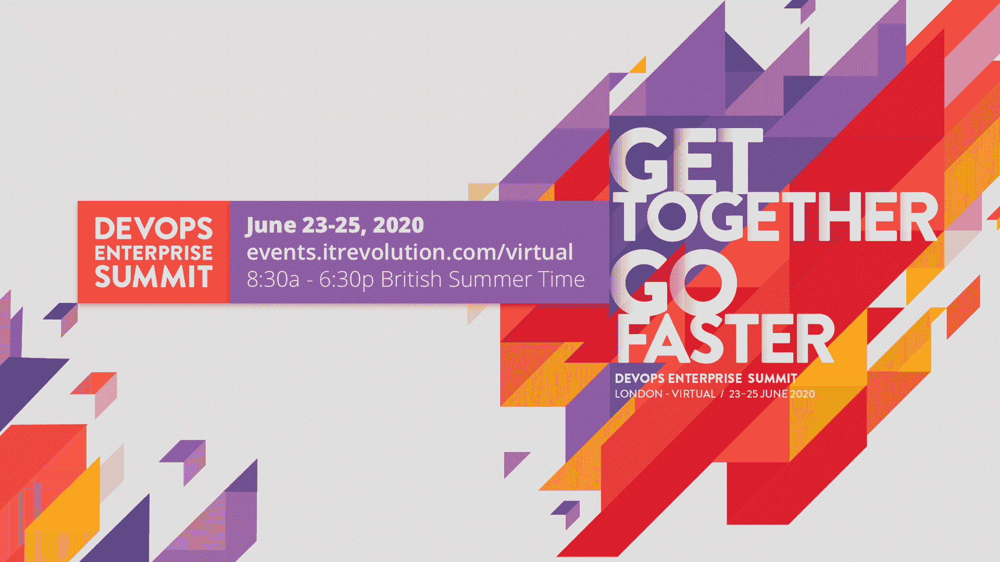

# 博彩公司威廉·希尔如何拥抱 DevOps

> 原文：<https://thenewstack.io/how-betting-company-william-hill-embraced-devops/>

[GitLab](https://about.gitlab.com/) 赞助本帖。

 [加雷斯·塞普顿

Gareth 是 William Hill 的基础设施和云工具产品负责人。](https://www.linkedin.com/in/garethsephton/) 

我在 William Hill 的基础设施团队支持一个全球开发团队，我们完全接受 DevOps。

全球在线博彩公司 William Hill 自成立以来一直是技术创新者。早在 1934 年，该公司就精明地开始用电话和邮件投注替代球场投注，从 1966 年开始增加投注店，并于 1998 年进入在线投注。William Hill 继续投资于技术创新能力，特别是在 2009 年将一些业务转移到直布罗陀，在 2012 年建立美国业务，并在 2019 年收购 Grand Parade 2016 和 Green 先生。

尽管 William Hill 有结构化的细分部门或渠道，但我们的技术团队的定义特征是他们的分离，以确保专注于产品设计和客户体验:团队现在在英国、直布罗陀和波兰克拉科夫的公司技术中心工作。

这些团队将开发人员、测试人员、工程师、项目经理、scrum masters 和产品负责人结合在一起，进行开发和交付。在其支持角色中，William Hill 的中央运营团队处于一个幸运的位置，能够从每个单独的渠道中吸取经验教训，并利用它们来帮助和指导他人。

随着全球博彩受到严格监管，大多数法律变更需要内部渠道进行大量工作，以确保本地合规性，同时保持收入。例如，2019 年欧洲三年期审查导致英国固定赔率投注终端的最大赌注从 100 英镑削减到 2 英镑。这一变化给该公司的零售部门带来了巨大挑战。相比之下，美国最高法院裁定 PASPA(1992 年职业和业余体育保护法案)违宪是一个例外，因为它允许各州允许赌博。这导致了美国市场机会的逐渐开放，而英国的零售机会却减少了。

在不断变化的法规中，我们必须创新、重塑业务并适应变化。成功的真正关键是让有才华、有动力和敬业的人创建一个高绩效的组织，团队掌握他们的技能。

为了在技术层面成功推动我们的战略，我们的目标是构建一个任何开发团队都可以用来提高工作效率的集中平台，包括类似生产的环境、为 DevOps 设置[部署战略、集成监控(包括信息安全团队的安全工具)以及将所有这些整合在一起。](https://thenewstack.io/deployment-strategies/)

借鉴设计思维，我们的基础设施支持团队面对面采访了主要的技术同事，以更深入地了解他们的需求。渠道报告说，他们希望开发管道是集中管理的，有更稳定可靠的工具和更少的工具。他们还希望在服务级别实现自治，即拥有足够的知识来组装拼图，同时保持整体可见性。有了这种明确的所有权，不同的团队可以更有效地合作，更快地为 William Hill 客户提供价值。

> 一个集中的平台可以帮助任何开发团队变得更加高效，构建类似生产的环境，建立部署管道，合并监控，甚至集成我们的 infosec 团队必须提供的安全工具。它有助于将所有东西结合在一起。

持续集成、交付和部署是 DevOps 工具链的圣杯。能够安全地将代码提交通过各种质量关，并在没有人为干扰的情况下交到客户手中，这是一个梦想。

自 2015 年以来，William Hill 一直使用 GitLab 作为其源代码控制库。作为新 DevOps 战略的一部分，基础设施团队研究了不同的开发和技术团队如何从更广泛的产品采用中受益。

通过设计思维访谈过程，中心团队发现 GitLab 在 CI/CD 领域脱颖而出，成为人们喜欢的产品——来自经验丰富的开发人员和工程师的高度评价。

## 实施 DevOps

更广泛地采用 DevOps 使 William Hill 能够退一步，审视没有约束的解决方案。在竞争激烈的市场中，技术可能会发生变化，但是随着时间的推移积累起来的知识和经验以及团队能够保持的知识和经验是非常宝贵的。

一个集中的平台可以帮助任何开发团队变得更加高效，构建类似生产的环境，建立部署管道，合并监控，甚至集成我们的 infosec 团队必须提供的安全工具。它有助于将所有东西结合在一起。

但是 DevOps 涉及到每个人，包括我们的网络、监控和基础设施团队。我们都在使用 GitLab 推行“as code”方法。对我们来说，关键是建立一个平台，而不是单个的产品或工具，将我们不同团队所能提供的最好的东西整合在一起。

## 其他好处

GitLab 的扩展使用也使团队能够定位早先同意的功能。不同的团队可以利用公司所有技术专长的技能和经验。通过 API 集成服务，让来自不同渠道的人们为彼此的代码库和依赖关系做出贡献，不需要有一个什么都知道的团队。

该平台还简化了最佳实践如何支持创新的长期问题。团队可以在工具中构建最佳实践和安全措施，并在需要时强制执行。我们不仅提高了交付时间技能，还让团队有信心相信我们交付给客户的产品。

为了在整个企业中嵌入 DevOps 功能，William Hill 的基础设施团队正在与 GitLab 和 [Amazon Web Services](https://aws.amazon.com/) 专业服务团队合作。因此，我们不仅改善了内部体验，还最大限度地改善了与供应商和第三方的关系。

该团队的长期目标是提供一个经验证的基础架构构建库。使用开源理念，每个人都可以做出贡献；这将反过来鼓励最佳实践的重用，而不是试图集中规定标准。

## DevOps 成为现实

一个长期的愿景正在接近现实。《DevOps 手册》中启发我的一段话写道:“想象一个产品所有者、开发、QA、IT 运营和 infosec 一起工作的世界，不仅要互相帮助，还要确保整个组织取得成功。”

我自己的简写 DevOps 定义是:停止要求人们做事情，而是展示给人们如何自己去做。并通过自动化使它变得更简单。我们的员工齐心协力，更广泛地采用 DevOps 是实现这些技术目标和公司保持最值得信赖品牌的关键。

*Gareth Sephton 在伦敦举行的[虚拟开发企业峰会](https://events.itrevolution.com/virtual/)上发表讲话，该峰会将于 6 月 23 日至 25 日举行。*

亚马逊网络服务是新堆栈的赞助商。

通过 Pixabay 的特征图像。

目前，新堆栈不允许直接在该网站上发表评论。我们邀请所有希望讨论某个故事的读者通过推特[或脸书](https://twitter.com/thenewstack)[访问我们。我们也欢迎您通过电子邮件发送新闻提示和反馈:](https://www.facebook.com/thenewstack/)[feedback @ thenewstack . io](mailto:feedback@thenewstack.io)。

<svg xmlns:xlink="http://www.w3.org/1999/xlink" viewBox="0 0 68 31" version="1.1"><title>Group</title> <desc>Created with Sketch.</desc></svg>