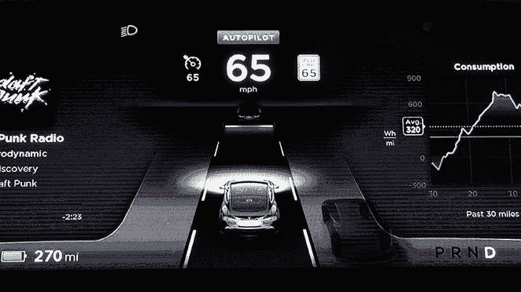
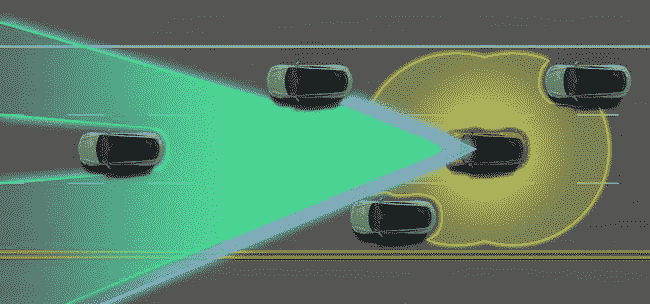

# 大黄蜂如何帮助智能汽车自动驾驶

> 原文：<https://thenewstack.io/how-bumblebees-may-help-smart-cars-drive-themselves/>

卑微的大黄蜂可能会对时尚、高科技、自动驾驶汽车的发展做出什么贡献？我们熟悉基于蜜蜂的[群体智能在无人机技术](https://thenewstack.io/bee-inspired-autonomous-robots-improve-crop-yields/)中的整合，虽然我们可能希望我们的无人机以协调一致的方式移动，但自动驾驶汽车是完全不同的事情。因此，马萨诸塞州伍斯特理工学院的科学家们不再转向蜜蜂，而是转向大黄蜂，因为他们相信大黄蜂的行为和导航技能可能是未来更安全、更智能的无人驾驶汽车的关键。

## 受大黄蜂启发的无线汽车网络

这项新研究聚焦于大黄蜂，正是因为它们没有蜜蜂意义上的“蜂群思维”。与它们的蜜蜂同胞相比，大黄蜂更倾向于社交，能够交流，但又能独立行动——这与我们实际驾驶汽车的方式非常相似。当然，我们的汽车已经融入了智能导航和传感技术，可以帮助我们停车或在有人位于我们的盲点时提醒我们，但我们的汽车在行驶中并没有真正相互“交流”。至少，现在还没有。因此，这里的想法是利用基于大黄蜂的研究开发一种车载无线网络，这将提高这些无人驾驶汽车的安全性。

通过无线连接相互“交谈”的自动“联网车辆”很可能在现实生活中的道路上表现更好，为立法者和保险公司带来更少的责任问题。以这种方式，大黄蜂可能是自然中智能汽车可能表现的完美模型:使用某种无线信道向周围的同伴广播，交换速度和目的地的数据，但能够独自行驶而不发生事故。

当然，对蜜蜂和蚂蚁等昆虫的研究已经为如何设计跨多模态网络的分布式优化和实时决策提供了大量线索。但这些模型有很高的依赖性，不能很好地转化为需要独立工作的汽车网络。“相反，大黄蜂的特征是与其他大黄蜂在社交上共享过去和现在的信息，但仍然能够做出独立的决定，这非常类似于车辆网络环境中的节点，”该团队的[摘要](http://www.nsf.gov/awardsearch/showAward?AWD_ID=1547291&HistoricalAwards=false)指出(该项目最近获得了美国国家科学基金会 30 万美元的资助)。

## 仿生大黄蜂认知过程

该项目的首席研究员 [Alexander Wyglinski](http://www.wpi.edu/academics/facultydir/aw1.html) 是一名电气工程师，他的工作重点是设计和实现高度自适应的无线通信系统和网络。Wyglinski 正在与生物学家 Robert Gegear 和 Elizabeth Ryder 联手。特别是，科学家们正在研究大黄蜂在密封的实验室里寻找花蜜时的觅食行为及其背后的认知过程，并在 Wyglinski 的计算模型中使用这些数据。

用大黄蜂来模拟现代自动驾驶汽车网络似乎有悖常理，但大自然在克服基本工程问题和设计动态敏捷系统方面拥有数十亿年的进化优势。这种潜在的观点是仿生学的基本原则，这是一种创新的设计方法，使用来自生物有机体和系统的想法和数据来生成复杂的人类挑战的可持续解决方案。

一些受自然启发的解决方案的突出例子包括在白蚁巢穴上模拟自然冷却的建筑物，或者将座头鲸的鳍作为创建高效风力涡轮机的模型。自然界的无限多样性意味着有令人难以置信的丰富的进化智慧可供学习，而大黄蜂只是亿万年成功适应的结果之一。从这个角度来看，借鉴 bumblebee systems 为未来的互联汽车开发可靠、高效的网络架构是完全有意义的。

就自动驾驶汽车而言，直接从自然中学习比理论模型更可取，正如 Wyglinski 告诉 [Motherboard](http://motherboard.vice.com/read/bumblebees-are-teaching-smart-cars-how-to-drive) :“使用数学方程的问题是数学优化做出了很多假设。它们只有在理想情况下才是最优的。但是大黄蜂在现实世界里工作。进化使得这些种类的昆虫能够在现实世界中生存。我们只是借用了大自然母亲打磨过的东西。”

在[国家科学基金会](http://www.nsf.gov/awardsearch/showAward?AWD_ID=1547291&HistoricalAwards=false)阅读更多信息。

图片:[数码猫](https://www.flickr.com/photos/14646075@N03/2811990080/in/photolist-5hubFA-9tgd99-kAqPVR-pH2PqP-vUJgWH-DtY8w-9AP9Ph-oesLyt-pxTdLA-6zSQ8a-b8DC32-qap1Zn-8awgc3-d2N4p7-vJk5GG-nBuP57-DtXz5-kjQ4E-6GTfZU-5y9Bcg-oJAh7i-7kCk4U-brk6oY-vyoC74-oB37pV-qoHXm7-9ALfJz-q8cJmY-9BE7if-xovj72-stWUf-qAVT2o-njfyLf-v6S3YL-xet4bP-6KCPVq-7fysSg-nTDe5-pQcmKN-f9jwBn-qHaNfj-7mqRKG-kAtfEq-4tvrej-3nN2Bn-9y6Qyt-k836QJ-j7SUX-4cPTYK-4qsD9Y) (Flickr，[CC BY 2.0](https://creativecommons.org/licenses/by/2.0/))；特斯拉

<svg xmlns:xlink="http://www.w3.org/1999/xlink" viewBox="0 0 68 31" version="1.1"><title>Group</title> <desc>Created with Sketch.</desc></svg>