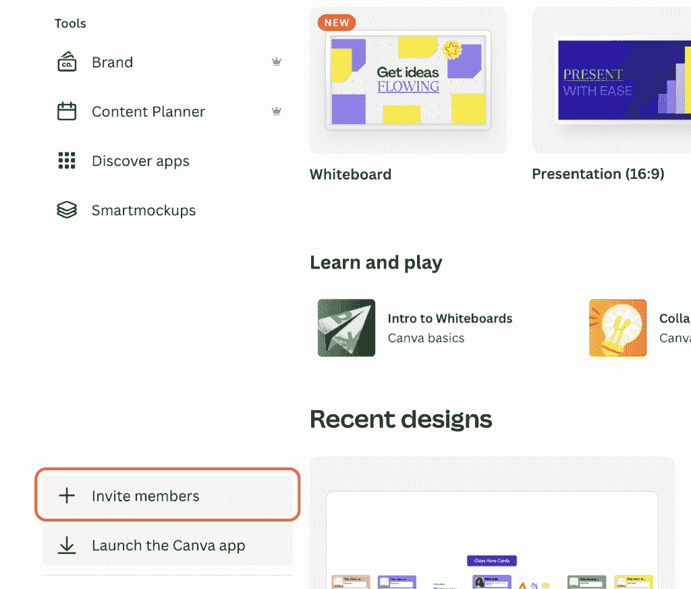
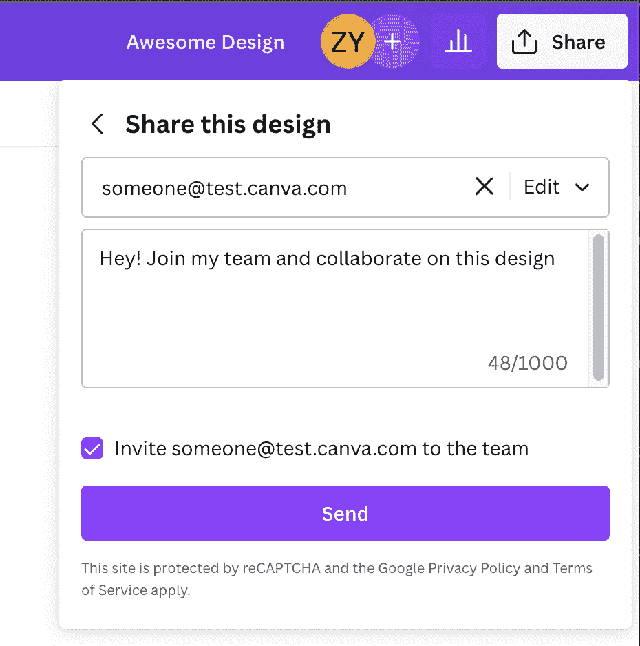

# Canva 如何使用数据确定 QA 测试的优先级

> 原文：<https://thenewstack.io/how-canva-uses-data-to-prioritize-qa-testing/>

[Canva](https://www.canva.com/) 媒体设计服务背后的质量协助工程师优化了他们的质量协助模型，首先将工程资源集中在最常用功能的故障排除风险和边缘案例上。这些数据驱动的决策有助于在客户端使用其服务时防止关键任务错误。

Canva 的质量助理工程师[庞子阳](https://www.linkedin.com/in/pangzy/)在最近[的一篇博客文章中解释说，Canva 的质量助理工程师帮助每个团队成员，包括项目经理、设计师、开发人员和数据分析师，在早期防止错误。](https://canvatechblog.com/how-we-used-data-to-optimize-our-quality-assistance-model-ae470899c23c)

然而，挑战是共同的，因为资源有时太有限。由于许多项目需要达到严格的期限要求，决定将工程师和 QA 工程师的注意力放在哪里是非常重要的，否则他们会面临过度分散的风险。

根据这一原则，Canva 通过尽可能做出数据驱动的决策来优化其质量援助模型。这些数据驱动的决策允许 Canva 优先测试最常用的功能，假设如果有任何错误进入生产级别，它们将倾向于以较少使用的功能结束。

“没有零缺陷的软件。重要的是你的用户遇到它们的频率以及它们有多重要，”庞写道。

## **代码覆盖和单元测试**

Canva 代码存在于 monorepo 中，所有者文件标识谁拥有代码的特定区域。对于代码覆盖，Canva 专注于单元测试，因为它们“与集成测试相比，提供了最详细的覆盖信息，集成测试更难评估。”

使用单元测试，Canva 的工程师查看了团队拥有的代码的代码覆盖率。这提高了代码覆盖率很低的特性的可见性，因此他们可以将精力集中在自动化测试很少的领域。

以下是 Canva 在向开发团队展示时听到的一些常见的第一反应:

“哦，但是我已经为此写过集成测试了。”

庞说，这是“你能得到的最常见的答案，这很好。”这样做的目的是提高对每个发布特性所需测试数量的认识。他们建议创建一个团队仪表板，集成测试覆盖特定的用户场景。

“哦，是的，我们知道一些，但是我们没有时间和空间去做。”

这一评论背后的挑战是技术债务。有一个风险是，团队只致力于新产品功能，而缺乏处理当前技术债务或工程基础工作所需的时间。随着时间的推移，这可能会导致累积更多的技术债务，从而阻碍未来扩大规模的能力。

Canva 在这里的建议是，每次冲刺，至少从积压的工作中挑选一个技术凹痕或工程基础工作票，以最小化技术债务的累积。庞说:“你希望偿还技术债务的速度快于积累技术债务的速度。”

“代码覆盖本身是没有用的，因为我们不知道我们在看什么。”

对此，Canva 提出了一个问题:“这是一个合理的要求，因为没有上下文，这些数字实际上没有任何意义。那么，我们如何解决这个问题呢？”

## **对用户体验的深刻理解**

“高质量的产品不仅仅意味着没有缺陷。它还必须便于用户发现和使用新功能，”庞解释说。与创建支持票的用户相比，更多的用户倾向于试图绕过这个问题。这只是意味着 Canva 的 QA 工程师能够“抓住这样的时刻，尽可能减少我们用户的摩擦点”更为重要。"

下图显示了用户界面中的一个区域，管理员可以在这里从主页侧边栏邀请某人加入他们的团队。

下图显示了用户界面中的区域，管理员可以在设计完成后邀请某人加入他们的团队。

在本例中，了解以下一些关于管理员喜欢如何邀请人们加入其团队的信息，是为制定这些数据驱动的决策而收集的有用数据:

*   桌面还是移动更受欢迎？
*   是首页还是曾经的设计做得更广泛？

这些数据点可以进一步细分，有助于将测试集中在流量最高的区域，并准确地确定错误的严重性和优先级。如果出现任何漏洞，现在 Canva 有一种方法来确定每个特定功能漏洞所影响的用户数量。这也有助于减少警报疲劳，因为每个 bug 警报的优先级不同。

这些分析为具有最高特性使用率和最低代码覆盖率的区域带来了更好的测试。这也有助于降低组件在未来损坏并影响许多用户的风险。

## **向质量的转变**

团队从容易实现的目标开始，并定期报告度量改进。随着时间的推移，他们的范围越来越大。这需要时间，但他们开始看到更好的测试覆盖率，更少的代码返工，以及在发布新功能时对团队更大的信心。Pang 说:“在过去的三个月中，我所在的三个团队没有发生任何事故(我希望保持这种状态！)"

因为没有办法达到 100%的单元测试，而且单元测试也不是完美的，所以团队在工程工作开始之前补充了其他的 QA 活动，比如 QA 启动、测试团队和审查设计。

在工程基础工作和运输功能的投资时间之间有一个持续的平衡。有一个更好的理解代码当前的健康状况，并有一个客观的衡量标准。

所有这些都带来了更好的用户体验。

<svg xmlns:xlink="http://www.w3.org/1999/xlink" viewBox="0 0 68 31" version="1.1"><title>Group</title> <desc>Created with Sketch.</desc></svg>