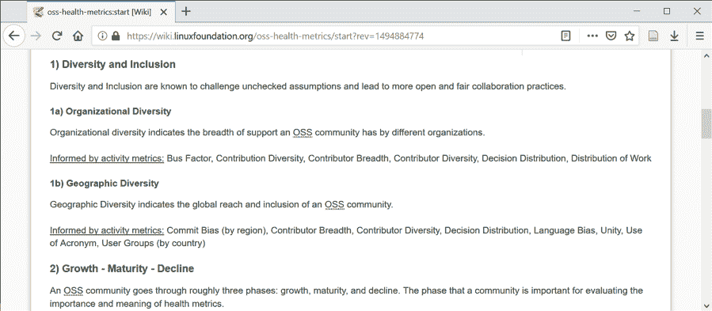
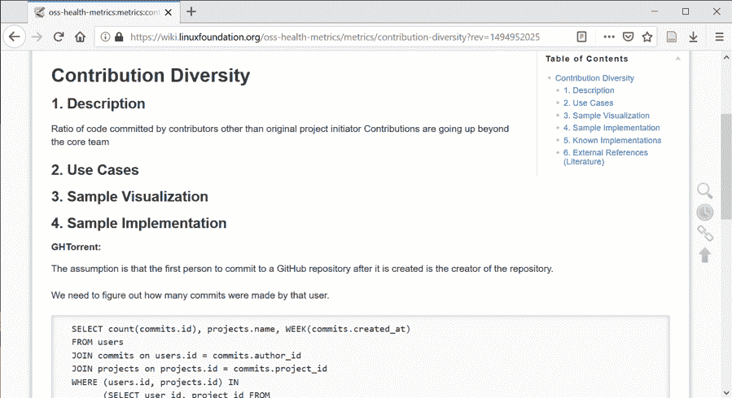
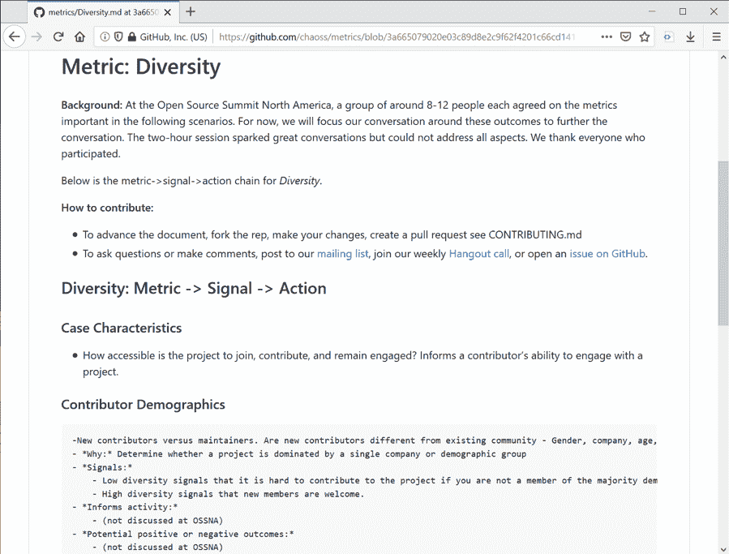
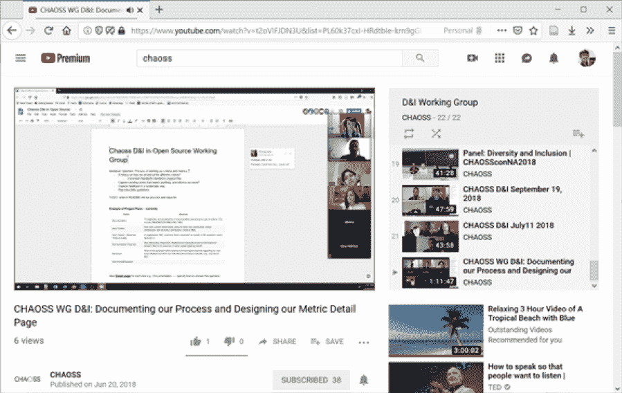
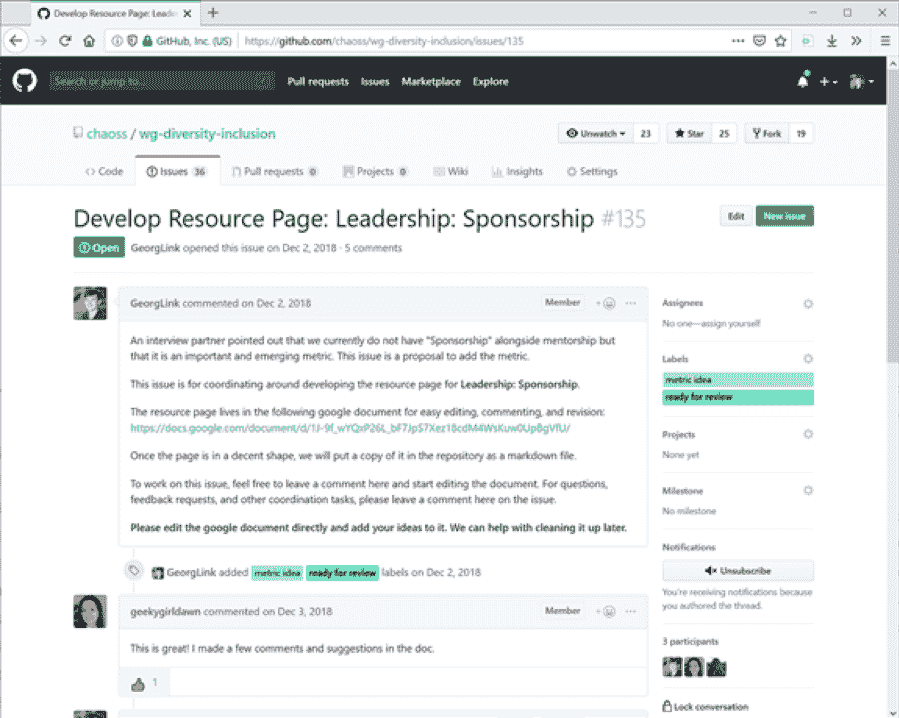
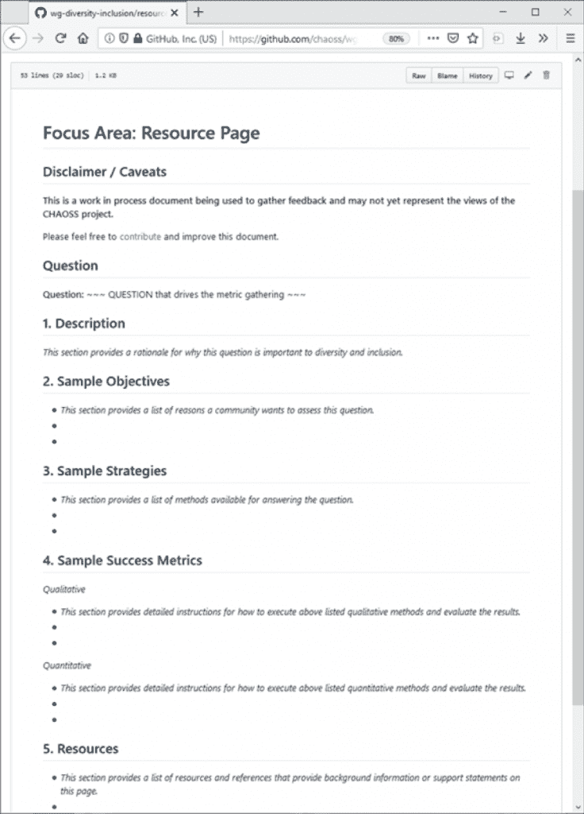
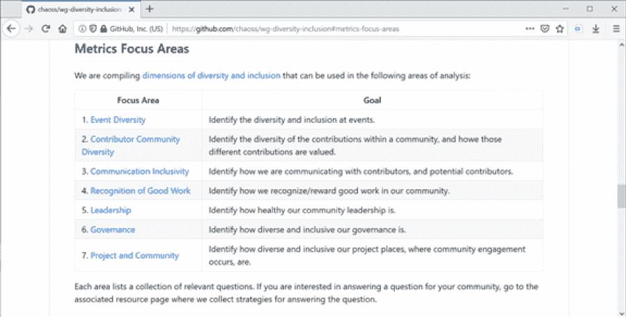
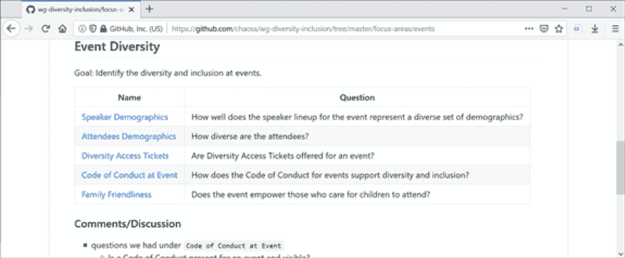
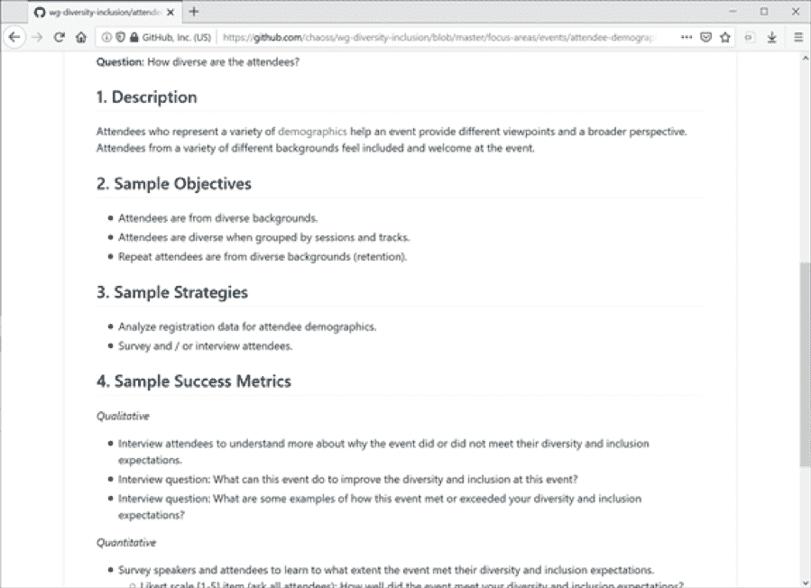

# CHAOSS D&I 如何帮助开源社区的多样性

> 原文：<https://thenewstack.io/how-chaoss-di-can-help-diversity-in-the-open-source-community/>

Linux 基金会赞助了这篇文章。

 [乔治·林克

Georg J.P. Link 是一位开源社区战略家。Link 共同创建了 Linux Foundation CHAOSS 项目，以推进开源项目健康的分析和度量。13 年来，Link 一直是几个开源项目的积极贡献者，并在十几个行业和学术会议上介绍了开源主题。林克拥有 MBA 学位，正在攻读信息技术博士学位。闲暇时，他喜欢阅读小说和乘坐热气球。](https://www.linuxfoundation.org/) 

最近的[研究](https://www.mckinsey.com/business-functions/organization/our-insights/delivering-through-diversity)越来越多地表明，在各个层面接受多样性的组织会取得更好的业务成果。当然，开源生态系统绝不是例外，因为多样性和包容性对它们的未来也至关重要。

然而，性别、种族和性取向偏见等问题在当今的开源开发世界以及整个行业中普遍存在。除了纠正这种不平衡之外，当各种各样的想法、文化和观点被代表时，促进多样性只会帮助项目成长和繁荣——并在技术和经济上表现得更好。

虽然开源社区没有人力资源部门，但项目可以引入结构和实践来促进包容性和多样性。然而，开源社区也需要分析、度量和最佳实践信息来衡量他们在这些领域的成功。进入 CHAOSS 项目。

## CHAOSS 项目的历史

 [莎拉·康威

Sarah Conway 是 Linux 基金会的通信副总裁，在那里她从事开源历史上最大和发展最快的一些技术。康威从 2004 年开始参与开源，五年前加入 Linux 基金会。她负责 Kubernetes、Node.js、Linux 和 Hyperledger 等项目的营销传播。她喜欢与开发人员一起讲述开源颠覆新行业、变得更有价值、更安全和更多样化的故事。](https://www.linuxfoundation.org/) 

[CHAOSS](https://chaoss.community/) 由开源实践者和学者于 2017 年创立，是一个 Linux 基金会项目，帮助社区衡量和分析他们的进展，以确保更健康、更可持续的社区。CHAOSS 项目旨在建立与实施无关的度量标准来衡量社区活动、贡献和健康；并且可选地产生标准化的度量交换格式、详细的用例、模型或建议，以分析行业/OSS 世界中的具体问题。

今天，CHAOSS 项目是通过工作组来构建的。一个工作组专注于[多样性和包容性(D & I)指标](https://github.com/chaoss/wg-diversity-inclusion)和分析，以帮助定义开源社区健康。其他工作组处理[通用度量](https://github.com/chaoss/wg-common)、[演进度量](https://github.com/chaoss/wg-evolution)、[风险度量](https://github.com/chaoss/wg-risk)和[价值度量](https://github.com/chaoss/wg-value)。

情况并非总是如此。一开始，CHAOSS 没有工作组来分配工作。CHAOSS 项目使用 wiki 来组织和记录它在度量方面的工作。然而，多样性和包容性(D&I)成为 CHAOSS 社区成员的一个关键指标类别。图 1 显示了 2017 年 5 月 15 日 D&I 度量类别的第一个记录。D&I 指标被进一步分组，以告知组织多样性和地理多样性的子类别。每个类别中都有实际的指标，称为“活动指标”

CHAOSS wiki 的截图，显示了截至 2017 年 5 月 15 日的 D&I 指标的第一个框架。绿色的指标(即“活动指标”)链接到包含有关如何显示数据指标的信息的详细信息页面。

在 D&I 类别创建之前，CHAOSS 项目的成员收集了一个“长长的度量列表”在图 1 中，一些指标是绿色的，表示到指标详细页面的链接。指标详细信息页面包含了关于指标的更多信息，包括如何实现指标(图 2)。例如，这种实现是可以计算数值的 SQL 语句。然后，这个数值可以显示为度量。

CHAOSS wiki 的屏幕截图，显示了属于 D&I 类别的度量详细信息页面。

## 混沌 D&I 工作组的兴起

CHAOSS 项目在洛杉矶举行的 2017 年北美开源峰会(OSSNA)上正式宣布。为了让更多的贡献者加入这个项目，CHAOSS 项目将所有的 wiki 页面复制到一个 GitHub 知识库中。这个存储库至今仍在使用。

导致 D&I 工作组成立的下一个重大事件是 OSSNA 2017 上的一个“一丘之貉”工作会议。在会议的计划中，CHAOSS 成员提出了一种新的思考方法。度量被讨论为通知信号。此外，信号被认为只有在通知某些行动时才有用。例如，“性别多样性”导致了“项目中女性与男性的比例”这一指标。由此产生的信号可以告知是否发起一项旨在邀请更多女性参与某个项目的倡议。在“特性之鸟”会议上，参与者被要求自行分成小组，讨论不同类别的指标，其中一个类别是 D & I 指标。

在“一丘之貉”会议上的讨论不受之前在 GitHub 中确定和记录的指标的约束。相反，参与者被鼓励引入新的度量理念。讨论中出现了三个 D&I 指标:贡献者人口统计、入职和留任(图 3)。第一个度量是关于项目中的人；后两个是关于社区成员之间交互的指标。

在开源峰会北美 2017 功能鸟会议上讨论 D&I 指标的小组笔记截图。

在 OSSNA 的声明之后，许多人都对 CHAOSS 项目表现出兴趣，包括 [OpenStack 性别报告的作者，该报告展示了 OpenStack 调查的结果。作者希望提高报告中的指标，并加入了 CHAOSS 项目对话。OSSNA 期间建立的另一个联系是 Mozilla 的多样性和包容性工作。Mozilla 刚刚公布了大规模开源调查](https://superuser.openstack.org/wp-content/uploads/2017/07/OpenStack-Gender-Diversity-Report_Apr2017.pdf)的[结果，并制定了解决多样性和包容性问题的议程。Mozilla 发现的一个问题是需要衡量一个开源项目在多样性和包容性方面做得如何。Mozilla 加入了 CHAOSS 项目，共同努力。](https://medium.com/@sunnydeveloper/take-action-innovation-requires-diversity-ossummit-foss-opensource-de24d8bf853d)

到目前为止，CHAOSS 社区每周都有一次电话会议。然而，推进 D&I 指标的机构群体成员希望更多地关注他们的指标类别。CHAOSS 多样性和包容性工作组(或称 D&I 工作组)已经成型，并开始组织该小组，建立沟通，协调社区成员的目标，并建立工作组的势头。2018 年上半年，工作组决定在自己的 GitHub 知识库中开发 D&I 指标，建立自己的邮件列表，并召开自己的每周电话会议。

## 创建 D&I 指标

在每次电话会议期间，社区成员在共享的 Google 文档中做记录，并将“行动项目”分配给特定的人，他们将在随后的会议中报告该行动项目。这些会议记录与邮件列表共享，以确保社区成员不必参加每次电话会议就能了解最新信息。当在通话过程中出现讨论时，例如，关于如何设计一个记录 D&I 指标的模板，该讨论会在邮件列表中继续进行，以包括更多的机构群体成员。此外，电话会议被录制并发布在 YouTube 上，以允许重新讨论并包括任何无法参加的人(图 4)。

CHAOSS D&I 工作组电话会议录音的截屏。该屏幕截图显示了在一个共享的 google 文档中为指标详细信息页面设计模板的协作过程。

新的 D&I 指标最初是在谷歌文档中创建的，每个人都有编辑权限。我们鼓励每个人为本文档献计献策，并对他人的想法发表评论。这些文档在 GitHub issues 中的项目级别被跟踪(图 5)。每个文件都有自己的问题，这些问题与该文件相关联。从这一约定开始，社区成员确定何时 D&I 指标定义得足够好，并创建一个拉取请求。pull 请求是一个 GitHub 工作流，用于对存储库进行更改。在拉动式请求工作流程中，D&I 指标的审查和修订仍在继续。当 D&I 度量被接受时，拉请求被合并，以将新的 D&I 度量添加到现有的 D&I 度量中。与谷歌原始文档相关的问题已经解决。当社区成员想要添加或更正某些内容时，通过拉请求进一步修改了存储库中的 D&I 指标。

GitHub 问题的截屏，用于跟踪提议的指标和相关的 google 文档。社区成员在谷歌文档中工作，并在这个问题上进行协调，以推进该指标。

提议的 D&I 指标是从对这些指标有不同背景和目标的各种机构群体成员中确定的。随着时间的推移，更多的指标被识别出来。需要收集和记录如何显示指标的想法。早期的对话集中在如何记录指标，以便可以与其他社区成员共享。随着机构群体成员对 D&I 指标理解的加深，他们开始评估这些指标。

随着时间的推移，CHAOSS D&I 工作组评估了提议的指标，并提出了记录它们的标准方法。通过标准化如何记录指标，CHAOSS D&I 工作组确定了哪些信息对于显示或使用指标是重要的。指标详细信息页面(即“资源页面”)的模板以一个标题开始，标题说明了指标的名称，下面是一个指标应该回答的高级问题(图 6)。当一个度量标准正在开发中时，一个免责声明警告潜在用户未完成的状态。以下是五个部分。首先，“描述”提供了为什么一个指标显示和使用很重要的基本原理。第二，“样本目标”是为什么有人想要显示或使用一个指标的原因列表。第三，“示例策略”列出了显示指标的方法，具体步骤留待下一节介绍。第四，“样本成功度量”描述了如何执行一个方法来显示一个度量，从数据收集，到显示，再到解释。第五，“参考资料”列出了参考资料和相关工作，提供了额外的背景信息或支持关于度量标准的声明。创建模板后，通过填写每个指标的模板来提升 D&I 指标，这需要评估每个模板部分包含哪些信息。

D&I 指标详细信息页面(资源页面)的屏幕截图，包含六个区域:0)标题和问题，1)描述，2)目标，3)策略，4)成功指标和 5)资源。

随着度量标准提案数量的增加，CHAOSS D&I 工作组成员决定将度量标准分成重点领域。七个重点领域的创建得益于 [Mozilla 的 2017 年研究建议](https://opensource.com/article/17/9/diversity-and-inclusion-innovation)，为指标提供了更强大的基础。图 7 显示了目前存在于 CHAOSS D & I 工作组存储库中的七个焦点领域。

CHAOSS D&I 工作组 GitHub 存储库自述文件中的焦点区域截图。

像 CHAOSS 项目的其他部分一样，CHAOSS D&I 工作组采用了[目标-问题-度量方法](https://drum.lib.umd.edu/bitstream/handle/1903/7538/?sequence=1)。这种方法背后的逻辑是，只有在知道如何使用度量来回答特定问题时，度量才是有用的。目标-问题-度量方法要求小组评估度量的效用。在 GitHub 存储库结构中，关注领域与一个高层次的目标相关联，这个目标是那些寻找度量标准的人可能有的。在每一个焦点领域中都有一组问题，进一步缩小了度量标准的选择范围(图 8)。

“活动多样性”重点区域的屏幕截图，显示了目标、问题列表和后续指标(名称)。

基于模板，每个问题都有自己的指标详细信息页面(图 9)。“metric detail”页面提供了定性和定量方法，用于将数据捕获为可以显示为度量的数值。在这里添加方法是评估度量标准不可或缺的一部分，包括发现方法的问题并克服这些问题。一些社区成员分享了他们自己的开源项目的方法和经验。一些社区成员对在他们的开源项目中应用一种方法感兴趣，并向其他人寻求反馈和见解。

来自“活动多样性”焦点区域的“与会者人口统计”问题详细信息页面的屏幕截图，显示了可用作指标的指标选择。

讨论的问题包括数据源、数据管理、可视化表示和语言。例如，当查看贡献的多样性时，在查看存储库中的提交时使用短语“技术与非技术贡献”会降低许多贡献的技术性质，例如文档编写。作为一种解决方案，CHAOSS D&I 工作组成员得出结论,“代码贡献与非代码贡献”是一种更好的构建贡献多样性的方法，因为它更符合创建该指标的数据，并且因为它不贴现任何人的贡献。

## CHAOSS D&I 工作组的下一步是什么

[近期目标](https://github.com/chaoss/wg-diversity-inclusion/blob/master/goals-2019.md)包括记录 D & I 指标的三个高质量和引人注目的用例，与项目合作进行 D & I 指标的试点展示，围绕 D & I 指标的展示建立道德准则，以及为推进 D & I 指标建立更复杂的工作流程。

CHOASS 成员 Sarah Conway、Daniel Izquierdo 和 Nicole Huesman 也将在 kube con+CloudNativeCon Europe 2019 上展示[“Metrics That matters”](https://events.linuxfoundation.org/events/kubecon-cloudnativecon-europe-2019/schedule/)，介绍该集团在创建一套社区策划的指标以跟踪多样性方面的进展。有关更多背景信息，以下是 D & I 工作组社区成员最近召开的会议列表:

*   2018 年 8 月 28 日:“建立对多样性和包容性至关重要的指标”(chaos scon[【2】](#_ftn2)2018 年北美，加利福尼亚州温哥华)；
*   2018 年 8 月 29 日:“D&I 度量黑客马拉松”(开源峰会北美 2018，加州温哥华)；
*   2018 年 10 月 24 日:“教程:如何为你的社区准备一份多样性和包容性报告”(开源峰会欧洲 2018，英国爱丁堡)；
*   2019 年 2 月 1 日:“多样性&包容性 WG 教程”(CHAOSScon Europe 2019，布鲁塞尔，BE)；
*   2019 年 3 月 14 日:“小组讨论:重要的指标:打造更多样化、更包容的社区之路”(2019 年开源领袖峰会，美国加利福尼亚州半月湾)。

今天，D&I 工作组的 D&I 度量标准正在几个项目中试用。OpenStack 性别报告包括由 CHOASS 制定的导师项目的新指标。Mozilla 在他们的开源项目的 [MOSS 拨款中采用了一些 CHAOSS D & I 指标。此外，D & I 工作组正在与更多对显示 D & I 指标感兴趣的开源项目进行对话。对于任何有兴趣加入工作组或成为试点的项目，请加入](https://blog.mozilla.org/inclusion/2018/12/18/innovating-for-inclusion-in-the-mozilla-open-source-support-program/) [D & I WG 邮件列表](https://lists.linuxfoundation.org/mailman/listinfo/chaoss-diversity-inclusion)。

CHAOSS 成员很快超越了二元性别，认识到性别存在于光谱中。

*[【2】](#_ftnref2)CHAOSScon 是由 CHAOSS 项目成员组织的一个系列会议，旨在将所有对显示或使用开源项目健康指标感兴趣的人聚集在一起。每年，北美 CHAOSScon 与北美开源峰会在同一地点举行，欧洲 CHAOSScon 与 FOSDEM 在同一地点举行。*

通过 Pixabay 的特征图像。

<svg viewBox="0 0 68 31" version="1.1" xmlns:xlink="http://www.w3.org/1999/xlink"><title>Group</title> <desc>Created with Sketch.</desc></svg>