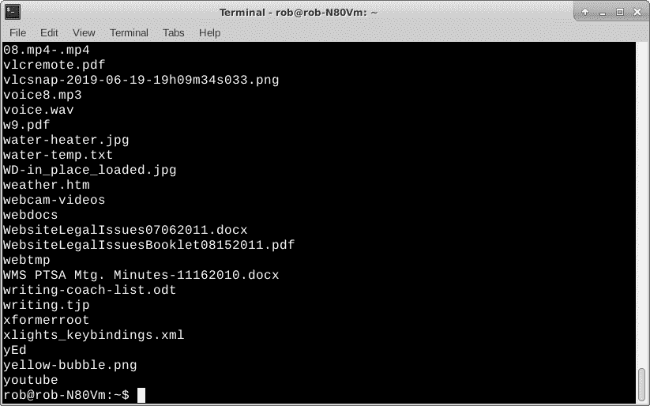
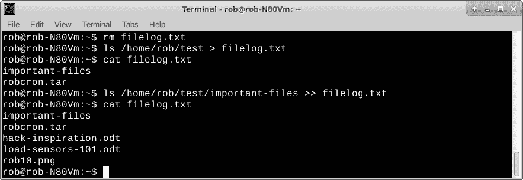
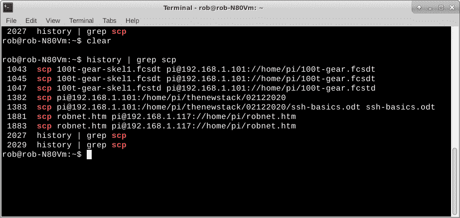
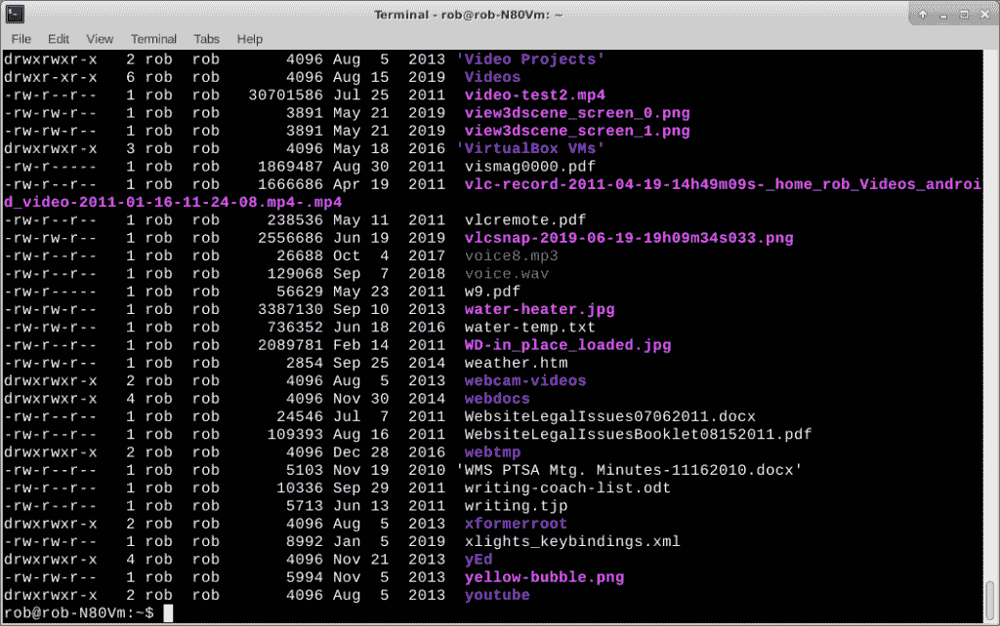
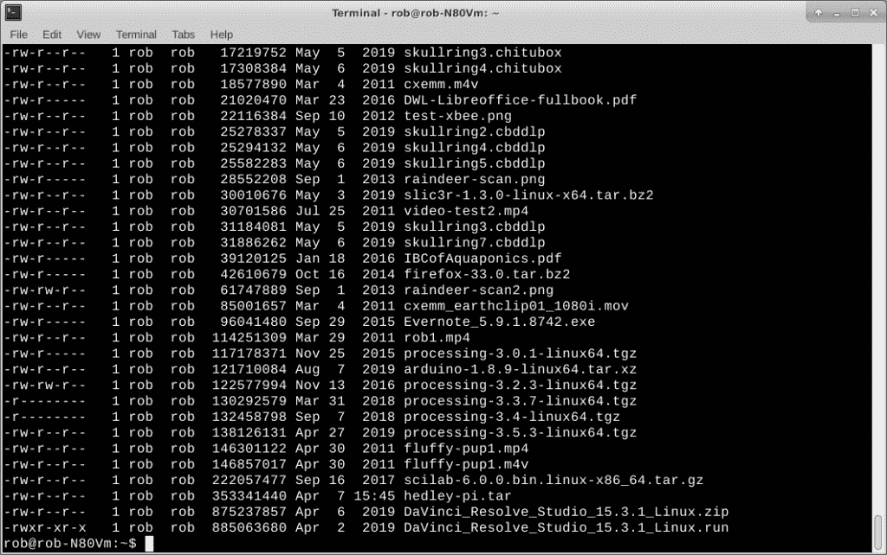

# CLI 重定向和管道如何将 Linux 程序捆绑在一起

> 原文：<https://thenewstack.io/how-cli-redirection-and-pipes-tie-together-linux-programs/>

Linux 有很多桌面用户经常忽略的内置命令行功能。打开一个终端，启动几个独立的命令行程序来做一些事情，如查找文件，监控系统性能，并在某个时间自动启动系统维护任务。

过去的大师们有时会反思“Unix 哲学”Linux 遵循了这一精神。这个想法是制造小型的、模块化的、只做一件事的命令行程序，这些程序可以连接在一起完成更大的任务。Linux 命令行程序通常很小并且是独立的。重定向和管道的概念是将程序联系在一起的纽带。

这就是我们今天要讨论的。

## 重寄

Linux 中的重定向指的是将程序的标准输出发送到一个文件。该文件可以作为程序输出的记录，记录数据或在其他时间分析和/或使用数据。在测试我的一个小工具时，我经常使用 Linux 重定向来捕获来自连接到我的 Linux 笔记本或 Raspberry Pi 的 USB 端口的传感器的输入。

重定向是在命令行或脚本中使用箭头符号执行的，非常容易使用。这里有一个例子。

假设您想打印出一个目录中所有文件的名称。在你选择的目录中，只需在命令行输入`ls`。

`robnotebook% ls`

也许你想更进一步，把这些名字保存在一个文件中，以后你可以把它发送到你的激光打印机，给你一个文件的物理记录。只需使用右箭头(>)符号将 ls 命令的输出发送到一个文件。

`robnotebook% ls > filelog.txt`

您可以通过`cat`查看文件内容，并随时打印文件。

`robnotebook% cat filelog.txt`

使用 ls 的简单文件名列表

上面的重定向创建了一个名为 filelog.txt 的新文件，其中包含目录列表。如果文件不存在，则创建该文件。如果文件已经存在，它将被文件的新版本覆盖。您不会得到关于覆盖文件的警告，所以最好专注于您的工作。由于疏忽，我在一天中重写了一些“有价值”的文件。这可能也会发生在你身上。把它记在经验上，然后继续做事情。希望那时你不会以`root`的身份登录。

您不必总是覆盖文件。也许您想将数据添加到现有文件中。使用双箭头(>>)符号。

一个稍微复杂一点的例子是从几个目录中收集文件。

假设您已经列出了当前目录(/home/rob/test)并将其重定向到一个文件(filelog.txt)。

`robnotebook% ls /home/rob/test > filelog.txt`

您想要将一个名为`important-files`的子目录添加到现有的文件列表中。添加最新的文件列表，如下所示。

`robnotebook% ls /home/rob/test/important-files >> filelog.txt`

这次我们使用完整的路径名和双箭头符号来`add`输出到文件列表中。

带文件重定向的 ls(添加)

将程序输出重定向到文件对于诊断问题和创建数据集非常有用。接下来，我们将讨论如何将程序连接在一起。

## 管道

另一种重定向称为管道。管道获取一个程序的输出，并将其作为输入发送给另一个程序。管道将简单的命令行程序连接在一起，以执行更复杂的任务。

管道使用起来非常简单。很像重定向到文件的右箭头，在程序之间用竖线(|)符号指定管道。下面是一个简单的例子，使用 [grep](http://man7.org/linux/man-pages/man1/grep.1.html) 在当前目录下的所有文件中查找单词“and ”,然后使用 [more](http://man7.org/linux/man-pages/man1/more.1.html) 命令一次显示一页。您可以使用空格键浏览列表。

`robnotebook% grep and * | more`

我经常使用 [history](http://man7.org/linux/man-pages/man3/history.3.html) 命令，尤其是在开发各种硬件小工具的时候。在测试过程中，我会浏览一个测试的总列表，如果我每次都必须重新输入所有内容，那么执行起来会很乏味。我的解决方案是使用 grep 命令的历史来找到一个我可以照原样使用的命令行，或者针对新的情况进行调整。

例如，假设我在我的 Linux 笔记本和我的远程 Raspberry Pi 项目之间来回移动文件。我使用 [scp](http://man7.org/linux/man-pages/man1/scp.1.html) 命令来传输文件。调用命令和调整文件名比我每次移动文件时重新键入整个命令行要容易得多。使用管道从历史中获得最近使用的 scp 命令列表是相当容易的。然后我可以选择一个适合我需要的。

`robnotebook% history | grep scp`

有烟斗的历史

这是一个简单的事情，然后只需修改一个命令行的新文件名，并点击返回。噗，新文件不费吹灰之力就被复制了。

我使用管道的另一种方式是使用[排序](http://man7.org/linux/man-pages/man1/sort.1.html)命令。

也许我正在我的当前目录中寻找大文件。您当然可以使用 ls -l 来显示所有的文件大小，然后浏览列表，查看第 5 列，找到最大的数字。效率不高，除了几屏文件。

`robnotebook% ls -l`

使用-l 选项显示文件大小的文件列表

找到最大文件大小的一个简单方法是使用管道排序命令。

`robnotebook% ls -l | sort -n -k 5`

使用排序命令的管道查找最大的文件

这里我们将 ls 与-l (long)选项一起使用，然后通过管道进行排序。-n -k 5 意味着它将按照数字顺序(-n 选项)查看第 5 列(-k 选项)排序。

## 包裹

我们已经看到了如何将程序的输出发送到文件，以及如何将独立的命令行程序连接在一起以执行集成的任务。

看看 ls、sort、grep 等选项，看看如何在自己的 Linux 计算环境中组合使用这些选项来完成任务。web 上有很多关于 Linux(或 Unix)文件重定向和管道的例子。通过一些实践和经验，我想你会发现这些功能非常有用。

在 doc@drtorq.com或 407-718-3274 联系[罗布“drtorq”雷利](/author/rob-reilly/)咨询、演讲约定和委托项目。

Linux 基金会是新堆栈的赞助商。

来自 Pixabay 的 2427999 的特征图像

<svg xmlns:xlink="http://www.w3.org/1999/xlink" viewBox="0 0 68 31" version="1.1"><title>Group</title> <desc>Created with Sketch.</desc></svg>