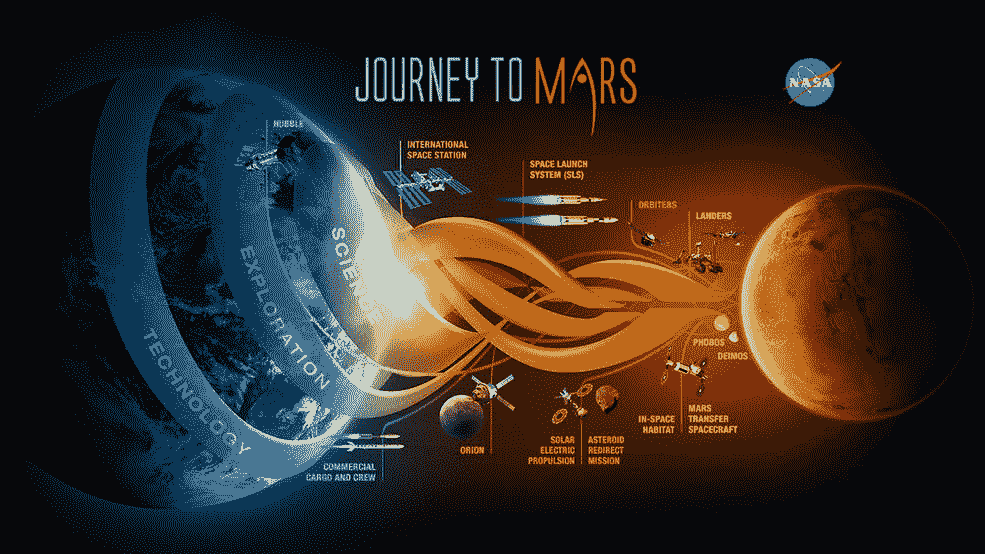

# 我们离火星任务还有多远？

> 原文：<https://thenewstack.io/how-close-are-we-to-a-mission-on-mars/>

雷德利·斯科特的《火星文》刚刚成为他有史以来最卖座的电影——收入超过了《T2》、《异形》、《T4》、《普罗米修斯》、《T5》、甚至《角斗士》的票房。但他关于一名宇航员在火星上幸存的鼓舞人心的故事可能反映了现实世界对实际访问遥远星球或至少更近一步的可能性的日益增长的兴趣。

最近几周，美国国家航空航天局甚至发布了一项新的宇航员申请，试验在太空种植食物，并宣布与私营航天公司建立九个合作伙伴关系。尽管这听起来像科幻小说，美国国家航空航天局的网站上目前有整整一个版面专门介绍其火星任务的准备工作。

“美国宇航局正在发展所需的能力，以便在 2025 年前将人类送上小行星，在 21 世纪 30 年代将人类送上火星——这是 2010 年跨党派的美国宇航局授权法案和美国国家太空政策中概述的目标，也是在 2010 年发布的，”该网站写道。

美国宇航局指出，40 多年来，机器人一直在探索火星表面，并指出国际空间站目前正在进行的探险，在那里，长期居住在轨道上的宇航员正在“帮助我们证明人类太空任务所需的许多技术和通信系统，包括火星。”

11 月 4 日，美国国家航空航天局宣布[将很快接受宇航员申请](http://www.nasa.gov/press-release/be-an-astronaut-nasa-seeks-explorers-for-future-space-missions)，“以期待人类航天发射返回美国本土，并为该机构的火星之旅做准备。”宇航员将乘坐美国制造的飞船从佛罗里达起飞，执行深空探测任务，这将推进未来人类的火星任务。

如果你感兴趣，这些申请将在 12 月 14 日至 2 月中旬接受，选择将在 2017 年年中公布。

国家地理杂志一直对美国宇航局关于火星的声明持怀疑态度，指出“细节尚未公布”(并补充说这将是一项巨大的持续财政承诺，“需要几位连续的美国总统的支持，这是不可能的。”)但美国宇航局的新闻稿指出，目前美国正在建造的载人飞船比历史上任何时候都多，周四的另一份声明强调了这一点。美国宇航局宣传[与美国公司](http://www.prnewswire.com/news-releases/nasa-announces-new-public-private-partnerships-to-advance-tipping-point-emerging-space-capabilities-300182258.html)的九项新合作关系，“以推进该机构机器人和人类探索太阳系的目标。”

一年多前，美国宇航局发布了一项征集活动“[，通过与私营部门合作来推进引爆点技术](http://nspires.nasaprs.com/external/solicitations/summary.do?method=init&solId=%7BED1BDB01-28C8-6859-E277-ED206F8B6D68%7D&path=open)，现在它已经形成了 22 个公私合作伙伴关系。它的最终计划是引导关键空间技术的发展，与商业空间部门有更多的联系，并特别针对“处于商业化和融合临界点”的市场。

我们今天进展如何？19 个月前，首个“新鲜食品生产系统”被送到国际空间站的轨道宇航员手中。它在 4 月到达，5 月安装，到 8 月，它在太空中收获了美味的新鲜莴苣。周一，美国宇航局的博客宣布，空间站的宇航员刚刚种植了一批百日菊，这是太空种花的首次尝试。令人振奋的是，这个在轨研究站已经连续被占用了 15 年——11 月 2 日是它的 15 周年纪念日——在此期间，来自 15 个不同国家的 200 多名不同的宇航员访问了它。(美国国家航空航天局在其网页上计算天数[——截至周五为 6209 天——并列出其目前六名成员中所有成员的名字。)](https://www.nasa.gov/mission_pages/station/main/index.html)

[https://www.youtube.com/embed/c1Gxn_nfgWA?feature=oembed](https://www.youtube.com/embed/c1Gxn_nfgWA?feature=oembed)

视频

上个月，凯利指挥官甚至创造了一项美国宇航员在太空停留总天数的新纪录——382 天。周三，他是接受 AOL.com 记者精彩现场采访的两名宇航员之一，在安第斯山脉上空 249 英里的轨道上进行现场直播，庆祝该任务在外太空连续 234 天。在 2015 年的“国情咨文”演讲中，奥巴马总统鼓励凯利“Instagram it”，他一直在这样做，在 [Instagram](https://instagram.com/stationcdrkelly/?hl=en) 和 [Twitter](https://twitter.com/StationCDRKelly) 上发布从太空看到的地球照片。(“今天在#莫桑比克看到了一些大的撕裂流…”)

如果我们想在漫长的火星之旅中幸存下来，美国宇航局认为这样的实验是全人类迈出下一小步的开始…

但下一步将是征服深空，这将从 21 世纪 20 年代的某个时候一个机器人任务开始，将一颗小行星重定向到月球轨道，然后宇航员可以对其进行探索和采样。“这种在低地球轨道以外进行人类太空飞行的经验将有助于美国宇航局测试新的系统和能力，例如太阳能电力推进，我们需要将货物作为人类火星任务的一部分，”美国宇航局说。2018 年，美国宇航局将开始测试他们新的强大的[太空发射系统火箭](https://www.nasa.gov/exploration/systems/sls/overview.html)，它被认为是任何载人火星探险的另一个重要组成部分的先驱。

我们这些没有耐心的人似乎仍然被火星之旅越来越接近现实的可能性所诱惑。在愚人节，房地产投资网站 Fundrise.com 宣布有机会投资一个“气候控制住宅物业，位于火星的后起之秀红山社区”。“Fundrise 是一个真正的房地产众筹网站——本周它提供了 5000 万美元的公开股份——但他们的愚人节恶作剧就像圣诞老人征服火星人一样真实。但是，请关注美国国家航空航天局与私营航天技术公司缓慢而稳定的合作关系。

*国家地理*指出，地球上的宇航员已经与深空旅行的巨大技术问题搏斗了 70 多年，直截了当地给他们的文章起了个标题，“这就是为什么火星上仍然没有人类。”它简洁地回答了自己的问题，引用了乔治·华盛顿大学太空政策研究所名誉教授的话。

“火星很远，很难到达，而且要花很多钱。”

专题图片:艺术家概念展示了美国宇航局/JPL 加州理工学院在红色星球上空执行的火星勘测轨道飞行器任务

<svg xmlns:xlink="http://www.w3.org/1999/xlink" viewBox="0 0 68 31" version="1.1"><title>Group</title> <desc>Created with Sketch.</desc></svg>