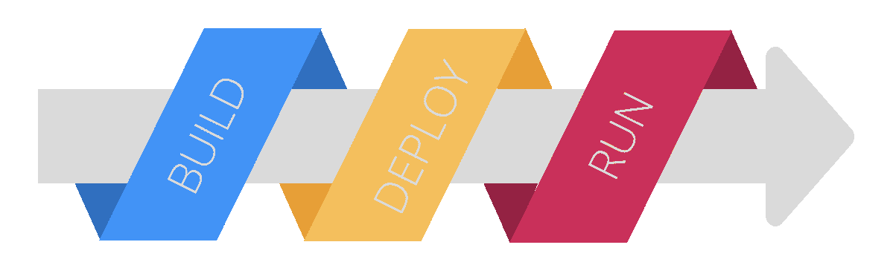

# Cloud Foundry、Red Hat Open Shift 如何简化 Kubernetes 部署

> 原文：<https://thenewstack.io/how-cloud-foundry-red-hat-open-shift-ease-kubernetes-deployments/>

 [拉姆·艾扬格

拉姆是云铸造基金会的开发者倡导者。他实际上是个工程师，本质上是个教育家。在他作为一名开发人员的旅程中，他被推上了技术福音传道者的位置，从那以后就再也没有回头。](https://www.linkedin.com/in/ramanujank/) 

让我们通过检查效用和努力的双轴来探索 Kubernetes 集群的分类。这个示意图是通过观察运行在 Kubernetes 上的应用程序的生命周期和许多团队经历的进展而得出的。

与技术领域的许多其他工具一样，Kubernetes 最具挑战性的体验来自运行生产工作负载。维护它们并与它们一起“保持运转”需要付出大量的努力。复杂性来自不同的技术和非技术领域，尤其是对于一个具有相当大影响的工具。

## Kubernetes 星团的类型

开发人员遇到的第一种 Kubernetes 集群是为原型应用程序创建的集群。

在小型组织中，几个有动力的工程师经常选择新技术并推动其发展。较大的组织往往倾向于创建试点团队，推动为其组织采用新技术的责任。

在这两种情况下，具有边际效用的集群被创建(和摧毁)，主要是为了证明项目的可行性。围绕这些集群的创建和维护工作被设计得很少，通常不会对组织的核心应用程序产生大的影响。

与此截然相反的是用于生产用途的集群。这些集群运行大规模工作负载，通常功能齐全。也就是说，它包含了开发、部署、监控、维护和操作全面运行所需的全部工具。

生产中的集群在基于 Kubernetes 的操作的生命周期中具有最长的跨度。运营团队必须付出最大的努力来了解他们的基础架构是如何工作的，以及如何集成到他们整个体系的技术架构中。无法平衡部署速度需求的团队将他们的 Kubernetes 战略置于高风险之中。

为了使 Kubernetes 集群可以在生产中使用，需要为它附加一些工具。container orchestrator 本身可以完成很多工作。然而，如果没有专门的补充，它是不完整的。Kubernetes 的这一方面构成了整个[云本地计算基础](https://cncf.io/?utm_content=inline-mention)格局的基础。数百家公司和数千名贡献者组成了一个活跃的社区来实现这一目标。

运行生产级工作负载所需的 Kubernetes 集群的一些最常需要的特征的(简短)列表如下:

*   访问控制
*   记录和监控
*   进入
*   存储和备份
*   秘密

如果没有这些功能，Kubernetes 集群就不能用于生产。接下来对每个组件进行检查，并解释它在 Kubernetes 集群中扮演的特定[角色。](https://thenewstack.io/do-i-really-need-kubernetes/)

本文的核心目的是检验中间道路是否存在。平台运营商提供集群的一种方式，以便开发人员可以利用包含电池的方法来创建基础设施。固执己见的 PaaS 平台允许您利用速度和敏捷性，但是会带来定制化的问题。

## PaaS 工具的历史

随着时间的推移，出现了许多工具，旨在简化在远程实例上部署和维护应用程序的体验。这些通常采取提供底层操作系统和运行时的形式。

这些通常基于软件定义的网络、存储和其他虚拟化组件。最早的 PaaS 工具是 EngineYard 和 Google App Engine。最流行的 PaaS 工具是 Heroku、 [Red Hat OpenShift](https://www.openshift.com/try?utm_content=inline-mention) 和 Cloud Foundry。

在适当的时候，这些 PaaS 工具中的一些已经发展到包含容器化，并且现在提供了对 Kubernetes 的抽象。特别是，OpenShift 和 Cloud Foundry 的功能在更大的开发人员社区中脱颖而出。

这两个工具展示了工程手段，并随着虚拟机、容器和现在的 Kubernetes 的不同技术周期而发展。

在接下来的章节中，添加了关于这两个工具的一些相关细节，主要是为了比较和对比它们的方法，并提供它们对各种组织的增值的清晰描述。这两个平台的一些共同特征是它们的 Kubernetes 集成、开源特性、企业级操作以及对混合云部署的适用性。

## 什么是 OpenShift？

[OpenShift](https://www.redhat.com/en/technologies/cloud-computing/openshift) 是 RedHat 开发的 PaaS。它与 RedHat Enterprise Linux 操作系统共享根。因此，它建立在 RHEL 的普遍性、性能、规模和安全性的历史性成功之上。

## OpenShift PaaS 增加了什么价值？

首先，OpenShift 在部署期间为开发人员提供了一致且可靠的体验。

它实现了优于 Kubernetes 的弹性消费体验。通过在 Kubernetes 上安装 OpenShift，应用程序开发人员可以在供应云基础设施和消费服务方面实现自助服务能力。这使他们能够充分利用公共云架构。它可以整合部署和其他操作的全栈自动化需求。

## 什么是云代工厂？

[Cloud Foundry](https://www.cloudfoundry.org/) 是由 Pivotal 的一个团队开发的 PaaS。它于 2015 年完全开源，此后一直由 Cloud Foundry Foundation 拥有和管理。它是完全开源的，有一个庞大的社区作为贡献者和维护者。Cloud Foundry 展示了跨云提供商、使用多种语言和框架的能力。随着大规模部署，Cloud Foundry 实现了其作为在全球组织中部署任务关键型应用的现代标准的宣称。

## 云代工厂 PaaS 如何增值？

对于开发人员来说，Cloud Foundry 使得通过一个[单一命令](https://docs.cloudfoundry.org/devguide/push.html)从“代码”到“运行应用”成为可能。与基于虚拟机、容器或 Kubernetes 的工作流无关。生态系统中的不同项目为此提供了所需的管道，而 cf cli 则是为融合而设计的。

对于运营商来说，Cloud Foundry 允许定义可以向上传播给应用程序开发人员的最佳实践。由于使用了简单的触发器，各种过程的自动化也变得容易了。Cloud Foundry 的可扩展性和互操作性使得它对于使用不同组织中的不同工具链特别有用。

## PaaS 的一般优势

关于这两个工具有趣的是，它们帮助不同的团队完成 Kubernetes 难题。这些工具提供的功能可以分为两大类。“构建时间”和“运行时间”

PaaS 工具通常是为了提供速度和便利而构建的。这包括创建工作流来适应软件开发的两个不同领域——即构建时间和运行时间。

构建时间是过程为了从源代码中准备一个不可变的工件所花费的持续时间。运行时是指应用程序在生产环境中运行的时间。在这两个阶段的中间是“部署”阶段，它在构建阶段结束时获取导出的工件，并将其推向生产。

在 Kubernetes 的世界中，“构建”阶段转化为集装箱化过程。这个过程本身是一个声明性的过程，主要是监听源代码中的任何变化，并触发一个新的工件作为容器导出。然后，这个容器被复制(或更新)到一个容器注册中心，并从那里部署到 Kubernetes 节点。

PaaS 工具通过获取王国的钥匙简化了这一过程。—获取源代码。然后，他们抽象出整个构建过程。最后，他们将使用配置好的远程端点进行部署。这可能是运行在私有云、IaaS 或 Kubernetes 集群上的虚拟机。

总之，让一个团队使用 Kubernetes 所需的所有工作流都可以通过现代的 PaaS 工具(比如 OpenShift 和 Cloud Foundry)来实现。使用这些将会大大简化与 Kubernetes 相关的复杂性。对于那些愿意在 Kubernetes 上尝试 PaaS 抽象的人来说，高效、低成本的 Kubernetes 是一个现实。

撰写本文是为了纪念用于 Cloud Foundry 工作负载的云原生转换工具 [Korifi](https://korifi.cloudfoundry.org/) 的发布。你可以从 GitHub 上的 [Korifi 开始](https://github.com/cloudfoundry/korifi)。

<svg xmlns:xlink="http://www.w3.org/1999/xlink" viewBox="0 0 68 31" version="1.1"><title>Group</title> <desc>Created with Sketch.</desc></svg>