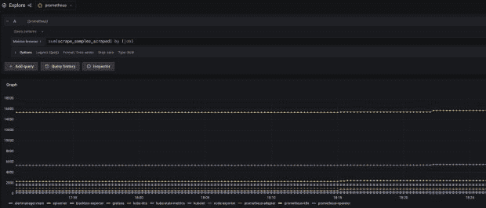

# 云原生工作负载如何随着时间的推移影响基数

> 原文：<https://thenewstack.io/how-cloud-native-workloads-affect-cardinality-over-time/>

说到度量，基数是一个重要的话题。对于那些不熟悉指标基数的人来说，它指的是基于指标的维度，可能存在的时间序列的数量。维度是数据的不同属性。Chronosphere 在我们的博客上写了几篇文章，涉及[高基数](https://chronosphere.io/learn/what-is-high-cardinality/)、[了解工作负载中的基数](https://chronosphere.io/learn/classifying-types-of-metric-cardinality/)、[管理基数峰值](https://chronosphere.io/learn/wrangle-metric-data-explosions-with-chronosphere-profiler/)等等。

谈到基数时，有一点还没有被很好地涵盖，那就是随着时间的推移理解基数有多重要。从某个时间点来看，通常会看到具有完全可管理的基数的工作负载，但是如果您尝试在更长的时间窗口内查询指标，性能将无法接受，甚至底层系统可能无法处理数据请求。在本帖中，我们将讨论如何考虑基数随时间的变化，介绍工作负载中“变动”的概念，并考虑云本地工作负载的短暂性如何影响长期基数。

## 如何看待基数随时间的变化

首先:一段时间内的基数与给定时刻的基数有什么不同？这相当简单。正如我们之前提到的，基数是我们所拥有的度量标准的可能分组的数量。因此，如果我们想了解给定时间的基数，我们只需要计算有多少个时间序列。如果我们使用 Prometheus，我们可以使用表达式`sum(scrape_samples_scraped{})`**计算给定时间点的工作负载基数，这将告诉我们在所有的抓取作业中有多少独特的时间序列被摄取。**

**

一个汇总基数的例子，通过`scrape_samples_scraped`指标按作业分解。这显示了在给定的时间点上，Prometheus 为每项作业所报废的系列数量。

然而，当我们观察时间窗口时，事情是如何变化的呢？嗯，我们需要了解在整个窗口中有多少独特的时间序列。例如，假设我们在过去的一个小时内测量特定服务的所有容器的 CPU 使用情况。如果您在一个小时的中途部署了一个新版本，然后要获得该小时的完整视图，我们需要获取运行旧版本服务的 CPU 的系列，以及测量新版本的 CPU 的系列。另一种说法是:如果我们正在查看一个时间窗口，并且一个时间序列在该窗口内停止报告，则该时间窗口内的基数不会改变，因为我们仍然在该时间窗口内看到该时间序列。

这意味着随着我们的时间窗口变大，我们的数据基数只会增加。结果是，我们希望查询和可视化指标的时间窗口越长，成本就可能越大。假设您正在使用 Prometheus，并希望了解一段时间内您的工作负载的基数。在这种情况下，您可以监视`prometheus_tsdb_head_series`**度量，它将跟踪时间序列数据库 head 块中唯一序列的数量(默认情况下是两个小时的窗口)。**

 **## 了解工作负载中的“变动”

因为基数随着时间窗口的延长而增加，所以当我们回顾指标的历史时，跟踪我们工作负载的时间点基数以及它的增长率是很重要的。我们通常将基数随时间的变化率称为工作负载的“变动”,即新系列引入工作负载的速度。时间点基数低但流失率高的工作负载在用户尝试查询的时间越久远时，查询性能往往越差，甚至比时间点基数高但流失率低的工作负载更差。

## 一些真实的客户流失的例子

那么，什么样的工作负载会有高流失率呢？事实上，很多事情都会产生客户流失，所以大多数工作负载都会有一定程度的客户流失。例如，每次您部署服务的新版本时，您可能会在您的工作负载中引入新的时间序列——从而产生变动。应用程序的实例、版本等维度可能会导致新部署的应用程序生成新的时间序列峰值，就像旧的时间序列不再活跃一样。

其他行为会导致工作负载缓慢流失，随着时间的推移不断引入新的系列。例如，如果您在 Kubernetes 中部署了一个配置了[水平 pod 自动伸缩](https://kubernetes.io/docs/tasks/run-application/horizontal-pod-autoscale/)的应用程序，那么 pod 的上下伸缩会对引入的每个新 pod 产生少量的变动。最具破坏性的例子来自度量反模式，例如对于应用程序处理的(几乎)每个请求，维度都有唯一的值。在这种情况下，工作负载将具有最大的变动量，并且将在不是为处理高基数而设计的系统中导致稳定性问题。

## 云原生工作负载的变动

既然我们已经了解了随着时间的推移测量基数的需求以及流失会如何影响基数，那么让我们来讨论云原生架构如何影响基数和流失。因为云原生工作负载往往有许多短命或短暂的容器，它们自然会在我们的指标工作负载中产生更高程度的变动。

从跨微服务的更频繁部署、更频繁地扩大或缩小规模的小型容器以及在后台运行的间歇性作业，所有这些都将导致我们可以在指标中预期的变动，并随着时间的推移增加我们必须处理的基数。

云原生工作负载带来的更高变动和基数很容易淹没旧的时间序列数据库，这些数据库设计的时间序列比我们今天看到的更少、更长。即使在使用较新的 TSDBs 时，关注工作负载随时间变化的基数也很重要，特别是如果您希望能够有效地查看数据的长期趋势。

不幸的是，大多数 TSDBs 在其设计中并没有提供良好的可见性。我们前面提到了在使用 Prometheus 时如何理解工作负载的基数，但是如果您想要理解数据子集的基数，比如单个指标，那么这样做的选择是有限的。

对于 Prometheus 用户来说，这里唯一可用的选项是像`count()`**或`count_over_time()`**这样的内置函数。虽然这些在一定程度上是可行的，但是当涉及到较高基数的序列时，它们是相当资源密集型的，尤其是当我们最关心的是对工作负载行为的可见性时。****

 ****我们唯一可用的其他选择是密切关注像`prometheus_tsdb_head_series`**这样的工作负载级指标，以尝试在引入它们时捕捉客户流失的增加。对于大规模的组织来说，当有多个团队和许多不同的服务需要被监控时，这又变得不切实际，无论何时行为发生变化，都需要考虑这些服务。**

 **## Chronosphere 提供可见性和规模

Chronosphere 的用户有一系列工具可以帮助他们[轻松控制数据的增长和基数](https://chronosphere.io/learn/using-aggregation-rules-to-control-data-growth/)。此外，我们的平台已被证明可扩展以满足任何云原生工作负载的需求，并高效地适应大量流失。如果您想了解更多关于基数随时间和规模变化的信息，请参见【Chronosphere 如何高效地提供工作负载基数随时间变化的可见性，让用户能够挖掘除工作负载整体之外的任何数据子集的潜在变动。

<svg xmlns:xlink="http://www.w3.org/1999/xlink" viewBox="0 0 68 31" version="1.1"><title>Group</title> <desc>Created with Sketch.</desc></svg>**********