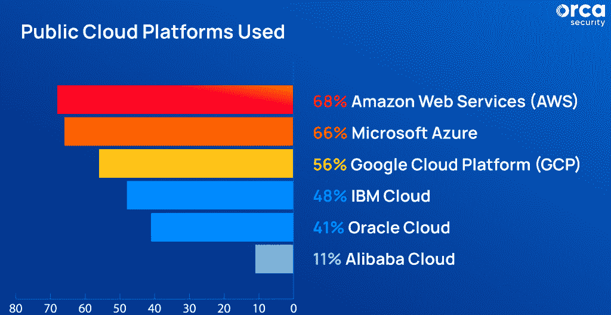
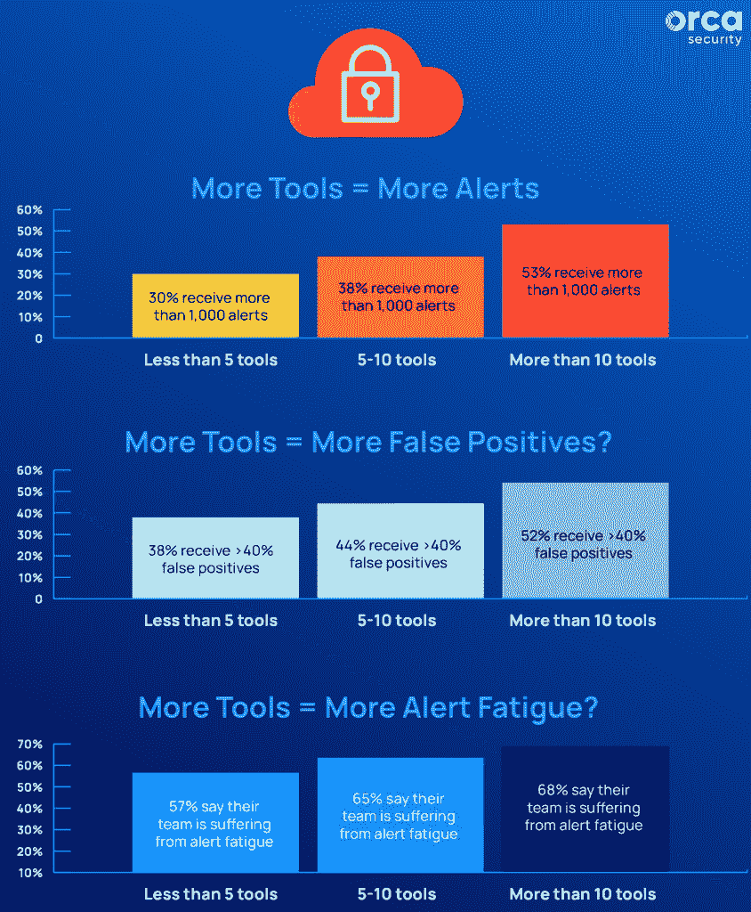
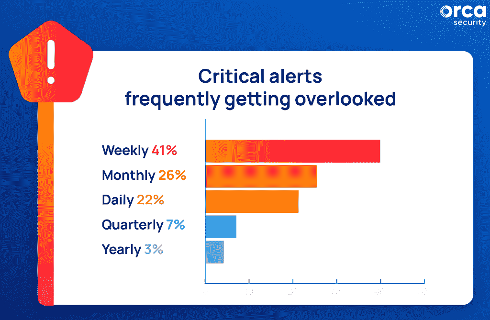
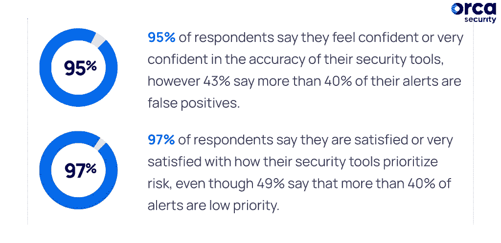
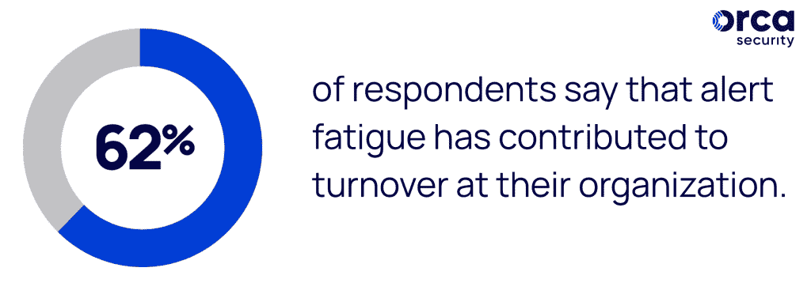

# 云安全警报疲劳如何影响您的团队

> 原文：<https://thenewstack.io/how-cloud-security-alert-fatigue-affects-your-tea/>

云安全已经达到了一个新的复杂水平。随着代码以极快的速度被部署到云上，漏洞和安全漏洞比比皆是。由人为错误导致的大规模违规已经变得司空见惯。

安全专业人员在保护其多云环境方面面临越来越大的压力。

在这种复杂和快节奏的环境中，防御者不能浪费时间去调查成百上千个无优先级、重复和/或不准确的警报。安全团队变得不堪重负，因为他们每天花费数小时来查看警报，以确定哪些问题需要首先修复。

这会导致重要警报的丢失、士气低落和人员流动，所有这些都是警报疲劳的症状。

 [埃利亚斯·特曼

埃利亚斯在云安全行业工作了十多年，如今在 Orca Security 担任高级副总裁，这是一个为 AWS、Azure 和 GCP 提供即时安全和合规性的云原生应用程序保护平台。](https://www.linkedin.com/in/eliasterman) 

## **什么是警觉疲劳？**

安全团队浪费宝贵的时间手动关联来自多个安全工具的大量低风险警报数据。这些警报缺乏上下文和可操作的细节，迫使安全专业人员承担所有繁重的工作。由于大量的误报，团队对警报变得不敏感，并错过了最重要的警报。结果呢？警惕疲劳。

新的研究表明，当不同的安全工具生成跨多个云的警报时，通常会出现警报疲劳。

## **Orca Security 2020 云安全警报疲劳报告**

最近，Orca Security 委托对 813 名 IT 安全专业人员进行了一项调查，以了解警报疲劳的流行程度和影响。结果令人震惊。59%的受访者表示每天会收到超过 500 条来自公共云安全工具的安全警报。

随着越来越多的组织转向多云环境，安全团队正在采用不同类型的非连接工具，这增加了每日警报量。

如下图所示，企业正在采用多云策略。绝大多数(81%)受访者表示他们使用不止一个公共云平台；55%的受访者报告使用三种或更多。

## **孤立的云安全工具加剧了问题**

此外，绝大多数受访者使用三个或更多公共云安全工具(87%)，其中 57%使用五个或更多。如下图所示，工具数量和警报疲劳之间似乎存在关联。

使用最多的工具类型是网络扫描工具(84%)，其次是云平台原生安全工具(82%)。

当部署了多云环境和多种工具的受访者报告经历了最高的每日警报量时，揭示了一个值得注意的趋势。

数据显示，安全团队部署的工具越多，他们收到的警报就越多。随着更多工具的部署，误报的比例似乎也在增加。这给日常工作增加了更多的警报，其中一些是报告相同问题的多个工具，给安全团队带来了重复工作。

## 据报道，每天都有重要的云安全警报被遗漏

警报疲劳现在已经成为 IT 和安全领导者需要管理的一个关键风险。事实上，55%的受访者表示，他们的团队过去由于警报优先级排序无效而错过了关键警报。在这些受访者中，22%的人表示他们每天都会错过重要警报，41%的人每周都会错过，26%的人每月都会错过。

## 戴着玫瑰色眼镜看云安全工具？

根据调查，受访者对安全工具性能的认识可能是问题的一部分。虽然绝大多数 IT 安全决策者指出他们认为他们的云安全工具运行良好，但他们仍然报告警报疲劳是一个重大问题，并因此遇到了安全问题。95%的受访者对其安全工具的准确性充满信心，但 43%的受访者表示超过 40%的警报是误报和/或低优先级警报。很明显，在谈到云安全工具性能时，有些乐观。

## 时间损失、士气低落和人员流动增加

从公共云环境中流出的大量安全警报浪费了宝贵的时间，并打击了士气。56%的受访者表示，他们一天中有超过 20%的时间用于对警报进行优先排序以进行调查。

62%的受访者表示，警报疲劳是导致人员流动的一个因素，在 IT 安全专业人员失业率为零的环境下，这是组织难以承受的。

## 解决云安全警报疲劳的主要建议

这份新报告提供了五种方法，IT 安全领导者可以通过这些方法解决警报疲劳问题，同时提高安全性。

1.  工具整合:不是添加更多孤立的工具，而是在更少的平台上整合工具，以避免重复的警报，并使用集中的上下文信息来发现危险的风险组合，从而改进风险优先级排序。在过去的两年里，云安全状态管理(CSPM)、云工作负载保护平台(CWPP)和云基础设施授权管理(CIEM)等以前截然不同的工具已经统一到一个新的类别中，称为[云原生应用程序保护平台(CNAPP)](https://orca.security/lp/gartner-cnapp-report/) 。
2.  对您的安全工具要求更多:询问安全供应商他们如何确定风险优先级。确保它们结合了许多因素，如严重性、易利用性、可访问性和潜在的业务影响。
3.  保护目标而不是入口点:确保您知道您最重要的资产在哪里，并了解您的安全供应商是否会根据这些资产的潜在风险自动确定风险的优先级。
4.  关注攻击路径:安全团队需要从调查孤立的警报转移到调查攻击链并确定其优先级，以便更快地了解哪些问题需要首先解决。
5.  战略补救:不要试图修复攻击链中的所有警报，而是从修复破坏链的警报开始，以阻止最直接的危险。

要与同行进行比较并获得宝贵的见解和最佳实践，请下载 [Orca Security 2022 云安全警报疲劳报告。](https://orca.security/lp/2022-cloud-security-alert-fatigue-report/)

<svg xmlns:xlink="http://www.w3.org/1999/xlink" viewBox="0 0 68 31" version="1.1"><title>Group</title> <desc>Created with Sketch.</desc></svg>