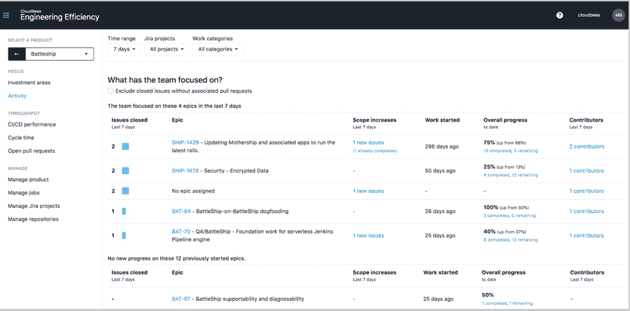

# CloudBees 软件交付管理如何帮助协调工程

> 原文：<https://thenewstack.io/how-cloudbees-sdm-modules-help-monitor-engineering-performance/>

CloudBees 已经发布了其[软件交付管理](https://www.cloudbees.com/software-delivery-management)平台的前两个模块，该平台旨在自动化 CI/CD 流程，以使开发人员、运营团队和其他 DevOps 利益相关方受益。CloudBees 工程效率和 CloudBees 功能管理模块的发布，以及随后的其他模块，也反映了 CloudBees 努力将其产品扩展到其 [Jenkins](https://www.jenkins.io/) 自动化服务器之外。

因此，CloudBees 软件交付自动化高级副总裁兼总经理 [Shawn Ahmed](https://www.linkedin.com/in/shawnahmed) 在上周的[在线活动](https://www.cloudbees.com/resources/webinar/cloudbees-software-delivery-management)中表示，这两个模块旨在“不仅获得您需要的关键见解，还帮助您管理您的渐进交付工作”。

“正如你们中的许多人所了解的，有时可能是艰难的方式，有效地扩展开发工作不仅仅是关于您的开发，以及开发人员和您的开发团队尝试产品。这也是关于不断学习，不断测量和不断监测，”艾哈迈德说。“众所周知，要改善无法测量的东西几乎是不可能的，有时候。获得这种洞察力的最大障碍是花费时间和资源来构建数据模型、获取数据并吸收数据、映射数据，然后频繁关联并持续维护最新的系统，以便在需要时获得关键的洞察力。”

例如，CloudBees 工程效率模块“完全是关于软件开发人员的可见性和洞察力，”Ahmed 说。

Ahmed 说，花费在从不同的监控工具手动收集信息或与单个开发人员开会讨论性能指标上的时间“不够理想”。这样的信息，当也手动传达给业务或其他团队成员时，例如用电子表格来获得对 CI/CD 过程如何运行的洞察，也是不理想的。

Ahmed 说:“为了使开发团队的工作与业务计划保持一致，我们不仅需要衡量交付速度，还需要衡量质量，知道哪里需要改进，并能够准确预测项目是否会按时交付。”

CloudBees 工程效率模块提供的功能之一是监控工程团队成员在哪些领域花费了时间，以及他们的代码交付吞吐量是多少。其他相关指标包括能够监控哪些任务占用了最多的时间，比如调试或测试应用程序代码的性能或安全性。

“这是一个很好的方式来了解我的团队在哪里投入了时间，并将其与您想要的业务结果联系起来，”Ahmed 说。

特性管理模块扩展了 [CloudBees Feature Flags](https://www.cloudbees.com/feature-flags) 工具，向其他开发者、其他 DevOps 利益相关者，甚至最终用户传达特性开发的进展情况。例如，在开发过程中，通过授予[基于角色的访问控制(RBAC)](https://en.wikipedia.org/wiki/Role-based_access_control) 和批准流程，可以显示应用程序功能进展，以便只有 DevOps 中的某些成员可以看到它们。

Ahmed 说，CloudBees 功能管理模块允许新用户在工程师“不能让他们意外破坏或复杂化任何东西”时“能够在沙盒中玩”。

Ahmed 说，软件交付管理平台平台中的两个模块中的第一个模块还扩展了 CloudBees 的公共数据模型，该模型旨在帮助统一和关联 DevOps 访问的数据。加强 CloudBees 向提供更全面的 CI/CD 平台的转变，Ahmed 说软件交付管理平台是“CloudBees 的真正支柱”

CloudBees 是新堆栈的赞助商。

通过 [Unsplash 上的](https://unsplash.com/s/photos/modules?utm_source=unsplash&utm_medium=referral&utm_content=creditCopyText)[标记 knig](https://unsplash.com/@markkoenig?utm_source=unsplash&utm_medium=referral&utm_content=creditCopyText)的特征图像。

<svg xmlns:xlink="http://www.w3.org/1999/xlink" viewBox="0 0 68 31" version="1.1"><title>Group</title> <desc>Created with Sketch.</desc></svg>