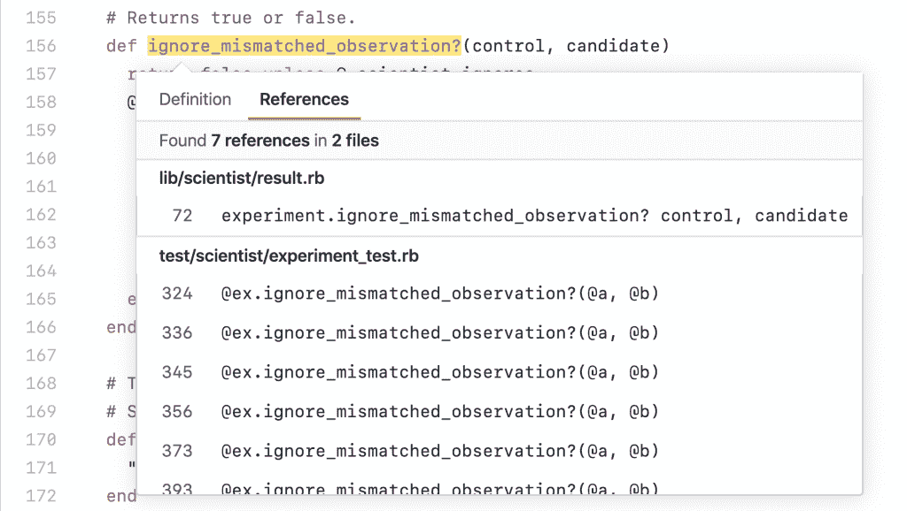
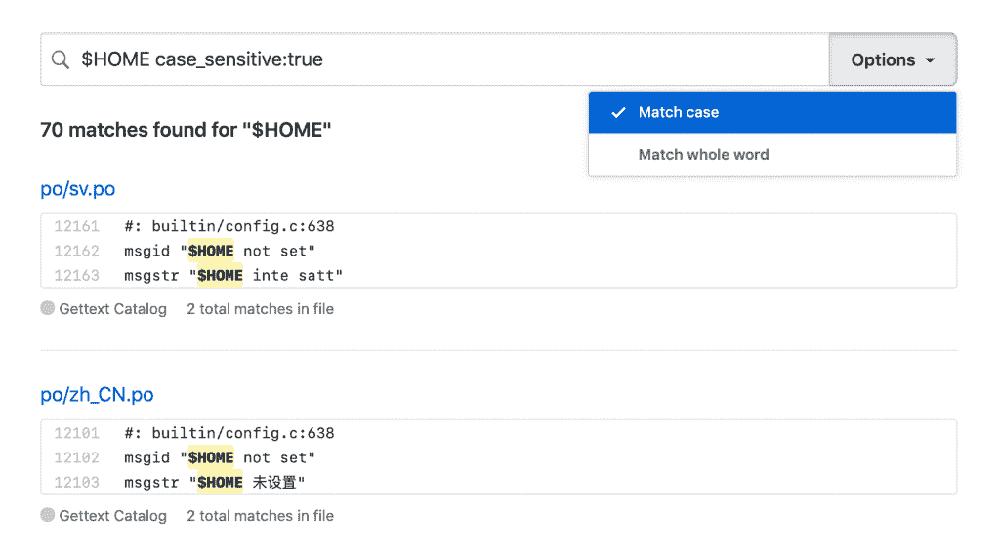

# 代码分析如何帮助 GitHub 破译其开源语义代码图

> 原文：<https://thenewstack.io/how-code-analytics-could-help-github-decipher-its-semantic-code-graph-of-open-source/>

GitHub 首席执行官[纳特·弗里德曼](https://twitter.com/natfriedman?lang=en)最近在 GitHub Universe 会议上预测，到 2025 年，GitHub 上将有超过 1 亿名开发者，并指出 99%的软件项目已经包含开源。去年 GitHub 上有 8700 万次拉取请求。开发人员和维护人员使用由[依赖机器人工具](https://dependabot.com/)生成的超过 20 万个自动更新修复了 760 万个安全警报。

如果开发人员要应付这种规模而不精疲力竭，并保持开源的成功故事，GitHub 需要创建系统和流程来帮助他们。深入理解 GitHub 上的代码有助于使这些代码更加智能和有用。

新的 GitHub 新的移动应用程序、更智能的任务分配以及改进的搜索和智能代码导航功能都应该有助于提高开发人员的工作效率。能够从一个引用跳到下一个引用，或者找到真正要找的代码行，而不是出现所有碰巧包含该字母序列的注释，这将使在大型代码库中导航变得更快更容易。类似地，让 [CodeQL](https://securitylab.github.com/tools/codeql) 语义代码分析引擎(GitHub 在 9 月收购 Semmle 时收购了[)免费用于研究和开源开发将有助于安全研究人员找到新的 CVE，开发人员自动对他们的代码库进行安全检查，以发现常见的模式，如缓冲区溢出和跨站脚本。](https://techcrunch.com/2019/09/18/github-acquires-code-analysis-tool-semmle/)

但是为了让这些新功能发挥作用，GitHub 不仅仅是创建简单的索引和依赖图。相反，它在幕后生成的更像是 GitHub 上所有公共回购的语义代码图，这为理解和改善编码模式、质量和安全性提供了巨大的机会——从只发送相关通知和选择合适的开发人员发送拉请求以供审查，到记录代码或帮助您找到合适的模块以进行重构。

直接在浏览器中浏览代码。图片:GitHub

### **代码的含义**

代码搜索和代码导航都依赖于开源的语义库来解析、分析和比较一系列编程语言中的源代码。代码搜索处理区分大小写、标记化和特殊字符，并允许您选择匹配精确的字符串或整个单词。它找到的不是几十个结果，而是更少更相关的结果。

最初，代码导航在 Ruby、Python 或 Go repos 中工作，让您跳转到代码定义，并在浏览器中找到 repo 中调用函数或方法的所有引用，而无需在 IDE 中打开代码。GitHub 开源了这个库，因此更多的语言社区将为它建立绑定:它也支持其他语言，包括 JavaScript、TypeScript 和 Java，代码导航将很快与更多的这些语言一起工作。

GitHub 战略副总裁 [Kelly Stirman](https://www.linkedin.com/in/kellystirman) 向我们解释说:“不同语言的语法有所不同，但隐含的语言结构是相当一致的，因为大多数语言都是面向对象的。这就是 GitHub 如何知道什么是函数或方法，并提取定义它的代码和调用它的位置，这形成了表示代码结构的图形。

“语义库让我们独立于所使用的底层语言，开发这个核心图概念。这就是我们对特定项目中代码图的理解；在一个项目中，围绕代码的依赖关系有一个不同的图，它都是一个主图的一部分。如果我使用某个库或包，取决于你使用的是哪种语言，这些关系就像一个俄罗斯洋娃娃，在所有这些相互关系中(我们可以看到)像许可证或使用特定版本的代码这样的事情。”

一旦 GitHub 创建了一个回购的语义图，那么已经在该代码上工作的开发人员就可以搜索和导航它，这也使得新开发人员很容易掌握代码，无论他们是开始使用它还是只是查看回购以帮助他们学习更多关于编码的知识。

“开发人员成为产品的很大一部分是学习代码如何工作，找到它并在其中导航。我们的目标是让这种导航无缝地成为 GitHub 体验的一部分，”[GitHub 产品团队的负责人 Shanku Niyogi](https://github.com/shankuniyogi) 告诉 New Stack。通过扫描和分析代码，并提供代码导航和代码搜索，探索和查找代码以及从代码中学习的能力变得更加自然

开发人员不必克隆 repo 并构建它来查看方法是如何使用的，他们只需查看代码定义并在浏览器中找到所有引用，这有助于他们更快地理解代码是如何工作的。

GitHub 产品安全副总裁 Jamie Cool 解释说:[GitHub 利用其构建的代码图的第一个地方是通过 Dependabot 和 CodeQL 找到并修复安全漏洞，CodeQL 将代码转换为开发人员可以查询的数据库。](https://github.com/jamiecool)

安全研究人员将使用 CodeQL 来寻找新的漏洞。“您可以编写一个简单的查询来返回百万行代码库中所有为空的语句；在 CodeQL 中只有三行代码，但是如果你试图用不同的工具来回答这个问题，你就做不到，”Cool 说。除了查找所有整数溢出之外，您还可以只查找那些具有网络数据源的溢出，这些网络数据源可以被精心编制以触发溢出。要找到跨站点脚本漏洞，您需要了解数据来自哪里以及如何使用数据，例如将数据插入 DOM，这意味着在数据通过程序时对其进行跟踪。CodeQL 可以找到这些代码行，因为它理解代码中的语言结构实际上是做什么的。

开发人员可能不会编写自己的查询，但他们可以使用内置查询来检查他们没有将已知类型的漏洞添加到代码中，并且组织可以自定义这些查询。这在一个新的 [Visual Studio 代码插件](https://marketplace.visualstudio.com/items?itemName=github.vscode-codeql)中可用:“这是为了让更多的开发人员更容易使用这个工具，因为今天有太多的开发人员在使用 VS 代码，”Cool 解释道。

## **从图表中学习**

“以前，代码有点像黑匣子，”他指出；“我们可以解析它，告诉你回购中的文件类型，但现在我们正在构建代码图，我们能够以一种前所未有的方式理解它。现在我们有了代码图，有了各种有趣的应用。我们现在非常关注的领域是安全应用程序，因为我们认为这是应用该技术的最关键需求，但一旦我们有了代码图，我们就可以做很多不同的事情。”

或者像施蒂曼说的更有雄心，“如果你有全世界的代码，有全世界的开发者，你坐在一个非常有价值的数据集上，你如何善用这些数据。”他建议，新的代码评审任务选项开始建立在这个基础上。

如今，代码评审任务的选项有循环法(轮流分配给项目中的每个开发人员)或新的负载平衡(试图避免任何一个开发人员工作负担过重)。“越来越多的标准做法是，当我签入一个项目的代码时，在它进入 master 之前，我需要最少数量的人来审查它，”Stirman 解释道。“但是谁被分配审查代码的任务呢？嗯，在很多项目团队中，是谁举手，或者团队领导把它分配给他们认为可以完成的人。但这可能不是评论者的最佳分布。”

不过，理想情况下，将代码审查发送给具有合适的专业知识或经验来查看拉请求的人是有意义的——这些人已经审查了其他项目中的类似代码，或者对类似问题发表了评论，或者甚至基于其代码批准倾向于导致成功的构建而不是进一步的问题。

类似地，如果有人在他们没有经验的领域处理一个问题或拉请求，或者他们的代码在过去有问题，GitHub 可以通过建议培训来帮助他们。“我们有学习实验室，”施蒂曼指出；“今天，这是一个让你为人们创造学习方式的平台。但是将来，当你发现团队中有人在从事他们以前没有从事过的领域，比如安全开发，而很多开发人员都不具备这方面的专业知识。难道我们不能给你一个学习课程，帮助你在你正在做的特定事情上做得更好吗？GitHub 可能会根据各种标准推荐人们学习的东西。”

通知方面的改进让你可以进行过滤，以查看你在哪里被“@”提到，而不仅仅是作为一个整体被提到的团队的一部分，这有助于开发人员挑选出要处理的重要通知(比如哪些通知足够紧急，需要在新的移动应用程序中处理，在新的应用程序中，你只能看到你创建、评论或分配的问题和拉式请求)。

新的“精确匹配”搜索理解特殊字符和代码的语义，以找到有用的匹配。图片:GitHub。

Cool 说，这就是让信息的消防水带变得易于管理。“代码扫描的很大一部分是确保警报是正确的——因为如果你是一千个回购的维护者，我会在那里给你发一千封电子邮件。我可以更好地控制你如何获得这些信息，这就是我们一直在做的“花园软管”功能。但当你收到警报时，它必须是一个有意义的警报，让你去修复，而不仅仅是噪音。”

为了避免供应链攻击，即一个合法的软件包被恶意的维护者接管，回购协议正在考虑越来越多的信誉因素，比如当新的维护者介入时，以不同的方式对待回购协议。施蒂曼称之为行为指纹，代码图也能对此有所帮助。“他们的行为模式是否潜在地表明，有人在你的项目中表现可疑，因此你需要拒绝他们提交的拉请求？”

考虑使用开源组件的开发人员通常会查看它有多少星级，使用范围有多广，但其他指标可能更有用。“我想知道在使用这个组件回购之前，我需要了解什么。它活跃吗？它是否解决了[被报告的]问题，安全也属于这一类。你知道，随着我们做的越来越多，我们获得的信息和数据越来越多。我们可以做很多事情，让每个人都更安全、更有效率。”

使用代码图分析 repos 可以揭示编码和重构的最佳实践，并通过推动最适合编写注释的开发人员来帮助编写文档。“我们能在你的代码中告诉你‘这在语义上等同于这个东西，我们将自动重写代码以遵循这个路径’吗？我们可以删除评论，我们可以标记某人，然后说‘你似乎是评论这段代码的合适人选，’”stir man 推测道。

通过了解如此多的开放源代码的全球 mono repo，GitHub 可能能够使用代码图来帮助估计开发可能需要多长时间，或者查看 pull 请求以查看它是否实际上改变了对某个问题负责的代码行

Stirman 说，拥有私人回购的开发者可以受益，而不必允许他们的代码被挖掘用于代码图(代码导航已经用于私人回购)。“对客户来说，私人回购中可能有一些东西可以帮助他们进行其他回购，而足够多的公开回购中有足够多的数据，每个人都可以从中学习很多东西。”

GitHub 很清楚，无论在代码图上构建什么特性，它都需要在不破坏客户信任的情况下使用数据。“是的，我们有工具和技能来利用这些数据，但我们也有巨大的责任，保护我们客户的数据，并负责任地使用这些数据，”Stirman 说。

但他也指出，“现在这是你手动做的事情。任何人都可以去看看公开回购，但我们能展示对每个人都有意义的东西吗？”也不要指望自动化特性会大规模地改变代码。“我们不想用大锤来解决这个问题。我认为这是我们提供信息，让人们做出正确选择的地方。”

来自 Pixabay 的 stokpic 的特征图像。

<svg xmlns:xlink="http://www.w3.org/1999/xlink" viewBox="0 0 68 31" version="1.1"><title>Group</title> <desc>Created with Sketch.</desc></svg>