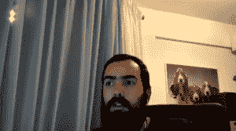

# 社区如何在 Python 的虚拟核心开发冲刺中胜出

> 原文：<https://thenewstack.io/how-community-prevailed-at-pythons-virtual-core-development-sprint/>

吉多·范·罗苏姆在 2020 虚拟 Python 核心开发冲刺启动会上。(截图经由 YouTube。)

社区有多种形式，可以克服许多挑战。上个月，Python 社区连续第五年举行了年度核心开发冲刺。但是，由于聚会是虚拟举行的，今年的活动与以往不同。

在去年的一篇博客文章中，本月早些时候退休并加入微软的 Python 创始人吉多·范·罗苏姆[，](https://thenewstack.io/this-week-in-programming-python-creator-guido-van-rossum-joins-microsoft/)[回忆道](https://medium.com/@gvanrossum_83706/peg-at-the-core-developer-sprint-8b23677b91e6)“对我来说，参加这样的活动的主要原因是经常与我全年在线合作的人见面，但我一年只能见他们一两次。”但是他们能在虚拟活动中重现同样的协同效应吗？他们会注意到同样的生产力激增吗？

这对 Python 来说是一个特别关键的时刻，在 van Rossum 辞去该语言“仁慈的终身独裁者”一职后，Python 于 2019 年 2 月转向了指导委员会模式[因此，在一个已经渴望常态和 facetime 的世界里，Python 的核心开发人员在网上重聚，决定继续他们的年度传统。](https://lwn.net/Articles/777997/)

拥抱新时代，该活动再次聚集了 47 名核心开发人员，今年我们做出了巨大努力来重现现场活动的所有舒适性。在 Discord 上有专门的社交频道——和午餐聊天频道——以及每日更新频道。从 10 月 19 日开始，这个活动以一个完全虚拟的周一[启动会议](https://www.youtube.com/watch?v=Uz8CP_05aCQ)开始，五天后以一个[周五总结会议](https://www.youtube.com/watch?v=5LyGF5CwNBw)结束。在这之间，有一个[核心开发者和社区成员 Q &一个](https://www.youtube.com/watch?v=yzCitT4juGk)事件。甚至还有一个特殊仪式的视频，PSF 的基础设施总监 Ernest W. Durbin III 为其 TUF 存储库生成密钥，该存储库保护重要的 Python 包索引(或 PyPI)，“以一种对 Python 社区透明和可见的方式，存储用于存档目的，以便人们可以了解 TUF 安全性的基础。”

PSF 虚拟冲刺 2020 的签约仪式，由欧内斯特·w·德宾三世生成密钥

到周末，已经审查并决定了 194 个不同的请求(合并了 165 个)。21 个 Python 增强提案(或 pep)也被审核并关闭(其中 20 个被合并)。

但更重要的是看起来已经发生的非常真实和必要的社区建设。

## 迎接挑战

在开球活动上，主持人玛丽雅塔强调了著名的吃豆人会议规则的虚拟版本。在现实世界的活动中，参与者被鼓励总是为新人加入一群人留下空间——所以对于这个虚拟活动，Mariatta 强调为任何默默监控虚拟会议的“潜伏者”腾出空间——并欢迎他们参与。"明确地邀请他们加入对话就行了."

核心开发人员 Joannah Nanjekye 在 2020 虚拟 Python 核心开发冲刺启动会上。(截图来自 YouTube)

他们开始了社区建设，在虚拟房间里走动，让参与者自我介绍——这显示了每个人实际上是多么广泛。核心开发人员几乎来自世界各地——从中国和以色列，到阿姆斯特丹、葡萄牙和德国。核心开发人员来自伦敦和牛津(以及苏格兰)，以及加州的圣地亚哥和欧文市。核心开发人员从华盛顿特区和科罗拉多州的丹佛拨电话到佐治亚州的亚特兰大和特拉华州的威尔明顿。一名韩国参与者指出，他们是在凌晨一点拨号上网的。核心开发者/版主 Mariatta 来自不列颠哥伦比亚省温哥华。

当然，还有范·罗森本人，他是从旧金山南部拨进来的。

核心开发者 Barry Warsaw 在 2020 虚拟 Python 核心开发 sprint 启动会上。
(YouTube 截图)

范·罗森看起来很放松，穿着一件印有“《我的世界》元素周期表”的 t 恤。核心开发者 Ned Deily 问了一个可能每个人都在想的问题:既然 van Rossum 不再是该语言的慈善监督者，那么指导委员会的体验是如何工作的？核心开发者/议员 Carol Willing 是第一个回应的人。

“我参与了许多治理组织，我可以说，指导委员会在坚持议程、深思熟虑和合作开展工作方面一直处于领先地位。”他们每周会面一小时——有一个预先设定的议程——“总的来说，我认为这很好。如果说我从中学到了什么的话，那就是我很惊讶 Guido 能够作为一个单身的人做这么长时间的工作。因为即使是五个人，工作量也很大。

“但我认为这是件好事。我认为它每年都会改进，就像 Python 软件基金会随着时间的推移而改进一样。”

核心开发者/议员 Barry Warsaw 表示同意。“自指导委员会成立以来，我们中有几个人一直是其成员。还有很多事情是治理计划没有真正涉及的。所以我们真的需要弄清楚很多事情的过程。我非常高兴能与第一年的指导委员会成员和今年的指导委员会成员一起工作。

“我认为每个人都有正确的理由这样做，因为我们热爱 Python，我们热爱 Python 社区……”

在 2020 虚拟 Python 核心开发冲刺启动会上，一幅巴吉度猎犬监视新核心开发人员 Lysandros Nikolao 的画(通过 YouTube 截图)

但是指导委员会的一名成员将问题重新引回核心开发人员，询问他对委员会表现的看法。戴利同意他们的评估。

“我的印象是事情进展得非常顺利，比预期的要好。

“我非常自豪我们作为一个群体能够迎接挑战，从零开始提出治理方案。我认为——我不确定 Guido 这么做的所有动机，但我认为在很多方面他做得很对，只是迫使社区想出了一些东西。我认为总的来说，效果非常好。”戴利要求更多的沟通——“像分钟之类的东西”——卡罗尔和巴里同意这是他们应该努力改进的地方。

## 我们只是推动比特

但是核心开发者 Christian Heimes 也想检查一下委员会的压力水平——并询问核心社区能做些什么来帮助？我们要做些什么来确保我们不会毁了我们的人民？委员会成员布雷特·坎农给出了非常有见地的回答。“老实说，每个人都应该对彼此友好……我想我们有时会忘记，我们都只是想帮助这个项目的人，老实说，我们只是向世界推出一些东西，有些人似乎碰巧真的喜欢，这很好。”

Python 指导委员会成员 Brett Cannon 在 2020 虚拟 Python 核心开发问答会上。(截图来自 YouTube)

华沙表示同意，并补充了一些他在工作和个人生活中观察到的东西。“这不是正常时期。对吗？世界上正在发生的一切对人们的影响是不同的。我们在度过一天的过程中都会感到压力，让这种压力侵入您与 Python 开发伙伴之间的交流是如此诱人……”

“所以，在你发送邮件之前，抓住那个时刻，深呼吸，试着站在收件人的角度想想。”

Willing 同意了，记得今年从她的一些承诺中后退了一步，这被证明是一个困难但有益的决定。“我认为我们正处于一个奇怪的时代，我鼓励你们每一个人首先照顾好自己。”她敦促人们不要害怕寻求帮助，并鼓励人们“继续照顾好自己，因为你们都很棒。”

大约 48 分钟后，范·罗森自己提出了一个关于 Bugs.python.org 问题追踪器(被亲切地称为“BPO”)的问题。"所以我非常好奇 BPO 向 GitHub 迁移的情况."他停顿了一下，然后小心翼翼地问道，“嗯，指导委员会愿意分享他们所知道的多少，你实际上知道多少？”

坎农回应道，他谈到了被雇佣来管理它的团体，并感谢那些捐款资助它的团体。然后戴利建议范·罗森志愿加入工作组，“因为这将影响到我们所有人。”范·罗森问如果他自告奋勇是否合适，每个人都同意了，他回答说，“好吧，我愿意。”

也许这一切都证明了社区可以在没有存在的情况下发生——对于优秀和忠诚的个人来说，虚拟网真就足够了。

<svg xmlns:xlink="http://www.w3.org/1999/xlink" viewBox="0 0 68 31" version="1.1"><title>Group</title> <desc>Created with Sketch.</desc></svg>