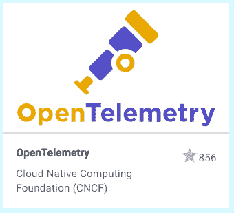
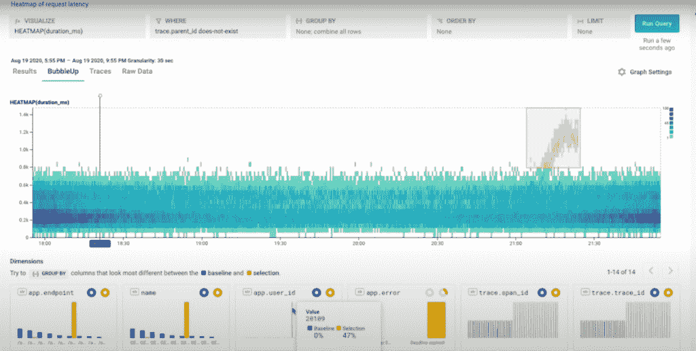

# 全面的可观测性如何将 DevOps 从“未知的未知”中拯救出来

> 原文：<https://thenewstack.io/how-comprehensive-observability-can-save-devops-from-unknown-unknowns/>

[蜂巢](https://www.honeycomb.io/)赞助本帖。

开发运维团队经常在各种多云和内部环境中部署和管理云原生应用。对于许多负责调试或提高应用程序性能的工程师来说，他们似乎正盯着分散部署的令人生畏的深渊，几乎没有希望有意义地理解他们代码的哪些部分正在工作，哪些部分需要修复。这就是为什么现在特别需要全面的可观测性。

根据 Honeycomb 的说法，综合可观测性是一种收集和分析独特的高基数遥测数据的方法，以便为任何给定的事件或服务请求提供完整的上下文。这些数据被运送到数据后端，在那里可以对其进行分析，以帮助调试或排除云原生分布式系统(如 Kubernetes)中出现的许多不可预见的复杂问题。

现代分布式系统可能以独特和新颖的方式发生故障，其中许多新发现的故障模式再也不会出现。现有的监控、APM 和日志记录解决方案无法解决此类异常，因为这些工具旨在发现已知或可预测的问题。Honeycomb 声称，他们也没有深入研究过去的整体聚合行为和个人用户体验，因为他们缺乏有效收集和分析高基数数据的能力。当大规模运行时，当甚至难以查明代码在系统中的何处运行时，诸如 CPU 或内存使用日志之类的标准监控指标不足以调试问题。

因此，可观测性构成了“理解你的系统内部正在发生什么的能力，并且不需要使用现有的仪器和从那些系统流出的数据来推动新的代码，”Honeycomb 的主要开发者倡导者和 OpenTelemetry 的治理委员会成员 [Liz Fong-Jones](https://www.linkedin.com/in/efong) 在新堆栈的 livestream 播客中说道，这是其 [KubeCon + CloudNativeCon](https://events.linuxfoundation.org/kubecon-cloudnativecon-europe/) 报道的一部分。

“一个全面的可观察性平台不仅仅是日志、指标、分布式跟踪数据和其他分析的集合，”Fong-Jones 说。“它主动测量您的系统，而不是只在系统出现故障时才查看。”

在本文中，我们将讨论综合可观测性应该为在高度分布式、多云环境中工作的组织提供什么。

## 可观测性的进化

不久前，监控工具还主要用于检测错误，并在出现故障时进行修复。通过这种方式，监控空间以前是关于“有静态的东西”和当中断发生时采取什么行动，例如，[首席工程师贾纳·多安](https://www.linkedin.com/in/jaana-dogan-9079ba1aa),[亚马逊网络服务(AWS)](https://aws.amazon.com/) 和 livestream 嘉宾同伴说。她说，例如，生产中崩溃的应用程序通过预先确定的操作进行补救，而这种方法不再适用。如今，“世界正变得异常庞大和复杂。”

相反，可观察性是一个动态过程，包括“试图弄清楚发生了什么，而没有为失败做太多准备，”多安说。

Fong-Jones 说，可观测性包括分析“未知的未知和已知的未知”。“监控是关于测量你知道要提前预测的事情，而可观察性帮助你理解如何以及为什么。”

Fong-Jones 说，今天可行的可观测性工具必须主动测量和分析系统，并涉及许多用例，而不仅仅是“中断/修复”。“你真的能像编写单元测试一样编写代码吗？您真的能想象出您的 CI/CD 渠道内部发生了什么吗？”她说。“对我来说，这就是全面可观察性的含义，不幸的是，许多其他人认为‘全面’意味着实现跟踪、日志和指标，而我认为根本不是这样。”

## 打开遥测开门

## 

组织应该能够采用一个全面的可观察性平台，而不必编写代码或做其他繁重的工作来在他们现有的系统中实现这些工具。云本地计算基金会(CNCF)最近启动的 [OpenTelemetry](https://opentelemetry.io/) 项目旨在提供一个厂商中立的框架，以促进工具提供商提供的众多选项之间的互操作性。在许多方面，OpenTelemetry，也称为 OTel，是未来可观测性的一个模型。

Fong-Jones 说:“OpenTelemetry 使组织能够以厂商中立的方式导出代码的检测，因此他们只需要检测一次。“因此，对我来说，可观察性与工具无关，但可观察性与人类能够用工具做什么有关。”

通常，一个组织可能会在实现高级工具时遇到困难，如用于分布式跟踪的[普罗米修斯](https://prometheus.io/)或[耶格](https://www.jaegertracing.io/)，OpenTelemetry 现在可以帮助解决这些问题。

“给自己买一个 Jaeger 实例不会神奇地给你带来耐用性，除非你的工程师真的知道如何使用它，”Fong-Jones 说。“因此，使用 OpenTelemetry 来生成和导出数据，并在后端，例如 Jaeger 或一个专有的闭源后端[提供]各种选项，帮助您真正实现…全面的可观测性。”

## 看起来像一只鸭子

一些供应商提供的有限的度量当然不构成可观察性。例如，在某些情况下，用于跟踪某些堆栈实例的 APM 微服务平台可能很有用，但其本身并不能满足许多(如果不是大多数)组织的可观察性需求。

“因为你叫它鸭子并不意味着它就是鸭子，可观察性是什么，是对慈善专业人士、[蜂巢的联合创始人和首席技术官]和蜂巢一直在做的事情的力量的证明，”[查克·达米纳托](https://www.linkedin.com/in/chuck-daminato-bb5a101b/?originalSubdomain=ca)，蜂巢的一位客户说。

例如，通过使用 Honeycomb 平台提供的查询功能，ecobee 能够检测和分析客户在新产品发布前用移动设备注册和登录其平台时可能遇到的一些不太明显的问题。

“蜂巢的平台确实帮助我们在应用和业务逻辑不起作用时找到了一些角落案例。我们也没有意识到它们，因为它们没有以真正影响应用程序的方式表现出来，”达米纳托说。“只要能够说‘对于这类客户的这类请求，我们遇到了这类错误’，以及快速进行查询的能力，而不是从基本原则出发考虑所有不同类型的[数据和指标]就很有帮助。]

“我们推出了几项新产品和服务，”他说，“我可以毫不掩饰地说，如果不是蜂巢，我们不可能及时到达那里。”

## DevOps 协作的可观察性

一个可行的可观测性平台提供了许多功能，可以帮助工程师在难以置信的复杂问题发生时快速找到问题的根源，并主动找到在高度分布式环境中改进生产系统的方法。在实践中，[企业管理协会(EMA)](https://www.enterprisemanagement.com/) 的分析师 [Torsten Volk](https://www.linkedin.com/in/torstenvolk) 告诉新的堆栈，可观测性应该将软件开发人员从编写和管理工具代码的义务中解放出来，然后他们必须针对不同的内部数据中心或云平台进行调整。“在运行期间，开发人员需要能够专注于完成他们的应用程序代码，并担心最终用户体验，而不是必须更新和测试工具功能。”

全面的可观测性将遥测数据与工具一起放在工程师手中，以任意数量的必要方式分析遥测数据并询问他们的系统，直到他们找到可靠性问题、性能瓶颈和其他问题的根本原因。

“这有助于可观测性平台成为一个协作空间，”Volk 说，“供开发人员、DevOps 团队、sre 和传统 IT 运营商不断增强应用代码和操作。”

现代云原生分布式系统提供了许多优于传统整体式系统的优势。但是微服务架构带来的复杂性也需要为现代系统设计的现代工具。在混合和多云环境中寻找提高和调试应用程序性能的方法，这一挑战似乎令人望而生畏，部分原因是为满足单一系统需求而设计的老一代工具的局限性。由于全面的可观察性，解决这种复杂性并让团队更好、更主动地了解他们的云原生系统变得易于管理。

云原生计算基金会和 KubeCon+CloudNativeCon 是新堆栈的赞助商。

Obelixlatino 通过 Pixabay 制作的专题图片。

<svg xmlns:xlink="http://www.w3.org/1999/xlink" viewBox="0 0 68 31" version="1.1"><title>Group</title> <desc>Created with Sketch.</desc></svg>