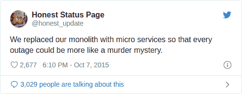

# 容器寿命如何影响可观察性

> 原文：<https://thenewstack.io/how-container-lifespan-affects-observability/>

[LogDNA](https://logdna.com/) 赞助本帖。

 [明道

Minh Dao 已经在软件开发和技术领域工作了二十多年，从 Docker 这样的初创公司到 VMware 这样的财富 500 强公司。他对开发人员体验和产品创新的关注使他进入了 LogDNA，在那里他领导所有的产品营销活动。](https://www.linkedin.com/in/minh-dao-2019/) 

容器从根本上改变了我们运行应用程序的方式。组织不再将应用程序作为长期运行的服务来运行，而是作为临时流程来运行。容器的供应速度使组织能够比以往更快地扩展、优化资源消耗和更新应用程序。典型的 Kubernetes 容器[只能持续一天](https://www.datadoghq.com/container-report/#five)，而典型的 AWS Lambda 容器[只能持续一个小时左右](https://read.acloud.guru/how-long-does-aws-lambda-keep-your-idle-functions-around-before-a-cold-start-bf715d3b810)。

容器的动态性和短暂性也影响了可观察性。可观察性是 DevOps 过程的一个关键部分，但是与更传统的单片应用程序相比，容器增加了独特的挑战。

在这篇文章中，我将解释这些挑战是什么，以及 DevOps 团队可以做些什么来简化向基于容器的架构的过渡。

## 集装箱可观察性的复杂性

在我们深入研究容器寿命之前，我将首先解释从容器中收集可观察性数据的挑战。有几种方法，包括一些内置在容器运行时和编排工具中的方法，如 Docker 和 Kubernetes。其中包括:

*   将专用监控代理部署为主机应用程序或容器。
*   部署一个[日志路由器](https://docs.logdna.com/docs/docker)自动收集容器生成的日志。
*   使用 Docker 日志记录驱动程序将容器日志存储到主机。
*   通过 [docker stats](https://docs.docker.com/config/containers/runmetrics/) 、[Kubernetes metrics pipeline](https://kubernetes.io/docs/tasks/debug-application-cluster/resource-metrics-pipeline/)或类似的 API 收集指标。

然而，这些方法存在风险。企业微服务部署可能涉及跨越许多云平台的数百、数千甚至数万台主机。不仅应用程序不再连续运行，而且团队在应用程序部署之前也无法确定哪个主机将运行应用程序。一个应用程序也可能有多个实例同时运行，这使得出现问题时很难知道到哪里去找。因为容器是短暂的，所以写入容器文件系统的任何数据都将与容器一起被删除，除非它可以被传输到主机。这也意味着不再保证工程师能够交互式地对正在运行的容器进行故障诊断，因为它可能在工程师能够打开会话之前就已经被删除了。

此外，宿主本身也可能是短暂的。Kubernetes Cluster Autoscaler、Google Kubernetes 引擎和 Amazon Elastic Kubernetes 服务等工具可以自动添加或删除主机以满足需求的变化，这可能会导致写入主机文件系统的任何文件的数据丢失。相比之下，更传统的单一应用程序的部署环境在整个应用程序的生命周期中保持相对一致。在传统环境中，开发运维团队可以在主机上安装一个监控代理，直接将应用程序中的数据记录到主机的文件系统中，甚至登录到主机环境中收集信息或解决问题。对于容器，这变成了一个几乎不可能的任务。这就是为什么用单一的思维方式对待容器的可观察性不仅弄巧成拙，而且非常危险。

当你以单一的思维方式对待容器可观察性时，你会有什么样的感觉。

当在基于容器的架构中实现可观察性时，团队需要关注两个关键目标:

1.  从容器和主机收集和集中可观察性数据。
2.  在整个应用程序的上下文中测量可观察性数据，而不是单个容器。

接下来，我会解释这些目标是什么意思，以及如何实现。

## **收集和集中可观测性数据**

如前所述，容器和主机是短暂的:它们可以在任何时候启动、停止和迁移。因此，由容器和主机生成的任何可观测性数据都应该被发送到持久收集和存储服务。

在这种情况下，LogDNA 等第三方服务是理想的解决方案，因为它们提供了一个专用的、快速的、可靠的平台来接收大量数据。例如，LogDNA 聚合并解析传入的日志数据，以便工程师可以立即对其进行搜索、过滤和分析。这消除了工程师远程登录应用环境的需要，并确保可观察性数据始终可用，即使原始容器或主机被破坏。

## **通过元数据的语境化**

与整体不同，容器只是大型应用程序的一小部分。虽然从单个容器中收集可观察性数据很重要，但是当在整个应用程序的上下文中查看时，这些数据才真正有用。

例如，假设您有一个三层的 web 应用程序，每一层都作为一个单独的容器运行。现在想象一下，您的后端层突然开始产生错误，结果导致容器崩溃。从单个容器中提取日志和指标将有助于根本原因分析，但这不会帮助您在整个应用程序的上下文中看到错误。这个问题可能是特定于容器的，也可能是一个更广泛的应用程序范围的问题。

这和短暂有什么关系？在收集可观察性数据时，您收集的数据应该标识容器提供的*服务，而不是容器本身。例如，LogDNA 代理自动用容器名和映像名标记每个容器日志。Kubernetes 代理通过包含 Pod 名称、节点和 Kubernetes 名称空间以及其他有用的元数据来扩展这一点。这允许您搜索和过滤容器、Kubernetes 服务或部署的所有实例的日志。拥有这种级别的上下文对于分布式跟踪尤其重要，但是它适用于所有形式的可观察性数据。*

## 如何有效应对昙花一现

像 LogDNA 这样的托管监控服务是收集、上下文化和访问可观察性数据的最简单、最有效的解决方案之一。使用 LogDNA，您可以部署一个代理，只需两个命令就可以从整个 Kubernetes 集群[中收集日志。LogDNA 代理除了收集容器日志之外，还收集主机日志，为您提供应用程序和基础结构的整体视图。此外，由于代理是作为守护进程部署的，因此它会随着您的基础架构自动扩展。](https://logdna.com/kubernetes/)

如果您想了解更多关于如何记录微服务和短暂工作负载的信息，请阅读我们关于在容器时代记录日志的博客文章，以及我们关于记录无服务器应用程序的挑战的文章。

通过 Pixabay 的特征图像。

<svg xmlns:xlink="http://www.w3.org/1999/xlink" viewBox="0 0 68 31" version="1.1"><title>Group</title> <desc>Created with Sketch.</desc></svg>