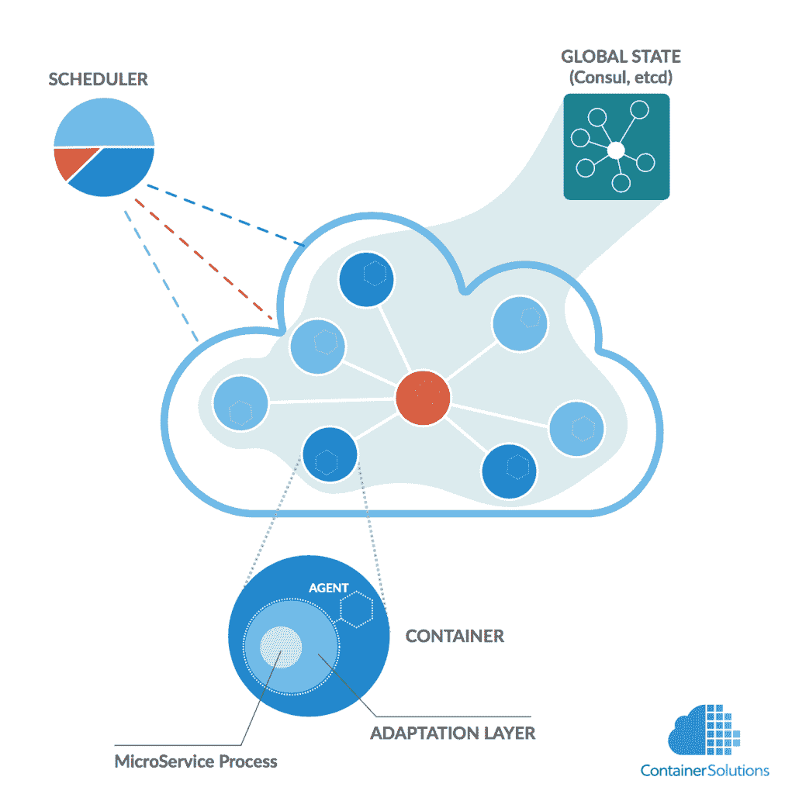
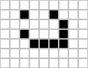
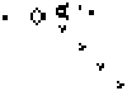
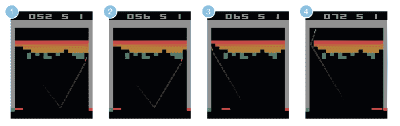

# 容器、微服务和人工智能将如何引领无操作员数据中心

> 原文：<https://thenewstack.io/how-containers-microservices-and-ai-will-lead-to-the-operatorless-data-center/>

 [杰米·多布森

杰米·多布森是 Container Solutions 的首席执行官，这是一家专门从事可编程基础设施的咨询和产品开发公司。](http://www.container-solutions.com) 

容器化解决方案和机器学习可能很快就会变得不那么相关了。集装箱化解决方案将开创一个不需要人工干预的运营时代。一旦人类退出运营，我们就可以自由地将机器学习技术应用于剩下的工作。如果我们在卡车司机、放射科医生和工厂工人被取代的同时成功取代了数据中心操作员，我们将需要一种新的方式来组织我们的经济。

在本帖中，我们将看看我们行业中正在出现的一些趋势。在后面的文章中，我们将更深入地探讨新兴的社会趋势及其与技术和数字化的关系。

## 现在发生了什么

[容器](/category/containers/)让我们可以轻松隔离、运输和运行软件。容器的杀手级应用之一是微服务架构模式。[微服务](/category/microservices/)做好一件事；每个服务都是"[弹性的、有弹性的、可组合的、最小的和完整的](https://en.wikipedia.org/wiki/Microservices)"

一旦我们开始使用容器来创建微服务系统，我们就需要一种方法来组织它们。输入 stage left、schedulers 和 orchestrators。

调度程序是关于选择一个运行作业的节点。调度包括将工作的需求与机器的能力相匹配。这导致硬件利用率增加，因为调度程序将在每个节点上运行多个作业，前提是该节点满足 CPU 和内存要求。

编排是关于一切如何一起工作的。因此，编排者是关于联网、扩展和应对失败的。例如，如果系统的流量超过某个阈值，orchestrator 应该会注意到这一点，增加额外的容量，然后重新配置负载平衡器。

社区中的许多人不同意调度器和指挥器应该做什么和不应该做什么。然而，人们普遍认为，我们接下来要做的事情是通过软件调度器和编排器的某种组合来实现自动化操作。这项工作现在正在顺利进行，例如，可以看到, [Mesosphere](https://d2iq.com/) 在 DC/OS(数据中心操作系统)方面取得的进展。

## 智能代理

指挥者之后可能出现的是智能代理。一个[智能代理](http://www.mind.ilstu.edu/curriculum/ants_nasa/intelligent_agents.php)内置了一些基本规则。这些规则规定了代理如何从错误中恢复，增加或减少容量，以及它在整个系统中应该扮演什么角色。比如代理在系统中是主还是从？这将取决于是否已经存在一个主节点。哪个代理最终成为从代理和主代理在构建时是不确定的。这是智能代理系统的一个特征。

Joyent 的集装箱驾驶员。第一批智能“增强”集装箱系统之一

以上为 [Joyent](https://www.joyent.com/) 的[容器先导](https://www.joyent.com/containerpilot)的示意图。使用 ContainerPilot，代理由微服务进程、容器和适配层组成。正是通过这一层，代理通过全局存储与系统中的其他代理进行通信。ContainerPilot 的承诺是使用它部署的应用程序将自我管理。

聪明的特工本身并不聪明。然而，当他们互动时，他们可以创造智能的假象。这里一个很好的例子就是[康威的《生活的游戏](http://www.conwaylife.com/)。游戏中的代理人被称为“细胞”，生活在二维平面上。细胞遵循简单的生存和死亡规则:

*   任何具有少于两个活邻居的活细胞死亡，就好像是由人口不足引起的。
*   任何有两个或三个活邻居的活细胞都可以存活到下一代。
*   任何有三个以上活邻居的活细胞都会死亡，好像是由于人口过剩。
*   任何一个死细胞，只要有三个活的邻居，就会变成活细胞，[就像通过繁殖一样](https://en.wikipedia.org/wiki/Conway%27s_Game_of_Life)。

在康威的游戏中，系统级智能来自细胞的个体行为。这种系统级智能创造了“有机体”，如“轻型飞船”和“滑翔机”，这两者似乎都在“旅行”。“滑翔机枪”是康威游戏的一种配置，可以创造无限数量的滑翔机。

康威的“轻型飞船”

康威的“滑翔机枪”无限创造了“滑翔机”

康威的一生是复杂适应系统(CAS)的一个例子。一个复杂的自适应系统是由遵循规则的自治主体组成的。代理相互作用，智能从系统中出现。例如，像伦敦这样的城市运行着大量的代理人(人)，他们中的许多人从未见过面，但他们仍然密谋确保面包被送到，垃圾被收集，火车准时运行。

复杂适应系统的其他例子有蚁群和交通系统。用智能容器构建的应用程序也是复杂的适应性系统。因此，就像康威无法预测他的游戏中出现的智能一样，我们也无法准确预测用智能代理构建的应用程序会产生什么样的系统级智能。

这真的会发生吗？智能代理听起来像科幻小说，但事实上我们都是高度分布式、容错代理网络的受益者。[传输控制协议](https://tools.ietf.org/html/rfc793) (TCP)，是互联网的关键协议，有拥塞控制、重传和错误检测的规则。所有这些规则组合在一起，以确保数据包从源到达目的地。我们不“运行”或“管理”数据包，很快我们也不会运行或管理我们的应用程序。他们会自己做的。

## 自动化操作的机器学习

我们可以从复杂的适应系统中学到很多。但是它们也是有限的。他们永远不会进化成超越自己规则的东西。康威的生活不会自发地变成三维的；蚂蚁不会开始解填字游戏；汽车不会飞。

[机器学习](/category/machine-learning/)不同。首先，没有规则。例如，[谷歌的 DeepMind](https://thenewstack.io/deep-learning-demystified/) 是一个神经网络，它被设计用来(除了别的以外)玩电脑游戏。DeepMind 不断学习获胜的规则。当被告知要为 Atari Breakout 优化分数时，DeepMind 开始自行设计策略，这让它的创造者感到非常惊讶。其中一个策略是在墙上开一条通道。然后系统将球弹到墙后，在那里可以用最少的努力(和风险)得到最多的分数。

因此，机器学习会给我们带来惊喜，就像孩子可以，而复杂的自适应系统不能一样。

谷歌的 DeepMind 打破了一个洞，将球放在里面，以获得最大的“伤害”，因此得分。

机器学习需要的三样东西是:

1.  强大的计算能力。
2.  大量数据。
3.  得体的问题。

一旦问题被提出，机器就会运行大量的模拟。一次模拟的输出可以输入到下一次模拟中。机器就是这样学习的。这项技术可用于自动化操作和优化成本等方面。要做到这一点，你需要两样东西。首先，您需要一种方法来自动遍历数百万种服务器配置。像 HashiCorp 的 Terraform 这样的工具已经可以让你轻松地配置服务器。其次，您需要能够迭代应用程序的不同配置。容器已经让您可以轻松地重新配置您的应用程序。一旦找到配置，就可以部署应用程序。如果应用程序是用智能代理构建的，它们将在没有任何人工帮助的情况下运行、从错误中恢复和扩展。

同样，从表面上看，这听起来像科幻小说。然而， [Skipjaq](http://www.skipjaq.com/) 是一款使用机器学习技术来优化应用的产品。他们的产品已经具有商业可行性。与此同时，谷歌的 deep mind[正在应用于数据中心](http://www.theverge.com/2016/7/21/12246258/google-deepmind-ai-data-center-cooling)的能源管理，并将能源成本降低了 15%。通过 Skipjaq，以及 Terraform 和 ContainerPilot 等工具，我们可以开始窥见未来。

## 结论

数据中心的下一波自动化将由容器、配置硬件的工具、机器学习的进步以及[摩尔定律](https://thenewstack.io/farewell-moores-law/)每年提供的原始 CPU 能力驱动。每一项创新和每一次重组都让我们离无操作员数据中心更近了一步。有了 ContainerPilot、DC/OS 和 DeepMind 的指引，我们不用费很大力气就能找到这方面的证据。

也就是说，随着我们越来越接近一个没有操作员的数据中心，我们将不得不接受这样一个事实:我们正在创造的东西将取代成千上万的工人。我们还必须面对这样一个事实，即我们正在促成一种更广泛的趋势，这种趋势将导致数百万工人失业。这就是为什么我们不能(也不应该)在不考虑更广泛的社会影响的情况下谈论我们的工作。

<svg xmlns:xlink="http://www.w3.org/1999/xlink" viewBox="0 0 68 31" version="1.1"><title>Group</title> <desc>Created with Sketch.</desc></svg>