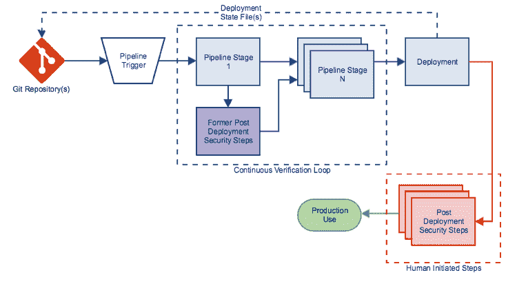
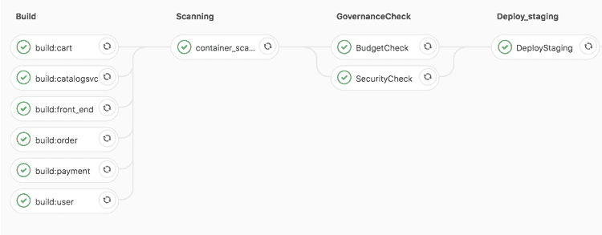
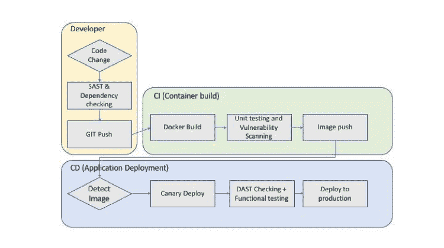

# “持续安全性”如何解决云计算保护难题

> 原文：<https://thenewstack.io/how-continuous-security-can-solve-the-cloud-protection-conundrum/>

[GitLab](https://about.gitlab.com/) 赞助本帖。

 [Shrivatsa Upadhye

Shrivatsa 是 VMware 的云倡导者，专注于云安全和云本机应用程序。Shri 之前在 AWS、Azure 和 GCP 担任过不同的角色，主要负责管理应用程序和 CI/CD 流程的软件解决方案的设计。他拥有亚利桑那大学的电子和计算机工程硕士学位。](https://www.linkedin.com/in/ishrivatsa/) 

过去几年，云安全漏洞一直占据着新闻头条。令人惊讶的是，几乎每一次违规都是由于错误配置或过于基本的简单云设置，通常是可避免的应用程序漏洞。

也就是说，DevOps 团队有自己的工作要做。管理各种云对象(EC2、S3、RDS 等)之间的大量策略、角色和互连。)而用户，不用说，是一个管理上的挑战。此外，这些配置涉及到企业内多个团队的交互，这可能会带来更大的复杂性。

由于当今运行在云中的应用程序的多语言特性，应用程序漏洞检测带来了挑战，这进一步加剧了问题的复杂性。由于更新速度很快，从而引入了漏洞，所以跨多种语言和不同代码库的检测更加困难。

因此，随着数十亿客户账户和数据记录已经暴露在互联网上，是时候退一步评估错误配置和漏洞，并重新思考我们的方法，以确保我们的云态势是安全的。

现在，这里有一个好消息:大多数错误配置和应用程序漏洞可以通过良好的卫生措施来预防，并通过适当的工具来检测。然而，风险识别和补救通常在服务或应用的部署前和部署后周期中完成。这是正常的，不幸的是，这个过程通常在部署阶段发现错误配置，一旦发现就太晚了。识别这些风险是困难的，但是在部署阶段的识别尤其必要。

借助适当的工具和最佳实践，DevOps 越来越多地发现持续安全的概念如何服务于云安全中一直缺乏的东西。

作为在 CI/CD 管道中构建安全检查的一种方式，持续安全也是[持续验证的一个子集。](https://thenewstack.io/continuous-verification-the-missing-link-to-fully-automate-your-pipeline/)

**持续的安全性**为 DevOps 和 SecOps 团队提供了一个精确的位置，使他们能够在没有开发人员参与的情况下将自己融入到开发和部署过程中。它提供了一个额外的检查，他们可以分析并采取行动，以改善整体应用程序和云安全。

为了更好地理解持续安全性的概念，让我们仔细看看一些风险和可能的解决方案。

## 资源错误配置风险

 [巴胡巴利(比尔)谢蒂

Bahubali (Bill)是 VMware 的 VMware 云服务公共云解决方案总监。他领导着一个云架构师团队，宣传和开发改善公共云运营的解决方案(AWS/Azure/GCP)。Bahubali 是开发和推出 VMware 云服务的最初团队的一员。在加入 VMware 之前，Bill 是 VCE 公司(现为戴尔公司)负责云管理产品的产品管理总监。在 2011 年至 2014 年期间，Bahubali 领导了 Cumulus Networks 的运营，领导了几家初创公司的 AWS 云运营，并领导了一个开源路由软件项目。他拥有卡内基梅隆大学的信息网络硕士学位和罗格斯大学的电气工程学士学位。](https://www.vmware.com/company.html) 

公共云的底层结构相当安全，而云提供商继续使用人工智能等新技术来防止违规，因此可以说比私有数据中心更安全。然而，不幸的是，最终用户的资源配置错误往往是违规和数据泄露的根源。

除了使用防火墙解决方案，配置其他资源如[安全组(AWS)](https://docs.aws.amazon.com/vpc/latest/userguide/VPC_SecurityGroups.html) 和路由表变得至关重要。对于 RDS、S3 或 SQL 等数据存储相关资源，必须控制这些资源的加密和公共访问。

与配置相关的违规会导致两种主要的安全威胁:数据违规和计算蔓延。数据泄露涉及关键数据的丢失。“[如何在 AWS](https://cloudjourney.io/articles/security/detect_and_prevent_data_breaches-bs/) 中检测和防止数据泄露”中描述了数据泄露的示例以及如何防止数据泄露计算蔓延(或计算劫持)涉及大量部署计算实例，以便在账户所有者不知情的情况下将其用于比特币挖掘或其他活动。

为了避免这些风险，在部署应用程序之前，我们首先验证基础架构的配置和现有状态是否存在任何安全漏洞，这一点非常重要。对可能导致数据泄露的特定错误配置的检查应该添加到部署状态中，例如作为阶段的 [GitLab](https://about.gitlab.com/) 管道。您可以通过在一个试运行环境中部署您的资源来验证这一点，然后使用云安全工具 API 来识别错误配置。

你可以使用的一些工具有[云托管](https://cloudcustodian.io/)(开源) [VMWare 安全状态](https://go.cloudhealthtech.com/vmware-secure-state)(商业)甚至 [AWS 配置](https://aws.amazon.com/config/)。

## 应用程序漏洞

对于许多使用软件包和库的项目，您需要知道您添加的包是否安全。组织希望验证您的应用程序中是否使用了任何可被利用的包。应用程序分析需要在各个级别完成，包括但不限于静态代码分析、动态代码分析、包依赖性分析以及容器和虚拟机的映像扫描。在我们的帖子"[中，我们描述了 Gitlab 如何帮助图像扫描，您的开发人员今天违反了什么？](https://cloudjourney.io/articles/security/ci-security-checks-bs/)

这些检查中的一些可以通过 [Gitlab](https://about.gitlab.com/) CI 开箱即用，而对于其他检查，您可能必须集成开源项目，例如 [Clair](https://github.com/coreos/clair/) 。

上述所有检查都应通过使用一个安全策略来执行，该策略寻找一组可接受的配置，当违反这些配置时，可以用来警告用户可能存在违规行为。设计一个有效的策略通常是一个迭代的过程，重点是为开发人员提供利用云基础设施的灵活性，同时也允许 SecOps 团队维护实施点。

通过将正确的错误配置和应用程序漏洞检查适当地添加到 CI/CD 管道中，您已经开始了实现**持续安全性的过程。**

## 持续安全:框架

最大限度地降低公共云的总体暴露程度并防止数据丢失和安全入侵是一个持续的过程。AWS、Azure 和 Google Cloud 的变化率决定了来自运营管道不同部分的持续反馈循环。如上所述，在 CI/CD 流程中添加对错误配置风险的检查也很重要。安全检查的这种“左移”以及检查应用程序漏洞的良好习惯，大大降低了违规和数据丢失的风险。这种结合提供了一个真正全面的框架— **持续安全** —作为一个坚实的基础。

实现持续的安全性也是一项多团队的工作。它需要由开发运维团队实施的来自安全运营团队的“策略”。希望**持续安全**和上面概述的概念将为行业提供基准，以促进降低安全漏洞和数据丢失的风险，同时重大漏洞和漏洞的新闻报道将变得非常罕见。

有关基础设施最佳实践的更多案例研究讨论，请参加 10 月 9 日的 [GitLab Commit London](https://about.gitlab.com/events/commit/) 。GitLab 的首次用户活动将通过战略和技术讨论、经验教训、开发生命周期的幕后观察等展示 DevOps 的强大功能。

VMware 是新体系的赞助商。

通过 Pixabay 的特征图像。

<svg xmlns:xlink="http://www.w3.org/1999/xlink" viewBox="0 0 68 31" version="1.1"><title>Group</title> <desc>Created with Sketch.</desc></svg>