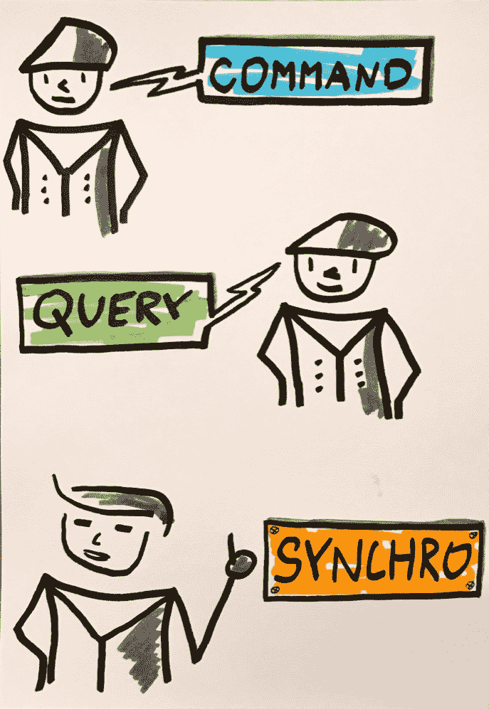
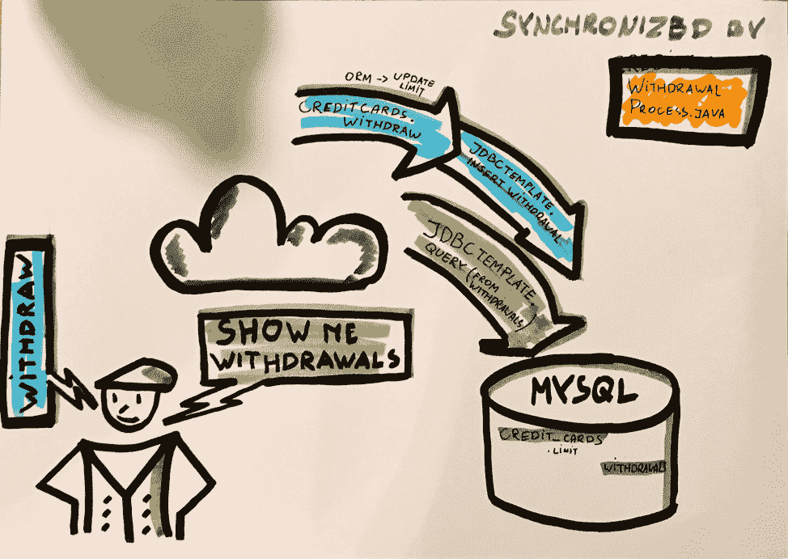
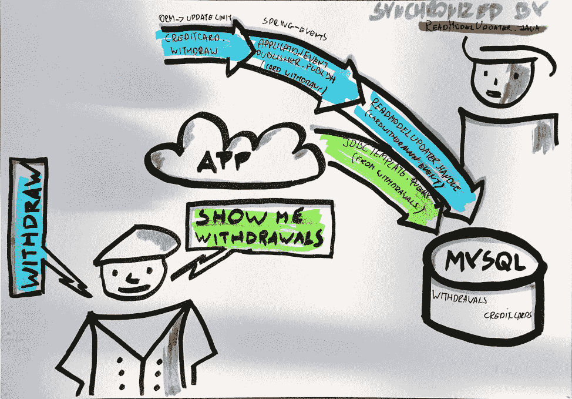
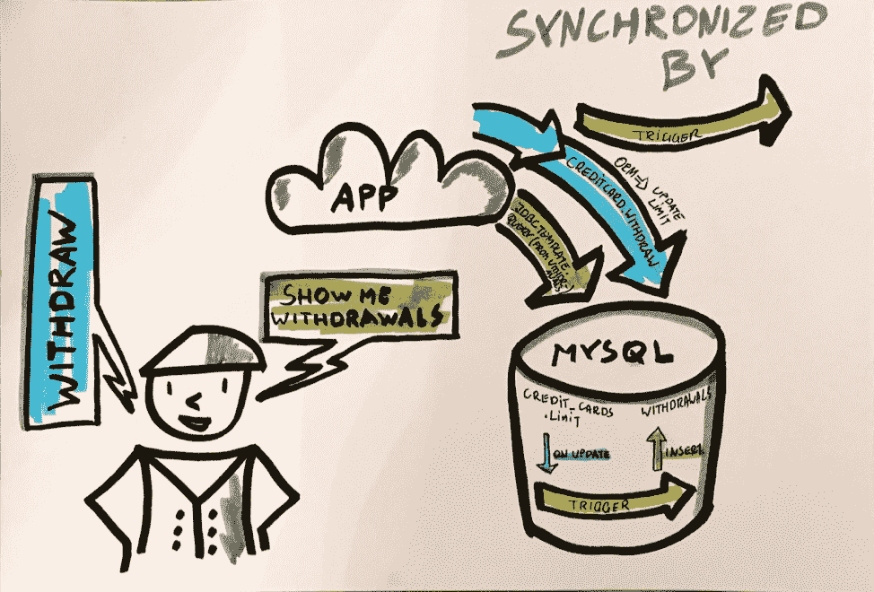
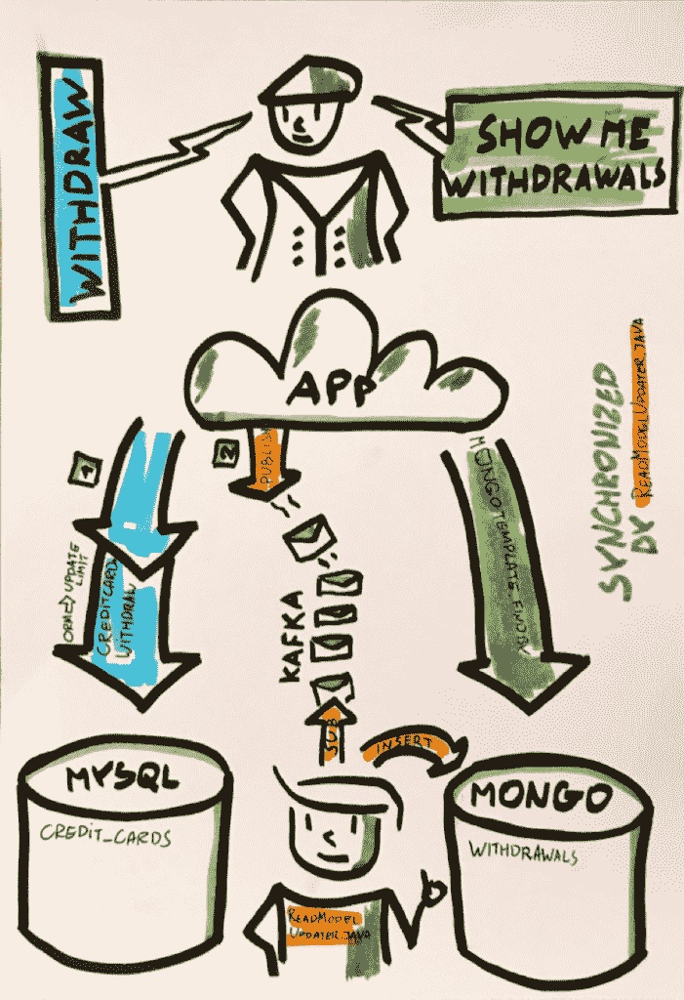

# 查询和命令之间的 Spring 和数据同步

> 原文：<https://thenewstack.io/how-cqrs-works-with-spring-tools/>

雅各布·皮里蒙

Jakub 是 Pivotal 的 Spring 开发者倡导者、博客作者、热情的程序员和培训师。他喜欢用领域驱动的设计、测试驱动的开发和 Spring 来处理复杂的架构。作为一个微服务狂，建筑是他的主要兴趣领域。当他不编程时，他骑摩托车、滑雪或练习风筝冲浪。他还写了 MVB 获奖博客:pillop . github . io

在本文中，我们描述了 [CQRS](https://martinfowler.com/bliki/CQRS.html) ，以及为什么它可能对您的微服务部署和管理有用。我们还以一种非常实用和全面的方式概述了使用 CQRS 和 [Spring](https://spring.io/) 工具的不同方式。在这个过程中，我们会考虑每个解决方案的利弊。注意，这些同步技术是不可知的。即使你不用 CQRS，你也会发现它们很有用。同样，您可以用不同的方式实现 CQRS。

什么是 CQRS？这种模式将您的系统分为两个不同的部分。CQRS 将用于编写(执行命令)的组件与用于查询的组件分开。因此，**命令服务**和**查询服务**是解耦的，可以分开操作。

让我们从 CQS 开始(我们稍后会添加 R)

在我们理解 CQRS 的旅程中，让我们从 CQS 开始——著名的[命令-查询分离](https://en.wikipedia.org/wiki/Command%E2%80%93query_separation)。(注意这种方法中缺少一个“R”——这是故意的。)

CQS(模式认为对象的方法应该分为:

*   **命令:**可以改变系统状态，不返回值。
*   **查询:**不能改变系统状态(无副作用)并返回值。

这种清晰的分离对开发人员很有用。原因如下:查询和命令是根本不同的操作。它们具有不同的可伸缩性特征，因此将它们分离是有用的。查询可以重复；它们是安全的和幂等的。(也就是说，第二次询问不会改变答案。)您可以处理不同顺序的查询，而不用担心一致性。相比之下，重复命令是不安全的。命令的顺序很重要。

我们可以通过构建一个牢记这些原则的示例应用程序来加深我们的理解。让我们按照 CQS 的提示构建一个信用卡对象。让我们给自己这些要求:

*   当绑定到他们信用卡的账户中有足够的钱时，用户可以提取给定的金额。我们称之为*撤回*
*   用户可以查看与他们的信用卡相关联的账户的所有提款列表。我们称之为*展示取款*

*取款*命令和*向我展示取款*查询是两个基本的用例。同样，查询取款应该返回所有过去的*取款*命令的细节。当它们都使用相同的数据存储时，实现这些命令和查询是简单的。

您可以使用单独的数据存储，前提是您有一种机制使*命令*和*查询*的来源一致。为了帮助说明这些概念，让我们在教程中的一些有趣的图画中使用颜色代码。



继续编码！

在一个班里

这里有一个简单的类(处理两个提到的用例):

```
<em><strong>public  class</strong>  CreditCard  {
  @OneToMany(cascade  =  CascadeType.<strong>ALL</strong>)
   <strong>private</strong>  List&lt;Withdrawal&gt;  <strong>withdrawals</strong>  =  <strong>new</strong>  ArrayList&lt;&gt;();
   @Id  @GeneratedValue  @Getter  
    <strong>private</strong>  UUID id;
    <strong>private</strong>  BigDecimal  <strong>initialLimit</strong>;
    <strong>private</strong>  BigDecimal  <strong>usedLimit</strong>  =  BigDecimal.<strong>ZERO</strong>;

   <strong>public void</strong>  withdraw(BigDecimal amount)  {
       <strong>if</strong>  (thereIsMoneyToWithdraw(amount))  {
           usedLimit  =  usedLimit.add(amount);
           <strong>withdrawals</strong>.add(<strong>new</strong>  Withdrawal(amount,  id));
       }  <strong>else</strong>  {
           <strong>throw new</strong>  NotEnoughMoneyException(id,  amount,  availableBalance());
       }
   }
   //.. private methods
   <strong>public</strong>  List&lt;Withdrawal&gt;  getWithdrawals()  {
       <strong>return</strong>  Collections.unmodifiableList(<strong>withdrawals</strong>);
   }
}</em>

```

注意，本文的主要目标是描述同步。出于这个原因，我们将保持简单，用大小数表示货币值。在现实世界中，您可能想花更多的时间对这个类所代表的概念进行建模。

请注意这里有命令和*【get 取款】* 查询。分离很明显。信用卡类负责在 收到 新命令后检查业务不变量。查询立即返回所有过去的提款。有一个模型来处理命令和查询。信用卡类就是上面提到的同步机制。

业务不变量和同步可以通过简单的单元测试来测试。你可以在这里找到[](https://github.com/ddd-by-examples/all-things-cqrs/blob/master/in-one-class/src/test/java/io/dddbyexamples/cqrs/model/CreditCardTest.java)。

使用 [*spring-mvc*](https://docs.spring.io/spring/docs/current/spring-framework-reference/web.html#mvc) ，我们可以为两个用例公开 RESTful API。HTTP GET 用于查询(取款列表), HTTP POST 用于*取款*命令。

```
<em>@RestController("/<strong>withdrawals</strong>")
<strong>class</strong>  WithdrawalsController  {
//fields, constructors
  @PostMapping
ResponseEntity withdraw(@RequestBody WithdrawalCommand withdrawalCommand)  {
   CreditCard creditCard  =  <strong>creditCardRepository</strong>.findById(withdrawalCommand.getCard())
       .orElseThrow(()  -&gt;  <strong>new  </strong>IllegalStateException("<strong>Cannot find card with id</strong> "  +      withdrawalCommand.getCard()));
   creditCard.withdraw(withdrawalCommand.getAmount());
   <strong>return</strong>  ResponseEntity.ok().build();
}

@GetMapping
ResponseEntity&lt;List&lt;Withdrawal&gt;&gt;  withdrawals(@PathParam("<strong>cardId</strong>")  String cardId)  {
   <strong>return</strong>  
ResponseEntity.ok().body(<strong>creditCardRepository</strong>.getOne(UUID.fromString(cardId)).getWithdrawals());
}
}

</em>

```

使用 [*spring-test*](https://spring.io/guides/gs/testing-web/) 的 REST API 的端到端测试可以在这里找到:

```
<em>@Test
<strong>public void</strong>  shouldSynchronizeQuerySideAfterSendingACommand()  {
   <strong>// given</strong>
   UUID cardUUid  =  thereIsCreditCardWithLimit(new BigDecimal(<strong>100</strong>));  <strong>//http POST</strong>
   <strong>// when</strong>
   clientWantsToWithdraw(<strong>TEN</strong>,  cardUUid);  <strong>//http GET</strong>
   <strong>// then</strong>
   thereIsOneWithdrawalOf(<strong>TEN</strong>,  cardUUid);

<strong>//private methods</strong>
}</em>
The entire application can be  <a  href="https://github.com/ddd-by-examples/all-things-cqrs/tree/master/in-one-class">found here</a>.

```

尽管查询和命令是分离的，但它们之间是耦合的。这是因为一个对象处理两种功能。这种方法有问题吗？对我们来说，这可能不是最好的答案，让我们仔细看看为什么。

*   如果我们使用对象关系映射器和延迟加载来提取，我们可能会遇到麻烦。我们可能会在不一致的状态下创建对象。想象一下加载初始状态(带有已用限制)，由并发线程创建一个新的撤销，并用新的撤销加载惰性集合。当然，这是有解决办法的。例如，您可以急切地加载，或者通过计算提款中的值来计算已用限额。
*   *撤销*命令将新的撤销添加到当前撤销列表中。接受或拒绝命令不需要此操作。但是，需要在将来执行准确的查询；
*   添加新的提款需要访问提款列表。懒装怎么办？对象关系映射器会从数据库中取出整个集合，只是简单地添加一个新的撤销吗？他们中的一些人会把这个操作当作简单的插入。但有些人不会。存在将大量多余的提取加载到应用程序内存中的风险；

大多数系统的读取远远多于写入。这意味着您的系统可能受益于不同的模型和不同的数据结构。换句话说，这些不同的非功能需求可能导致不同的设计决策。

记住这两个事实:

*   重复读取是安全的。命令不是。
*   读取可缓存。命令不是。

假设我们想要用不同的对象来处理那些用例。我们不说单独的存储。至少，现在还没有。

您可能还会面临现有代码和数据的情况，我们需要同步这些代码和数据以交付新的价值。我们将在下一节中使用的一些同步技术可能会有所帮助。

## 现在，让我们分开我们的用例

将我们的信用卡拆分成不同物品的一种方法是:

*   让我们从 originate 类中移除*取款*集合。
*   并引入了一个新的概念，表示客户取款的列表。 ***提款*** 似乎是个不错的选择。

***公共类*** *信用卡{*

```
<i  style="font-family: Georgia, 'Times New Roman', 'Bitstream Charter', Times, serif;">
  </i><i  style="font-family: Georgia, 'Times New Roman', 'Bitstream Charter', Times, serif;">@Id  @GeneratedValue  @Getter  </i><b  style="font-family: Georgia, 'Times New Roman', 'Bitstream Charter', Times, serif;"><i>private  </i></b><i  style="font-family: Georgia, 'Times New Roman', 'Bitstream Charter', Times, serif;">UUID  </i><b  style="font-family: Georgia, 'Times New Roman', 'Bitstream Charter', Times, serif;"><i>id</i></b><i  style="font-family: Georgia, 'Times New Roman', 'Bitstream Charter', Times, serif;">;</i>

```

***私有****BigDecimal****initial limit****；*

***私有****BigDecimal****used limit****= BigDecimal。* ***零****；*

***公共*** *信用卡(BigDecimal limit) {*

***本*** *。***= limit；**

 **}*

```
<i  style="font-family: Georgia, 'Times New Roman', 'Bitstream Charter', Times, serif;">  </i><b  style="font-family: Georgia, 'Times New Roman', 'Bitstream Charter', Times, serif;"><i>public void  </i></b><i  style="font-family: Georgia, 'Times New Roman', 'Bitstream Charter', Times, serif;">withdraw(BigDecimal amount)  {</i>

```

***if****(thereimoneytowithout(amount)){*

**=****used limit****。添加(金额)；**

 **}* ***其他*** *{*

***抛出新的****notenoughmoneexception(****id****，amount，available balance())；*

*}*

*}*

```
<i  style="font-family: Georgia, 'Times New Roman', 'Bitstream Charter', Times, serif;"> </i><i  style="font-family: Georgia, 'Times New Roman', 'Bitstream Charter', Times, serif;">//private methods</i>

```

*}*

***类*** *提款{*

***私有*** *列表<提款>* ***提款****；*

*}*

***类****WithdrawalDto {*

***私有****UUID****cardId****；*

***私有****BigDecimal****金额****；*

*T160)}*

从客户的角度来看，REST API 不会改变。然而，现在信用卡上没有取款单。信用卡不知道提款的事。ORM 和抽象的成功是有代价的。我们往往会忘记，在大多数情况下，RDBMS 为系统提供动力。在这种情况下，我们可以使用直接查询。没必要上信用卡课。让我们看看这有多简单:

*@ get mapping*

*response entity<List<WithdrawalDto>>取款(**)@ path param**(****【cardId】****)String cardId){【T185*

***返回****response entity . ok()。body(loadWithdrawalsFor(uuid . from string(cardId)))；*

*}*

***私有*** *列表<WithdrawalDto>loadWithdrawalsFor(**)@ path variable**UUID cardId){*

***返回******withdrawaalsrepository。*** *。queryForWithdrawals(cardId)；*

*T237)}*

在 WithdrawalsFinder 中，我们可以直接查询我们的数据库，或者只使用只读事务。但重要的是我们避免了肮脏的检查处罚。这是什么，为什么要回避？脏检查是一种内置于对象关系映射器中的机制，用于检测对象的变化。当然，查询不会改变状态，所以脏检查是没有用的。Spring 允许在使用只读事务时禁用它。

将查询结果映射到不可变的数据结构已经足够了

快速旁白:我们可能会让您考虑映射实体的部分数据用于读取目的，其余的用于写入。？可以将两个 JPA 实体映射到一个数据库表。(可以通过映射不同的列来实现。)但这有必要吗？可以修改实体。当两个实体映射到同一个表时，您可能会引入频繁的乐观锁定异常。同样，服务于查询的实体不需要改变。不可变投影是一种自然的解决方案。

但是现在端到端测试失败了。 *取款* 指令成功后，查询时返回零笔取款。为什么？因为我们删除了一些用于同步命令和查询的代码。 *取款单* 中的 *信用卡* 消失了。

在帖子的提醒中，让我们看看同步信用卡和取款状态的不同方法。首先:显式同步。

## 显式同步

同步可以从信用卡对象上移一层到应用层。毕竟，我们想让我们的信用卡更简单。同样，我们希望在查询时避免脏检查。这就是它的工作原理。

让我们在取款时更新信用卡的限额。让我们也在数据库中插入一笔新的取款。我们可以创建一个简单的应用服务来完成这项工作。其名称为 [*提款流程*](https://github.com/ddd-by-examples/all-things-cqrs/blob/master/explicit-with-dto/src/main/java/io/dddbyexamples/cqrs/application/WithdrawalProcess.java) 。它让我们的测试又变绿了。

*@服务*

***公共类****WithdrawalProcess {*

```
<i  style="font-family: Georgia, 'Times New Roman', 'Bitstream Charter', Times, serif;">  </i><b  style="font-family: Georgia, 'Times New Roman', 'Bitstream Charter', Times, serif;"><i>private final  </i></b><i  style="font-family: Georgia, 'Times New Roman', 'Bitstream Charter', Times, serif;">CreditCardRepository  </i><b  style="font-family: Georgia, 'Times New Roman', 'Bitstream Charter', Times, serif;"><i>creditCardRepository</i></b><i  style="font-family: Georgia, 'Times New Roman', 'Bitstream Charter', Times, serif;">;</i>

```

***私人期末**提款服务* ***提款****；*** 

```
<i  style="font-family: Georgia, 'Times New Roman', 'Bitstream Charter', Times, serif;">  WithdrawalProcess(CreditCardRepository creditCardRepository,  WithdrawalsService withdrawals)  {</i>

```

***此*** *。****credit card repository****= credit card repository；*

***本*** *。提款* *=提款；*

*}*

*@事务性*

***公共 void*** *撤回(UUID cardId，BigDecimal 金额){*

*CreditCard 信用卡=****credit card repository****。findById(cardId)*

*T134。orelsthrow(()->****new****IllegalStateException(****【找不到 id 为的卡】****+**cardId***

*【credit card . withdraw(金额)；*

*提款.添加(新提款(UUID.randomUUID()，cardId，金额)。；*

*T170)}*

*T174)}*



命令和查询是不耦合的。我们有一个确保状态一致的应用程序服务。和前面的例子一样，同步是即时的。变化是原子性的。我们的系统在单次交易中执行信用卡限额的修改和新提款的插入。

之前我们用 ORM 完成了**隐式**同步。现在我们已经在应用层完成了**显式**同步。如果单独的数据库只用于取款，那么立即同步是不可能的。我们无法击败 [*CAP 定理*](https://en.wikipedia.org/wiki/CAP_theorem) 并自动改变两个不同的数据库。但是这种方法交付了期望的业务结果。

整个应用程序可以在这里找到[(在查询端有投影)，在这里](https://github.com/ddd-by-examples/all-things-cqrs/tree/master/explicit-with-dto)(在查询端有实体)。

我们继续看一种隐式同步，它以 Spring 应用程序事件为特色。

## 与 Spring 应用程序事件的隐式同步

有些人可能不喜欢上面的应用程序服务中手工和显式的工作。是否有不同的方法来插入新的取款？有，有！为了反转控件，我们的信用卡类可以用事件发布来结束。这个事件可以在应用程序的不同部分处理。要发布和监听事件，可以使用 *spring 应用事件*。

下面介绍如何在[*WithdrawalProcess*](https://github.com/ddd-by-examples/all-things-cqrs/blob/master/with-application-events/src/main/java/io/dddbyexamples/cqrs/application/WithdrawalProcess.java)中发布事件。

*@事务性*

***公开作废*** *撤回(UUID cardId，BigDecimal 金额){*

*CreditCard 信用卡=****credit card repository****。findById(cardId)*

*。orelsthrow(()->****new****IllegalStateException(*****+**cardId**)；****

*card retracted 事件= credit card . retract(金额)；*

***applicationEventPublisher****。publishEvent(事件)；*

*}*

[在这里如何订阅它](https://github.com/ddd-by-examples/all-things-cqrs/blob/master/with-application-events/src/main/java/io/dddbyexamples/cqrs/sink/ReadModelUpdater.java) 并创建新的撤销。

*@ event listener*

***public void****addwithdrawalcardravent(cardravent 事件){*

**。add(新提现(UUID.randomUUID()、cardId、amount)；**

 **}*

正如您所看到的，与我们前面的例子的唯一区别是我们如何在组件之间划分相同的工作。应用程序服务用于插入撤销，现在它将其作为事件发布，ReadModelUpdater 插入撤销。概念流程还是一样的；我们更新信用卡和提款表。应用程序事件是用来反转控件的。记住所有的事情都在一个事务中运行。如果插入新的取款失败，信用卡中的更改将被回滚。

如果您想避免手动发布和对 ApplicationEventPublisher 的依赖，Spring 可以为您完成所有工作。如果你有兴趣，在这里阅读[](https://docs.spring.io/spring-data/jpa/docs/current/reference/html/#core.domain-events)。



之前的两个同步都是在应用程序级别上运行的。给了它明确的控制权。然而，也有一种隐式的方法可以做到这一点，它在数据库级别上运行——我们可以使用数据库触发器。

## 数据库触发器

这里有一张图，我们可以用它来形象化这种选择:



下面是如何使用内存版本的 H2 数据库来实现这一点:

***公共类****creditcardusetrigger****实现*** *触发器{*

*@覆盖*

***public void****fire(连接连接，对象[前]，对象[后)* ***抛出****SQLException {*

***试****(prepared statement stmt = connection . prepare statement(*

***【插入取款(ID，CARD_ID，金额)】****+****【值(？, ?, ?)"****){*

*stmt . setobject(**1**，uuid . randomuuid())；**//生成取款 id*

*stmt . setobject(**2**，cardId(after))；*

*stmt . setobject(**3**，getUsedLimitChange(before，after))；*

T45stmt . execute update()；

*}*

*}*

```
<i  style="font-family: Georgia, 'Times New Roman', 'Bitstream Charter', Times, serif;">  </i><b  style="font-family: Georgia, 'Times New Roman', 'Bitstream Charter', Times, serif;"><i>private  </i></b><i  style="font-family: Georgia, 'Times New Roman', 'Bitstream Charter', Times, serif;">Object cardId(Object[]  cardRow)  {</i>

```

***return****cardRow[**0**；*

*}*

***private****BigDecimal getUsedLimitChange(Object[]oldCardRow，Object[] newCardRow) {*

***return****((BigDecimal)newCardRow[**2**)。subtract((BigDecimal)oldCardRow[**2**)；*

*T120)}*

*T124)}*

同步是即时的。信用卡限额的改变和增加新的提款仍然是原子的 ***，因为触发器是交易*** 的一部分。

这种解决方案有一些缺点。如上所述，这是一个特定于数据库的解决方案。这意味着应用程序逻辑不保存在应用程序中。此外，该解决方案可能无法移植到不同的数据库。

我们提到应用服务和触发器将命令和查询分离。这并不完全正确。如果触发器失败会发生什么？一切都是一个交易。*撤销*操作会因为与执行命令无关的原因而失败。

将同步从信用卡类移动到更高的层，从域层移动到应用层(通过应用程序事件显式或隐式地)，然后移动到数据库层并没有解决所有问题。我们仍然有一定程度的耦合。有人可能会说，事件让我们脱钩。以下是我不同意的原因。

请注意，上一个解决方案中的应用程序事件只存在于内存中。任何在 前 *和* 事件发布后 *调用的代码都在一个数据库事务中处理。因此，同步是即时的。这有一个隐藏的重大缺点。看起来好像命令和查询是分离的。事实上，一个事务创建了一个强的隐式耦合。从审查代码来看，这并不明显。*

整个应用程序可以在这里找到[。](https://github.com/ddd-by-examples/all-things-cqrs/tree/master/with-trigger)

## 事务日志结尾

现在，进入下一步。那一个 会有点违反直觉。有时以这种方式进行同步可能会很有用。尤其是当我们无法控制产生初始状态的应用程序时。让我们回到例子。当负责*撤销*命令的线程完成时，我们需要同步。一种选择是使用数据库事务日志，并查找要更新的信用卡限额。事务日志或[事务日志](https://en.wikipedia.org/wiki/Transaction_log)是已执行操作的历史记录。以前，触发器是基于同一事务和线程中信用卡限额的变化而触发的。现在，我们的应用程序可以扫描事务日志，对以前的更新做出反应，并继续更新信用卡限额。在此设置中，我们将使用:

*   MySQL 来保存取款和信用卡；
*   [Apache Kafka](https://cloud.spring.io/spring-cloud-stream/) (针对从数据库事务日志(在本例中为 MySQL)读取的消息的发布/订阅)；
*   [Kafka 将](https://www.confluent.io/hub/)与 [Debezium](https://debezium.io) 连接，读取 MySQL 的事务日志，并将消息流至 Kafka 的主题；
*   [春云流](https://cloud.spring.io/spring-cloud-stream/)读卡夫卡题的留言。

[*ReadModelUpdater*](https://github.com/ddd-by-examples/all-things-cqrs/blob/master/with-log-tailing/src/main/java/io/dddbyexamples/cqrs/sink/ReadModelUpdater.java)现在负责创建新的取款。它订阅 Kafka 的主题，并寻找从事务日志中读取的消息:

*@服务*

*@Slf4j*

***类****ReadModelUpdater {*

```
<i  style="font-family: Georgia, 'Times New Roman', 'Bitstream Charter', Times, serif;"> </i><b  style="font-family: Georgia, 'Times New Roman', 'Bitstream Charter', Times, serif;"><i>private final  </i></b><i  style="font-family: Georgia, 'Times New Roman', 'Bitstream Charter', Times, serif;">WithdrawalRepository  </i><b  style="font-family: Georgia, 'Times New Roman', 'Bitstream Charter', Times, serif;"><i>withdrawalRepository</i></b><i  style="font-family: Georgia, 'Times New Roman', 'Bitstream Charter', Times, serif;">;</i>

```

*ReadModelUpdater(WithdrawalRepository WithdrawalRepository){*

***本*** *。****withdrawalRepository****= withdrawalRepository；*

*}*

*@ StreamListener**(沉。* ***输入*** *)*

***公共 void*** *句柄(信封消息){*

***如果****(message . I update()){*

*saveWithdrawalFrom(消息)；*

*T116)}*

*T120)}*

```
<i  style="font-family: Georgia, 'Times New Roman', 'Bitstream Charter', Times, serif;">
 </i><b  style="font-family: Georgia, 'Times New Roman', 'Bitstream Charter', Times, serif;"><i>private void  </i></b><i  style="font-family: Georgia, 'Times New Roman', 'Bitstream Charter', Times, serif;">saveWithdrawalFrom(Envelope message)  {</i>

```

*String cardId = message . get payload()。getBefore()。getId()；*

*BigDecimal 取款金额*

*= balanceAfter(消息)。减去(balance before(message))；*

***取款*** *。save(****new****)withdrawalmount，cardId)；*

*}*

***私有****BigDecimal balance after(信封消息){*

***返回****message . get payload()。getAfter()。get used _ limit()；*

*}*

***私有****BigDecimal balance before(信封消息){*

***return****message . get payload()。getBefore()。get used _ limit()；*

*T75)}*

*}*

此时，*ReadModelUpdater*可能会将新的取款保存在单独的存储中。未能插入新的取款不影响命令端。但是，现在这种变化不再是原子性的了..成功执行 *撤回* 命令后插入新的撤回命令需要一段时间。解决方案最终是一致的。

发布/订阅允许我们在不影响命令模型的情况下添加新的读取模型。但是引入消息传递有一个缺点。现在，我们必须考虑消息和副本的顺序。和触发器一样，事务日志是特定于给定数据库的解决方案。此外，由于新的依赖性(Kafka、Kafka Connect、事务日志)，测试变得更加困难。至少我们可以在数据库中测试消息传递是否会导致新的撤销:

*@测试*

***public void****shouldsynchronizequerysidafterlogtailing(){*

*//给出*

*String cardUUid = thereascreditcardwithlimit(****new****BigDecimal(**100**)；*

*//当*

*creditCardUpdateReadFromDbTransactionLog(****十*** *、cardUUid)；//消息来自输入通道*

*//然后是*

*thereIsOneWithdrawalOf(****十*** *、cardUUid)；//数据库被填充*

*}*

实际上，事务日志结尾和触发器有一个更大的问题。让我们试着给信用卡系统添加一个新特性:退款。实现很简单:只要有退款，我们就降低已用限额。

***公共类*** *信用卡{*

*//…字段*

***公有 void****charge(BigDecimal amount){*

*used limit = used limit . subtract(金额)；*

*}*

*}*

猜猜发生按存储容量使用计费时，我们的读取模型会发生什么？你猜对了:扳机会动。是的，事务日志中会出现一条消息。其结果是取款金额为负数。我们可以用一个 if 语句来解决这个问题，该语句只允许正的取款金额。但这是一个短期的解决方案——真正的问题在别的地方。它与软件开发中最常见的误解之一有关。我们的解决方案患有“商业意图健忘症”

这个解决方案**关注数据而不是行为**。可能有许多业务案例(提款、退款)会导致状态变化(即更改已用限额)。当我们依赖政府时，可能无法找到这种变化背后的真正商业原因。使用数据库触发器或事务日志跟踪窃取了这些知识。

整个[应用程序可以在这里找到。](https://github.com/ddd-by-examples/all-things-cqrs/tree/master/with-log-tailing)

## 领域事件介绍

所以现在我们需要一个看起来像交易日志的东西——但是要有商业意图。理想情况下，我们应该有类似于包含业务上下文的不可变变更的仅附加日志的东西。换句话说，我们需要一个领域事件流。我们的事务日志由数据库管理系统自动填充。但是我们的事件将从应用程序代码中发布。我们会格外小心地解决这种情况。只有当命令成功时，事件才会被**发布。** (想了解更多？[阅读本文](https://pillopl.github.io/reliable-domain-events/)。)

注意:域事件代表信用卡发生的所有变化。这样，我们可以在某种存储中托管域事件，以重新创建任何信用卡的状态。因此，一个命令只需发布一组事件即可完成。不需要保存信用卡状态，可靠的事件发布也没有问题。这种技术被称为事件源。Axon 框架[使得在 Spring Boot 中使用](https://axoniq.io)[事件源](https://martinfowler.com/eaaDev/EventSourcing.html)和 CQRS 更加容易。



在此设置中，我们使用:

*   MySQL 存储信用卡数据；
*   Apache Kafka 用于域事件的发布/订阅；
*   从卡夫卡的《话题》看出版与聆听的春云流:
*   MongoDB 作为取款的单独存储。为了连接到 MongoDB，我们使用来自 *Spring Data 的反应式驱动程序反应式 MongoDB*；请注意，MongoDB 的使用(尤其是使用反应式驱动程序)是可选的。关键是在这个例子中，我们可以自由地使用最适合我们的查询端的东西。我们可以明智地选择！

解决方案已分发。对于 [命令](https://github.com/ddd-by-examples/all-things-cqrs/tree/master/with-events/with-events-source) 和 [查询](https://github.com/ddd-by-examples/all-things-cqrs/tree/master/with-events/with-events-sink) ，我们有单独的 Spring Boot 应用和存储。如果我们的查询比命令多得多怎么办？查询端可以水平伸缩，独立于 MySQL。另外，我们在读取端选择不同的数据库也有好处。我们可以选择一个更高性能的查询模型。

此解决方案在 3 个方面不同于事务日志跟踪:

1.  取款有单独的存放处。事务日志包含状态变化，而领域事件关注业务行为；
2.  交易日志由数据库管理系统填充。域事件必须由应用程序的代码发布。

我们需要记住如何在改变内部状态后原子地推动一个事件。其中一个想法是将事件存储在同一个数据库中，然后由预定的发布者发送。如果你想知道如何实现它，在这里查看[](https://github.com/ddd-by-examples/all-things-cqrs/blob/master/with-events/with-events-source/src/main/java/io/dddbyexamples/cqrs/persistence/KafkaDomainEventPublisher.java)。

[*ReadModelUpdater*](https://github.com/ddd-by-examples/all-things-cqrs/blob/master/with-events/with-events-sink/src/main/java/io/dddbyexamples/cqrs/sink/ReadModelUpdater.java)现在负责创建一个新的撤销。它订阅 Kafka 的主题并寻找领域事件:

*@服务*

***类****ReadModelUpdater {*

***私有最终****WithdrawalsRepository****WithdrawalsRepository****；*

*ReadModelUpdater(WithdrawalsRepository WithdrawalsRepository){*

***本*** *。****withdrawals repository****= withdrawals repository；*

*T101)}*

*@ StreamListener**(target = Sink。* ***输入*** *，条件=* ***【表头['类型'] =【撤回卡】*** *)*

***public void****handle(cardravent cardravent){*

***撤回库***

**。save(****new****)WithdrawalDto(uuid . randomuuid()。toString()、card extracted . getcardno()。toString()、card extracted . getamount()))。subscribe()；**

 **}*

*}*

*T73)}*

这里可以找到两个代表事件完成同步的应用:[查询](https://github.com/ddd-by-examples/all-things-cqrs/tree/master/with-events/with-events-sink)和[命令](https://github.com/ddd-by-examples/all-things-cqrs/tree/master/with-events/with-events-source)。

## 摘要

我们讨论的所有方法都各有利弊。重要的是选择一个适合您的用例的选项。我给你的建议是选择一个选项，然后考虑这些因素:

**实施:** 实施提议的解决方案有多容易？

**可测试性:** 测试解决方案的难易程度如何？

**复杂性:** 构建解决方案需要多少技术？

**一致性:** 命令成功后查询端是否立即一致？还是说还是最终一致？

**可移植性:** 将解决方案移植到不同的供应商是否容易？例如，一些解决方案可能依赖于特定的数据库。这造成了供应商锁定。

**可伸缩性:** 独立于另一边，水平缩放一边容易吗？

**分发:** 溶液分发了吗？用例由不同的过程处理吗？

**扩展性:** 添加新型号容易吗？

<svg xmlns:xlink="http://www.w3.org/1999/xlink" viewBox="0 0 68 31" version="1.1"><title>Group</title> <desc>Created with Sketch.</desc></svg>****