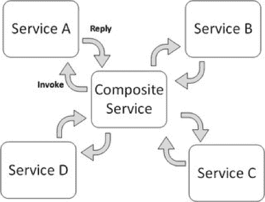
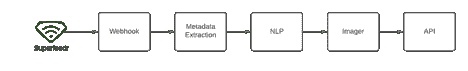

# 多日常啊。Dev 为在线文章建立了一个低预算的无服务器抓取管道

> 原文：<https://thenewstack.io/how-daily-dev-built-a-low-budget-serverless-scraping-pipeline-for-online-articles/>

 [伊多沙蒙

伊多沙蒙是 daily.dev.](https://daily.dev/) 的联合创始人兼 CTO

在 [daily.dev](https://daily.dev/) ，我们每月从 500 个博客和杂志中抓取 50，000 篇文章，而我们每月的成本仅为 50 美元。在本文中，我想分享使我们的文章管道成本友好、灵活且无运营成本的决策。

让我们从解释在文章发布到我们的 feed 之前我们必须做的不同步骤开始。第一步是检查新文章的提要(主要是 RSS)。一旦检测到一篇新文章，我们需要抓取文章的元数据，比如封面图片、标题、作者、出版日期等等。下一步是应用 NLP 算法从文章内容中提取关键词。接下来是处理文章的封面图像，并将其放在 Cloudinary 上。最后，将新文章添加到数据库中。

这个管道的行为模式是处理中间有长空闲时间的消息峰值。这是因为我们每隔几分钟检查一次博客订阅源。另一个重要因素是我们没有针对处理时间进行优化。只要花几秒钟甚至一两分钟来处理每一件符合产品规格的商品。请注意，较长的处理时间可能会导致更高的成本。

有了它应该如何表现的规范和上下文，我们可以继续为它寻找合适的基础设施。

## 云功能的拯救

我是[谷歌云平台](https://cloud.google.com/)的忠实粉丝，所以我开始寻找 GCP 提供的可用托管解决方案。

为什么管理？因为我们是一个小团队，无力管理基础架构，尽管这意味着我们将被供应商锁定。考虑到所有可用的产品，我发现[云功能](https://cloud.google.com/functions)(类似于[亚马逊网络服务](https://aws.amazon.com/?utm_content=inline-mention)’[Lambda](https://aws.amazon.com/lambda/)服务)是我们架构的最佳解决方案。它可以缩小到零，这对成本很重要，另一方面，云功能支持大规模扩展，远远超出我们的要求。

我们管道中的每一步都可以作为一个独立的函数来部署，这使我们能够灵活地选择正确的编程语言和运行时环境。比如我比较熟悉 [Cloudinary](https://cloudinary.com/) 的 JavaScript SDK，所以图像处理功能用 JavaScript 是有意义的。Python 是 NLP 的绝佳选择，这也是我们管道中的一步。

另一个重要的成本因素是，我们可以设置每个功能的硬件要求。它支持 HTTP 和发布/订阅触发器。它有一个非常慷慨的免费试用者。但它确实有一些我们必须考虑的组成部分，云功能是谷歌云的专有解决方案。本地开发的工具非常简单，你必须自己动手，测试也是如此。与基于 Docker 的解决方案相比，云功能的运行时支持有限。

鉴于我们的步骤的简单性质和它们彼此如此独立的事实，我认为云功能的优点大于缺点。具体到订阅 RSS 提要，我们使用 [Superfeedr](https://superfeedr.com/) 。这是一个托管服务，当提要发生变化时会触发一个 webhook。在我看来，这相当昂贵，10 个 feeds 每月花费 1 美元，这肯定是一个更好的产品，但它确实发挥了作用。

为了让它快速运行，它是正确的解决方案，因为它减少了所需的开发量和正在进行的操作。几年后，我们现在考虑构建自己的订阅 RSS 提要的解决方案，但那是另一个时代的事情了。

## 编排与编排

当处理像我们用例中的分布式工作流时，总是有服务编排或服务编排的问题。第一个意味着将有一个专门的服务来监督从 A 到 z 的整个过程。监督程序应该以正确的顺序调用每个服务，同时提供正确的参数。它还必须处理错误和意外事件。

服务编排意味着每个服务要么同步(例如 HTTP)要么异步(各种消息队列)调用流程中的下一个服务。当遵循编排模式时，一些工作流逻辑必须作为服务的一部分实现，并且服务应该知道下一个在线服务。

我们的工作流程非常简单，没有任何条件，也没有复杂的执行图。每个服务都丰富了其前任的数据。我不想管理每个帖子的执行状态，也不想引入单点故障，所以我决定遵循编排模式。

这些服务使用 [Google Pub/Sub](https://cloud.google.com/pubsub/docs/overview) 进行异步通信。我想强调的是，随着最新发布的 [Google Workflows](https://cloud.google.com/workflows) ，一个服务编排的管理主管，我可能会重新考虑我的决定。借助工作流，我可以获得服务编排的所有优势，而无需开发或维护编排器本身。

上面你可以看到现有的管道架构。每个盒子都是一个云函数，除了 API，它是我们的服务器，订阅 post 处理事件。在这种情况下，API 将向数据库添加一个新的实体，并使其对所有用户可用。Superfeedr 通过 HTTP 请求触发 webhook，其余的通过 Google Pub/Sub 进行消息通信。

## 监控和错误处理

我们不能在不考虑监控和错误处理的情况下引入新的架构。我不会说得太详细，只说一些重要的要点。

首先，我们需要监控我们的消息队列。我的闹钟设置为队列中有一条未打包的消息，持续五分钟。通常，文章管道的延迟非常低，所以消息不会在队列中停留很长时间，所以如果它发生了，我们需要知道，我们需要尽快知道。

第二个方面是运行时可能发生的应用程序错误。我使用[谷歌错误报告](https://cloud.google.com/error-reporting)，它会实时通知我服务中任何新的意外错误。当然，错误报告有很多替代方法，但我发现它更容易，因为它与其他云服务完美集成。

最后，我们需要考虑出错时的重试策略。幸运的是，消息队列有一些现成的策略，包括死信队列，因此我们可以在以后检查系统无法处理的消息。

## 成本分析

这种架构的成本分析非常简单。云函数每月有 200 万次免费调用。Google 发布/订阅免费层限制为每月 10GB。这意味着每月 50，000 篇文章的所有内容都属于 GCP 的免费等级，这太不可思议了！

对于这种实施和规模，我们为包括云功能、发布/订阅、监控和错误报告在内的基础架构支付 0 美元。Superfeedr 是这种架构的唯一成本。每月 10 次订阅 1 美元。我们总共支付 50 美元。Cloudinary 被排除在外，因为我认为它是我们 API 架构的一部分。无论如何，Cloudinary 的真正成本是带宽，而不是与本案例无关的存储。

## 结论

在这篇文章中，我们介绍了一个新的无服务器管道抓取文章。我们已经讨论了云功能的优缺点，以及为什么它是一个经济高效的解决方案。然后我们比较了不同的技术来编排我们的工作流，接着是监控的必要方面。最后，我们做了一点成本分析，以了解它的成本。

<svg xmlns:xlink="http://www.w3.org/1999/xlink" viewBox="0 0 68 31" version="1.1"><title>Group</title> <desc>Created with Sketch.</desc></svg>