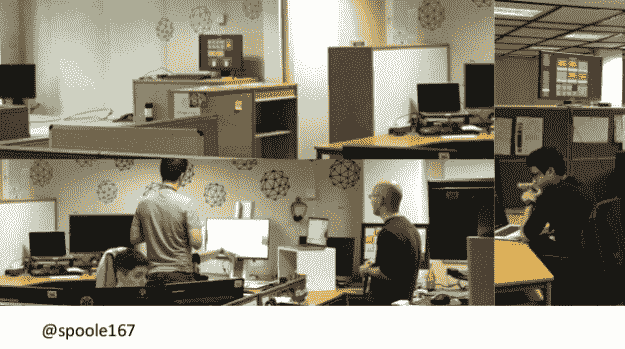

# 仪表板如何改变开发人员的行为

> 原文：<https://thenewstack.io/how-dashboards-are-changing-human-behavior-in-devops/>

[CloudBees](https://www.cloudbees.com/) 赞助了这个故事，作为正在进行的“云原生 DevOps”系列的一部分

什么是仪表板？需要它的每个人都容易看到的东西，它显示了事物是如何运行或进展的。当正确使用时，无论是在汽车、飞机还是 DevOps 团队中，仪表板都是一目了然的简单易读的工具，也是一种非常有效的方式来知道你正朝着正确的方向前进。

2014 年，IBM 的[史蒂夫·普尔](https://www.linkedin.com/in/steve-poole-47780310/)接手领导一个 100 多人、有点分散的欧洲“慢 IT”团队，该团队正在向更快的云发展。他们从两年的发货周期转向支持每天发货的 SaaS 产品。他在[敏捷之旅伦敦会议](http://2018.agiletourlondon.co.uk)和新堆栈的后续采访中分享了仪表板如何帮助缩小孤岛团队之间的沟通差距。

## 仪表板充当跨 IT 翻译

Poole 的第一个挑战是带领运营团队运行“具有传统期限和时间的传统运营”,并将其转换为新的 24/7 发布周期。他们需要理解正在发生的事情的价值。

> “我们必须让人们从旧的思维方式转向新的思维方式。仪表板成为实现这一目标的主要工具。”—史蒂夫·普尔

“我了解到它和 dev 不沟通。他们只是用自己的语言互相喊叫，”普尔说，因为他们没有共同的经历或观点。

“it 团队倾向于将他们自己聚集在专家周围，所以你会看到许多负责部分 IT 的小筒仓。我接手的团队有很多小团队。”

Poole 随后指出，即使是科技会议，通常也是围绕某些语言、方法或角色进行的。

他认为开发人员和运营部门之间需要一份新的“开发运维合同”，其中包括平台即服务和基础设施即服务、容器和测试等自助服务资产，并且必须涵盖新的可用性要求，强调上市速度和反馈循环。

这种共同的目标感通过仪表盘来体现和解释。

Poole 将数字化转型仪表板比作类似于汽车仪表板:非常直观:

*   刚刚够地位
*   足够的洞察力
*   只是足够的警告
*   清晰的紧急指示器。

你应该一眼就能看出哪里不对劲。

他所在的 IBM 领域到处都是在仪表盘上广播信息的屏幕，利用 Raspberry Pis 创建了一个监视器网络。

不到一年，每个人——每个开发团队、支持团队、经理和高管——都有了一个仪表板，每天广播 400 多万个事件。

“你不再看系统中的电子邮件和报告，而是开始看仪表盘，”普尔说。

他继续说，清晰的绿色和红色通知完全改变了反应速度。

“在此之前，开发团队会做他们正在计划的工作，然后管理团队会进来说‘我们有一个 bug，谁来修复它？’现在，它是整个团队的寻呼机外观”，每个待命的人都有相同的视图。

他们使用 Shopify 开发的框架 [Dashing](http://dashing.io) 来创建简单的仪表盘小工具。

这个合并后的更大的团队包括面向客户、面向开发者和面向公众的实体。这导致了大约五组不同的仪表板，分别用于:

*   每个开发团队
*   每个支持团队
*   管理层和高管
*   操作
*   不寻常和古怪的仪表板

所有的仪表板都有一个共同点——确保正确的人第一个知道是否出了问题。

## 中层管理人员和高管仪表板

很难衡量开发运维转型的直接成功，因为有时该过程会导致速度变慢、预算损失，或者两者兼而有之。给中层管理人员和高管一些可以衡量的东西，有助于让他们致力于经常是破坏性的变革。

中层管理人员需要 Poole 所说的“反应堆仪表盘”，帮助他们标记实际需要处理的事情。

“我们有一种合理的文化，能够很好地洞察开发过程、bug 和敏捷过程。”

普尔说，对于中层和高层管理人员来说，仪表板需要帮助他们思考可以采取的行动。IBM 的中层管理仪表板可以包括对积压工作中的 bug 数量设置一个标杆，或者测量进来的比率。

中层管理人员的仪表盘是用来查看哪些地方需要干预的，而高管们则迫切需要更准确的数据来指导利用哪些杠杆来改变组织的方向。

例如，开发团队被告知要做的事情之一是更好地利用云容量，从内部迁移。普尔说，要做到这一点，你必须了解你目前的内部状态。有了仪表盘，大型团队就从数字变成了进度报告，这是一条当云增长而本地下降时上升的线，带有对未来的预测。当然，将云与本地进行比较就像将苹果与菠萝进行比较一样。为此，他们必须根据工作负载类型对服务器进行分类，并根据云特征(如 CPU、内存和裸机多租户)对本地工作负载进行分类。

有了这一点，管理人员就能够通过展示现有容量的使用情况来更有效地证明预算增长的合理性，并且能够更好地预测迁移到云的总体成本。

管理层仪表板的所有东西都必须手工制作，但是由于是 DevOps，信息检索是自动化的。

普尔说，“当你有了一个共同的愿景时，你会丢掉所有头衔，‘让我们坐下来，看看你想做什么，你想从中获得什么。’你可以在挑战的现实中教育高管，他可以回来说‘我接受’或‘我不接受’。仪表板的创建[使它]成为一种双向活动。"

与所有仪表板和大数据一样，DevOps 自动化面临的一大挑战是清理不准确、不现实和陈旧的数据。

该团队花了大约一个月的时间来了解从数千台机器中产生的数据，了解目的、用例以及所述数据的大小。只有这样，数据才能被清理，从而使仪表板变得有用。

从内部迁移到云的仪表板的一个好处是，IT 支持人员也更好地了解了他们的客户使用机器的目的。

## 支持、开发人员和运营仪表板

> “我的 IT 团队是被动的，我真的很讨厌这一点，我希望我的团队去找客户，第一个说:‘你有问题。’”—史蒂夫·普尔

如果你真的想让开发人员、运营人员和支持人员团结一致，你需要提供非常透明的反馈，让他们明显地看到他们正在朝着发布更好的代码的方向前进。

在一个仪表板上，Poole 的团队绘制出了他们发布了多少行代码，以及这些代码的复杂程度。如果有某种数量和复杂性的组合，就应该暂停发货。

Poole 说，“他们试图找出如何让他们的交付在任何时候都是合理的——它不是超级大或超级小或复杂或简单。来显示你的贡献的质量。这一切都是关于洞察力和你寻找模式，用图表更容易，更可行。”

他们在所有的 IT 仪表板上都遵循这种思维模式，比如改进票务仪表板，测量诸如“关闭 80%的票据需要多长时间？”他们还使用仪表板来突出每个团队使用的不同流程。

他们不只是在团队内部分享这些信息。他们与他们的最终用户共享团队的初始响应时间和解决问题的时间数据，无论是由 ops 服务的开发人员还是有时甚至是外部人员。他们甚至为 SaaS 的主要客户设计了不同的仪表盘。

“要实现这一点，您必须与您的最终用户进行对话，了解停机意味着什么。红色是什么意思？这取决于你在看什么样的服务，它可能会有所不同。”Poole 继续说，“我们教给 IT 团队的是理解服务可用的真正含义，所以当它不可用时，它就意味着不可用。”

## 仪表盘不会改变人，但能反映真实的变化

对于 Poole 来说，克服的最大挑战是“你必须让仪表板的两边——那些使用数据的和那些消费数据的——达成一致。”

他形容这是一场持续的谈判，双方都必须了解对方的运作方式。

“你在洗你的脏衣服:‘你这样做吗？“你为什么这样做？”有时这是一个公平的问题，有时只是不理解，”他解释说。

但是，一旦这个仪表板基础架构启动并运行，其价值就显而易见了。

他澄清说，这些仪表板都没有与业务目标或预算相关联，而是与服务可用性、开发人员生产力和开发状态相关联。

“我们真的不需要把它归结为美元，这都是关于进步和地位，”普尔说。

仪表盘真的能改变文化吗？当然不是，但它们是一面很好的镜子，可以用来观察文化是否接受了透明、自主和自动化。

“重要的是，它改变了人们的行为方式。你从一个团队到肢体语言非常封闭的地方，他们不想说话，也不想分享，因为他们害怕被指责，”普尔说。

他说，一旦他们明白顾客喜欢他们所做的事情，他们的行为就会改变。“我们从非常消极的团队到理解他们的价值，”普尔说。

史蒂夫·普尔的演讲截图。照片由伦敦敏捷之旅提供。

<svg xmlns:xlink="http://www.w3.org/1999/xlink" viewBox="0 0 68 31" version="1.1"><title>Group</title> <desc>Created with Sketch.</desc></svg>