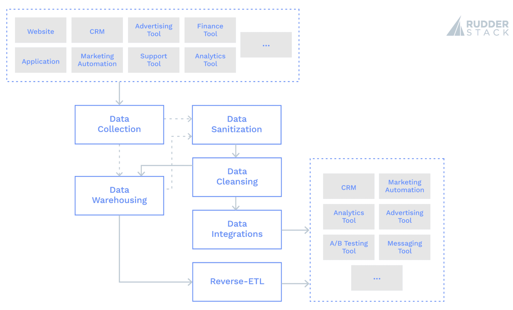

# 数据工程师如何利用自动化为您的业务提供数据支持基础

> 原文：<https://thenewstack.io/how-data-engineers-use-automation-to-give-your-business-a-data-backed-foundation/>

 [加文·约翰逊

加文是舵栈公司的产品营销人员。他是 New Relic 和 AT & T 的前 PMM，德勤的前顾问，前系统管理员和(有时)前开发人员。](https://www.linkedin.com/in/gavin-johnson/) 

您公司执行的每一项任务，如果涉及到数据团队中的某个人发送一个充满数据的电子表格，都是一个改进的机会。让多人处理您的数据不仅会增加使用不正确数据的可能性，还会降低数据的安全性。此外，每个人都应用自己的转换层，使得数据不太一致。

数据工程可以为你解决这些问题。

您的数据工程师构建了收集、共享和存储数据的管道。它们有助于实现贵公司执行的数据驱动型流程的自动化，应用程序执行，并尽可能消除等式中的人为延迟和人为错误。数据工程师从您的数据管道中删除电子邮件、电子表格和手动处理。这解放了整个公司的团队，让他们能够进行创新，给他们一个稳定的、有数据支持的执行和实验基础。

## 数据工程有助于自动化

数据工程师的主要职责是以易于访问的方式向您的所有团队提供准确、高质量和完整的数据。在本帖中，我们将介绍自动化任务在六个关键领域的优势:

*   数据收集
*   数据净化
*   数据清理
*   数据库
*   系统集成
*   反向 ETL——将数据移出仓库并移入应用程序

下面的框图显示了数据工程的六个关键领域之间的相互关系:

### 数据收集

数据收集成功的标志是数据的准确性和一致性。假设您的数据不一致、不正确，或者您的数据集中缺少预期的数据。在这些情况下，数据科学家和分析师很难处理它。其他应用程序可能很难激活它，并且它对于 AI/ML 用例变得不太有用。

数据收集过程越标准化和自动化，数据就越一致和准确。自动化确保事件数据被一致地交付，并且 ETL 管道是成功的并且按照可靠的时间表运行。任何数据工程师的梦想场景都是建立一个数据管道，验证它，并且再也不用去碰它，因为它是标准化的、自动化的、容错的。

### 数据净化

数据清理是从数据中删除私人或敏感信息的过程。您可以在收集过程中、交付前或交付后清理数据。在这两种情况下，成功数据清理的指标是准确性和一致性，例如，它是否应用于正确的字段，以及它是否应用于所有记录？

数据清理过程越标准化和自动化，您的数据隐私就越好，暴露敏感数据的可能性就越低。自动化确保您不会存储敏感数据，除非必要，并且在必要时，只有适当的人可以访问它。

### 数据清理

与数据清理一样，数据清理是数据工程中最耗时的过程。数据净化和清理需要检查每条记录并进行有条件的更新；这需要大量的计算时间，不管是由人还是由计算机来执行。

数据清理是指删除或纠正坏数据或不必要的数据。为了使您的数据更容易处理和更准确，您将经常删除或更新不准确的数据或不完整的或与数据集不一致的数据。数据清理过程需要准确和一致—在您的数据中均匀应用，只接触坏数据。

数据清理过程越标准化和自动化，数据的质量就越高，越有用。自动化确保您只存储好的数据。

### 数据库

数据仓库是将数据存储在数据仓库中，以供分析和 BI/ML 用例访问。您的数据仓库通常是您最常用的数据目的地。一致性和准确性的需求适用于数据仓库过程。

数据仓库过程越标准化和自动化，数据集就越完整和有用。自动化确保您的数据以符合逻辑的格式和模式，按照您期望的时间表一致地交付和存储。

### 数据集成

数据集成是连接系统之间的数据。从技术角度来看，数据集成的工作方式类似于数据仓库:将数据从源连接到目的地，就像处理数据仓库一样。但数据集成通常较少用于存储，而更多用于激活，这要求它们提供比数据仓库更接近实时的数据。此外，您可能希望集成大量不同的工具，但是通常只有一个数据仓库可以集成。因此，对于数据集成来说，标准化和自动化的难度和重要性都更大。跨系统的一致、准确的数据使团队更加团结，并使他们能够根据最新的数据采取行动。

数据集成过程越标准化和自动化，数据工程师维护管道的工作量就越少，新工具的试验速度就越快，团队的灵活性和创造性就越强。自动化确保您的所有工具和团队都使用相同的高质量数据。

### 反向 ETL

反向 ETL 是数据工程师的新生事物，但它只是依赖于数据仓库的数据集成的扩展。反向 ETL 是将存储在数据仓库中的数据发送到您使用的工具中。数据仓库传统上是目的地专用的，因此翻转数据流并将其转换为数据集成的来源是一种新颖的方式，可以帮助解决许多困难的用例。像数据工程师所做的其他过程一样，一致性和准确性对于反向 ETL 来说极其重要。

标准化和自动化反向 ETL 过程与数据集成具有相同的好处。然而，来自反向 ETL 过程的数据比正常的事件流或 ELT/ETL 数据对您的业务更有价值。通过反向 ETL 发送的数据通常是分析后或建模后的数据，包含您想要激活的洞察力。因此，反向 ETL 过程中的任何错误都会放大负面影响。

## 您的数据工程师也应该标准化他们使用的工具

数据工程师长期以来一直使用各种工具来帮助完成这些任务。他们有 ETL 工具、ELT 工具、事件流工具，现在还有反向 ETL 工具。这些工具使数据工程师的职责成为可能，也使标准化和自动化这些任务变得容易。正如您的数据工程师希望标准化和自动化他们执行的任务一样，您的数据团队也应该标准化他们使用的工具。

允许您的数据团队使用他们想要的任何工具可能看起来很自由，但这并不高效。许可将比必要的更复杂和昂贵，您的数据将处于不一致的模式中，并且您可能最终要为每个工具重新构建完整的功能(例如数据清理和数据清理)。

将您的数据团队整合到针对每种类型数据流的最佳工具上是非常有意义的。一个用于事件流的工具，一个用于 ELT/ETL 的工具，一个用于反向 ELT 的工具。这种方法更加标准化，但仍然不是最佳的。您将支付三笔许可费，不同工具之间的数据模式仍然不同，并且您可能仍然需要为每个工具重新构建完整的功能——但至少您只能使用三种工具。

最好的方法是将您的团队统一在一个完整的解决方案上。您只需支付一笔许可费，您的数据模式在不同的商店中是相似的，并且您可以更好地重用您构建的功能。而且，你的数据团队只需要学习一个管道工具；如果他们的任何数据管道出现问题，他们知道该去哪里。

RudderStack 是为您的数据工程师构建您公司所需的所有客户数据管道的单一完整解决方案——事件流、ELT/ETL 和反向 ETL。它允许您轻松构建连接整个客户数据堆栈的管道。立即注册免费的方向舵堆栈云。

<svg xmlns:xlink="http://www.w3.org/1999/xlink" viewBox="0 0 68 31" version="1.1"><title>Group</title> <desc>Created with Sketch.</desc></svg>