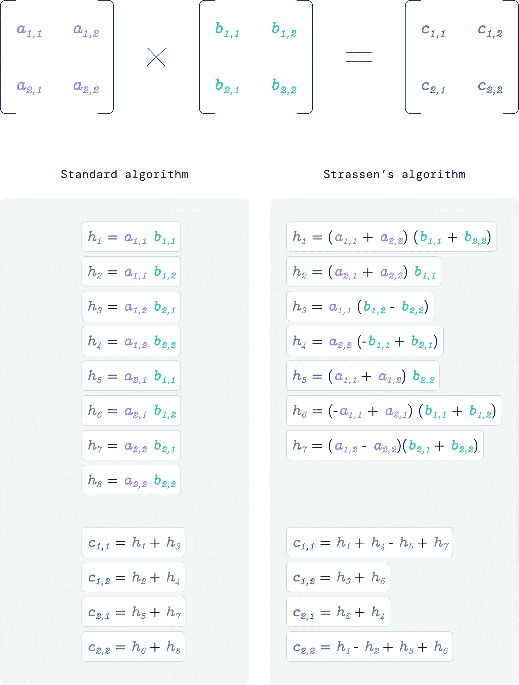
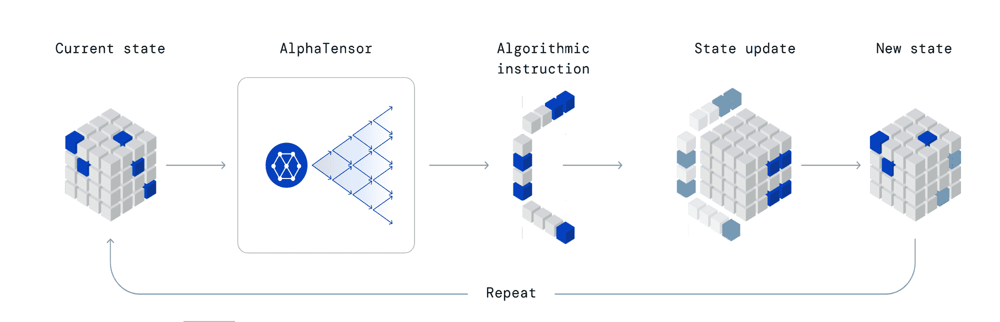
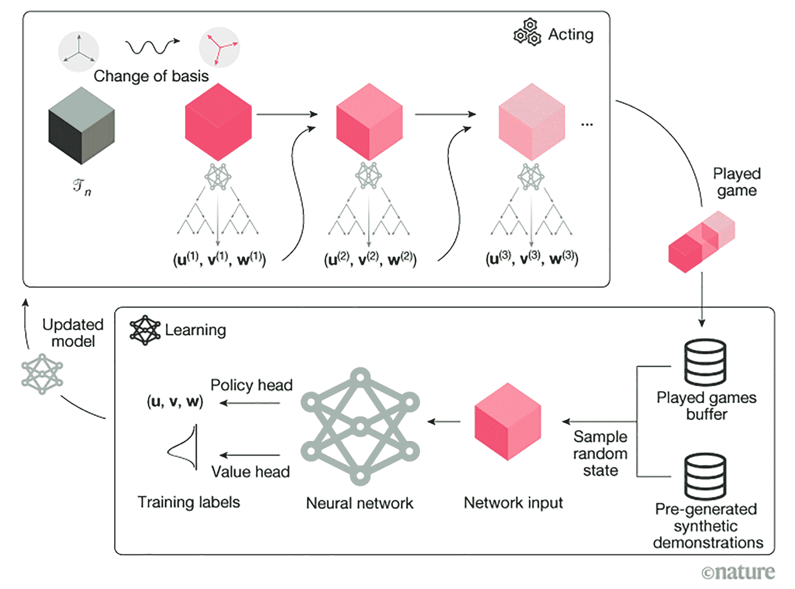

# DeepMind 的 AlphaTensor AI 如何设计更快的矩阵乘法

> 原文：<https://thenewstack.io/how-deepminds-alphatensor-ai-devised-a-faster-matrix-multiplication/>

在开发了一种能够实现对国际象棋和围棋等游戏的超人掌握的人工智能之后，除了另一种能够预测蛋白质如何在三维空间中折叠的人工智能之外， [DeepMind](https://www.deepmind.com/) 的研究人员又做了一次——这次使用深度学习人工智能模型有效地解决了一个基本的数学问题，同时打破了 50 年的纪录。

在本月早些时候的一篇博客文章中，DeepMind 团队介绍了 [AlphaTensor](https://www.nature.com/articles/s41586-022-05172-4) ，这是一个人工智能系统，旨在发现新的更有效的算法来解决关键的数学运算——在这种情况下，是矩阵乘法。

无论是用于处理或压缩图像或视频，识别口头命令，还是运行模拟来预测天气，矩阵乘法都是现代计算的基础。

所以难怪世界各地的专家和公司都在不断寻找更有效的方法来改进解决这些任务背后的数学运算的算法。

[矩阵乘法](https://www.mathsisfun.com/algebra/matrix-multiplying.html)是代数中最简单的数学运算之一，其中排列在网格或矩阵中的各个数字相乘，然后以特定的方式相加，以生成一个新的矩阵。

这种矩阵用于表示各种类型的数据，如图像中的像素组，或人工神经网络的内部功能。

几个世纪以来，数学家们一直使用他们认为最有效的方法，直到 1969 年，德国数学家 Volker Strassen 用一种更好的方法震惊了数学界，这种方法可以用七次乘法而不是标准的八次乘法来乘以一对 2×2 矩阵。

50 多年来，Strassen 的记录一直保持着，但 DeepMind 的 AlphaTensor 能够表明，它可以自己发现更有效的方法。

事实上，该团队像对待游戏一样对待矩阵乘法问题，AlphaTensor 是建立在从其游戏前辈 [AlphaZero](https://thenewstack.io/deepminds-new-milestones-on-the-road-to-artificial-general-intelligence/) 吸取的经验教训之上的。

除了蒙特卡罗树搜索(MCTS)技术之外，这两种模型都使用了一种称为强化学习的机器学习，因此该系统可以在玩“游戏”时从以前的“移动”中接收反馈，从而逐渐自学改进——无论这可能是国际象棋，还是乘法矩阵。

在 AlphaTensor 的情况下，该团队将寻找高效算法矩阵乘法的问题重新表述为单人游戏，其中“棋盘”被转换为三维数字数组。

为了达到用最少的步数将所有数字归零的目标，模型必须正确地填充数字网格，从一组允许的移动中进行选择。这最终产生了该团队所说的“对任何一对矩阵都是可证明正确的矩阵乘法算法，其效率由输出矩阵中“清零”条目所用的步骤数来衡量”。

每当系统表现良好时，其内部参数就会更新，以增强其未来再次成功的机会。与此同时，蒙特卡罗树搜索技术有助于它预测通向可能解决方案的不同路径的成功程度，以便优先考虑更有利的路径，并将游戏结果反馈到网络中，以便进一步改进系统。

“我们使用强化学习训练了一个 AlphaTensor 代理来玩游戏，开始时没有任何关于现有矩阵乘法算法的知识，”该团队解释道。

“通过学习，AlphaTensor 随着时间的推移逐渐改进，重新发现了历史上的快速矩阵乘法算法，如 Strassen 的算法，最终超越了人类直觉的领域，并以比以前已知的更快的速度发现算法。”

该团队强调了两个矩阵相乘这个看似简单的问题的难度:“这个游戏极具挑战性——要考虑的可能算法的数量远远大于宇宙中的原子数量，即使是矩阵相乘的小例子也是如此。

与几十年来一直是人工智能挑战的围棋相比，我们游戏中每一步可能的走法数量要多 30 个数量级(在我们考虑的一个设置中，超过了 10^^(33))。本质上，要想玩好这个游戏，你需要在一大堆可能性中找出最小的一根针。"

在测试高达 5×5 的输入矩阵的实验中，团队发现 AlphaTensor 不仅“重新发现”了之前显示的矩阵乘法的快捷方式，还找到了有效执行这些计算的新方法。

例如，AlphaTensor 能够找到一种将 4×5 矩阵乘以 5×5 矩阵的算法，只需要 76 次乘法，优于以前需要 80 次乘法的算法。

利用 11×12 和 12×12 矩阵的较大集合，AlphaTensor 能够将所需的乘法次数从 1，022 次减少到 990 次。AlphaTensor 还可以为特定硬件优化矩阵乘法，该团队在两个不同的处理器上训练该系统，以便为每个处理器优化性能。

最终，该团队认为这项新工作可能会对从数学研究到计算的各个领域产生重大影响。

“从数学的角度来看，我们的结果可以指导复杂性理论的进一步研究，该理论旨在确定解决计算问题的最快算法。通过比以前的方法更有效地探索可能算法的空间，AlphaTensor 有助于增进我们对矩阵乘法算法丰富性的理解。

了解这个空间可能会解开新的结果，帮助确定矩阵乘法的渐近复杂性，这是计算机科学中最基本的开放问题之一。因为矩阵乘法是许多计算任务的核心组成部分，包括计算机图形学、数字通信、神经网络训练和科学计算，所以α张量发现算法可以使这些领域的计算效率显著提高。"

<svg xmlns:xlink="http://www.w3.org/1999/xlink" viewBox="0 0 68 31" version="1.1"><title>Group</title> <desc>Created with Sketch.</desc></svg>