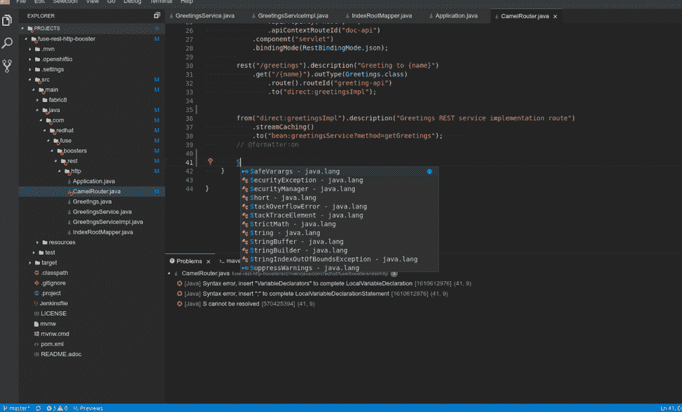

# 开发人员如何通过 CodeReady 工作区度过最后一英里

> 原文：<https://thenewstack.io/how-developers-can-survive-the-last-mile-with-codeready-workspaces/>

[红帽](https://www.openshift.com/)赞助本帖。

 [亚历克斯·汉迪

亚历克斯是红帽公司的技术营销经理。在此之前，他报道了第一台 iMac 的发布，然后开始了 20 多年的科技记者生涯。他的作品出现在《连线》、《亚特兰大宪法日报》和《奥斯汀美国政治家》上。他也是艺术和数字娱乐博物馆(themade.org)的创始人和主管，这是一家位于奥克兰的非营利性视频游戏博物馆。](https://www.openshift.com/) 

基于云的软件开发的承诺伴随着一个大型工具包。这有点像一辆工具车或一个盒子里的新房子:你面前有所有的部件，你只需要正确地组装它们，把它们放在适当的位置，然后进去。

作为一种将这种可用开源工具的爆炸式增长拼凑成简单一致的单一接口以用于云原生部署的方式，Eclipse Foundation 提供了 [Eclipse Che](https://www.eclipse.org/che/) 集成开发环境(IDE)。

今天对 Eclipse Che 的迫切需求可以追溯到过去 10 年间开源工具的发展。这些工具不仅一直在发展，而且在许多情况下，它们都是完全从零开始创建的。这给那些处于可扩展微服务前沿的人带来了一点问题，因为旧的稳定基础架构组件让位于全新的开源商业产品和工具的大杂烩。

在每个云提供商内部，许多工具可以解决 CI/CD、测试、监控、备份和恢复问题。在这些提供商之外，云原生社区一直在努力推出新工具，从 [【普罗米修斯】](https://prometheus.io/)[Knative](https://knative.dev/)[特使](https://www.envoyproxy.io/) 和 [Fluentd](https://www.fluentd.org/) ，到 [Kubenetes](https://kubernetes.io/) 本身以及 Kubernetes 运营商不断扩大的生态系统。

然而，在所有这些项目中，基于云的服务和桌面工具是一个主要的缺口:软件开发的最后一英里是 IDE。尽管社区和云计算原生计算基金会内部有大量的开发项目，但正如上面提到的，正是 Eclipse 基金会关注新的云开发前景，着手解决这个问题。

## Eclipse Che:基于云的集成开发环境

为支持 Eclipse IDE 而创建的非营利基金会长期致力于基于云的 IDE: Eclipse Che，这也许并不奇怪。Che 项目始于 Codenvy 的一部分，Codenvy 是一家初创公司，于 2017 年被红帽收购。

Codenvy 基于浏览器的商业 IDE 背后的团队在收购前几年将 Che 项目剥离给了 Eclipse Foundation。收购后，Red Hat 将 Codenvy 以前的专有代码贡献给了 Eclipse Che 项目。

现在红帽提供了对 [红帽的 CodeReady Workspaces](https://developers.redhat.com/products/codeready-workspaces/overview) 的免费订阅和全球支持，该工作空间基于 [Eclipse Che](https://www.eclipse.org/che/) 。这一点，加上许多大公司的采用，为 Eclipse Che 注入了一股能量，这些能量来自那些寻找基于云的开发工具来帮助他们的团队更快发展的人。

虽然传统的 IDE 市场一直关注特定编程语言用户的特殊需求，但 Eclipse Che 和 Red Hat CodeReady 工作区已经采取了提供更通用的基于 GUI 的工作区的方法，而实际的编程语言是第二层关注的问题。这一点在语言服务器协议(LSP)的使用中表现得最为明显。

LSP 是与微软和其他公司联合设计的，它允许代码完成和其他语言特定的代码呈现信息作为服务分发到 IDE，而不是将这些功能内置到 IDE 本身中。

这使得 Che 和 CodeReady 工作区中的语言支持可以与语言本身同步更新，而不是与 IDE 同步更新。这对于像 JavaScript 这样的语言来说尤其重要，因为它的变化率在不断增加。

## 通过运算符的 Kubernetes IDE

这也意味着 Che 和 CodeReady 工作区并不意味着要取代日常的 ide，比如 IntelliJ、emacs 或 vi。但是只有随着 Kubernetes 操作者的出现，基于云的 IDE 的真正力量才能在基于容器的集群上发挥出来。

这是因为运营商允许开发人员按需提供自己的系统和服务，并由管理员实施预配置的访问控制和治理。因此，希望快速打开行为不当的服务并在集群中更改单个变量的开发人员现在可以快速完成，而不必将自己的笔记本电脑或台式机环境绑定到 Kubernetes 集群中错综复杂的安全和服务授权网络中。

Red Hat 的软件工程师 Mario Loriedo 表示，Che 团队致力于通过运营商使 IDE 在基于 Kubernetes 的环境中更无缝地工作。他说，该团队正在:“努力让操作员变得更加智能。我们增加了一些 Prometheus 端点来获得语言服务器的反馈。如果一个正在开发的用户没有马上得到建议，那是因为服务器很慢，或者因为它需要更多的内存。操作员可以使用这些信息来解决内存问题或磁盘空间问题，并重新部署环境。”

在其他地方，该团队还致力于与 Kubernetes 和 Linux 容器集成，以使修订和重新部署周期更容易。“在 Codenvy 时代，如果你想在 Che 环境中开发你的应用，你必须以某种方式修补你的应用的容器。然后，您必须将开发工具添加到生产容器中，”Loriedo 说。“有了这个新版本，您可以将生产容器带进 Che。我们将公共工具作为边车运行。语言服务器作为边车运行，如果你需要的话，你可以打开或关闭它。你不需要暴露你的应用程序容器。这会将您的生产容器引入到 Che 中，并在您的 ide 中创建一个新实例。”

通过 Pixabay 的特征图像。

云计算原生计算基金会是新堆栈的赞助商。

<svg xmlns:xlink="http://www.w3.org/1999/xlink" viewBox="0 0 68 31" version="1.1"><title>Group</title> <desc>Created with Sketch.</desc></svg>