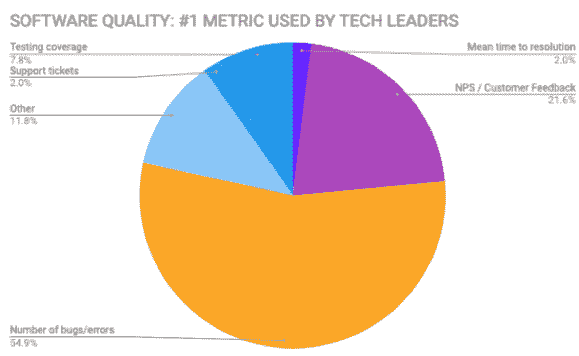

# DevOps 如何优先考虑软件开发的时间和精力

> 原文：<https://thenewstack.io/how-devops-can-prioritize-time-and-energy-for-software-development/>

[Raygun](https://raygun.com/) 赞助本帖。

 [弗雷亚·斯帕文

Raygun.com 是一个性能监控套件，能让你为你的客户构建更强大、更快速、更有弹性的网络和移动应用，弗雷亚为其撰稿。](https://www.linkedin.com/in/freyja-spaven-991533125/?originalSubdomain=nz) 

任务是明确的，但实现这一目标充满了困难:技术领导者不仅要按时交付，质量也必须至少满足现代需求。

用户对软件的质量要求是:

*   不会崩溃。
*   就是快。
*   交流用户如何使用他们的软件以及他们的体验。
*   具有可重复且可靠的交付节奏。(就是敏捷。)

然而，即使是最好的团队也仍然在寻找衡量软件质量的最佳标准。虽然竞争激烈，软件工程师的工资也普遍较高，但组织在尝试优先分配资源以确保软件满足这些现代需求时往往会遇到困难。

这就是为什么崩溃、错误和性能监控软件 [Raygun](https://raygun.com/) 正在举办一系列名为“技术领袖之旅”的活动。该系列将软件领导者聚集在一起，相互学习如何提高软件质量和客户体验。

在我们的惠灵顿活动中，我们将三位软件领导者聚集在 60 名专业开发人员面前，讨论软件性能指标、技术债务等问题。

我们的小组成员是:

*   [Sonya Williams](https://www.linkedin.com/in/sonya-williams-830ab747/?originalSubdomain=nz) ，Sharesies 联合创始人兼产品总监。Sharesies 是一个在线投资平台。
*   Raygun 的产品总监李征。Raygun 是一个错误跟踪和性能监控工具。
*   [Simon Young](https://www.linkedin.com/in/simonaryoung/) ，Trade Me 的首席产品和技术官。 [Trade Me](https://www.trademe.co.nz/about-trade-me/our-story) 是一家位于新西兰的在线市场。
*   [Gabe Smith](https://www.linkedin.com/in/smithgabriel/?originalSubdomain=nz) ， [Xero](https://www.xero.com/) 的企业技术总经理。

谈话的主要话题是技术领导者如何优先考虑和平衡开发时间，以便软件按照用户的期望工作，解决他们的问题，并且是可靠的。以下是该小组的三个关键要点。

## 1.软件质量很难量化

然而，这并不意味着我们不应该尝试。大多数受众使用特定时间段内引入的 bug 或错误的数量来衡量软件质量，这很容易使用[错误跟踪工具](https://raygun.com/platform/crash-reporting)来监控。

“我们有相当多的工程主管，每个人对跟踪什么(作为软件质量的度量)都有不同的看法，”李说。“最后，我们决定跟踪自新部署推出以来引入了多少错误，修复了多少错误，周期时间是多少，我们正在做的事情是否变得更好、更有效率，以及我们实际上是在解决错误吗？”

## 2.通过尽早解决技术债务获得认同

在过去的两次活动中，科技债务一直是我们的科技领袖反复提到的主题。Young 用信用卡的比喻来帮助传达修复技术债务的价值，并建议如果你正在努力阐明它的价值，你也这样做。

“(科技债务)是一种完成事情的工具，就像你使用信用卡一样。你想买一件东西，你现在就想买，你准备过一段时间再付钱，”杨说。但是如果你一个月后还不清卡，你就开始计息了。如果你很好地管理债务，那么你就可以很好地利用它，但是如果你只是，你知道，用另一张信用卡来偿还你的旧信用卡，你就会陷入很大的痛苦之中，你需要关注这一点。"

史密斯也提出了类似的优先化策略。如果一个问题与战略愿景一致，那么这个问题会首先得到解决。他解释说，开发团队基于战略价值、合规性问题和风险构建业务案例。“很容易对谁喊得最大声做出反应，这并不总是正确的答案，”史密斯说。

李分享说，在决定分配工程时间时，应将用户放在首位。“对我来说，是每千行代码引入的错误，每个开发周期纠正的错误，以及受影响的用户数量，”李说。

## 3.NPS 是一个有缺陷的软件质量度量标准

我们之前已经写过[为什么 NPS 是一个有缺陷的工程指标](https://raygun.com/blog/nps-is-a-flawed-engineering-metric/)，但是这个客户忠诚度指标似乎被用作我们的观众衡量客户满意度的主要方式。Raygun 的郑建议，如果团队确实使用 NPS，他们也应该测量更多的前瞻性指标，如网站速度和功能采用。

在 46:00 的视频中，郑说:“当我们的网站运行缓慢时，我们的 NPS 得分会下降一半左右。所以速度很重要。”

“我们需要确保我们的 Raygun 应用程序保持在 4 秒或更快的加载速度，”郑说。“当我们推出新项目或新功能时，我们会在发出所有营销材料后，派客户成功团队去与客户交谈，我们会判断人们的想法，如果不正确，我们会迅速改变。”

Smith 说，为了提供出色的客户体验，团队成员开心并始终有机会发展职业生涯也很重要。在视频的 44:02 分，加布说:“获得真正好的反馈真的很重要。你知道，无论是庆祝成功，还是在你周围，也许你应该以不同的方式做这件事，或者你应该努力改进。”

[点击此处观看完整的小组讨论。](https://raygun.com/blog/monitor-what-matters-panel/)

<svg xmlns:xlink="http://www.w3.org/1999/xlink" viewBox="0 0 68 31" version="1.1"><title>Group</title> <desc>Created with Sketch.</desc></svg>