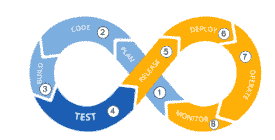
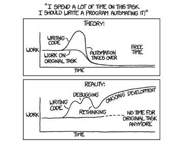
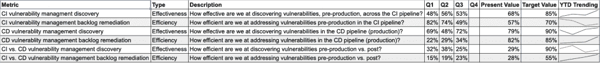

# DevOps 如何保护安全

> 原文：<https://thenewstack.io/how-devops-can-save-security/>

[帕洛阿尔托网络公司的 Prisma](https://www.paloaltonetworks.com/prisma/cloud) 在 2020 年 2 月 11 日举行的[云本地安全直播，2020 年虚拟峰会](https://vshow.on24.com/vshow/Palo_Alto_Networks/registration/16700)之后，赞助了这篇文章。

 [马特·乔迪

Matt 拥有近二十年的安全领导经验，目前是 Palo Alto Networks 公共云的首席安全官。他经常在 RSA 等行业活动上发表博客和演讲。他目前领导着云威胁团队，这是一个专注于公共云问题的安全研究人员精英团队。他还是罗格斯大学网络安全证书项目的顾问委员会成员，也是 IANS Research 的成员。](https://www.linkedin.com/in/mattchiodi/) 

安全团队喜欢将安全问题归咎于 DevOps。经常被引用的研究立即浮现在脑海中，包括 [40，000 个云容器系统](https://www.infosecurity-magazine.com/news/researchers-find-40000-containers-1/)，比如 Kubernetes 和 Docker，它们都有默认配置。

然而，集装箱只是一个新兴领域。指责的其他领域通常包括使用具有已知漏洞的组件、敏感数据暴露、跨站点脚本(XSS)——等等。但是，如果我告诉您这个问题与 DevOps 无关，而是安全团队缺乏参与，会怎么样呢？

事实是，尽管许多安全团队拥有超过 99 种安全工具，但他们就是无法参与其中，而 DevOps 团队则首当其冲。

但是，有一个解决方案。通过使用以下问题，DevOps 团队可以帮助他们的安全同事了解持续集成/持续部署(CI/CD)管道的风险，从而引导他们走上明智的理解之路。

### 我们在 CI/CD 渠道的自动化安全性方面做了哪些投资？

CI/CD

根据您的安全团队的知识水平，他们可能不会深刻理解您所说的 [CI/CD](https://www.twistlock.com/2019/07/08/greatest-security-risks-lurking-ci-cd-pipeline/) 的含义。从一开始就认识到许多安全从业者没有软件开发背景。这个问题很关键，因为它将让你花时间写下你的管道和流程是什么样子。这些会议将带来许多积极的成果，首先是让安全部门更深入地了解软件如何在您的组织中流动。

也许最重要的是让安全部门拥有管道中的自动化安全。尽管我们喜欢重复这句口头禅:“安全是每个人的工作”，但事实并非如此。这并不意味着您不应该尝试编写安全的代码，但这确实意味着它永远不会成为您的主要关注点。

自动化理论与现实来源:xkcd.com

### 我们如何持续跟踪多个云客户和提供商的合规性？

希望在您的下一次会议中看到安全团队立正吗？问上面的问题。安全部门会想，DevOps 为什么要关注法规遵从性？现实情况是，如果您知道安全性和法规遵从性是如何被跟踪的(以及您的组织所对应的标准)，那么虽然安全性和法规遵从性不是您的主要工作，但是它可以极大地减轻您的团队的负担。

怎么会？

因为为了构建兼容的云原生应用程序，您需要做出有意识的设计选择，并遵循将它们付诸实践的正式流程。如果无法持续跟踪众多云客户和提供商的合规性，就很难知道需要做出哪些设计决策。在与数百个安全团队合作后，有一件事非常清楚:大多数人没有办法跟踪这一点。更糟糕的是，那些尚未实现云规模的人经常试图用电子表格来实现。起带头作用，这样做，你不仅可以让你的团队更清楚地了解事情，还可以确保安全性和合规性。

> 效率就是把事情做对；有效性就是做正确的事情。
> [彼得·德鲁克，管理思想领袖。](https://en.wikipedia.org/wiki/Peter_Drucker)

### 我们可以共同制定哪些指标来更好地跟踪我们的云安全状况？

历史上，作为开发人员，我们只关心应用程序。然而，对于云，我们通常拥有整个堆栈，这要归功于作为代码 (IaC)的[基础设施。考虑到这种扩大的所有权，拥有与安全性一起跟踪的特定指标非常重要。关注区分功效和效率的指标。正如彼得·德鲁克所说，“效率就是把事情做对；有效性就是做正确的事情。”许多组织都在努力应对安全指标。最好从少量开始，然后随着时间的推移不断扩展和完善。图 3 中的指标非常清楚地表明了开发运维与安全性的协同工作情况。请注意，发现指标假设您已经花时间在安全方面来规划您的管道。如果您做到了这一点，那么您就知道应该在管道中的什么地方自动进行安全扫描(参见上面的第一个问题)。与任何度量标准一样，必须有一个目标。对于这个组织来说，有很多工作要做，特别是关于他们在生产前和生产后发现漏洞的效率有多低。该组织可能是最近由 Unit 42 在其【2020 年春季云威胁报告](https://start.paloaltonetworks.com/delivering-infrastructure-security-and-operations-as-code.html)中发现的 43%具有不安全云形成模板的组织之一。

衡量有效性和效率的 CI/CD 指标。

## 从 DevOps 进化到 DevSecOps 的最好方式是什么？

具有安全策略的开发运维团队为他们自己和他们的组织带来了竞争优势。想要免除未来指责的开发运维团队必须挑战安全团队，让他们从长计议。这个问题触及了它的核心:我们如何从 DevOps 进化到 DevSecOps？所有这些问题的关键不仅在于使您的开发运维流程更加安全，还在于增强安全性方面的协作，同时提高业务敏捷性。参与和合作越频繁，两个团队就越清楚两个团队有一天会合二为一。

谈到云，您作为 DevOps 团队拥有控制权。然而，有一个最广为人知的推论，叫做[彼得·帕克](https://en.wikipedia.org/wiki/Spider-Man)原则，指的是一个标志性的虚构人物，他的另一个自我是蜘蛛侠:“权力越大，责任越大。”那么 DevOps 的问题是你会用它做什么？

*欲了解安全思想领袖的更多见解， [Cloud Native Security Live，2020 虚拟峰会](https://vshow.on24.com/vshow/Palo_Alto_Networks/registration/16700)为您提供了一个向开发人员、DevOps 专业人员和 it 领袖学习经验和专业知识的机会，他们在容器技术和 DevSecOps 方面都有很大的利益。由 Palo Alto Networks 的 Prisma 主办，与 New Stack 合作，您仍然可以虚拟地参加 2020 年 2 月 11 日举行的活动，参加一整天关于云原生安全性的讨论，无论您身在何处，都可以在线参加。*

图片来自 Pixabay。

<svg xmlns:xlink="http://www.w3.org/1999/xlink" viewBox="0 0 68 31" version="1.1"><title>Group</title> <desc>Created with Sketch.</desc></svg>