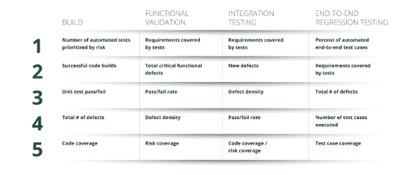
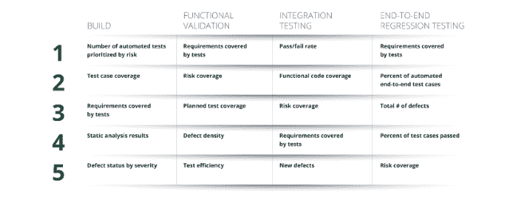
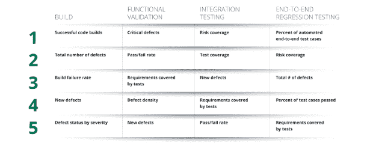

# DevOps 质量趋势如何在全球范围内变化

> 原文：<https://thenewstack.io/how-devops-quality-trends-vary-around-the-world/>

Tricentis 赞助了这篇文章。

 [韦恩·阿里奥拉

来自 Tricentis 的 Wayne 是持续测试、基于风险的测试、服务虚拟化和 API 测试等软件测试领域公认的思想领袖。Wayne 创造并销售了支持动态软件开发、测试和交付环境的产品。他推动了许多创新技术的设计，并获得了多项发明专利。他为软件测试领域贡献了 15 年，在软件行业工作了 20 多年。在 LinkedIn 或 Twitter 上与他联系。](https://www.linkedin.com/in/wayneariola/) 

快速交付高质量的软件不再是一种奢侈——它是数字化成功的先决条件，也是客户忠诚度和获取的必要条件。在我们所处的时代，客户有权选择并转向能够以最低成本快速为他们提供最佳体验的公司。无法满足客户期望并适应新业务模式的组织将会发现自己的客户和业务被能够做到这一点的竞争对手抢走。

企业如何快速、高质量地交付产品？实施敏捷+DevOps 最佳实践和构建质量是第一步——这不是小事。自动化是开发团队提高速度的杠杆。然而，如果管理不当，自动化会危及质量并增加风险。为了确保质量问题和不可接受的风险不会抵消自动化的速度优势，公司必须确保他们在整个开发-测试-部署过程中跟踪正确的度量标准来测量质量。

Tricentis 最近委托 Forrester 研究 603 名 DevOps 领先者和落后者如何使用和评估 75 项质量指标。目标:为软件测试社区提供一个客观的视角，让他们了解哪些质量度量对 DevOps 的成功最重要。

在过去的专栏中，我们提供了一个[对该研究结果的高层次概述](https://thenewstack.io/devops-quality-metrics-ranked-from-overrated-distractions-to-hidden-gems/)，并分享了 DevOps [跨构建、功能验证、API 测试和端到端测试的质量趋势。](https://thenewstack.io/devops-metrics-that-matter/)在本文中，让我们深入探讨质量指标的使用和评估在不同地区的差异。

## 全球结果

回顾一下我们在之前的文章中提到的全球调查结果，DevOps 的专家认为以下指标最有价值:

全球结果的三个关键要点是:

*   对业务风险的理解是 DevOps 成功的关键因素。一旦组织重新定义了他们考虑风险的方式，他们也改变了他们的质量度量，以帮助他们更好地理解他们发布周期中的风险水平。
*   DevOps 专家更关注上下文度量(例如，需求覆盖，风险覆盖)，而其他人关注“计数”度量(例如，测试的数量)。
*   DevOps 专家更有可能测量端到端事务的用户体验，而其他人则依赖于特定于应用程序或特定于团队的指标。

最终，这强调了一个事实，即 DevOps 的成功需要更多的自动化和全新的工具集。需要进行更广泛的转型，以调整业务风险并满怀信心地发布。不容易。但是，在使团队能够更快地交付更好的软件方面，这种努力确实得到了回报。

## 欧洲 DevOps 质量指标趋势

具体来看欧洲，“前 20 名”的变化如下:

该地区一些有趣的趋势包括:

### 对测量质量度量有更大的承诺

欧洲受访者普遍报告了更高水平的 DevOps 质量度量标准。几乎所有指标的使用率都比全球平均水平至少高 6%。对于与时间、覆盖面、风险、有效性和效率相关的指标，使用率高出 14%以上。这表明欧洲组织致力于审查和持续优化质量流程，尤其是在时间和资源利用方面。

### 风险和覆盖指标的价值高于全球平均值

欧洲受访者对风险和覆盖质量指标的排名也比全球平均水平高出 21%，令人惊讶。这可能与该地区的受访者主要来自金融服务和保险行业，医疗保健和政府紧随其后有关。在这种高度监管的行业中，衡量和降低风险无疑是一个核心问题。这一发现也表明欧洲组织更加重视保护企业品牌。

### 测试数据准备时间似乎是一个更大的问题

欧洲受访者比他们的全球同行更可能测量(+18%)和高度重视(+23)花费在准备测试数据上的时间。鉴于截至 2018 年 5 月 GDPR 对测试数据的限制，欧洲组织似乎已经显著改变了他们的测试数据管理流程(例如，屏蔽和更具综合性的测试数据生成)，并谨慎地监控这些变化如何影响他们的整体效率。

### 亚太地区 DevOps 质量指标趋势

现在，让我们把焦点转移到亚太。亚太地区 DevOps 专家将以下 20 项指标评为最有价值的指标。

该地区值得注意的趋势包括:

### 端到端测试指标比全球平均水平更受重视和衡量

尽管亚太地区的受访者测量的构建和功能验证指标少于全球平均水平，但他们测量(和评估)的端到端测试指标远多于世界各地的同行。例如，47%的组织测量了自动化端到端测试的百分比(全球范围内为 36%)，84%的组织高度重视自动化端到端测试(全球范围内为 70%)。风险覆盖面测量值明显更高；49%(对 34%)的人对其进行了衡量，71%(对 59%)的人给予了高度评价。这表明了该地区对数字化转型的关注以及对提供卓越用户体验的承诺。

### API 测试指标也比全球平均水平更受重视和衡量

亚太地区的受访者对 API 测试质量指标的衡量和评价也高于全球平均水平。总的来说，该地区的 API 质量度量单位比全球多 16%。最有价值的 API 质量指标是 API 测试覆盖率(全球 63%对 39%)和 API 风险覆盖率(全球 79%对 62%)。API 测试的这种优先化很可能是 API 驱动的开放银行的区域趋势的副作用(绝大多数受访者表示他们在金融服务和保险行业)。

### 领导者/落后者之间的质量度量差距更大

研究的一部分包括根据受访者对有关流程成熟度的各种问题的回答，将他们分为 DevOps 领导者或 DevOps 落后者。尽管该地区 DevOps 领导者的比例低于全球平均水平(18%比 26%)，但亚太地区的 DevOps 领导者通常以与其全球同行相当的速度衡量质量指标。然而，DevOps 在亚太地区的落后者通常衡量质量指标的比率比他们的全球同行低得多。这表明，真正优先考虑 DevOps 计划的公司已经取得了长足的进步，落后者要保持竞争力还有很长的路要走。

有关该研究方法和结果的更多详细信息，请参见完整的 55 页报告:[Forrester Research on devo PS Quality Metrics at the materials:75 个常用指标——由行业专家排名](https://www.tricentis.com/resources/forrester-research-on-devops-quality-metrics/)。该报告可在 Tricentis 网站上免费获得。

来自 Pixabay 的特征图像。

<svg xmlns:xlink="http://www.w3.org/1999/xlink" viewBox="0 0 68 31" version="1.1"><title>Group</title> <desc>Created with Sketch.</desc></svg>