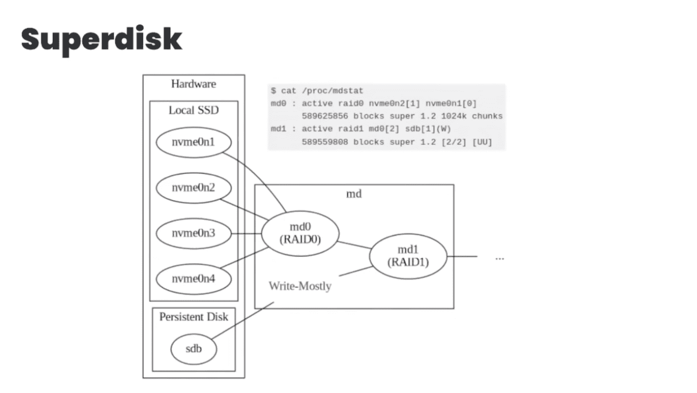

# 不和谐如何将数万亿条消息迁移到 ScyllaDB

> 原文：<https://thenewstack.io/how-discord-migrated-trillions-of-messages-to-scylladb/>

流行的社交网络服务 [Discord](https://discord.com/company) 将其消息集群从开源 [Cassandra 数据库系统](https://thenewstack.io/4-common-questions-we-hear-about-apache-cassandra/)迁移到分布式数据存储 [ScyllaDB](https://www.scylladb.com/?utm_content=inline-mention) ，并将延迟从 200 毫秒减少到 5 毫秒。

ScyllaDB Summit 2023 于上周三开幕，由 Discord 高级软件工程师 [Bo Ingram](https://www.linkedin.com/in/bo-ingram-1a069275/) 主讲“Discord 如何将数万亿条消息从 Cassandra 迁移到 ScyllaDB”。这本身并不是一个问题，但答案需要大量的工作。软件和硬件中有创造性的工程设计，从 Cassandra 的热分区到 ScyllaDB 的持续延迟带来了不和谐。

为了提高效率和减少延迟，Discord 的工程师们构建了一个数据服务库，以简化进出数据库的查询。这将限制给数据库基础设施带来压力的请求数量。

他们还创建了一个由持久磁盘和 NVMe 固态硬盘组成的“超级磁盘”，以优化他们的硬件速度和效率。最后，对 ScyllaDB 进行了修改，以增加与 Superdisk 的兼容性。最终结果是高流量群集中的一致延迟。

卡珊德拉的工作有一定的意义，但分歧越大，支持 NoSQL 商店就越困难。Discord 经历了 Cassandra 热分区导致的级联延迟，当高流量被驱动到一个分区时，会导致级联延迟。垃圾收集是另一个问题。“我们真的不喜欢垃圾收集，”英格拉姆证实道。

ScyllaDB 引起了 Ingram 和他的团队的注意。“我们有点嫉妒地看着 ScyllaDB。我们非常好奇，”他说。ScyllaDB 是用 C++编写的，这意味着没有垃圾收集，对 Ingram 来说，“听起来像是一场梦。”

2022 年，Discord 将其大部分数据迁移至 ScyllaDB。Ingram 说，核心消息数据库是坚持者，因为“我们不想从我们的消息数据库中吸取所有的教训”。在获得更多的经验并学习如何最好地优化 ScyllaDB 之后，消息也将继续前进。

以下是一些组件:

## **数据服务库**

构建数据服务库是简化消息工作流的第一步。它用 Rust 编写，位于 API 和 Cassandra 之间，通过 gRPC 进行通信。数据服务库保护数据库，并作为请求合并的主要用途。

请求合并通过使用工作线程将对同一消息的多个请求减少到一个数据库查询中。当一个拥有大量用户的巨型服务器发布一个重大公告，让大量用户打开他们的应用程序/电脑查看详细信息时，就会有一个工作线程开始响应到来的请求。工作线程查询数据库一次，并将消息返回给所有订阅的请求。

请求合并的上游是一致路由，这使得请求合并成为可能。在上图中，Discord 使用通道 ID，但实际上任何路由都是可用的。所有发送到特定通道的请求都通过同一个消息实例。所以在大消息场景中:相同的消息，相同的渠道。相同的实例等于一个查询。

英格拉姆把这一切归功于拉斯特。Rust 作为一种表演性语言，“让我们不费吹灰之力就能处理这个用例。太棒了，”他说。

**超级磁盘**

磁盘竞争者:速度更快的 NVMe 固态硬盘具有更高的仲裁丢失和停机风险，而速度较慢的持久磁盘可能会重新引发级联延迟。两者都不是一个好的解决方案，但是它们一起构成了超级磁盘！

它从一个 1.5TB 的永久磁盘开始，然后与 1.5TB 的本地 NMVe SSD RAID0 一起条带化。RAID0 提供了相当于永久磁盘大小的大型逻辑卷。然后，Discord 获取逻辑磁盘(RAID0)并通过 RAID1 阵列将其与持久性磁盘结合。RAID1 提供镜像功能，因此 RAID0 本地 SSD 上的数据与永久磁盘上的数据相匹配。

*行动中的超级磁盘*

永久磁盘被标记为主要写入，读取操作将进入 RAID1 阵列。不和谐主要来自 RAID0 固态硬盘。

如果出现主机错误，假设本地 NVMe 固态硬盘丢失是安全的，但现在没问题了，因为磁盘镜像提供了一个副本。一旦固态硬盘恢复运行，Raid 将执行恢复操作，使其恢复与永久磁盘的奇偶校验状态。

它在开箱后并不完美。Discord 与 Scylla 合作实现了双工 IO，这允许他们将读写操作分配到自己的通道上。写意图位图已关闭。

## **迁移时间**

*cassandra-messages* 数据库的迁移计划很简单——使用 ScyllaDB 存储最近的数据，并迁移其背后的历史数据。Discord 调整了 ScyllaDB 的 spark migrator，准备迁移。到这个时候(2022 年 5 月)，Ingram 已经受够了他所谓的 Cassandra“救火”，所以当 cassandra-messages 迁移的预计时间变成三个月时，他认为三个月太长了。

更快意味着在 Rust 中重写 ScyllaDB 的数据迁移器。重写花了 Ingram 和两个同事大约一天的时间，而且更快！更新后的数据迁移器每秒发送 320 万条记录。三个月的时间缩短到了九天。

数据验证一旦数据被发送并通过随机读取进行采样，就执行数据验证，以确保数据是一致的、等价的和正确的。

**快一年了，不后悔**

ScyllaDB 效率更高，由于存储密度更高，它使用了 Cassandra 集群一半的节点。ScyllaDB 更好的磁盘效率体现在磁盘利用率降低了 53%。Cassandra 的消息群的延迟在 5 到 500 毫秒之间。有了 ScyllaDB，Ingram 确信“它是准时的 5 毫秒。没有微秒……我这里就具体说一下。”

<svg xmlns:xlink="http://www.w3.org/1999/xlink" viewBox="0 0 68 31" version="1.1"><title>Group</title> <desc>Created with Sketch.</desc></svg>