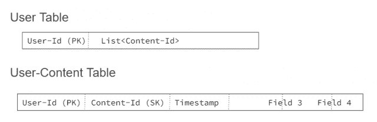

# 迪士尼+ Hotstar 如何简化其数据架构以实现规模化

> 原文：<https://thenewstack.io/how-disney-hotstar-simplified-its-data-architecture-for-scale/>

印度最受欢迎的流媒体服务 Disney+ Hotstar 占全球 Disney+用户群的 40%。迪士尼+ Hotstar 提供超过 100，000 小时的内容点播，以及世界上最受关注的体育赛事的直播(印度超级联赛，超过[2500 万并发观众](https://www.youtube.com/watch?v=mFpqrVxxwKc))。在过去的六年里,[的 IPL 观众人数以数量级增长。随着第一位](https://www.techradar.com/news/premier-league-viewership-on-disney-plus-hotstar-at-record-high-all-details-here)[南亚血统超级英雄](https://www.outlookindia.com/art-entertainment/muslim-woman-and-south-asian-iman-vellani-s-ms-marvel-mcu-marvel-cinematic-universe-latest-superhero-makes-her-debut-fawad-khan-farhan-akhtar-shah-rukh-khan-news-201127)漫威女士本月首次亮相，迪士尼+ Hotstar 的快速增长肯定会通过接触新的观众和人口统计数据而继续下去。

 [辛西娅·邓洛普

Cynthia 写软件开发和测试的时间比她愿意承认的要长得多。她目前是 ScyllaDB 的内容战略高级主管。](https://www.linkedin.com/in/cynthiadunlop/) 

“继续观看”功能对于 3 亿多月活跃用户的点播流媒体体验至关重要。这让你可以在一个设备上暂停视频，并在世界上任何地方的任何设备上立即从你停止的地方继续。这也是吸引你狂看你最喜欢的剧集的原因:看完一集，下一集就会自动开始播放。

然而，要让事情变得如此简单并不容易。事实上，支持这一特性的底层数据基础设施已经变得过于复杂。它最初建立在 Redis 和 Elasticsearch 的组合之上，连接到 Kafka 流数据的事件处理器。

 [彼得·科尔莱斯

Peter Corless 是 ScyllaDB 的技术支持主管。他倾听用户的故事，发现每个故事中的智慧，并通过博客或技术演示与业内其他从业者分享。他偶尔会主持从网络研讨会到在线会议的现场行业活动。](https://www.linkedin.com/in/petercorless/) 

拥有多个数据存储意味着维护多个数据模型，这使得每次更改都是一个巨大的负担。此外，每六个月翻一番的数据需要不断增加群集的大小，从而导致更多的管理和不断飙升的成本。

这篇文章深入探讨了由 [Vamsi Subash Achanta](https://www.linkedin.com/in/vamsisubhash/) (架构师)和[Balakrishnan Kaliyamoorthy](https://www.linkedin.com/in/balakrishnan-kaliyamoorthy-04028195/?originalSubdomain=in)(高级数据工程师)领导的 Disney+ Hotstar 团队如何简化这种数据架构以实现大规模敏捷性。

**TL；DR —** 首先，团队采用了新的数据模型，然后他们转向了高性能、低延迟的数据库即服务( [ScyllaDB Cloud](https://www.scylladb.com/?utm_content=inline-mention) )。这使他们能够腾出资源用于团队的许多其他优先事项和项目。它还降低了读取和写入的延迟，以确保今天的流媒体用户所期望的快速用户体验，即使内容库迅速扩大，订户数量激增。

## 迪士尼+ Hotstar 的“继续观看”功能

在迪士尼+ Hotstar，“继续观看”以多种方式促进了引人入胜的无缝观看体验:

*   如果用户播放视频，然后暂停或停止，该视频将被添加到他们的“继续观看”托盘中。
*   每当用户准备在任何设备上继续观看视频时，他们都可以很容易地在主页上找到它，并准确地回到他们离开的地方。
*   当用户完成一个系列中的一集时，下一集被添加到他们的“继续观看”托盘中。
*   如果新的剧集被添加到用户之前完成的剧集中，则下一个新的剧集被添加到他们的“继续观看”托盘中。

迪士尼+ Hotstar 用户平均每天观看 10 亿分钟的视频。该公司还每天处理近 100 到 200GB 的数据，以确保“继续观看”功能对于每月数亿用户来说是准确的。由于用户观看行为的不稳定性，Disney+ Hotstar 需要一个能够处理大量写入工作负载的数据库。他们还需要一个可以在高流量时期适当扩展的数据库，此时请求量会在一分钟内增加 10 到 20 倍。

图 2 显示了“继续观察”功能最初是如何设计的。

图 2:看看迪士尼+ Hotstar 决定替换的遗留架构

首先，用户的客户端会向 Kafka 发送一个“观看视频”事件。从 Kafka，事件将被处理并保存到 Redis 和 Elasticsearch。如果用户打开主页，就会调用后端，从 Redis 和 Elasticsearch 检索数据。他们的 Redis 集群拥有 500 GB 的数据，而 Elasticsearch 集群拥有 20tb 的数据。每个事件的键值数据从 5 千字节到 10 千字节不等。一旦保存了数据，API 服务器将从两个数据库中读取数据，并在用户下次登录或继续观看时将数据发送回客户端。

Redis 提供了可接受的延迟，但是数据量的增加意味着他们需要横向扩展他们的集群。这增加了他们每三到四个月的成本。弹性搜索延迟在 200 毫秒的高端。此外，考虑到回报，弹性搜索的平均成本相当高。他们经常遇到节点维护问题，需要手动解决这些问题。

这是遗留数据架构背后的数据模型:

毫不奇怪，拥有两个数据存储导致了一些重大的扩展挑战。他们有多个数据存储，不同的数据模型用于相同的用例:一个键值和一个文档。随着每天大量用户加入 Disney+ Hotstar，管理所有这些数据变得越来越困难。此外，在大规模上维护两个具有不同代码库和不同查询模式的数据存储变得非常昂贵。每六个月，他们的数据几乎翻了一番。这需要增加集群，导致管理负担沉重，成本不断攀升。

## 重新设计数据模型

解决这些挑战的第一步是设计一个新的数据模型:NoSQL 键值数据存储。为了简化，他们的目标是一个只有两个表的数据模型。

用户表用于一次检索给定用户的整个“继续观看”托盘。如果一个新的视频需要添加到用户的“继续观看”托盘中，它将被添加到相同的用户 Id 键的列表中。

用户内容表用于修改特定的内容 Id 数据。例如，当用户继续播放视频然后暂停时，更新的时间戳被存储。当视频观看完毕后，可以直接查询和删除该条目。在这个表中，User-Id 是主键，Content-Id 是辅(集群)键。

## 选择新数据库

该团队考虑了许多备选方案，从 Apache Cassandra 和 Apache HBase 到 Amazon DynamoDB 再到 ScyllaDB。为什么他们最终选择了 ScyllaDB？几个重要原因:

*   *   **性能:** ScyllaDB 的[深度架构改进](https://www.scylladb.com/product/technology/)为读取和写入提供持续的低延迟，即使当直播事件超过 2500 万并发观众时，也能确保快速的用户体验。
    *   **操作简单性** : ScyllaDB 从头开始构建，提供[自我优化功能](https://lp.scylladb.com/self-optimizing-database-offer.html)，带来一系列好处，包括能够在统一基础架构上运行操作和分析工作负载，更高的利用率可防止浪费性的过度配置，并显著降低管理开销。
    *   **成本效率:**完全托管的数据库即服务(NoSQL DBA as)ScyllaDB Cloud 提供了比他们考虑的其他选项[低得多的成本](https://www.scylladb.com/pricing/#pricing-calc)。

图 ScyllaDB 的性能监控结果显示亚毫秒级 p99 延迟和 150-200 微秒范围内的平均读写延迟

## 零停机时间迁移

### **从 Redis 和 Elasticsearch 到 ScyllaDB Cloud**

迪士尼+ Hotstar 的迁移过程是从 Redis 开始的。Redis 到 ScyllaDB 的迁移相当简单，因为数据模型非常相似。他们捕获了一个 RDB 格式文件中的 Redis 快照，然后使用 cqlsh(一个使用 CQL 与 Cassandra 交互的命令行界面)将其转换为逗号分隔值(CSV)上传到 ScyllaDB Cloud。从他们的经验中得到的一个教训:观察最大的有用的写并发，以避免写超时。

他们用七个线程运行，在 15 分钟内迁移了 100 万条记录。为了加快进程，他们增加了线程的数量，并增加了更多的机器。

图 Redis 到 ScyllaDB 的云迁移

类似的过程也适用于弹性搜索迁移。JSON 文档被转换为 CSV 文件；然后 CSV 文件被复制到 ScyllaDB Cloud。

一旦 ScyllaDB Cloud 加载了 Redis 和 Elasticsearch 的历史数据，它就会通过以下方式保持同步:

*   修改他们的处理器应用程序，以确保所有新写入也写入 ScyllaDB。
*   升级 API 服务器，以便所有读取也可以从 ScyllaDB 进行。

图 5:从 Redis 和 Elasticsearch 迁移到 ScyllaDB Cloud

在这一点上，写和读可以完全从遗留的 Redis 和 Elasticsearch 系统中删除，让 ScyllaDB 处理所有正在进行的流量。这种迁移策略完全避免了任何停机时间。

图 6: ScyllaDB 云现在处理所有正在进行的流量

### **ScyllaDB 开源到 ScyllaDB 云**

Disney+ Hotstar 团队也使用 ScyllaDB 开源做了一些工作，并且需要将这些数据转移到他们管理的 ScyllaDB 云环境中。他们可以使用两种不同的进程:SSTableloader 或 ScyllaDB Spark Migrator。

图 7:从 ScyllaDB 开源到 ScyllaDB 云的基于 SSTableloader 的迁移

SSTableloader 使用集群中每个服务器的 nodetool 快照，然后将快照上传到 [ScyllaDB Cloud](https://www.scylladb.com/product/scylla-cloud/) 中的新数据库。这可以成批运行，也可以一次全部运行。该小组注意到，当他们有一个二级(复合)密钥时，这个迁移过程会大大减慢。为了避免这种减速，该团队实现了 ScyllaDB Spark Migrator。

图 8:使用 ScyllaDB Spark 迁移器从 ScyllaDB 开源迁移到 ScyllaDB 云

在此过程中，数据首先备份到 S3 存储，然后放在单节点 ScyllaDB 开源实例上(此过程称为 unirestore)。从那里，它被用 ScyllaDB Spark Migrator 注入 ScyllaDB Cloud。

## 为迪士尼+增长最快的部分提供服务

该团队现在正在实现亚毫秒级 p99 延迟，平均读写延迟在 150 到 200 微秒的范围内。此外，数据库即服务减轻了他们的管理负担，如数据库备份、升级和修复，他们可以专注于为迪士尼+全球用户中增长最快的部分提供卓越的体验。例如，他们最近重新架构了平台的推荐功能，以使用 ScyllaDB 云。短期内的其他项目包括将其监视列表功能迁移到 ScyllaDB Cloud。

<svg xmlns:xlink="http://www.w3.org/1999/xlink" viewBox="0 0 68 31" version="1.1"><title>Group</title> <desc>Created with Sketch.</desc></svg>