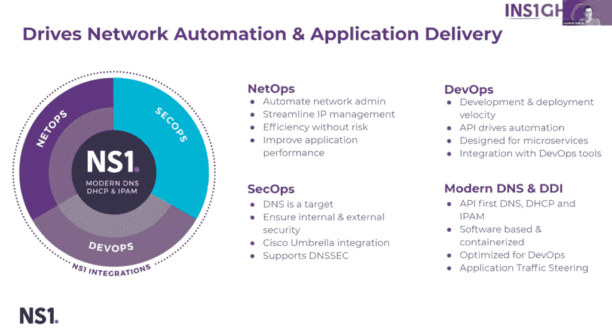

# DNS 管理如何解决当今的开发运维、安全运维和网络运维冲突

> 原文：<https://thenewstack.io/how-dns-management-can-resolve-todays-devops-secops-and-netops-conflicts/>

[NS1](https://www.ns1.com/) 赞助本帖。

在数据中心时代，IT 管理员通常负责维护服务器基础架构，就像他们负责确保 LAN 甚至 WAN 网络连接一样，包括 DNS、DHCP 和 IP 地址管理(DDI)。他们的工作甚至可能包括确保数据中心的供暖、通风和空调(HVAC)系统以及电源正常工作。

然而，IT 运营已经从以基础架构为中心转变为以应用程序开发为中心，特别是对于高度分布式云环境中的部署。

今天，随着组织越来越多地寻求加快开发和部署软件的节奏，许多网络操作团队继续使用的 DDI 工具的现状往往仍然过时。这是因为这些工具主要是为维护基础设施而设计的，而不是以应用程序开发为中心的操作。与此同时，DevOps 和 SecOps 团队经常依赖于在这种上下文中有时在关键方面不兼容的过程。

> “任何到现在还没有把开发、网络和安全团队团结起来的组织都将举步维艰”——Clive long bottom，Clive Longbottom and Associates。

在 NS1 的 [INS1GHTS2020](https://thenewstack.io/baptism-by-fire-ns1-insights2020-surveys-the-current-challenges-of-devops/) 虚拟峰会期间的主题演讲中，[NS1 的首席技术官和联合创始人 Jonathan Sullivan](https://www.linkedin.com/in/jonathansullivan1) 表示，DevOps、NetOps 和 SecOps 因此存在与网络相关的冲突——但他也描述了如何解决这些问题。

Sullivan 说:“这些团队正在从事高速部署和持续集成/持续交付(CI/CD)工作，所有这些团队在管理 DDI 或 DNS 基础架构方面都有些分歧，因为他们都希望从中获得不同的东西。”。“DevOps 和 SecOps 团队面临的一个真正挑战是，一旦 DevOps 团队获得了一些 IP 地址，或者一旦他们开辟了一些空间并部署了 Kubernetes，SecOps 就会突然失去对这些的所有可见性，然后就不再需要 NetOps 了。”

## 人人为我

沙利文说，NS1 提供的容器化平台“能够很好地与所有这些[DevOps、SecOps 和 NetOps]团队合作，并为他们提供拉动和共存的杠杆”。

“我们的平台为所有这些团队提供了可视性、工具和自动化框架，以便他们可以彼此共存，”Sullivan 说。

Sullivan 说，这个想法是允许组织采用该平台，以便它能够满足其客户的部署需求，“无论他们部署在哪里”，包括他们是否完全在内部、在数据中心或在多云和无服务器环境中。“您只需下载我们完整平台的容器化版本，将其部署在防火墙后，并使用它来增强或取代传统的 DDI 解决方案或开源 DNS 解决方案。”

苏利文说，NS1 平台的“关键区别”之一是它是“驱动所有这些东西的相同技术”所以，你的团队学习一个平台。它能够服务于您的所有使用情形:内部、外部和私有云。

沙利文说:“你可以自动化、学习并获得这些事情中任何一件的服务。”“它解决了您的基础架构上可能有应用程序的所有地方的用例。”

Clive Longbottom and Associates 的分析师 [Clive Longbottom](https://uk.linkedin.com/in/clivelongbottom) 说，事实上，NS1“说的没错”，因为传统的 DDI 工具“不再真正适合使用。

“对于组织来说，采用有助于管理内部和(尽可能)外部环境的工具确实是有意义的，”隆巴顿说。

Longbottom 说，在现代混合平台上，工作负载可能会从一个区域转移到另一个区域，使用 DDI 工具确实可以通过 DDI 工具管理物理或逻辑目标来维护 IP 地址。

Longbottom 说:“这些工具还允许开发人员创建代码，而不需要从平台的一个部分到另一个部分重置任何地址，因为开发区域可以从操作环境中隔离出来，在两个环境中使用相同的 IP 地址——也就是说，如果一个组织愚蠢到想要以这种方式做事的话。”“负载平衡、迁移、重定向和其他一切普通物理 DNS/DHCP 环境无法做到的功能都非常值得一看，即使不考虑它如何帮助满足高度动态、虚拟化、基于微服务的环境的需求。”

NS1 解决方案背后的概念是帮助促进协作，并消除各个 DevOps、SecOps 和 NetOps 团队之间的任何冲突。隆巴顿说，事实上，“任何到现在还没有把开发、网络和安全团队团结起来的组织都将举步维艰。”

“现代 IT 平台需要作为单一平台进行设计、构建和维护。Longbottom 说:“你不能在开发人员开发的应用程序上部署安全性，他们不能在高度虚拟化的平台上部署他们的应用程序，除非确保所有东西都按照要求粘合在一起。”“应用程序需要了解网络；为了维护数据/信息安全，安全需要渗透到一切事物中。IT 中的任何“团队”概念都必须认识到所需的所有方面，并且必须相互密切合作，以保持能力并实现整个平台的承诺。”

通过 Pixabay 的特征图像。

<svg xmlns:xlink="http://www.w3.org/1999/xlink" viewBox="0 0 68 31" version="1.1"><title>Group</title> <desc>Created with Sketch.</desc></svg>