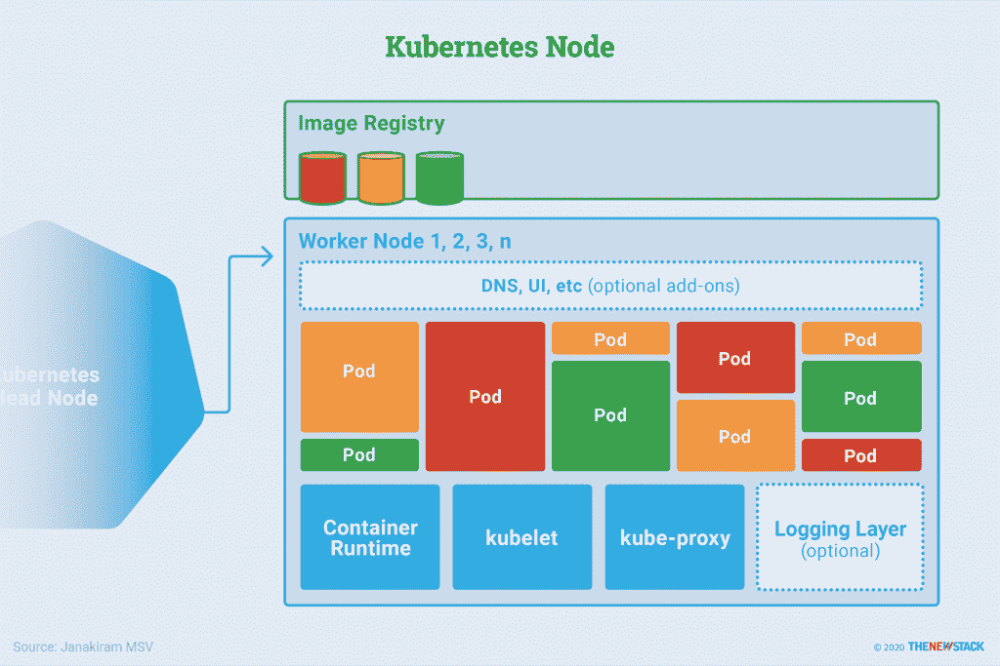

# 应用程序如何在 Kubernetes 上运行？

> 原文：<https://thenewstack.io/how-do-applications-run-on-kubernetes/>

一个节点是 Kubernetes 集群的主力，负责运行容器化的工作负载；日志记录、监控和服务发现的附加组件；和可选的附加组件。其目的是向应用程序公开计算、网络和存储资源。

正如我们在之前关于 Kubernetes 架构的文章中所解释的，头节点通常运行负责调度和管理工作负载生命周期的控制平面。工作节点运行应用程序。头节点和工作者节点的集合成为一个集群。

每个 [Kubernetes 节点](https://thenewstack.io/how-does-kubernetes-work/)包括一个容器运行时，比如 Docker，加上一个与头部通信的代理(kubelet)。节点可以是运行在云中的虚拟机(VM ),也可以是数据中心内的裸机服务器。

工作节点的组件。资料来源:贾纳基拉姆·MSV。

### **容器运行时**

容器运行时负责管理节点中运行的每个容器的生命周期。在节点上安排了 pod 之后，运行时将从注册表中提取 pod 指定的图像。当一个 pod 终止时，运行时会终止属于该 pod 的容器。Kubernetes 可以与任何符合[开放容器倡议(OCI)](https://opencontainers.org/) 的容器运行时进行通信，包括 Docker 和 CRI-O

OCI 是定义运行时规范和映像规范的标准，目标是推动容器运行时和映像格式的标准化。

### **库伯莱**

Kubelet 是 Kubernetes 代理，其职责是与容器运行时交互，以执行启动、停止和维护容器等操作。

每个 kubelet 还监控着吊舱的状态。当一个 pod 不符合部署定义的所需状态时，它可能会在同一节点上重新启动。节点的状态每隔几秒钟就会通过心跳消息传送到头部。如果磁头检测到节点故障，复制控制器会观察到这种状态变化，并在其他正常节点上安排 pod。

### **Kube-Proxy**

kube-proxy 组件被实现为网络代理和负载平衡器，它协调网络将请求路由到适当的 pods。它根据相关的服务名称和传入请求的端口号将流量路由到适当的 pod。它还通过操纵由 iptables 定义的策略和规则来利用特定于操作系统的网络功能。每个 kube-proxy 组件可以与网络层集成，例如 [Calico](https://github.com/projectcalico/calico) 和[法兰绒](https://github.com/coreos/flannel)。

### **测井层**

[orchestrator](https://thenewstack.io/what-is-container-orchestration/) 经常使用日志作为收集每个节点上容器的资源使用和性能指标的方法，例如 CPU、内存、文件和网络使用。云本地计算基金会托管了一个软件组件，该组件提供了一个统一的日志记录层，用于 Kubernetes 或其他 orchestrators，称为 [Fluentd](https://github.com/fluent/fluentd) 。该组件生成 Kubernetes head controller 需要的指标，以便跟踪可用的集群资源以及整个基础设施的健康状况。

### **附加产品**

Kubernetes 支持附加服务形式的附加服务。这些可选的服务(如仪表板)像其他应用程序一样部署，但是与节点上的其他核心组件(如日志记录层和 kube-proxy)集成在一起。例如，dashboard 插件从 kubelet 中提取指标，以显示丰富的资源利用率可视化。基于 kube-dns 或 CoreDNS 的 DNS 插件通过名称解析增强了 kube-proxy。

## 工作负载是容器化的应用程序

虽然控制平面和工作节点构成了核心集群基础设施，但工作负载是部署在 Kubernetes 中的容器化应用程序。

在开发和测试微服务之后，开发人员将其打包为容器，容器是打包为 pod 的最小部署单元。属于同一个应用程序的一组容器在 Kubernetes 中被分组、打包、部署和管理。

Kubernetes 公开了用于部署的原语，同时不断扩展、发现和监控这些微服务的健康状况。命名空间通常用于在逻辑上将一个应用程序与另一个应用程序分开。它们充当一个逻辑集群，为属于一个应用程序的所有资源和服务提供一个明确定义的边界和范围。

在名称空间中，部署了以下 Kubernetes 原语:

### **豆荚**

pod 是 Kubernetes 应用程序的基本执行单元。它是 Kubernetes 对象模型中最小和最简单的单元。pod 也是 Kubernetes 应用程序中最小的可调度项目。如果 Kubernetes 是一个操作系统，那么一个 pod 代表一组运行在集群上的进程——其中每个进程可以映射到一个容器。

pod 充当 Kubernetes 工作负载管理的核心单元，充当共享相同执行上下文和资源的容器的逻辑边界。将相关的容器分组到 pod 中，可以弥补容器化取代第一代虚拟化时带来的配置挑战，因为这使得同时运行多个相关的流程成为可能。

每个 pod 是一个或多个容器的集合，这些容器使用进程间通信(IPC)进行通信，并且可以共享存储和网络堆栈。在容器需要耦合和协同定位的场景中——例如，web 服务器容器和缓存容器——它们可以很容易地打包在单个 pod 中。一个单元可以手动横向扩展，也可以通过名为水平单元自动扩展(HPA)的功能定义的策略来横向扩展。通过这种方法，作为部署一部分的机架数量会根据可用资源按比例增加。

pod 支持开发和部署之间的功能分离。当开发人员专注于他们的代码时，操作人员可以专注于更广阔的图景，决定哪些相关的容器可以被拼接成一个功能单元。结果是最佳的可移植性，因为一个 pod 只是一个或多个一起管理的容器映像的清单。

### **控制器**

在 Kubernetes 中，控制器通过添加额外的功能来扩充 pod，例如所需的配置状态和运行时特性。

部署为 pod 带来了声明性更新。它通过跟踪参与部署的 pod 的健康状况，确保始终保持所需的状态。每个部署管理一个副本集，该副本集维护一组在任何给定时间运行的稳定的副本盒，如期望的状态所定义的。

部署通过扩展、部署历史和回滚功能为 pod 带来了类似 PaaS 的功能。当一个部署被配置为最小副本数为 2 时，Kubernetes 确保至少有两个 pod 一直在运行，这带来了容错。即使在部署只有一个副本的 pod 时，也强烈建议使用部署控制器，而不是普通的 pod 规范。

statefulset 类似于部署，但是适用于需要持久性、定义良好的标识符和有保证的创建顺序的 pod。对于数据库集群之类的工作负载，statefulset 控制器将按照给定的顺序创建一组高度可用的 pod，这些 pod 具有可预测的命名约定。需要高度可用的有状态工作负载，如 Cassandra、Kafka、ZooKeeper 和 SQL Server，在 Kubernetes 中被部署为有状态集。

要强制 pod 在集群的每个节点上运行，可以使用 DaemonSet 控制器。由于 Kubernetes 会在新配置的工作节点中自动调度 DaemonSet，因此它成为配置和准备工作负载节点的理想选择。例如，如果在部署工作负载之前必须在节点上装载现有的网络文件系统(NFS)或 Gluster 文件共享，建议将 pod 作为 DaemonSet 打包和部署。监控代理是用作 DaemonSet 的良好候选，以确保每个节点都运行监控代理。

对于批处理和调度作业，可以为运行到完成作业或 cron 作业打包 pod。一个作业创建一个或多个 pod，并确保指定数量的 pod 成功终止。配置为从运行到完成的 pod 执行作业并退出，而 cron 作业将根据 crontab 格式中定义的计划运行作业。

控制器基于工作负载特征和它们的执行上下文来定义 pod 的生命周期。

现在，我们已经了解了 Kubernetes 控制平面的基础知识以及应用程序如何在 Kubernetes 上运行，是时候讨论[服务发现](/how-does-service-discovery-work-in-kubernetes/)了，以便更好地了解生产工作负载如何在 Kubernetes 上运行。

<svg xmlns:xlink="http://www.w3.org/1999/xlink" viewBox="0 0 68 31" version="1.1"><title>Group</title> <desc>Created with Sketch.</desc></svg>