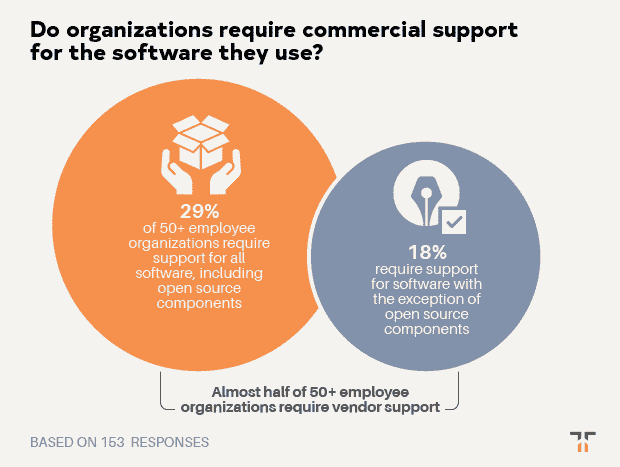

# 组织如何获得开源所需的支持？

> 原文：<https://thenewstack.io/how-do-organizations-get-the-support-they-need-for-open-source/>

Tidelift 赞助了这篇文章。

 [克里斯·格拉姆

克里斯是 Tidelift 的营销主管。Chris 在创建开源技术公司方面拥有超过 20 年的经验，包括在 Red Hat 和技术品牌代理 New Kind 各工作了 10 年，在那里他帮助创建了 Ansible、NGINX 和 Anaconda 等品牌。](https://tidelift.com/) 

*2019 年 6 月，Tidelift 和 New Stack 联合开展了一项专业软件开发人员调查。近 400 人回答了他们今天如何使用开源软件，是什么阻碍了他们，以及什么工具和策略可以帮助他们更有效地使用它。特别是，通过这次调查，我们有兴趣了解一个[管理的开源战略](https://thenewstack.io/how-managed-open-source-boosts-developer-productivity-and-saves-money/)如何帮助开发者回收时间，加快开发，并降低风险。*

在本帖中，我们分享了八个关键发现中的第七个。如果你想在一个地方看到所有的结果，你可以点击下面的链接下载完整的调查报告。

**调查结果#7:几乎一半的组织都有要求他们使用的软件获得商业支持的政策。**

这是管理层反对使用开源的一个由来已久的理由:“但是当出现问题时，我们该找谁呢？”在开放源码的早期，这是西装革履的人的常见说法。现在，由于像 Red Hat、Elastic 和 Cloudera 这样的公司为开源提供了企业级的支持和保证，这种反对在一些大量使用的开源项目中已经变得不那么常见了。

然而，对于大多数用于构建应用程序的开源组件来说，没有商业组织支持它们。我们想更多地了解大型组织如何处理这个难题。他们是否需要供应商备份他们所有的开源依赖项？还是自己养活自己，自己承担风险？

像我们询问的其他开源政策一样，许多回答者不确定他们的组织是否需要软件组件的商业支持。整整 24%的人不知道他们的组织是否要求对生产环境中使用的任何类型的组件提供商业支持。

当我们观察拥有超过 50 名员工的公司时，29%的公司制定了要求对所有软件组件提供商业支持的政策，包括那些开源软件。另外 18%的公司制定了政策，要求对任何非开源组件提供商业支持。这意味着，超过 50 名员工的组织中，几乎有一半需要为他们使用的软件提供某种形式的商业支持。

这就提出了一个问题:为什么开源和专有组件的商业支持会有差距？为什么一个需要软件组件商业支持的组织会排斥开源？

可能的答案是，这是因为开发人员不必通过传统的采购流程来下载免费可用的开源组件，通过在命令行安装一个包来完全跳过他们的法律和采购部门。如果采购没有支付机制，他们就不能限制使用。

> 超过 50 名员工的组织中，几乎有一半需要为他们使用的软件提供某种形式的商业支持。

这样可以吗？在某个时候，这种缺乏监督的情况可能会回来困扰这些组织，就像 Equifax 这样的公司一样。

另一个可能的解释是，这些公司还不知道有什么选项可以为他们提供不受大型商业开源供应商支持的开源组件的支持和保证。即使他们手里有支票簿，也不知道该付给谁。

幸运的是，[管理的开源策略](https://thenewstack.io/how-managed-open-source-boosts-developer-productivity-and-saves-money/)可以帮助解决这个问题。有了托管开源，组织可以向一个供应商付费，获得他们使用的大量开源包的企业级覆盖，跨越 JavaScript、Python、Java、Ruby 等常见的生态系统。随着越来越多需要软件支持的组织理解了托管开源的好处，希望这是“但是当出现问题时，我们该找谁呢？”所有开源组件的问题终于成为过去。

想在一份报告中获得完整的调查结果吗？[让他们现在就过来](https://tidelift.com/subscription/managed-open-source-survey)。

通过 Pixabay 的特征图像。

<svg xmlns:xlink="http://www.w3.org/1999/xlink" viewBox="0 0 68 31" version="1.1"><title>Group</title> <desc>Created with Sketch.</desc></svg>