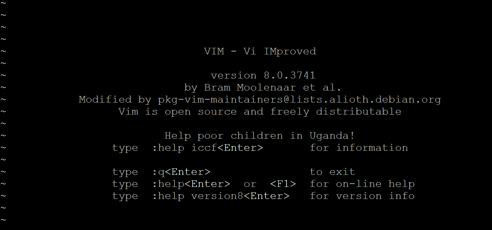
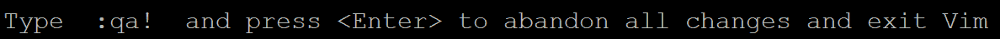
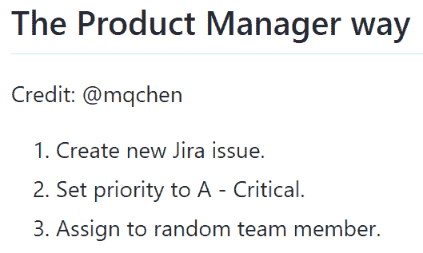
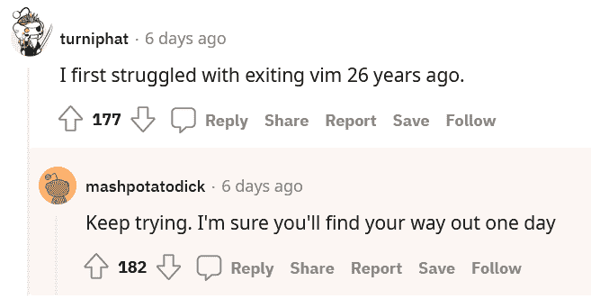

# 如何退出 Vim？一个新手问题变成了技术迷因

> 原文：<https://thenewstack.io/how-do-you-exit-vim-a-newbie-question-turned-tech-meme/>

十年前，一个程序员在 Stack Overflow 上问如何退出有几十年历史的 [Vim](https://www.vim.org/) 开源文本编辑器，这个问题从此成为现代开发经验的文化试金石。

也许这证明了 [50 岁的文本编辑器](https://thenewstack.io/a-look-at-vim-a-text-editor-for-the-ages/)仍然很受欢迎——它现在是开发者社区共享集体体验的一部分。(Vim 是 Bill Joy 在 1976 年创建的 vi 编辑器的 1991 年克隆版，用作名为 ex 的行编辑器的可视模式。它包含在 1978 年发布的最初的 Berkeley Software Distribution[BSD]Unix 中，并且从那以后一直在 Unix/Linux 开发人员的工具箱中。)

但这也说明了一个更大的事实，即需要花时间自学 Vim 的快捷方式和功能。也许有一些秘密的骄傲，因为 Vim 可能很强大——仍然有一个学习曲线。对于苦苦挣扎的第一次用户来说，在几十年前的文本编辑器中陷入 Vim 仍然是一种常见的经历，如果不是普遍的话。

基本上，这是一个基本功能，不能总是以直观的方式执行。当你在 Vim 中输入时，在你第一次按下 escape 键之前，它不会接受像“q”这样的命令——即使这样，像“quit”这样的命令前面也有一个冒号。

一位聪明的 Linux 灰胡子曾经向我们指出，Vim 和微软的 Word 没有什么不同，两者都有两种模式。一种是命令模式，用于保存文件、添加格式、退出程序等等。还有编辑模式，在这里你可以写代码、书籍提案等等。诀窍是学会如何毫不费力地在两者之间切换。

然而，如此多的新手用户在退出 Vim 时被绊倒，以至于当软件启动时，说明会显著地显示在它的欢迎屏幕上——甚至在 Help 命令之前。

在 Vim 中键入 Ctrl-C 两次，现在会在屏幕底部弹出一个提示。

但多年来，这一困难成为一些温和的极客讽刺的深情目标。目前，GitHub 甚至向 77 名贡献者展示了一个名为“[如何退出 Vim](https://github.com/hakluke/how-to-exit-vim/blob/master/README.md) ”的知识库例如，有人建议最好的方法是编辑您的 shell 的别名文件，以便将“vim”映射到一个启动 vim 进程的命令，该进程在 600 秒后超时并结束。(“一定要定期保存。”)

一个 [2019 YouTube 视频](https://www.youtube.com/watch?v=xteTjU8GNMc)展示了一个更加复杂的解决方案。它包括挂起前台 vim 进程(使用 Ctrl-Z)，然后调出所有活动进程的列表(使用 ps ax)，对包含字符串 vim 的所有进程进行 grep，同时过滤掉那个 grep 进程(也包含字符串 Vim)，然后使用 Awk 对结果进行格式化，这样 xargs 命令就可以终止正在运行 Vim 的进程。

`ps ax | grep vim | grep -v grep | awk '{print $1}' | xargs -n1 kill -9`

视频上的评论者以夸张的感激回应，其中一人声称他们被困在 vim 整整一周，另一人补充道“直到现在，我一直按着电源按钮退出 Vim”

## 认识我们自己

当极客们偶然发现这个问题有多普遍时，也会有一种被认可的喜悦和兴奋。

十年前有人问“我如何退出 Vim？”[关于栈溢出](https://stackoverflow.com/questions/11828270/how-do-i-exit-vim)——十年来，这个问题已经被投票 4786 次(被栈溢出用户收藏超过 1000 次)。在过去的 10 年里，这个问题的答案一直被精心维护和策划。虽然花了近五年时间才达到 100 万次浏览，但在此后的五年里，它又获得了 170 万次浏览，总计 270 万次。

上周，Reddit 用户忍不住庆祝了这个问题提出 10 周年。在 Reddit 的编程论坛上发布了最初问题的网址[后，它吸引了超过 5000 次投票——以及另外 660 条评论。](https://www.reddit.com/r/programming/comments/whnwxq/vim_infamous_for_its_steep_learning_curve_often/)

然而，夹杂在评论中的是一些对 Stack Overflow 答案的真诚赞赏。一位评论者回忆道:“事实上，这个答案让我在十年前就开始考虑 Vim。”。"十年后，仍然是我 CS 旅程中最好的偶然软件决策之一."

另一位评论者认为 Vim 不值得它陡峭的学习曲线的名声，因为“它有时会对那些只是试图执行 git 提交的无辜用户造成伤害。我敢打赌，这至少构成了这个问题的一半观点。”

2017 年 5 月，这个问题在 Stack Overflow 的博客上得到了特别的认可[——当时它实现了一个特殊的里程碑。“你并不孤单…”堆栈溢出数据科学家大卫·罗宾逊写道。在这个问题提出后的五年里，已经有超过一百万的其他开发人员陷入了 Vim，如果没有一点帮助，他们是无法逃脱的。“这实际上占了 Stack Overflow 问题每 20，000 次访问中的一次。](https://stackoverflow.blog/2017/05/23/stack-overflow-helping-one-million-developers-exit-vim/)

“这意味着在工作日的交通高峰期，每小时大约有 80 人需要帮助才能走出维姆。”

## 陷入 Vim 的人口统计数据

罗宾逊也不得不承认，这个问题本身现在已经成为一个技术迷因。

但这篇文章也深入研究了这百万次浏览的人口统计(“为了纪念这一里程碑”)。有趣的是，在 2017 年，问题访问占所有 Vim 相关问题访问百分比最高的国家是乌克兰(其次是土耳其、印度尼西亚、巴基斯坦、越南，然后是俄罗斯)。美国排名第 21 位(在澳大利亚之后，印度之上)。

Robinson 还计算了顶级访问者最常访问堆栈溢出的哪个区域(基于区域的标签)，希望通过他们的“主要编程技术”来分解 Vim exiters。结果呢？“最有可能陷入 Vim 的开发人员是前端 web 开发人员:那些主要访问 JQuery、CSS 和 AngularJS 等标签的人。紧随其后的是微软开发者(C#和 SQL Server)和移动开发者(Android 和 iOS)。”

这篇文章推测，微软开发人员通常使用成熟的 IDE，可能不熟悉像 Vim 这样的简单文本编辑器。相比之下，最不可能陷入 Vim 的开发人员是那些主要编程语言是 C、C++、Python 或 Ruby 的人 Stack Overflow 的数据科学家认为这些语言通常是用纯文本编辑器编写的。

但人口统计数据并没有完全消除陷入 Vim 是一种相当普遍的经历的想法。笑话还在继续——见证了这种独特但可能令人困惑的体验，等待着第一次使用 Vim 的用户。

亚马逊的 Kindle 商店有一本关于主题为的幽默的 23 页电子书，作者将它分成了 19 章。(“最后，这是一个解开退出维姆之谜的方法，不会在你身后留下毁灭的痕迹。”)它的顶级评论称其为“简洁的大师级壮举”，并在一篇可能带有讽刺意味的评论中给这本 23 页的电子书打了整整 5 颗星。)”这本书详尽地论述了 Vim 最常见、最不为人知的特性之一，但它读起来既快又轻松。它将经得起时间的考验。”

另一位评论者在他们的评论标题中加入了假装的热情。”退出 Vim 第一次尝试。会再次购买。”

另一个人开玩笑说，“我迫不及待地想看到关于如何访问和使用 vim 帮助的第二版。”

但遗憾的是，一位评论家只给了四颗星。“我会给这本书 5 颗星，但我不知道如何关闭它。”

* * *

# WebReduce

<svg xmlns:xlink="http://www.w3.org/1999/xlink" viewBox="0 0 68 31" version="1.1"><title>Group</title> <desc>Created with Sketch.</desc></svg>