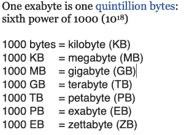

# 你如何编织一个数据结构？

> 原文：<https://thenewstack.io/how-do-you-weave-a-data-fabric/>

随着智能手机和物联网设备的出现，结构化和非结构化数据呈爆炸式增长，人们需要能够处理海量数据，挖掘这些数据并使其可访问。进入数据结构，这是一种帮助理解通过云系统传输的万亿字节、千兆字节以及千兆字节数据的方式。

两年前，《经济学人》宣称数据是新的石油，是世界上最有价值的资源。这些数据库里有黄金，人们只需要找到它，提炼它，提炼它的价值。

数据结构可以跨私有云和公共云提供一致的数据服务目录。为了探索数据结构——它们是什么，为什么需要它们以及如何制作自己的数据结构——我与该领域的三位领先专家进行了交谈，他们是 [NetApp](https://www.netapp.com/us/index.aspx) 的高级副总裁兼云业务部门总经理 [Anthony Lye](https://www.linkedin.com/in/anthonylye/) 、[MapR Technologies](https://www.linkedin.com/in/jandjnorris/)的数据和应用高级副总裁 [Jack Norris](https://www.linkedin.com/in/jandjnorris/) 以及[Talend](https://www.linkedin.com/in/isabellenuage/)的产品营销总监 [Isabelle Nuage](https://www.linkedin.com/in/isabellenuage/) 。

所有这些公司都提供数据结构即服务。

## 什么是数据结构？

与许多技术术语不同，数据结构在提供数据结构即服务(DFaaS)的三家公司中有一致的定义。据 Lye 称，大约五年前，NetApp 的 Kurian 在构建他们的内部项目时创造了“数据结构”一词。他说，人们需要数据得到保护、安全、集成、协调和成本核算。

Nuage 说，数据结构“是一个用于数据集成和管理的单一、统一的平台，使您能够在单一环境中管理所有数据，并加速数字化转型。”她列举了 DFaaS 的常见特征:

*   它通过预包装的连接器和组件连接到任何东西
*   管理所有环境中的数据(多云和内部)
*   支持批处理、实时和大数据用例
*   提供内置的机器学习、数据质量和治理功能
*   支持数据集成和应用程序集成场景
*   提供完整的 API 开发生命周期支持

诺里斯说，最好的视觉效果是“跨越位置、数据类型和访问方法的结构。”在过去，每一部分都需要不同的数据持久化机制。数据结构是跨越所有这些的持久层。

企业面临着民主化数据访问和开放数据的压力。同时，他们必须确保它是安全的、受保护的和可用的。数据结构的一个作用是允许这两种对立的力量协同工作。

Lye 说，一开始，数据结构只是关于内部和防火墙后的数据。现在，随着云技术的爆炸式发展，它变得更加复杂。

“数据有引力，”他说。“它不喜欢被感动。将计算转移到数据比将数据转移到计算更容易。”幸运的是，像 Kubernetes 这样的可用工具使这变得更容易。使用 Istio，您可以创建计算类，这样您就可以将计算移动到数据所在的位置。

通常，数据结构由希望改善业务流程并提高大数据分析、预测性维护、风险和欺诈效率的客户使用。当然，还有合规性，Nuage 说。例如，使用数据湖创建所有客户个人身份信息(PII)数据的清单，以遵守一般数据保护法规(GDPR)

## 最多样化的使用案例

诺里斯说，数据结构价值的一个很好的例子可能来自现实世界:爆破即服务(BaaS)。假设有人想要拆除一栋建筑，但需要保持两边的建筑不动。那需要多少炸药？而不是猜测他们雇佣了 BaaS 公司。公司一开始会问很多问题。多大的洞？需要拆什么？几年来，他们一直在收集关于拆除的各种数据，因此他们将需求与数据相匹配，并确定到底需要什么。这在一定程度上是由于他们的 MapR 数据结构。

“非常精确，”诺里斯说。“这是未来的趋势——公司能够将分析与他们服务的核心价值结合起来。”

世界上最大的比萨公司达美乐比萨公司也是如此，但却处于一个完全不同的行业，该公司在外卖比萨方面有着重要的业务。为了保持竞争优势，该公司现在提供了一种方式，让你现在可以从电视、智能手表、车载娱乐系统或社交媒体平台订购披萨。这从 85，000 个结构化和非结构化数据源中创建了 17TB 的数据。

使用 Talend 的数据结构，Domino 从该公司的销售点系统、26 个供应链中心以及包括短信、Twitter 和 Amazon Echo 在内的数字渠道收集数据。

“我们已经成为一家销售披萨的电子商务公司，”该公司网站称。

在制药业，杂草破坏用于制造药物的作物是一个昂贵的问题。拜耳正在将人工智能技术应用于杂草识别，从而允许农民应用所需的精确解决方案来杀死每种杂草。

因此，拜耳数字农业利用 Talend 实时大数据开发了名为 Weedscout 的新应用。

全世界的农民都可以免费下载 Weedscout。该应用程序使用机器学习和人工智能来匹配识别农民加载到应用程序中的杂草照片。这使得种植者可以对种子品种、作物保护产品的施用量或收获时间做出更好的选择。

“这是提高产量的努力的一部分，同时仍然考虑到农业的环境足迹，”Talend 的网站上说。

## 如何制作你自己的

听起来有用吗？当然有 DFaaS，但是如果您想构建自己的呢？数据结构到底包含什么？

白皮书[数据结构的十二条规则](https://mapr.com/whitepapers/12-rules-for-a-data-fabric/)的作者 Norris 说，第一步是在解决任何技术之前创建一个总体数据计划。“数据操作，”他说，“是理解数据需求的关键。”

解决核心问题至关重要，包括如何治理数据访问以及如何跨位置管理一致性。对于核心容量，您需要解决数据结构如何存储数据、线性可扩展性、分发元数据的能力以及支持数据规模和一致性的体系结构是核心构建块。

他说，如何固定布料非常重要。通常，安全性与访问方法有关，但数据本身并不安全。在结构中，无论如何访问数据，都需要数据级的粒度安全性。

诺里斯说:把你的系统作为一个整体来看待。您需要解决它如何支持数据访问的问题。跨多种协议的混合数据访问很常见。此外，它能否在同一结构中支持多租户、静态数据和动态数据？无论如何访问数据，如何更新相同的基础数据？

“最重要的是，”他说，“你需要回答这个问题:数据是否一致？”

## 数据结构堆栈

Lye 说，数据结构有四层，可以一起使用，也可以单独使用。最底层是数据存储。这里有一组 API，可以通过用户界面对协议进行管理。

接下来是数据服务。API 有助于管理这一级别的一些服务，包括数据保护、移动数据(以及移动数据需要什么连接)、保护数据(谁在访问数据，应该是谁？)并对数据进行检查和分类(是命令吗？一份简历？在正确的地方。).

下一层是控制平面，包括将数据传递给使用者的工具，通常是站点可靠性工程师(SRE)。优化工作负载维度通常是 SRE 的职责。Kubernetes 服务住在这里。

顶层是分析。每家公司都有一个监视所有底层基础设施的数据结构视图，通常通过 REST APIs 发布。

## 工程师需要什么技能

好奇吗？要成为一名数据结构专家，你需要掌握哪些技能？实际上，Nuage 说，当你的公司购买 DFaaS 时，并不多。

她说:“有了提供重要拖放用户界面的数据结构，具有现有技能的数据工程师可以非常快速地掌握处理和转换大规模数据的新技术，如 Spark 或 Serverless。”数据结构的部分目的是让更随意的临时用户或市民数据工程师能够更容易地访问数据。

<svg xmlns:xlink="http://www.w3.org/1999/xlink" viewBox="0 0 68 31" version="1.1"><title>Group</title> <desc>Created with Sketch.</desc></svg>