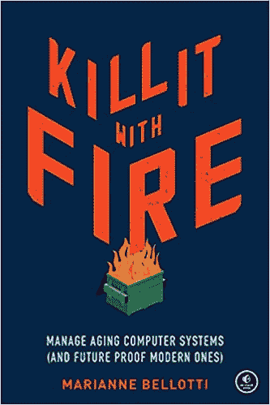
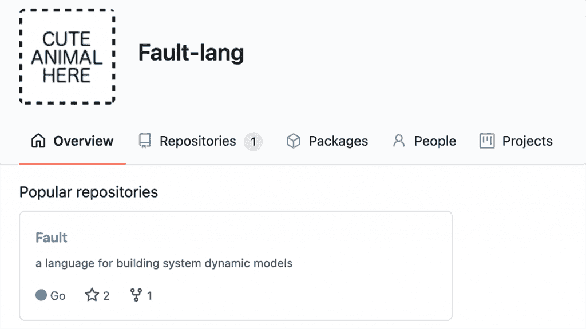

# 工程师如何创造一种编程语言？

> 原文：<https://thenewstack.io/how-does-an-engineer-create-a-programming-language/>

除了是一名软件工程师，Marianne Bellotti 也是一名技术人类学家。早在 2016 年的[我们热爱的系统会议](https://thenewstack.io/systems-we-love/)上，贝洛蒂开始她的演讲时说，她欣赏大多数工程师讨厌的系统——“凌乱、陈旧、胶带和口香糖。”然后她补充道，“幸运的是，我为联邦政府工作。”

当时，贝洛蒂正在为[美国数字服务](https://www.usds.gov/)工作，那里有才华的技术工人被匹配到需要一些咨询的联邦系统。(在那里，她遇到了一个从半个世纪前的 IBM 7074 大型机中提取 JSON 格式数据的 web 应用程序[。)](https://thenewstack.io/happens-use-java-1960-ibm-mainframe/)

丰富的经验使她写了一本书，书名是《用火杀死它:管理老化的计算机系统(和经得起未来考验的现代系统)》。它在兰登书屋的官方[网页](https://www.penguinrandomhouseaudio.com/book/690821/kill-it-with-fire/)承诺，它将提供“一个更加宽容的现代化框架”，其中有“启发性的案例研究和她在该领域工作的令人瞠目结舌的轶事”，包括“每个组织在将数据迁移到云之前都应该权衡的关键因素。”

贝洛蒂现在为国防和国家安全机构工作，担任[叛乱防御](https://rebelliondefense.com/)的系统安全首席工程师(处理[身份和访问控制](https://medium.com/rebellion-defense/identity-digital-redactions-and-international-alliances-83ba39c86779))。

但是她的最新项目是一个播客，记录她在尝试编写自己的编程语言时所学到的东西。

《Marianne 编写一种编程语言》捕捉了一种思维的探险，展示了求知的渴望是如何让软件工程师陷入越来越迷人的兔子洞的。但这也是一个鼓舞人心的“自己动手”精神的例子，并且从一个全新的角度看待使我们的代码运行的解析器、词法分析器和评估器。

简而言之，这是对程序员工具真正来源的一个深度信息解构。

## 深入

在[的一篇博文](https://bellmar.medium.com/marianne-writes-a-programming-language-8fff3e09f3e)中，贝洛蒂邀请听众“通过解析器、语法、数据结构之类的东西，和我一起开始这段奇怪的旅程。”

而这*是*一段旅程，充满了希望和雄心——还有许多意想不到的曲折。“沿着这条路，我将采访活跃在这个领域的研究人员和工程师，并深入通常不会讨论的编程领域，”播客主持人承诺。“总而言之，我希望围绕程序语言设计展开一场对话，它不那么令人生畏，对初学者来说更容易理解。”

但是“Marianne 写一种编程语言”播客也带有适度的自嘲。“我们先解决一个问题，”她的第一集开始了。“这个世界真的需要另一种编程语言吗？可能不会，不会。”但她将其描述为一个激情项目，由良好的老式好奇心驱动。“我一直想写一门编程语言。我想我会从挑战中学到很多。”

> “在一个充斥着各种观点的行业里，人们会为了制表符和空格而殊死搏斗，对于未来的程序语言设计者来说，这并没有太多的指导。”

—玛丽安·贝洛蒂，软件工程师兼播客主持人

贝洛蒂告诉她的观众，在闪亮的技术生涯中，15 年了，“我觉得我的知识中有很多奇怪的漏洞”。即使她知道一些东西，比如字节码和逻辑门，“我也不清楚这些东西是如何协同工作的。”

在播客的[第三集](https://dev.to/bellmar/writing-a-bnf-grammar-featuring-prof-jeff-heinz-1cf0)中，贝洛蒂指出，“至少对我来说，学习一件事最难的部分是首先弄清楚如何学习。”她发现了令人惊讶的最佳实践文档的缺乏，她在 Medium 的一篇文章中写道[。“在一个充斥着各种观点的行业里，人们会为了制表符和空格而殊死搏斗，对于未来的程序语言设计者来说，这并没有太多的指导。”](https://bellmar.medium.com/programming-paradigms-as-language-destiny-f533607d5024)

尽管如此，她的播客的第一集显示了第一缕洞察力的到来。“即使我之前知道的很少，我也能感觉到，为了让一门编程语言正常工作，它的设计中必须有某种凝聚力。”

## 从哪里开始？

她的 Medium 帖子引用了 2012 年的一篇题为“傻瓜编程范例:每个程序员都应该知道的东西”的文章，该文章根据语言类型提供抽象的方式提供了语言类型的分类法。那篇文章显然让她想到了一种编程语言到底是如何帮助沟通其各种数据结构之间存在的联系的——这导致了更多的见解。(在后来的播客中，贝洛蒂甚至说“技术向用户建议应该如何使用它。”)

“最终我得出了自己的结论，”她在她的媒体文章中写道。为了成功地创建自己的语言，她意识到她需要将面向对象或函数式编程这样的编程范式视为“抽象的逻辑分组，并有意地考虑包含什么和不包含什么。”

贝洛蒂还试图设计一种语言来满足她的特定需求:了解在给定的系统中特定类型的问题出现的可能性，以实现模型的弹性。但是在她[的第一集播客](https://dev.to/bellmar/no-one-just-designs-a-programming-language-featuring-thorsten-ball-3a1o)中，贝洛蒂承认她仍然不得不从在谷歌中键入“你如何设计一门编程语言”开始——并对几乎没有出现感到惊讶。(尽管她确实发现“有一整个世界的晦涩难懂的实验语言出现在研究论文中，积累了大量的引用，除了发明者的计算机之外，从未接触过真正的计算机。”)

> “我觉得我一直在努力在家里挂照片，有一天有人敲我的门，向我介绍了锤子，”
> 
> **——玛丽安·贝洛蒂，软件工程师兼播客主持人**

那么从哪里开始呢？她避开了标准枯燥的大学教科书，如[《编译器:原理、技术和工具》](https://en.wikipedia.org/wiki/Compilers:_Principles,_Techniques,_and_Tools)，而是找到了《在 Go 中编写解释器》这本书[，这本书也不可避免地为其解释器创建了自己的编程语言(称为](https://interpreterbook.com/) [Monkey](https://monkeylang.org/) 的【T10 方案的修改版本)。

该书的作者 Thorsten Ball 成为她播客的第一位嘉宾，解释说他的语言与其说是设计出来的，不如说是实验出来的。(后来，其他人[提出了类似的建议](https://dev.to/bellmar/programs-split-over-multiple-files-featuring-troels-henriksen-35pl)——贝洛蒂“用另一种语言选择你喜欢的东西，然后复制实现开始，因为从头开始找出所有的边缘情况真的很难。”)

在第一集播客中，贝洛蒂解释了她的担忧，“我甚至没有意识到我正在做出的微小的设计决定可能会产生巨大的影响……这似乎是这样的情况，程序员在没有完全预见到它们将如何被使用或技术将如何围绕它们发生变化的情况下创建语言。”

## 事情变得复杂了

有些时候,[听起来很简单。(“当你编写编程语言时，你所做的实际上是编写一系列应用程序，这些应用程序接受字符串输入，并将其翻译成机器可以执行的东西。”)](https://dev.to/bellmar/writing-a-bnf-grammar-featuring-prof-jeff-heinz-1cf0)

但是事情很快就变得复杂起来，到了第三集，贝洛蒂开始看到一种模式:“在这个项目中，面对像潮水般的信息变得太熟悉了。”然而，当考虑到对其语言的源代码解释解析器的需求时，她意识到解析器可以自动生成——只要她能为该工具提供必要的语法规则。

“我觉得我一直在努力在家里挂照片，有一天有人敲我的门，向我介绍了锤子，”她告诉她的播客观众。

她最终与一位师从诺姆·乔姆斯基的语言学家进行了交谈，这位语言学家将她介绍给另一位语言学教授，这位教授首先讨论了语言是否可以通过机器学习的蛮力同化来学习，最后解释了为什么乔姆斯基的“上下文无关语法”最终成为了编程语言和编译器的基础。

但是有资源可以发掘。一路上，贝洛蒂找到了一个关于编程语言设计的 [Reddit](https://www.reddit.com/) 论坛[。(“这个 subreddit 充满了伟大的故事，人们会给出详细的解释和鼓励，这在当今的互联网上很少见。”)她还为开发特定领域语言的人建立了一个论坛。](https://www.reddit.com/r/ProgrammingLanguages/)

到了 12 月，她收到了一位心存感激的听众的评论，这位听众也在[编写他们自己的编程语言](https://dev.to/faraazahmad/comment/18iog)，她很高兴找到了一个相关的播客。贝洛蒂在回应中承认，她的整个旅程“到目前为止非常有趣。”

显然正在取得进展。到第 12 集时，贝洛蒂考虑到给她的语言添加模块有多难。(“从我的角度来看，能够将一个系统规格分解成更小的部分意味着你可以重用这些部分，并逐步构建更复杂的系统，这些系统是容易消化的块。”)而且 GitHub 上也已经有了一个空的仓库[在期待代码的到来。](https://github.com/Fault-lang)

然后，在四月中旬，贝洛蒂宣布第 12 集将是“一段时间内”的最后一集。我已经做出了一些我感觉非常好的设计决策，但很明显，验证它们的唯一方法是编写代码并进行尝试。”

她还花了一些时间研究如何优化她的编译器，“但真的，我只需要在这方面埋头苦干一段时间。”

因此，播客进入了一个多产的间隙，留给听众这个诱人的承诺。

"几个月后我会回来告诉你进展如何。"

* * *

## WebReduce

<svg xmlns:xlink="http://www.w3.org/1999/xlink" viewBox="0 0 68 31" version="1.1"><title>Group</title> <desc>Created with Sketch.</desc></svg>