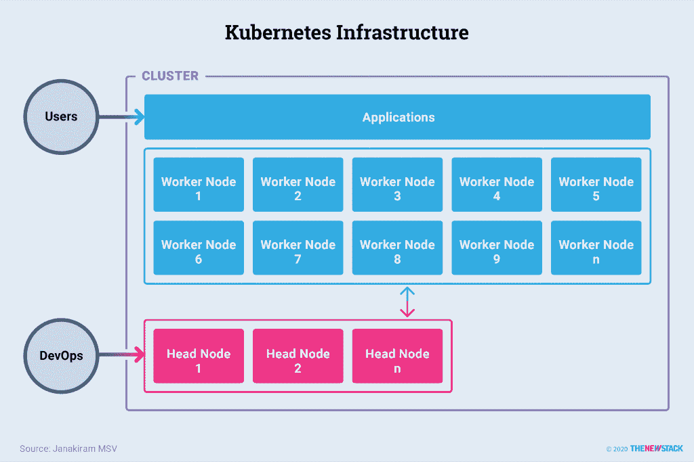

# Kubernetes 是如何工作的？

> 原文：<https://thenewstack.io/how-does-kubernetes-work/>

一个打包成一组容器并部署为微服务的当代应用程序，需要一个足够健壮的基础架构来处理集群的需求和动态编排的压力。这样的基础设施应该提供用于跨主机调度、监控、升级和重定位容器的原语。它必须将底层计算、存储和网络原语视为一个资源池。每个容器化的工作负载应该能够利用暴露给它的资源，包括 CPU 核心、存储单元和网络。

Kubernetes 是一个[开源分布式系统](https://thenewstack.io/what-is-container-orchestration/)，它抽象了底层的物理基础设施，使得大规模运行容器化的应用程序变得更加容易。由 Kubernetes 在整个生命周期中管理的应用程序是由作为一个集合集合在一起并协调成一个单元的容器组成的。一个高效的集群管理器层可以让 Kubernetes 有效地将这个应用从它的支持基础设施中分离出来，如下图所示。一旦 Kubernetes 基础架构完全配置完成，DevOps 团队就可以专注于管理部署的工作负载，而不是处理底层资源池(CPU 和内存)，后者由 Kubernetes 处理。

## Kubernetes 像操作系统一样工作

Kubernetes 是一个架构良好的分布式系统的例子。它将群集中的所有机器视为一个资源池。它通过有效地管理调度、分配资源、监控基础架构的健康状况，甚至维护基础架构和工作负载的期望状态，来承担分布式操作系统的角色。Kubernetes 是一个操作系统，能够在云服务和私有数据中心环境上的多个集群和基础设施上运行现代应用程序。

像任何其他成熟的分布式系统一样，Kubernetes 有两层，由头节点和工作者节点组成。头节点通常运行负责调度和管理工作负载生命周期的控制平面。工作节点充当运行应用程序的主力。头节点和工作者节点的集合成为一个集群。

描述:Kubernetes 星团的全景图。资料来源:贾纳基拉姆·MSV。

管理集群的开发运维团队通过命令行界面(CLI)或第三方工具与控制面板的 API 对话。用户访问工作节点上运行的应用程序。这些应用程序由存储在可访问的映像注册表中的一个或多个容器映像组成。

描述:头节点在 Kubernetes 架构中的作用。资料来源:贾纳基拉姆·MSV。

## 库伯内特控制飞机

控制平面运行提供核心功能的 Kubernetes 组件:公开 Kubernetes API、调度工作负载的部署、管理集群以及指导整个系统的通信。如第二个图所示，head 监控每个节点中运行的容器以及所有注册节点的健康状况。容器映像作为可部署的工件，必须通过私有或公共的映像注册中心对 Kubernetes 集群可用。负责调度和运行应用程序的节点通过容器运行时从注册中心访问图像。

标题:头节点的组件。资料来源:贾纳基拉姆·MSV。

Kubernetes 头节点运行构成控制平面的以下组件:

### etcd

etcd 由 CoreOS 开发，后来被 Red Hat 收购，它是一个持久的、轻量级的、分布式的、键值数据存储，用于维护集群的配置数据。它代表群集在任何给定时间点的整体状态，充当真实情况的单一来源。各种其他组件和服务监视 etcd 存储的变化，以保持应用程序的期望状态。该状态由声明性策略定义；实际上，这是一个说明该应用程序的最佳环境的文档，因此编排者可以努力实现该环境。该策略定义了 orchestrator 如何处理应用程序的各种属性，如实例数量、存储要求和资源分配。

etcd 数据库只能通过 API 服务器访问。任何需要读写 etcd 的集群组件都是通过 API 服务器来完成的。

### API 服务器

API 服务器通过 HTTP 上的 JSON 公开 Kubernetes API，为 orchestrator 的内部和外部端点提供表述性状态转移(REST)接口。CLI、web 用户界面(UI)或其他工具可能会向 API 服务器发出请求。服务器处理并验证请求，然后更新 etcd 中 API 对象的状态。这使得客户端能够跨工作节点配置工作负载和容器。

### 调度程序

调度器根据对资源可用性的评估选择每个工作负载应该运行的节点，然后跟踪资源利用率以确保 pod 不会超出其分配。它维护和跟踪资源需求、资源可用性以及各种其他用户提供的约束和策略指令；例如，服务质量(QoS)、相似性/反相似性要求和数据局部性。操作团队可以声明性地定义资源模型。调度程序将这些声明解释为向每个工作负载提供和分配正确的资源集的指令。

### 控制者-管理者

Kubernetes 架构中赋予其多功能性的部分是控制器管理器，它是头部的一部分。控制器管理器的职责是通过一个定义良好的控制器来确保集群始终保持应用程序的预期状态。控制器是一个控制循环，它通过 apiserver 监视集群的共享状态，并做出更改，试图将当前状态移向所需状态。

控制器通过持续监控集群的运行状况以及部署在该集群上的工作负载来维持节点和单元的稳定状态。例如，当一个节点变得不健康时，在该节点上运行的 pod 可能变得不可访问。在这种情况下，控制器的工作是在不同的节点中调度相同数量的新 pod。此活动确保集群在任何给定的时间点都保持预期的状态。

Kubernetes 附带了一组运行在控制器管理器内部的内置控制器。这些控制器提供了与某一类工作负载相关联的原语，例如无状态、有状态、预定的 cron 作业和运行完成作业。开发人员和操作人员可以在 Kubernetes 中打包和部署应用程序时利用这些原语。

本系列的下一篇文章将更详细地探讨 Kubernetes 架构，包括 worker 节点和工作负载的关键组件；服务和服务发现；以及网络和存储。

<svg xmlns:xlink="http://www.w3.org/1999/xlink" viewBox="0 0 68 31" version="1.1"><title>Group</title> <desc>Created with Sketch.</desc></svg>