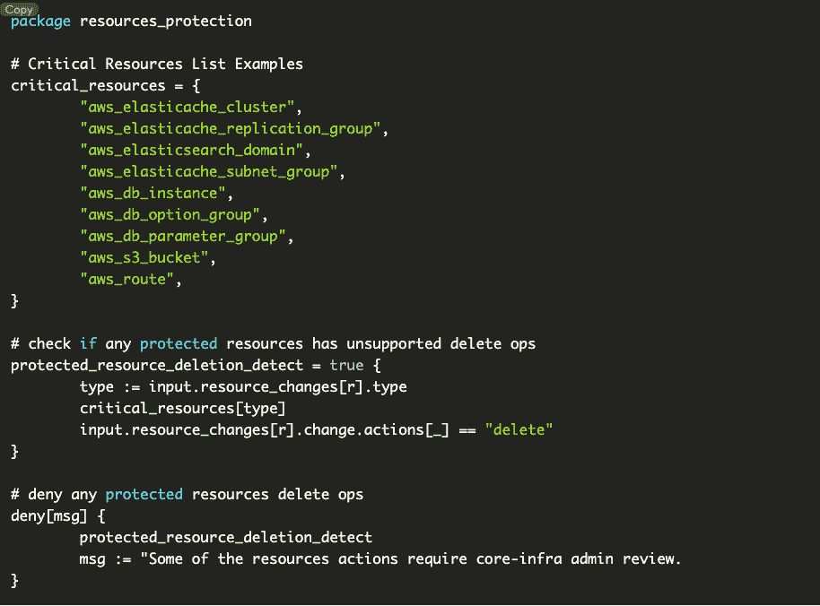
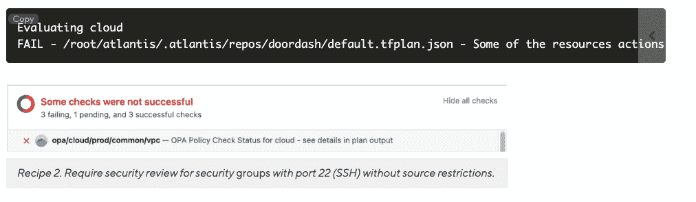
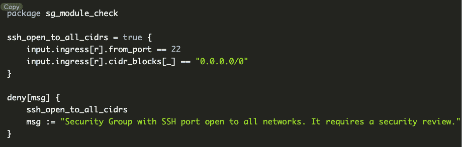
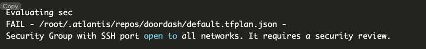
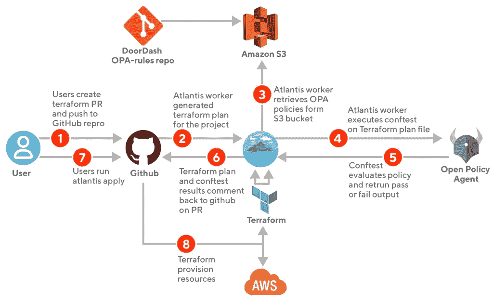

# DoorDash 如何使用开放策略代理管理其基础设施

> 原文：<https://thenewstack.io/how-doordash-governs-its-infrastructure-with-open-policy-agent/>

在线交付服务 DoorDash 使用基础设施即代码(IaC)来自动化开发运维流程。为了安全和成功地做到这一点，该公司实施了安全措施，以确保不会发生重大变更和安全问题。

DoorDash 使用 [Terraform](https://www.terraform.io/intro) 作为他们的基础设施供应工具。根据 DoorDash 软件工程师[林杜](https://www.linkedin.com/in/lin-du-lance-3b901a29/)和 DoorDash 安全工程师[尤维纳利斯·桑多斯](https://www.linkedin.com/in/juvenal-santos/)撰写的 DoorDash 工程博客中的[案例研究](https://doordash.engineering/2022/09/20/how-doordash-ensures-velocity-and-reliability-through-policy-automation/)，Terraform 的一大卖点是它使用了[哈希公司](https://www.hashicorp.com/?utm_content=inline-mention)的 HCL(哈希公司配置语言)，这类似于 JSON，但具有额外的数据结构和内置功能。

IaC 越来越受欢迎的原因有很多。可能是因为应用和功能不断增长。或者可能是因为人类参与越多，出现人为错误的可能性就越大。即使人为误差很小，2000 的 2%还是 40。如果不考虑潜在的严重性，这个数字并不算大。不管怎样，我认为最纯粹的形式是，我们是工程师。我们用代码交流。我们自动化。现在这种情况蔓延到了 DevOps。

## **欢迎使用基础设施代码**

简而言之，IaC 是包含基础设施规范的配置文件，而不是人工实现。IaC 是通过代码而不是手动过程来管理和供应基础设施。

DoorDash 使用 GitHub 进行版本控制和 IaC 生命周期管理，使用 GitOps 进行 CI/CD 工具。

因为没有策略即代码就没有 IaC，但是不，我们不称它为 PaC(尽管我们也可以这样称呼它)。策略(也称为规则、条件、指令)是保持自动化基础设施形状的策略。

策略文件中可能包含哪些说明或(咳咳策略)？DoorDash 建议的领域包括云本地基础设施、应用程序授权或 Kubernetes 准入控制。定义基础设施代码通过安全控制和部署所需条件的规则也与编写策略时做出的决策非常一致。

政策不仅定义了可以做什么，还定义了不应该做什么。确保它看起来像这样是一回事，但是如果正在调整负载平衡器，会发生什么呢？这有可能是一个突破性的变化，但不一定会导致关键的停机时间。

DoorDash 有一个政策护栏，需要时需要来自不同团队的额外代码审查(例如，在负载平衡器的情况下，流量工程师需要在批准前进行审查)。

其他一些护栏包括:

*   受支持的 Terraform 模块允许基础架构更改，只要工程师采用推荐的方法部署云资源，批准就会自动进行。
*   需要安全小组审查的更改。
*   围绕基础设施可允许变更的成本参数。

## **这里的开放策略代理将逻辑与逻辑解耦**

目标是从策略逻辑中导出业务逻辑，因为应用程序(也称为业务逻辑，也称为策略执行)不能决定在哪里实现策略。所以进入左舞台:T2 开放政策代理。现在，伙计们，如果我们稍微向左看，我们会看到这个可爱的开源、通用策略引擎将策略决策从应用程序的其他职责中分离出来。[减压阀](https://thenewstack.io/strengthen-compliance-by-analyzing-rego-in-ci-cd-pipelines/)(高级声明性)是语言策略，简单的 API 是用它编写的。

当软件需要一个策略决策时，它通过发送结构化数据(可能是 JSON 作为输入)来查询 OPA。然后，OPA 通过根据策略和数据评估查询输入来生成策略决策。

## 好了，伙计们！运行中的运算放大器

食谱 1。删除关键资源时，要求核心基础架构管理组审查

尝试从基础架构代码中删除关键云呼吸将生成以下“OPA 检查失败”消息:

尝试使用端口 22 和 CIDR 0.0.0.0/0 创建/更新安全组会生成以下“OPA 检查失败”消息:

## **DoorDash 的工作流程**

DoorDash 使用一个自托管版本的 [Atlantis](https://www.runatlantis.io/docs/policy-checking.html) 来自动执行 Terraform pull 请求，以及 [Conftest](https://www.conftest.dev/) 来检查结构化配置数据。现在是图表:

创建 GitHub pull 请求后，Atlantis 运行一个 Terraform 计划，并将计划文件传递给 conftest。Conftest 提取定制的减压阀策略[Amazon Web Services](https://aws.amazon.com/?utm_content=inline-mention)‘S3 桶，根据 Terraform 计划评估 OPA 策略，然后将输出结果提交给 PR。

**所有这些都发生在一个动作中，如果你认为这种事情很疯狂的话，这是相当疯狂的…** 你可能会这样认为，因为你已经在本文中讲到这里了。

所有者很快就知道它是否满足所有的策略要求，或者在提交之前需要修改，然后再进一步审查。这可能也不会损害 DevOps 和其他工程团队之间的关系。

对于如何更大规模地利用这一技术，还有很多探索的余地。DoorDash 提到他们正在探索云成本政策。DoorDash duo 写道，“我们的目标是为所有基础设施运营提供统一的体验，我们相信这是工程工作流变革的未来，”这是继续朝着这个方向推进的观点。

<svg xmlns:xlink="http://www.w3.org/1999/xlink" viewBox="0 0 68 31" version="1.1"><title>Group</title> <desc>Created with Sketch.</desc></svg>