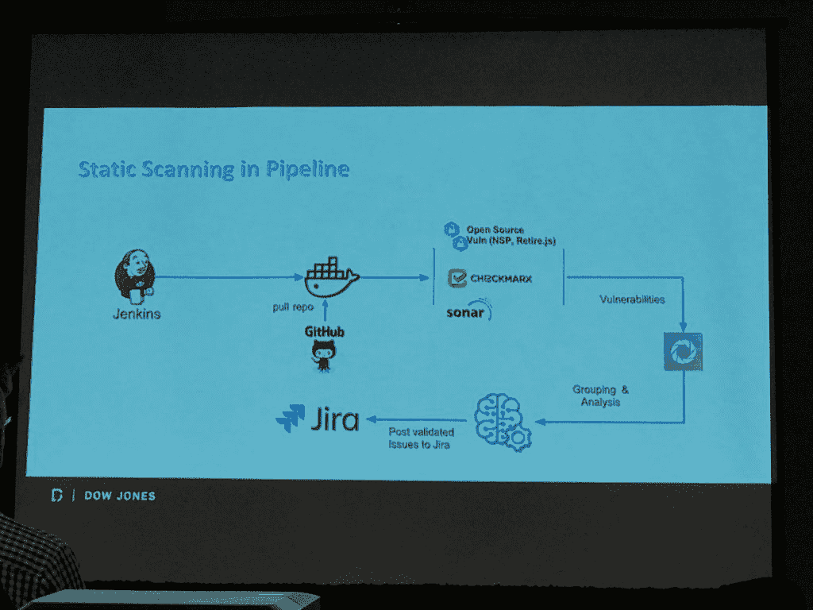

# 道琼斯如何将安全性纳入其自动化开发管道

> 原文：<https://thenewstack.io/how-dow-jones-folded-security-into-its-automated-dev-pipeline/>

像许多组织一样，道琼斯金融媒体公司在将自动安全检查纳入其持续集成和交付管道方面面临挑战，这种做法被称为“DevSecOps”。因此，该公司开发了许多用于自动化的开源工具，以及一些管理实践，以在不中断开发人员流程的情况下检查新代码的安全性。

“众所周知，安全工具对 CI/CD 并不友好，”道琼斯的产品安全总监杰伊·克拉斯在本周于北卡罗来纳州罗利举行的[万物开放](https://allthingsopen.org/)会议上说。

道琼斯安全团队的安全架构师 [Pranavkumar Patel](https://github.com/pranav1688) 说，这个由两名成员组成的产品安全团队的目标是尽可能提高道琼斯 800 名开发人员的工作效率，即尽可能多地自动化软件开发中的低级安全工作。

为此，他们开发了两个应用程序，可以自动执行许多不同的安全测试，因此可以将它们合并到公司的持续集成和部署管道中，从而减少手动执行这些检查所需的时间和精力。

在审查了 DevSecOp 工具供应商的产品并发现它们在覆盖和/或自动化方面有所欠缺后，安全团队决定自己构建软件。所以他们建立并开源了自己的软件。

作为《华尔街日报》、《巴伦周刊》、《市场观察》和道琼斯新闻服务的出版商，[道琼斯](https://github.com/dowjones/hammer)至少从 2012 年开始依赖开源。道琼斯的工程总监 Vishaal Patil[说，当时公司开始使用 Node.js，后来扩展到使用 React 和 Express.js 进行网络开发，使用 Terraform 管理云基础设施。该公司最近也成为了开源贡献者。](https://github.com/dowjones)

第一个工具是 Hammer，它的出现源于一年前[公开的安全漏洞](https://www.upguard.com/breaches/cloud-leak-dow-jones),在那次事件中，由于亚马逊网络服务 S3 存储桶上错误配置的权限设置，数百万用户的账户被泄露。该团队现在承认这是一个愚蠢的错误，因此它领导了一个名为 [Hammer](https://github.com/dowjones/hammer) 的软件，该软件确实检查了这样的错误，比如简单的配置错误。它甚至可以“自动修复”一些错误，并为其他错误提供易于操作的警报。

该软件本身是许多 AWS Lambda 函数，这些函数扫描 AWS S3 桶中的道琼斯代码和数据，寻找公共 Docker 实例的错误配置模式，如开放端口、不正确的权限设置、不正确的 IP 号码、暴露的密钥。漏洞可能来自简单的输入错误。“这些是真正的问题，可能会在整个行业造成许多事故，”帕特尔说。

[https://www.youtube.com/embed/Z0wl_lIq4Ys?feature=oembed](https://www.youtube.com/embed/Z0wl_lIq4Ys?feature=oembed)

视频

Kelath 指出，第二个工具暂定名为 Braavos，用于在部署管道中自动进行安全检查。这个包的想法是尽量减少安全检查对开发人员工作流程的干扰。

最初，Dow Jones 开发管道中包含了一系列全面的安全检查工具，这些工具都是在管道的不同位置触发的，例如在构建阶段。然而，开发人员抱怨它们，因为它们引发了误报，否则只会因为额外的需求而使开发管道停止。因此，安全团队寻找一种方法，悄悄地将这些工具放入管道，“特洛伊木马式的”，Kelath 说。

作为替代方案，该团队将一组最重要的工具和规则集捆绑到一个容器中。通过这种方式，“开发人员并没有真正与安全工具进行交互。他们不是测试者，”Kelath 说。该团队希望将运行所有安全检查的时间减少到 10 分钟或更少。他指出，因此他们减少了检查工具的数量，只检查那些“我们只知道我们不擅长的”东西，比如跨端脚本、SQL 注入问题。其他问题可以在管道之外解决。

“不要试图煮沸海洋。只要看看你真正想在组织中解决的两三个大问题就行了，”Kelath 说。目前，生产管道的检查过程大约需要 53 分钟才能完成，安全部分大约需要 5 分钟才能完成。

对于道琼斯来说，这组工具包括 [CheckMarx](https://www.checkmarx.com/) (静态代码分析) [Git-Secret](http://git-secret.io/) (一个私人数据仓库) [NPM-Audit](https://docs.npmjs.com/cli/audit) (安全审计) [Burp](https://portswigger.net/burp) (动态网络漏洞扫描器)，以及 [SonarCube](https://docs.sonarqube.org/) 质量管理软件。

特别是，假阳性可能是 CI/CD 管道的一个特殊挑战，尽管有许多事情可以降低它们，Kelath 指出。许多工具都是为减少误报而设计的，比如 [DefectDoJo](https://owasp.org/www-project-defectdojo/) ，来自[开放 Web 应用安全项目](https://www.owasp.org)。

该团队对试图在管道中插入安全性的其他人有一些额外的建议。一个是当开发人员在开发的那个阶段工作时，提醒他们一个错误。在代码继续运行之后，修复一个 bug 变得更加困难，开发人员对此也不感兴趣。此外，安全检查应该尽可能完全集成到开发人员自己的工作环境中。

“一旦你告诉开发者进入一个安全工具并检查结果，你就完全失去了他们，”Kelath 说。

*All Things Open 资助了此次活动的差旅费用。*

专题图片(从左至右):道琼斯的维沙尔·帕特尔、普拉纳夫库马尔·帕特尔、杰伊·克拉斯。

<svg xmlns:xlink="http://www.w3.org/1999/xlink" viewBox="0 0 68 31" version="1.1"><title>Group</title> <desc>Created with Sketch.</desc></svg>