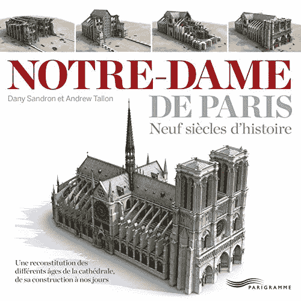

# 无人机和机器人如何帮助拯救巴黎圣母院

> 原文：<https://thenewstack.io/how-drones-and-robots-helped-save-notre-dame/>

当巴黎圣母院在 21 世纪面临火灾时，是现代技术帮助扑灭了火焰——而且将是现代技术修复了损害并将其送向下一个千年。

该网站 Hackaday 惊叹于人类的足智多谋，称赞应急人员，同时指出“与他们并肩战斗的是尖端技术”,这些技术指导了消防员，有时还取代了他们的位置。

接下来几天的故事暗示了我们的新兴技术——偶尔在云的帮助下——在未来几年将如何被使用。

## 派出无人驾驶飞机

首先是两架 DJI 无人机——Mavic Pro 和 Matrice M210——它们提供了火焰的近距离鸟瞰图。具有讽刺意味的是，无人机在巴黎是被禁止的，但这些是政府所有的无人机——来自内政部和文化部——所以推测他们限制区域的“地理围栏”已经被禁用了。

随着火焰的燃烧，消防队员还派出了巨像，一种遥控微型机器人坦克，可以喷射连续不断的水流。这种重达 1100 磅的“无人驾驶地面车辆”由操纵杆控制，以每小时仅 2 英里的速度移动到位，但它防水、防热，并配备有水炮。Hackaday 指出，它通过创造一种冷却效果，挽救了彩色玻璃窗。

《华盛顿邮报》报道说巨像也能爬楼梯——而且它[可能是即将到来的事情](https://www.washingtonpost.com/technology/2019/04/17/firefighters-had-secret-weapon-when-notre-dame-caught-fire-robot-named-colossus/)的先兆。《华盛顿邮报》援引法国官员的话说，巨像是“新一波消防机器的一部分，这些机器被用来在火灾发生时保护人们免受伤害”，并称巨像的表现“可能会被视为机器人消防新时代的开端。”

[https://www.youtube.com/embed/6G-79XpzgNc?feature=oembed](https://www.youtube.com/embed/6G-79XpzgNc?feature=oembed)

视频

他们指出，许多其他团体也在开发类似的消防机器，包括中国的[类似机器人](https://www.youtube.com/watch?v=yuyEq4Q9Glg)，豪和豪技术公司制造的[工业消防机器人](https://youtu.be/W4jIJr3BlPY)和[洛克希德·马丁公司的 Fire Ox](https://www.youtube.com/watch?v=6YGvkkm4H-w) 。“这些机器让人们远离危险，并提供了一种替代将笨重的消防水龙带拖进杂乱建筑的古老做法的方法。”

[https://www.youtube.com/embed/6YGvkkm4H-w?feature=oembed](https://www.youtube.com/embed/6YGvkkm4H-w?feature=oembed)

视频

这篇文章还引用了安全工程/咨询公司 Jensen Hughes 的 R&D 副总裁 Brian Lattimer 的话，他预测很快机器人[将拥有传感器，让它们能够看穿烟雾](https://www.washingtonpost.com/technology/2019/04/17/firefighters-had-secret-weapon-when-notre-dame-caught-fire-robot-named-colossus/)(例如，识别用水瞄准的热点)——甚至还有复杂的人工智能系统，让它们能够自主操作。最终目标“将是消防员与这些机器人一起参与进来，协助和评估危险，以便他们能够计划有效的应对措施。”他还预测了合作机器人的未来，“在空中和地面上——它们将与人密切合作，降低人类生命的风险。”

## 精密扫描

但是还有另一种现代技术将在拯救巴黎圣母院中发挥作用。《大众力学》指出，瓦萨学院艺术史教授安德鲁·塔隆使用安装在三脚架上的徕卡扫描站 C10 激光束创建了一个精确到 5 毫米以内的 3D 模型。

“我对哥特式建筑矗立的方式很感兴趣，”塔隆在 2015 年向国家地理杂志解释道，“以及它们在结构上处理自己的方式。”但是缺少那个时代的书面材料。“石匠从来不会在一天结束时停下来说，‘嗯，我这样建造我的大教堂是因为……’”所以塔龙花了五天时间收集大教堂内部的超过十亿个数据点，将其描述为一种回顾过去的方式。

[https://www.youtube.com/embed/jAi29udFMKw?feature=oembed](https://www.youtube.com/embed/jAi29udFMKw?feature=oembed)

视频

加拿大广播公司指出，塔隆于去年去世，享年 49 岁。但他的详细扫描可能会成为修复大教堂的关键部分，最终“他捕捉巴黎圣母院建设者的美丽和创造力的努力将成为巴黎地标悠久历史的一部分。”

2013 年，塔隆[还与人合著了一本关于圣母院](https://www.amazon.com/Notre-dame-Paris-Dany-Sandron/dp/2840967685/ref=sr_1_1?keywords=andrew+tallon&qid=1555630753&s=gateway&sr=8-1)的书，再现了几个世纪以来圣母院的样子。

瓦萨学院院长乔恩·切尼特告诉法新社，如果塔隆的“学术工作能够以某种方式告知那些将承担起恢复大教堂昔日荣耀这一艰巨任务的人，那么它[将成为一位非常出色的学者](https://news.yahoo.com/american-hard-drives-most-accurate-3-d-model-012229311.html)的恰当纪念，他为圣母院奉献了太多”。

他们报告说，这些数据目前存储在瓦萨的外部硬盘上，在哥伦比亚大学有副本，这是一个名为“测绘哥特式”的合作项目的一部分。“如果建筑师需要数据，必须亲自交付，因为数据太大，无法通过互联网传输。”

《大西洋月刊》采访了瓦伦的扫描助手保罗·布莱尔，他现在是哥伦比亚大学的计算机科学讲师。Blaer 指出大约有 1tb 的数据。但是*起点*杂志指出[它是一个更大作品](https://www.pobonline.com/articles/101625-could-late-professors-3d-scans-save-notre-dame)的一部分。在瓦萨尔学院露西·梅纳德·萨尔蒙基金的支持下，梅隆基金会拨款资助，塔隆得以扫描近 40 座哥特式建筑，包括坎特伯雷大教堂(建于 1070 年)以及沙特尔和布尔日大教堂。

这些难以处理的万亿字节数据将很快成为又一个转移到云的不为人知的活动。该杂志引用了 Tallon 在去世前对徕卡地质系统有限公司名为 JetStream 的“交钥匙点云分布解决方案”的评论。

“JetStream 现在在亚马逊云空间的 Vassar 运行，很快将使与世界各地的专家进行远程研究合作成为可能。”

## 由机器人还原？

但《华盛顿邮报》提醒读者，在修复这座中世纪大教堂时，“可能要靠机器人来拯救它了。”他们采访了东北大学的土木工程教授 Jerry Hajjar，他指出，现在配备激光扫描仪和相机的无人机可以调查火灾损失——并创建今天大教堂状态的详细 3D 地图。甚至还有类似 x 光的功能，可以评估石墙，估计它们现在承受了多大的压力。

Hackaday 推测，无人机也可能在巴黎圣母院的重建中发挥作用。“从空中，装有高分辨率相机的无人机将能够快速拍摄整个现场，这可用于通过摄影测量创建结构的三维模型；有助于最终设计出一个与原始石雕融为一体的现代屋顶。”

关于技术在修复巴黎圣母院中的作用，有许多积极的故事，但也有另一种观点。周五，大教堂的教区长告诉当地商人，火灾可能是由电脑故障引起的[*，而一家英国报纸(引用法国报纸)报道称，当“电脑故障*](https://www.wtsp.com/article/news/nation-world/notre-dame-fire-cathedral-rector-points-to-computer-glitch-as-possible-cause/507-9de60bc5-7910-4543-af92-2e35094f1f96)*[将调查人员送至大教堂错误的地方](https://www.telegraph.co.uk/news/2019/04/17/notre-dame-fire-cathedral-blaze-cause-donation/)时，消防队员损失了宝贵的时间*

 *所以也许最终圣母院的故事向我们传递了同样的信息，它在漫长的八个世纪里一直在传递给人类。

也许科技和人类本身一样，仍然处于一种不完美的状态。

* * *

# WebReduce

<svg xmlns:xlink="http://www.w3.org/1999/xlink" viewBox="0 0 68 31" version="1.1"><title>Group</title> <desc>Created with Sketch.</desc></svg>*