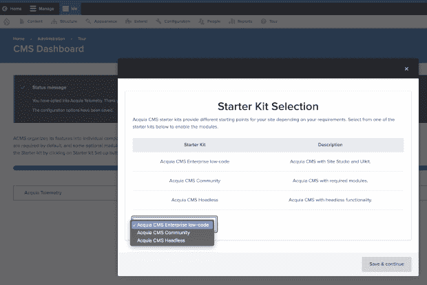

# Drupal 如何融入一个日益无头的 CMS 世界

> 原文：<https://thenewstack.io/how-drupal-fits-into-an-increasingly-headless-cms-world/>

在过去的几年里，无头的内容管理系统已经颠覆了传统上保守的内容管理系统市场。在无头 CMS 中，前端(也称为头部；表示和发布)与后端(内容)分离，并在核心系统之外进行管理。像 WP Engine 这样的 WordPress 供应商现在把无头产品放在他们网站的最前面和中心。即使是从开源 WordPress 产品中分离出来的 Automattic，也有一个无头 CMS 产品——尽管其创始人马特·莫楞威格最初不愿意接受这一趋势。

为了不被超越，WordPress 的长期竞争对手 Drupal 在 headless 上也有很多话要说。我与 Drupal 创建者 [Dries Buytaert](https://twitter.com/Dries) 谈论了他的公司 Acquia 的新“开源，无头初学者工具包”，这是今天宣布的基于 Drupal 的 Acquia CMS 的一部分。

## 小心接近无头

Buytaert 自 2016 年以来一直在提供关于解耦 Drupal [的建议，因此他对何时以及如何使用无头方法有一些强烈的看法。](https://dri.es/how-should-you-decouple-drupal)

一开始，他承认选择一个无头 CMS 需要权衡利弊。“Headless 通常对开发人员来说很好，”他告诉我，“但对业务人员或营销人员来说是有代价的。[……]我看到许多数字机构真的在推动 headless，而这实际上并不符合客户的利益。”

他认为机构有时会选择 headless，以便他们的开发人员可以使用最新的 JavaScript 框架，但他警告说，这可能意味着内容创作者“失去预览、上下文编辑和页面布局等功能——所有这些功能在 headless CMS 中并不总是可用。”

根据新闻稿，“Acquia CMS Headless Starter Kit”的主要好处是使组织“能够将内容交付给不仅仅是传统的 web 浏览器。”引用的例子包括数字标牌、可穿戴设备、聊天机器人、移动应用和信息亭(我不得不谷歌后者以确保这一产品类别仍然存在；但毫无疑问，想想你当地电影院的自助屏幕，它允许你购买门票。

阿夸的无头初学者工具包

除了 headless 工具包，Acquia 还发布了 Next.js 初学者工具包，“以帮助加速前端应用程序的构建，这些应用程序显示在 headless CMS 中创建的内容。”

Buytaert 告诉我，Acquia 的大客户经常使用混合方法，既使用传统的 Drupal 软件，也使用 headless APIs。

“我们看到[混合]对大型组织非常重要，因为他们有许多不同的站点，”他说。“而且每个地点都有很大的不同。[……]有些是模板化的，有些是定制化的，有些[网站]有工程团队，有些只有营销团队。而且，如果您经常与拥有多样化网站组合的大型组织交谈，他们需要能够混合和匹配这些不同的架构方法。”

## Drupal vs. WordPress in Headless

Drupal 创建于 2001 年，甚至早于 WordPress(几年后才推出)。它一直将自己定位为比 WordPress 更强大的 CMS，这意味着它的目标是开发者和内容创作者。Drupal 目前表示，它希望吸引“雄心勃勃的网站建设者”，Buytaert 将其定义为开发者和内容创作者之间的中间地带。所以我问他“雄心勃勃的网站建设者”倾向于如何使用 headless？

“我们看到人们用它做各种不同的事情，”他回答说。“有时是因为他们希望使用自己选择的 JavaScript 框架，但我们也有一些客户已经与 AR(增强现实)解决方案、聊天机器人或语音助手进行了集成。这不仅是为了创建不同的传统网站，也是为了创建其他类型的应用程序。”

我问，那么 Drupal 处理 headless 的方式和 WordPress 有什么不同呢？

“我的理解是，它在 WordPress 中更受欢迎，”他说，“而我们在 Drupal 中采用的方法是重写 Drupal 的核心系统，几乎就像一个开胸手术。”

他解释说，Drupal 有一个基础版本，叫做“Drupal Core”，它“自带所有这些开箱即用的功能”他说，这些无头功能并不是“附加”的，而是作为传统 Drupal CMS 的替代方案。相反，他们的方法是让 headless 成为“平台核心的一部分”

他补充说，他并不确定 WordPress 是如何处理 headless 的，“但上次我检查时，它更像是一个你可以安装的插件——它不像 Drupal 那样是 WordPress 的原生插件。”

## 纯粹的无头提供者和 Jamstack

Drupal 与纯无头 CMS 公司(如 Strapi 和 Contentful)的比较更加微妙。我以前写过，纯 play 无头解决方案往往对内容创作者的支持[很差](https://thenewstack.io/strapi-headless-cms-and-lessons-learned-from-docker/)；它们不像 Drupal 或 WordPress 那样容易使用。Buytaert 认为，他们最终可能会与他的公司 Acquia 现在提供的服务趋同。

“我们已经进入了 headless，并在 Drupal 中采用了许多 headless 的想法，但反之亦然，我觉得纯粹的 headless 解决方案可能也在向 Drupal 发展——因为他们试图弄清楚如何进行预览，如何进行布局，如何进行上下文编辑。[……]因此，在我看来，他们会将所有这些功能添加到未来版本的[他们的产品]中，最终，事情几乎会趋同。”

另一个在过去几年中风靡开发者世界的网站创建趋势是 Jamstack。Jamstack 中的“jam”指的是 JavaScript、API 和标记；“栈”部分指的是云计算技术。我问 Buytaert Drupal 如何融入 Netlify 和 Gatsby 等公司推广的 [Jamstack 模式](https://thenewstack.io/up-the-stack-a-year-end-review-of-serverless-jamstack-and-javascript/)。

“盖茨比实际上是由两个 Drupal 开发者创建的，”他回答说，并补充说“Drupal 是盖茨比支持的第一个内容平台。”就 Jamstack 的核心功能而言，包括创建利用 cdn(内容交付网络)的静态网站，他只是指出，15-20 年前“我们正在生成静态页面——这一直是 Drupal 能够做到的一项功能。”他指出，有一些 Drupal 模块(插件的术语)为 Drupal 添加了静态站点生成器(SSG)功能。

尽管如此，他承认 Jamstack 为网站创建引入了一些独特的创新。

“新的是一些 Jamstack 解决方案使用的一些方法，如开发人员工作流，略有不同，是新的——那个世界正在发生一些伟大的创新，不要误会我的意思，但我们也在重复旧的概念。”

## 不要忘记内容创作者

尽管 Drupal 是一个比通常更具技术性的 CMS 平台，并且主要面向开发者，Buytaert 说“不要把营销人员和内容创建者抛在后面是很重要的。”特别是考虑到 Drupal 在 web 上已经有 22 年的历史，他觉得创建网站不应该只是 web 开发人员用他们花哨的 JavaScript 框架的领域。

“我相信每个人都需要能够建立网站，”他说，“每个人都需要能够建立先进的网站——更广泛地说，现在的数字体验可能不仅仅是网站，还可能包括其他类型的客户接触点，如原生手机，或语音和聊天机器人。”

<svg xmlns:xlink="http://www.w3.org/1999/xlink" viewBox="0 0 68 31" version="1.1"><title>Group</title> <desc>Created with Sketch.</desc></svg>