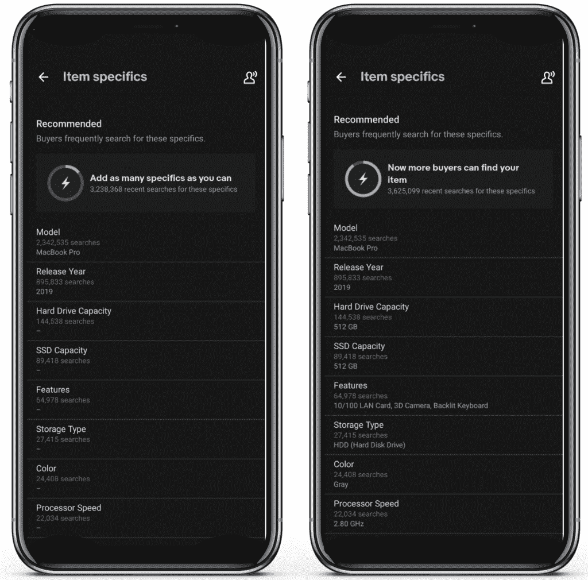
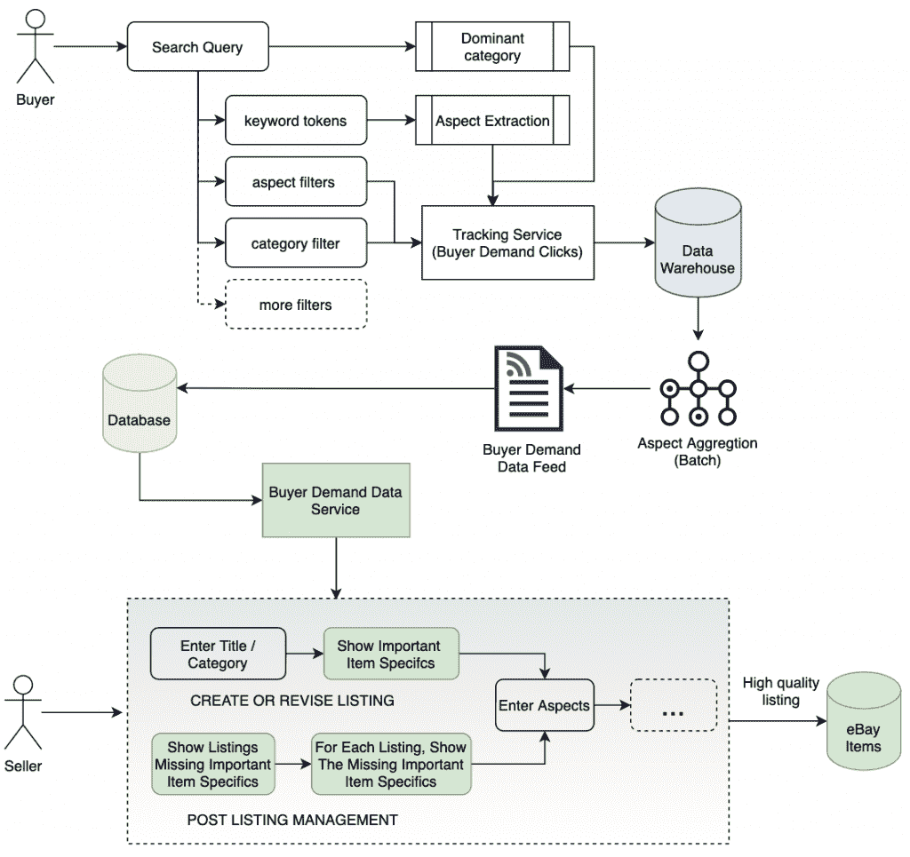

# 一种用于搜索平台的分布式应用架构

> 原文：<https://thenewstack.io/how-ebays-distributed-architecture-surfaces-more-item-listings-for-buyers/>

 [维卡斯·辛格

Vikas 是易贝公司的工程总监，负责领导当前和下一代面向全球市场的消费者和企业销售工具。他负责端到端的上市经验；包括卖方 SEO、主页和产品登录页面、搜索自动完成、产品和视觉搜索、项目细节、列表指导以及跨 iOS、Android 和 Web 平台的创建。](https://www.linkedin.com/in/vikas-singh-2661208/) 

EBay 的全球市场将人们和他们喜爱的商品联系在一起。市场上有如此多的选择，我们的卖家面临的一个挑战是如何让他们的产品脱颖而出，并激发买家购买。在本帖中，我们展示了一个使用事件驱动系统、微服务、推荐系统和数据聚合层构建的分布式应用架构。

高质量的列表有助于买家了解产品。它通过描述性标题、物品细节、照片和详细的产品描述，包含了关于物品的信息，从状况到运输。但是，创建一个优秀的列表只是成功销售的一半——卖家还必须向最感兴趣的买家展示他们的商品。

买家以两种不同的方式进行搜索:通过关键字和/或对他们的查询应用左侧导航过滤器。即使卖家创建了一个与买家完美匹配的高质量列表，如果它没有映射到买家令牌(或关键词)和过滤器，该列表也不会出现在搜索中，并发挥其全部潜力。卖家经常试图通过调整措辞来优化他们在搜索结果中的位置，从而提高他们的列表的搜索性能，但他们可能不知道买家正在使用的重要关键词或过滤器可能会影响他们的项目的可见性。

现在，[易贝](https://tech.ebayinc.com/?utm_content=inline-mention)卖家可以在列表流程中以一种简单而优雅的方式访问买家需求数据，以帮助展示买家会喜欢的商品。这种对买家需求的洞察有助于推动卖家参与，并增加项目细节的完整性，从而进一步提高列表质量、可见性和销售额。

## **买方需求数据**

买方需求数据是买方在一段时间内搜索特定产品的次数。买家倾向于使用一致的搜索词搜索二手或商品，而对于新的或当季商品，在搜索模式出现之前可能会有一些波动。买家需求数据捕捉这些趋势，并帮助卖家向买家推销他们的产品。

[易贝](https://tech.ebayinc.com/?utm_content=inline-mention)获取数据的一些方式包括:

1.  **从买家关键词**中提取物品细节。例如，买家可以使用搜索栏并键入“苹果 Macbook Pro 2019”
2.  **统计搜索过滤器的点击量**；例如购买者通过项目特定的“发布年份”过滤搜索结果
3.  **分析浏览/导航模式**。比如买家浏览电子产品→电脑、平板&更多→笔记本电脑&上网本→苹果笔记本电脑→发布年份。

## **重要项目细节**

重要的物品细节是买家在搜索和过滤时经常使用的。例如，一个典型的买家可能会使用“Apple Macbook Pro 15”作为关键词来搜索 Macbook Pro，然后应用发布年份、处理器和 SSD 容量等过滤器。如果我们鼓励卖家在他们的列表中包含这些信息，他们的商品将有更高的机会显示在搜索结果中，从而显著提高列表的可见性和整体转化率。

图 1:卖家的商品细节用户界面

## **架构和数据流图**

下图显示了数据如何在系统中流动。当买家搜索房源时，他们的查询被分析并分解成结构化的信号，让下游系统捕捉买家的需求。这包括基于过去的搜索和买家行为，使用机器学习，从关键词中提取商品细节，以及考虑买家选择的其他过滤器。

例如，分析样本查询“Apple Macbook Pro 2019”，我们可以知道买家正在“Apple Laptops”类别中搜索 Brand = "Apple，" Model = "Macbook Pro "和 Release Year = "2019 "。

图 2:“买方需求数据服务”微服务

这些信号被跟踪并存储在数据仓库中，并随后被处理为随时间推移的总需求(例如，如图 1 所示，在过去 30 天中，针对项目特定“模型”的搜索为 2，342，535 次)。然后，这种汇总的需求被推送到交易系统，为卖家提供关于重要商品细节的实时指导，以最大限度地提高其商品的可见性。

实时指导包括在创建或修改列表时向卖家显示买家需求数据，以及在卖家体验中提升*高需求*项目细节的可见性，以推动前期参与和项目细节完成率。这是通过图 2 中的微服务“买家需求数据服务”实现的，该服务作为单一的事实来源，在整个跨平台销售体验中提供需求数据和重要的商品细节。这种整合涵盖了列表创建过程和列表后管理过程，其中为卖家提供了关于缺少重要项目细节的现有列表的指导。

卖家对这些有价值的信息做出积极回应，从而填写更多的商品细节，更深入地参与平台，最终创建更高质量的列表，推动转化和销售。

## **结果**

通过透明地分享市场动态来指导我们的卖家，让他们提高了他们的商品在搜索中的可见性，推动了全球范围内测试组比对照组高出 5%的转化率。除了更高的销售额，我们还观察到同期全球项目细节完成率增加了 15%。

## **结论**

数据驱动的洞察力在连接买家和卖家方面大有可为。这种体验在易贝的[网站](https://www.ebay.com/sl/sell)和[本地](https://pages.ebay.com/ebay-app-mobile/) ( [iOS](https://apps.apple.com/us/app/ebay-shopping-buy-sell-save/id282614216) 和 [Android](https://play.google.com/store/apps/details?id=com.ebay.mobile) )上直播，在所有主要市场销售应用，也可以在我们的公共[分类 API](https://developer.ebay.com/api-docs/commerce/taxonomy/resources/category_tree/methods/getItemAspectsForCategory) 上获得。

作为一个纯粹的在线市场，易贝致力于买家和卖家的成功。通过透明地分享这些动态需求洞察，我们使我们的卖家能够充分利用平台的功能来发展业务。

有兴趣在易贝发展事业吗？我们在招人！请[看一下](http://ebay.to/Careers)我们目前的职位空缺。

通过 Pixabay 的特征图像。

<svg xmlns:xlink="http://www.w3.org/1999/xlink" viewBox="0 0 68 31" version="1.1"><title>Group</title> <desc>Created with Sketch.</desc></svg>