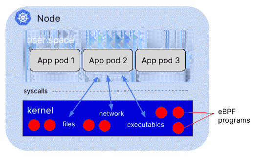
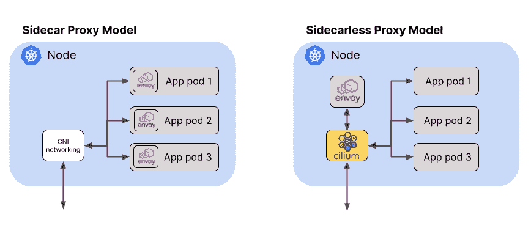
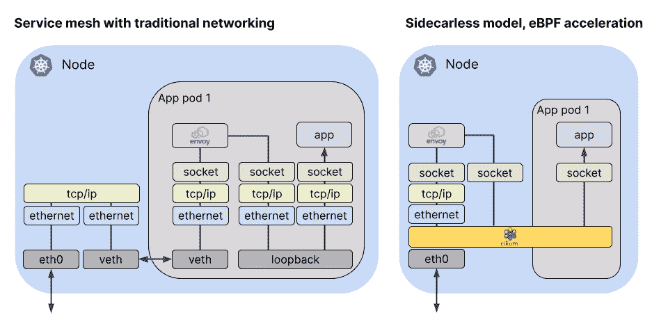

# eBPF 如何简化服务网格

> 原文：<https://thenewstack.io/how-ebpf-streamlines-the-service-mesh/>

今天有几个[服务网格](https://thenewstack.io/category/service-mesh/)产品和项目，承诺简化应用微服务之间的连接，同时提供额外的功能，如安全连接、可观察性和流量管理。但是正如我们在过去几年中反复看到的那样，对服务网格的兴奋已经被实际的[担忧](https://medium.com/geekculture/watch-out-for-this-istio-proxy-sidecar-memory-pitfall-8dbd99ea7e9d)所冲淡[额外的](https://nowei.github.io/projects/svc_mesh_measurement_final_report.pdf) [复杂性](https://engineering.hellofresh.com/everything-we-learned-running-istio-in-production-part-2-ff4c26844bfb)和[开销](https://pklinker.medium.com/performance-impacts-of-an-istio-service-mesh-63957a0000b)。让我们探索一下 [eBPF](https://ebpf.io/) 如何让我们简化服务网格，使服务网格数据平面更高效、更易于部署。

## 边车问题

今天针对 Kubernetes 的[服务网格解决方案要求您向每个应用 pod 添加一个代理 sidecar 容器，如](https://thenewstack.io/why-do-you-need-istio-when-you-already-have-kubernetes/) [Envoy](https://www.envoyproxy.io/) 或 [Linkerd-proxy](https://linkerd.io/) 。没错:即使在一个非常小的环境中，比方说，有 20 个服务，每个服务运行 5 个 pod，分布在 3 个节点上，您也有 100 个代理容器。无论代理实现有多小多高效，纯粹的重复都会耗费资源。

每个代理使用的内存随着它需要能够与之通信的服务数量的增加而增加。Pranay Singhal [写了他的经历](https://medium.com/geekculture/watch-out-for-this-istio-proxy-sidecar-memory-pitfall-8dbd99ea7e9d)配置 Istio 以减少每个代理大约 1GB 的消耗(！)到更合理的 60-70MB。但是，即使在我们想象的小型环境中，三个节点上有 100 个代理，这种优化的配置仍然需要每个节点大约 2GB。

为什么我们需要这些边车？该模型允许代理容器与 pod 中的应用程序容器共享网络名称空间。网络名称空间是 Linux 内核结构，它允许容器和 pod 拥有自己独立的网络堆栈，将容器化的应用程序相互隔离。这使得应用程序之间互不干扰，这也是为什么，例如，你可以在端口 80 上运行一个 web 应用程序，想有多少个 pods 就有多少个——网络名称空间意味着它们每个都有自己的*端口 80。代理必须共享同一个网络名称空间，以便它可以拦截来往于应用程序容器的流量并对其进行操作。*

## 输入 eBPF

[eBPF](http://ebpf.io) 是一种内核技术，允许自定义程序在内核中运行。这些程序响应事件而运行，eBPF 程序可以附加成千上万个可能的事件。这些事件包括跟踪点、进入或退出任何函数(在内核或用户空间中)或者——对服务网格很重要——网络数据包的到达。

重要的是，*每个节点只有一个内核*；在一个节点上运行的所有容器(以及所有的 pod)共享同一个内核。如果您将 eBPF 程序添加到内核中的一个事件中，它将被触发，不管是哪个进程导致了该事件，也不管它是在应用程序容器中运行还是直接在主机上运行。

每台主机一个内核

这就是为什么 eBPF 对于 Kubernetes 中的任何一种工具来说都是如此令人兴奋的技术——您只需要在每个节点上添加一次工具，所有的应用程序都将包含在内。无论您是寻求可观察性、安全性还是联网，eBPF 驱动的解决方案都可以在不需要边车的情况下为应用提供工具。

基于 eBPF 的 [Cilium](http://cilium.io) 项目(最近[以孵化级别](https://www.cncf.io/blog/2021/10/13/cilium-joins-cncf-as-an-incubating-project/)加入了云计算基金会)将这种“无侧柜”模型带到了服务网格的世界。与传统的 sidecar 模型一样，Cilium 支持每个节点使用一个特使代理实例来运行服务网格数据平面。使用我们前面的例子，这将代理实例的数量从 100 个减少到只有 3 个。

使用无侧柜代理模型减少代理实例

## 减去 YAML

 [利兹·赖斯

Liz Rice 是 Isovalent 的首席开源官，也是云计算原生计算基金会技术监督委员会的主席。](https://www.linkedin.com/in/lizrice/) 

在 sidecar 模型中，需要修改指定每个应用程序 pod 的 YAML 来添加 sidecar 容器。这通常是自动化的——例如，使用一个变异的 webhook 在部署每个应用程序 pod 时注入 sidecar。

例如，在 Istio 中，这需要[标记](https://istio.io/latest/docs/setup/additional-setup/sidecar-injection/#controlling-the-injection-policy)Kubernetes 名称空间和/或 pod 来定义是否应该注入 sidecar 当然，这需要为集群启用变异的 webhooks。

但是如果出了问题呢？如果命名空间或单元的标签不正确，则不会注入侧柜，单元也不会连接到服务网格。更糟糕的是，如果攻击者破坏了集群，并能够运行恶意工作负载(比如加密货币挖掘程序)，他们将不可能标记它，以便它参与服务网格。它不会通过服务网格提供的流量可观察性来显示。

相比之下，在支持 eBPF 的无侧柜代理模型中，pod 不需要任何额外的 YAML 来进行检测。相反，CRD 用于在集群范围的基础上配置服务网格。甚至预先存在的 pod 也可以成为服务网格的一部分，而无需重启！

如果攻击者试图通过直接在主机上运行工作负载来绕过 Kubernetes 编排，eBPF 程序可以看到并控制这一活动，因为它在内核中是可见的。

## 支持 eBPF 的网络效率

消除边车并不是 eBPF 优化服务网络的唯一方式。支持 eBPF 的网络允许数据包走捷径，绕过内核的部分网络堆栈，这可以在 Kubernetes 网络中带来显著的[性能改进](https://cilium.io/blog/2021/05/11/cni-benchmark)。让我们看看这在服务网格数据平面中是如何应用的。

在 eBPF 加速的、无侧柜的服务网格代理模型中，网络数据包通过的路径要短得多

在服务网格的情况下，代理在传统网络中作为边车运行，数据包到达应用程序的路径非常曲折:入站数据包必须穿过主机 TCP/IP 堆栈，才能通过虚拟以太网连接到达 pod 的网络名称空间。从那里，数据包必须通过 pod 的网络堆栈到达代理，代理通过环回接口转发数据包到达应用程序。请记住，流量必须流经连接两端的代理，这导致[与非服务网格流量相比，延迟](https://linkerd.io/2021/05/27/linkerd-vs-istio-benchmarks/#latency-at-20-rps)显著增加。

基于 eBPF 的 Kubernetes CNI 实现(如 Cilium)可以使用 eBPF 程序，明智地连接到内核中的特定点，沿着更直接的路径重定向数据包。这是可能的，因为 Cilium 知道所有的 Kubernetes 端点和服务身份。当数据包到达主机时，Cilium 可以将它直接发送到它要到达的代理或 pod 端点。

## 网络中的加密

如果一个网络解决方案能够识别 Kubernetes 服务，并在这些服务的端点之间提供网络连接，那么它能够提供服务网格数据平面的功能就不足为奇了。但是这些功能可以超越基本的连接。一个例子是透明加密。

通常使用服务网格来确保所有应用程序流量都经过身份验证和加密。这是通过相互 TLS(MTL)实现的；服务网格代理组件充当网络连接的端点，并与其远程对等方协商安全 TLS 连接。这种连接对代理之间的流量进行加密，而无需对应用程序做任何更改。

但是，在应用程序层管理的 TLS 并不是实现组件间认证和加密流量的唯一方法。另一种选择是在网络层加密流量，使用 [IPSec 或 WireGuard](https://cilium.io/blog/2021/05/11/cni-benchmark#the-cost-of-encryption---wireguard-vs-ipsec) 。因为它在网络层运行，所以这种加密不仅对应用程序是完全透明的，而且对代理也是完全透明的——无论有没有服务网格都可以启用。如果您使用服务网格的唯一原因是提供加密，那么您可能需要考虑网络级加密。它不仅更简单，而且还可用于验证和加密节点上的任何流量，而不仅限于支持 sidecar 的工作负载。

## eBPF 是服务网格的数据平面

现在，eBPF 在 Linux 产品发行版中使用的内核版本中得到广泛支持，企业可以利用它来实现更高效的网络解决方案，并将其作为服务网格的更高效的数据平面。 [Solo.io](https://solo.io?utm_content=inline-mention) 在最近的 ServiceMeshCon 上将此描述为“[用 eBPF](https://servicemeshconna21.sched.com/event/mH1w) 给你的服务网格超级充电”。

去年，我代表 [CNCF](https://cncf.io/?utm_content=inline-mention) 的技术监督委员会做了一些[预测](https://youtu.be/bESogtuHwX0)，关于服务网络领域的整合和清晰化。在同一主题演讲中，我谈到了 eBPF 成为更多项目和更广泛部署的功能的基础的可能性。这两个想法现在走到了一起，因为 eBPF 似乎是服务网格数据平面的自然路径。

<svg xmlns:xlink="http://www.w3.org/1999/xlink" viewBox="0 0 68 31" version="1.1"><title>Group</title> <desc>Created with Sketch.</desc></svg>